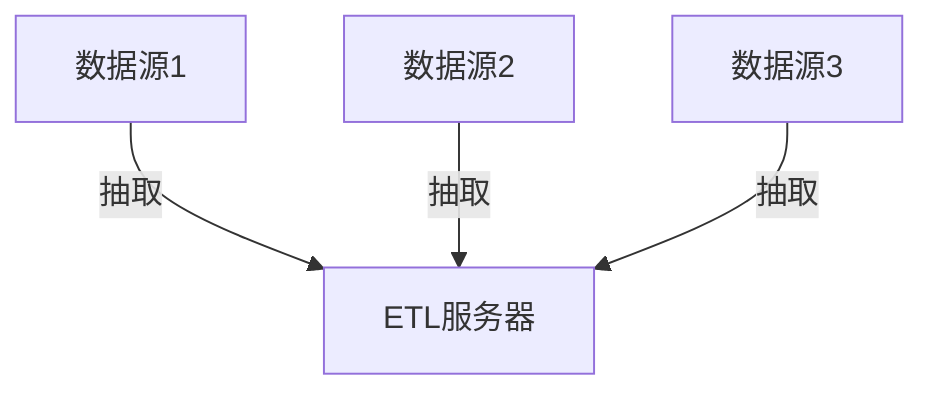
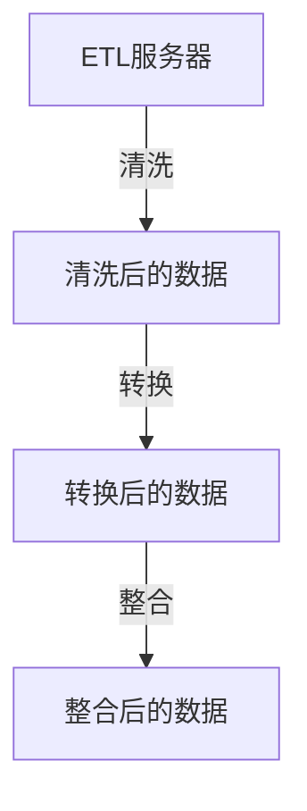
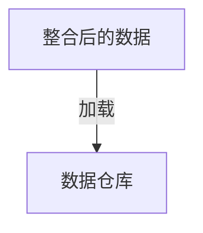
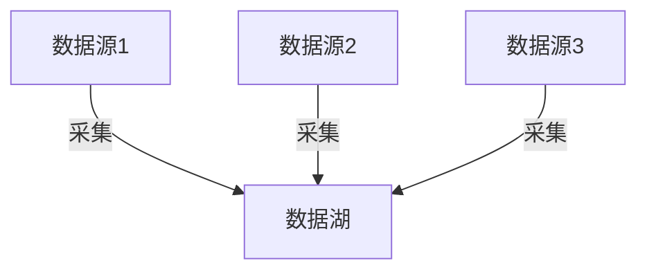
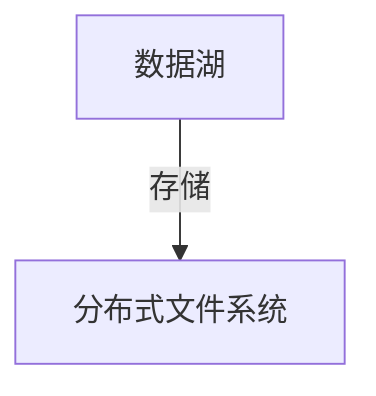
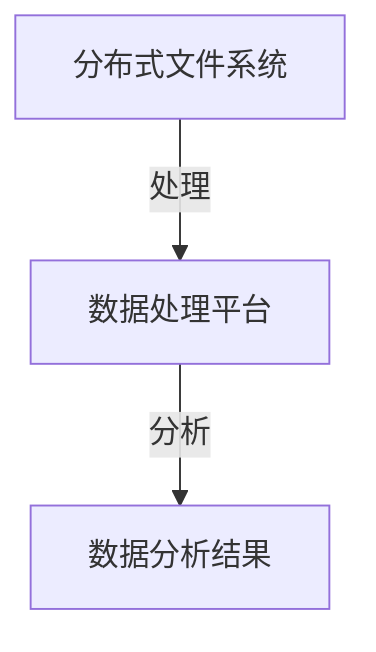
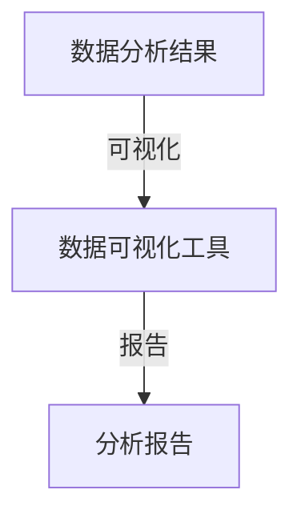
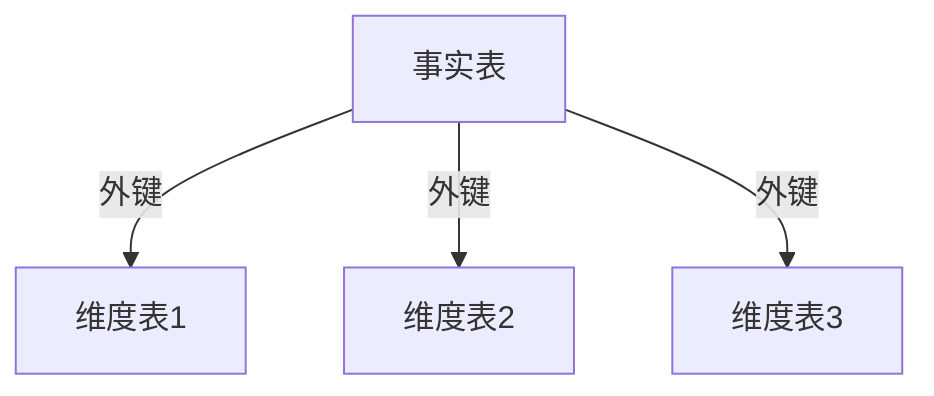

# 数据湖与数据仓库的区别是什么？

作者：禅与计算机程序设计艺术

## 1. 背景介绍

### 1.1 数据的重要性

在现代信息时代，数据已经成为企业和组织的核心资产。无论是商业决策、市场分析，还是产品研发，数据的作用都无可替代。随着大数据和人工智能技术的迅猛发展，如何高效地存储、管理和分析海量数据成为了一个关键问题。

### 1.2 数据存储技术的演变

传统的数据存储技术主要依靠关系型数据库，但随着数据量的爆炸性增长和数据类型的多样化，关系型数据库逐渐显得力不从心。为了应对这些挑战，数据仓库和数据湖应运而生。这两种技术在数据存储和管理方面各有优势，但也存在显著的区别。

### 1.3 本文目的

本文旨在详细探讨数据湖和数据仓库的区别，从核心概念、算法原理、数学模型、项目实践、实际应用场景、工具和资源推荐等多个方面进行深入分析，帮助读者更好地理解和应用这两种技术。

## 2. 核心概念与联系

### 2.1 数据仓库

数据仓库（Data Warehouse）是一种面向主题的、集成的、稳定的、随时间变化的数据集合，用于支持管理决策。数据仓库的主要特点包括：

- **面向主题**：数据仓库中的数据是按照主题进行组织的，如销售、客户、产品等。
- **集成性**：数据仓库中的数据来自多个异构数据源，通过ETL（抽取、转换、加载）过程进行集成。
- **稳定性**：数据仓库中的数据是稳定的，不会频繁更新。
- **随时间变化**：数据仓库中的数据具有时间维度，可以反映数据随时间的变化。

### 2.2 数据湖

数据湖（Data Lake）是一种存储海量原始数据的系统，数据可以是结构化、半结构化或非结构化的。数据湖的主要特点包括：

- **海量存储**：数据湖可以存储几乎无限量的数据。
- **多样化数据类型**：数据湖支持存储各种类型的数据，包括结构化数据、半结构化数据和非结构化数据。
- **原始数据**：数据湖中的数据通常是原始数据，未经处理或转换。
- **灵活性**：数据湖具有高度的灵活性，适用于多种数据分析和处理需求。

### 2.3 数据仓库与数据湖的联系

尽管数据仓库和数据湖在概念和实现上存在显著区别，但它们也有一些共同点：

- **数据存储和管理**：两者都是用于存储和管理大量数据的系统。
- **支持数据分析**：两者都支持数据分析和商业智能应用。
- **数据集成**：两者都可以集成来自多个数据源的数据。

### 2.4 数据仓库与数据湖的区别

尽管数据仓库和数据湖在某些方面有相似之处，但它们在以下几个方面存在显著区别：

- **数据类型**：数据仓库主要存储结构化数据，而数据湖可以存储结构化、半结构化和非结构化数据。
- **数据处理**：数据仓库中的数据经过ETL处理，而数据湖中的数据通常是原始数据。
- **数据存储架构**：数据仓库使用关系型数据库架构，而数据湖使用分布式文件系统架构。
- **数据查询**：数据仓库适合复杂的SQL查询，而数据湖适合多种数据处理和分析工具。

## 3. 核心算法原理具体操作步骤

### 3.1 数据仓库的ETL过程

ETL（Extract, Transform, Load）是数据仓库的核心过程，涉及数据的抽取、转换和加载。以下是ETL过程的具体操作步骤：

#### 3.1.1 数据抽取

数据抽取是从多个数据源中获取数据的过程。数据源可以是关系型数据库、文件、API等。抽取的数据通常是原始数据，需要经过清洗和转换才能加载到数据仓库中。

#### 3.1.2 数据转换

数据转换是将抽取的数据进行清洗、格式转换和整合的过程。数据转换的目的是保证数据的一致性和完整性，并将数据转换为适合加载到数据仓库的格式。

#### 3.1.3 数据加载

数据加载是将转换后的数据加载到数据仓库的过程。加载的数据可以是全量数据或增量数据，具体取决于业务需求和数据更新频率。

### 3.2 数据湖的数据处理

数据湖的数据处理过程与数据仓库有所不同，主要包括数据采集、数据存储、数据处理和数据分析。

#### 3.2.1 数据采集

数据采集是将原始数据从多个数据源采集到数据湖的过程。数据源可以是传感器、日志文件、社交媒体等。数据采集的目的是将各种类型的数据统一存储到数据湖中。

#### 3.2.2 数据存储

数据存储是将采集到的数据存储到数据湖的过程。数据湖通常使用分布式文件系统（如HDFS）进行存储，支持海量数据的高效存储和管理。

#### 3.2.3 数据处理

数据处理是对存储在数据湖中的数据进行处理和分析的过程。数据处理可以使用多种技术和工具，如MapReduce、Spark、Flink等。

#### 3.2.4 数据分析

数据分析是对处理后的数据进行分析和挖掘的过程。数据分析可以使用多种工具和技术，如SQL查询、机器学习、数据可视化等。

## 4. 数学模型和公式详细讲解举例说明

### 4.1 数据仓库的数学模型

数据仓库的数学模型主要包括维度建模和星型模型。维度建模是一种用于数据仓库设计的方法，星型模型是维度建模的一种具体实现。

#### 4.1.1 维度建模

维度建模的核心思想是将数据分为事实表和维度表。事实表存储业务过程中的度量数据，维度表存储业务过程的上下文信息。

$$
\text{事实表} = \{ \text{度量1}, \text{度量2}, \ldots, \text{度量n}, \text{维度1\_ID}, \text{维度2\_ID}, \ldots, \text{维度m\_ID} \}
$$

#### 4.1.2 星型模型

星型模型是一种常见的维度建模实现方式，中心是事实表，周围是维度表。维度表通过外键与事实表关联。

### 4.2 数据湖的数学模型

数据湖的数学模型主要包括分布式存储和并行计算。分布式存储用于高效存储海量数据，并行计算用于高效处理和分析数据。

#### 4.2.1 分布式存储

分布式存储将数据分布存储在多个节点上，每个节点存储一部分数据。分布式存储的核心思想是