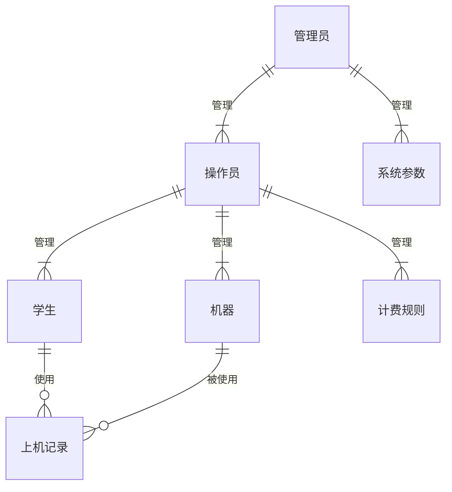
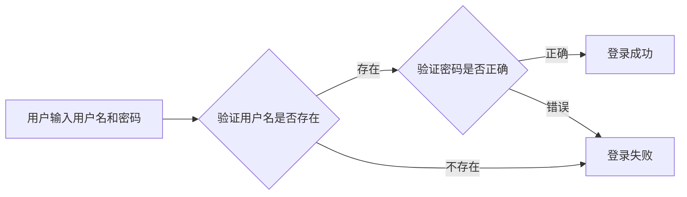
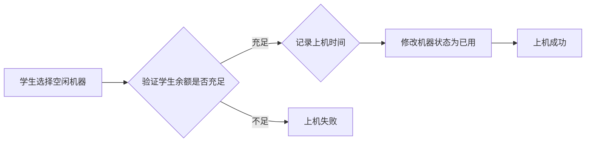
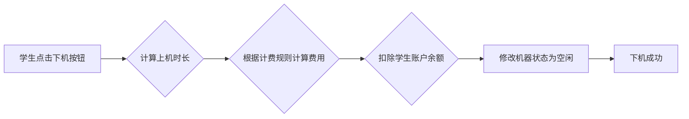

# 机房学生上机管理系统详细设计与具体代码实现

作者：禅与计算机程序设计艺术

## 1. 背景介绍

### 1.1 机房管理的现状与挑战

随着高校教学规模的不断扩大和计算机技术的快速发展，学生上机实践的需求日益增长，传统的机房管理模式已经难以满足现代化教学的需求。传统的机房管理模式存在以下弊端：

* **人工管理效率低下:**  学生上机登记、下机记录、费用统计等工作需要人工完成，费时费力，容易出错。
* **资源利用率低:**  由于缺乏有效的监控和管理手段，机房资源的利用率往往不高，部分机器闲置，而另一些机器却供不应求。
* **安全隐患:**  学生随意使用U盘、下载软件等行为难以监管，容易造成病毒传播、系统崩溃等安全问题。

### 1.2 系统建设目标

为了解决以上问题，提高机房管理的效率和安全性，设计开发一套功能完善、操作便捷、安全可靠的学生上机管理系统势在必行。本系统旨在实现以下目标：

* **提高管理效率:**  实现学生上机、下机、充值、查询等操作的自动化，减轻管理员的工作负担。
* **提高资源利用率:**  实时监控机房机器的使用情况，合理分配资源，避免资源浪费。
* **增强系统安全性:**  限制学生的操作权限，防止病毒传播和系统破坏。
* **提供数据分析:**  记录学生上机时间、使用软件等信息，为教学管理提供数据支持。

## 2. 核心概念与联系

### 2.1 系统用户角色

本系统主要涉及三种用户角色：

* **学生:** 上机使用的主要对象，可以进行上机、下机、查询余额、修改密码等操作。
* **操作员:** 负责机房的日常管理，包括学生信息管理、机器管理、计费管理、系统设置等。
* **管理员:** 拥有最高权限，可以管理操作员账户，设置系统参数，查看系统日志等。

### 2.2 系统功能模块

本系统主要包括以下功能模块：

* **学生上机管理:**  包括学生注册、登录、上机、下机、查询余额、修改密码等功能。
* **机器管理:**  包括机器添加、删除、修改、查询等功能。
* **计费管理:**  包括设置计费规则、充值、扣费、查询消费记录等功能。
* **系统设置:**  包括系统参数设置、操作员管理、日志管理等功能。

### 2.3 核心概念关系图



## 3. 核心算法原理具体操作步骤

### 3.1 用户登录认证

#### 3.1.1  流程图



#### 3.1.2 算法描述

1. 用户输入用户名和密码。
2. 系统验证用户名是否存在。
    * 如果用户名不存在，则登录失败。
    * 如果用户名存在，则验证密码是否正确。
3. 如果密码正确，则登录成功。
4. 如果密码错误，则登录失败。

### 3.2 学生上机

#### 3.2.1 流程图



#### 3.2.2 算法描述

1. 学生选择一台空闲的机器。
2. 系统验证学生余额是否充足。
    * 如果余额不足，则上机失败。
    * 如果余额充足，则记录上机时间。
3. 修改机器状态为已用。
4. 上机成功。

### 3.3 学生下机

#### 3.3.1 流程图



#### 3.3.2 算法描述

1. 学生点击下机按钮。
2. 系统计算上机时长。
3. 根据计费规则计算费用。
4. 扣除学生账户余额。
5. 修改机器状态为空闲。
6. 下机成功。

## 4. 数学模型和公式详细讲解举例说明

### 4.1 计费规则

本系统采用分段计费的方式，具体规则如下:

* **第一个小时:**  $P_1$ 元/小时
* **第二个小时到第三个小时:**  $P_2$ 元/小时
* **第三个小时以后:**  $P_3$ 元/小时

其中， $P_1$，$P_2$，$P_3$ 为系统参数，可以根据实际情况进行设置。

### 4.2 费用计算公式

假设学生上机时长为 $t$ 小时，则费用计算公式如下：

$$
\text{费用} = 
\begin{cases}
P_1t, & 0 < t \le 1 \\
P_1 + P_2(t-1), & 1 < t \le 3 \\
P_1 + 2P_2 + P_3(t-3), & t > 3
\end{cases}
$$

### 4.3  举例说明

例如，假设系统参数设置为：

* $P_1 = 2$ 元/小时
* $P_2 = 1.5$ 元/小时
* $P_3 = 1$ 元/小时

如果学生上机时长为 2.5 小时，则费用为：

$$
\text{费用} = P_1 + P_2(t-1) = 2 + 1.5 \times (2.5 - 1) = 4.25 \text{ 元}
$$

## 5. 项目实践：代码实例和详细解释说明

### 5.1 开发环境

* 操作系统：Windows 10
* 开发语言：Java
* 数据库：MySQL
* 开发工具：Eclipse

### 5.2 数据库设计

```sql
-- 学生表
CREATE TABLE student (
  id INT PRIMARY KEY AUTO_INCREMENT,
  name VARCHAR(255) NOT NULL,
  password VARCHAR(255) NOT NULL,
  balance DECIMAL(10, 2) NOT NULL DEFAULT 0.00
);

-- 机器表
CREATE TABLE machine (
  id INT PRIMARY KEY AUTO_INCREMENT,
  name VARCHAR(255) NOT NULL,
  status TINYINT NOT NULL DEFAULT 0 -- 0:空闲，1:已用
);

-- 上机记录表
CREATE TABLE record (
  id INT PRIMARY KEY AUTO_INCREMENT,
  student_id INT NOT NULL,
  machine_id INT NOT NULL,
  start_time DATETIME NOT NULL,
  end_time DATETIME DEFAULT NULL,
  cost DECIMAL(10, 2) DEFAULT NULL
);
```

### 5.3 代码实例

#### 5.3.1 学生登录

```java
public boolean login(String name, String password) {
  Connection conn = null;
  PreparedStatement stmt = null;
  ResultSet rs = null;
  try {
    conn = DBUtil.getConnection();
    String sql = "SELECT * FROM student WHERE name = ?";
    stmt = conn.prepareStatement(sql);
    stmt.setString(1, name);
    rs = stmt.executeQuery();
    if (rs.next()) {
      String dbPassword = rs.getString("password");
      if (password.equals(dbPassword)) {
        return true;
      }
    }
  } catch (SQLException e) {
    e.printStackTrace();
  } finally {
    DBUtil.close(conn, stmt, rs);
  }
  return false;
}
```

#### 5.3.2 学生上机

```java
public boolean startUse(int studentId, int machineId) {
  Connection conn = null;
  PreparedStatement stmt = null;
  try {
    conn = DBUtil.getConnection();
    conn.setAutoCommit(false);

    // 验证学生余额
    String sql1 = "SELECT balance FROM student WHERE id = ?";
    stmt = conn.prepareStatement(sql1);
    stmt.setInt(1, studentId);
    ResultSet rs = stmt.executeQuery();
    if (rs.next()) {
      double balance = rs.getDouble("balance");
      if (balance < 1.0) {
        return false;
      }
    } else {
      return false;
    }

    // 修改机器状态
    String sql2 = "UPDATE machine SET status = 1 WHERE id = ?";
    stmt = conn.prepareStatement(sql2);
    stmt.setInt(1, machineId);
    int row2 = stmt.executeUpdate();
    if (row2 != 1) {
      return false;
    }

    // 记录上机时间
    String sql3 = "INSERT INTO record (student_id, machine_id, start_time) VALUES (?, ?, NOW())";
    stmt = conn.prepareStatement(sql3);
    stmt.setInt(1, studentId);
    stmt.setInt(2, machineId);
    int row3 = stmt.executeUpdate();
    if (row3 != 1) {
      return false;
    }

    conn.commit();
    return true;
  } catch (SQLException e) {
    try {
      conn.rollback();
    } catch (SQLException ex) {
      ex.printStackTrace();
    }
    e.printStackTrace();
  } finally {
    DBUtil.close(conn, stmt, null);
  }
  return false;
}
```

#### 5.3.3 学生下机

```java
public boolean endUse(int studentId, int machineId) {
  Connection conn = null;
  PreparedStatement stmt = null;
  try {
    conn = DBUtil.getConnection();
    conn.setAutoCommit(false);

    // 查询上机记录
    String sql1 = "SELECT * FROM record WHERE student_id = ? AND machine_id = ? AND end_time IS NULL";
    stmt = conn.prepareStatement(sql1);
    stmt.setInt(1, studentId);
    stmt.setInt(2, machineId);
    ResultSet rs = stmt.executeQuery();
    if (rs.next()) {
      // 计算上机时长
      Timestamp startTime = rs.getTimestamp("start_time");
      long useTime = System.currentTimeMillis() - startTime.getTime();
      double hours = useTime / (1000.0 * 60 * 60);

      // 计算费用
      double cost = calculateCost(hours);

      // 扣除学生余额
      String sql2 = "UPDATE student SET balance = balance - ? WHERE id = ?";
      stmt = conn.prepareStatement(sql2);
      stmt.setDouble(1, cost);
      stmt.setInt(2, studentId);
      int row2 = stmt.executeUpdate();
      if (row2 != 1) {
        return false;
      }

      // 更新上机记录
      String sql3 = "UPDATE record SET end_time = NOW(), cost = ? WHERE id = ?";
      stmt = conn.prepareStatement(sql3);
      stmt.setDouble(1, cost);
      stmt.setInt(2, rs.getInt("id"));
      int row3 = stmt.executeUpdate();
      if (row3 != 1) {
        return false;
      }

      // 修改机器状态
      String sql4 = "UPDATE machine SET status = 0 WHERE id = ?";
      stmt = conn.prepareStatement(sql4);
      stmt.setInt(1, machineId);
      int row4 = stmt.executeUpdate();
      if (row4 != 1) {
        return false;
      }

      conn.commit();
      return true;
    }
  } catch (SQLException e) {
    try {
      conn.rollback();
    } catch (SQLException ex) {
      ex.printStackTrace();
    }
    e.printStackTrace();
  } finally {
    DBUtil.close(conn, stmt, null);
  }
  return false;
}

private double calculateCost(double hours) {
  // TODO: 根据计费规则计算费用
  return 0;
}
```

## 6. 实际应用场景

### 6.1 高校机房管理

本系统可以应用于高校机房管理，实现学生上机、下机、充值、查询等操作的自动化，提高机房管理效率和资源利用率。

### 6.2 企业培训中心

本系统可以应用于企业培训中心，对员工的培训上机进行管理，记录员工的培训时间和学习情况，为企业培训评估提供数据支持。

### 6.3 图书馆电子阅览室

本系统可以应用于图书馆电子阅览室，对读者使用电子资源的情况进行监控和管理，提高电子资源的利用率。

## 7. 工具和资源推荐

### 7.1 数据库管理工具

* **Navicat:**  一款功能强大的数据库管理工具，支持多种数据库，界面友好，易于上手。
* **DataGrip:**  JetBrains公司推出的一款数据库管理工具，功能强大，支持多种数据库，适合专业开发人员使用。

### 7.2 Java开发工具

* **Eclipse:**  一款免费、开源的Java开发工具，功能强大，插件丰富，适合大型项目开发。
* **IntelliJ IDEA:**  JetBrains公司推出的一款Java开发工具，功能强大，智能提示，适合专业开发人员使用。

### 7.3  学习资源

* **菜鸟教程:**  https://www.runoob.com/
* **W3School:**  https://www.w3school.com.cn/

## 8. 总结：未来发展趋势与挑战

### 8.1 未来发展趋势

* **云计算:**  将机房管理系统部署到云平台，可以提高系统的可靠性和可扩展性。
* **大数据:**  利用大数据技术分析学生上机数据，可以为教学管理提供更精准的数据支持。
* **人工智能:**  利用人工智能技术实现人脸识别、语音识别等功能，可以进一步提高机房管理的自动化程度。

### 8.2 面临的挑战

* **系统安全性:**  随着网络攻击手段的不断升级，机房管理系统的安全性面临着严峻的挑战。
* **用户体验:**  如何设计出操作简便、用户体验良好的机房管理系统，也是一个需要不断探索的问题。

## 9. 附录：常见问题与解答

### 9.1  学生忘记密码怎么办？

学生可以通过系统提供的“忘记密码”功能，使用注册时填写的邮箱或手机号码进行密码重置。

### 9.2  如何充值？

学生可以通过线上支付平台或线下充值的方式进行充值。

### 9.3  如何查询消费记录？

学生可以通过系统提供的“消费记录”功能，查询自己的上机消费记录。
