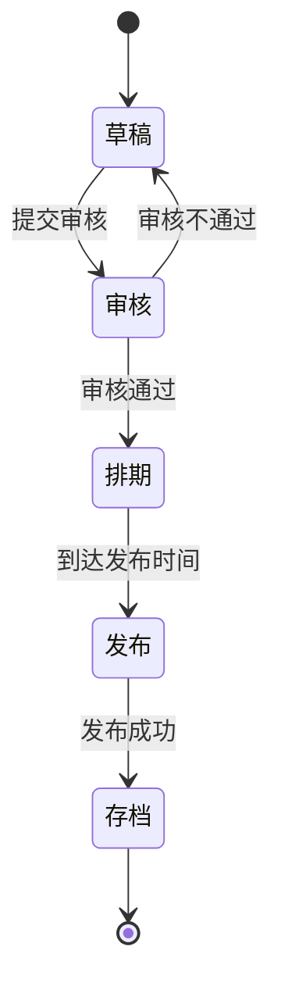

# 校园新闻管理系统设计与实现

## 1. 背景介绍

### 1.1 校园新闻管理系统的重要性

在当今信息时代,新闻传播在校园生活中扮演着越来越重要的角色。校园新闻不仅是校园文化的重要组成部分,也是学校与师生、家长以及社会沟通的重要窗口。高效、便捷的校园新闻管理系统可以确保新闻信息的及时发布、传播和存档,为校园生活增添活力。

### 1.2 传统校园新闻管理的挑战

传统的校园新闻管理方式存在诸多弊端:

- 纸质新闻发布效率低下、成本高昂
- 新闻发布渠道单一,缺乏互动性 
- 新闻存档管理混乱,信息难以检索
- 新闻编辑流程低效,工作重复劳动大

这些问题不仅影响了校园新闻的传播效率,也增加了管理的工作量。因此,构建一个高效、智能的校园新闻管理系统迫在眉睫。

## 2. 核心概念与联系  

### 2.1 系统架构

校园新闻管理系统通常采用 B/S 架构或 C/S 架构。前者以浏览器为客户端,通过网络与服务器交互;后者需要在客户端计算机上安装专用软件。两种架构都包括:

- **客户端**:用户使用的人机交互界面
- **服务器端**:负责处理业务逻辑和数据存储
- **数据库**:存储新闻数据和用户信息

### 2.2 系统功能模块

一个完整的校园新闻管理系统通常包括以下核心功能模块:

1. **新闻发布模块**:用于撰写、审核和发布新闻
2. **新闻浏览模块**:为用户提供新闻浏览、搜索、评论等功能  
3. **用户管理模块**:管理用户账号,分配权限
4. **系统管理模块**:管理整个系统的运行、维护、备份等

### 2.3 系统开发技术

校园新闻管理系统的开发需要综合运用多种技术:

- **前端技术**: HTML、CSS、JavaScript等网页开发技术
- **后端技术**: Java、Python、Node.js等服务器端开发语言
- **数据库技术**: MySQL、Oracle、MongoDB等数据库系统
- **框架技术**: Spring、Django、Express等应用框架
- **其他技术**: 版本控制、自动化测试、DevOps等

## 3. 核心算法原理具体操作步骤

### 3.1 新闻发布流程 

新闻发布流程是校园新闻管理系统的核心算法之一,通常包括以下步骤:

1. **新闻撰写**:编辑人员在系统中创建新闻草稿
2. **新闻审核**:管理员审核新闻内容,确保信息准确无误
3. **新闻排期**:确定新闻发布的时间和渠道 
4. **新闻发布**:将审核通过的新闻发布到相应的渠道(网站、移动端等)
5. **新闻存档**:将发布的新闻内容存入数据库,方便后续检索

该流程可以通过状态机模型来实现,新闻在不同状态之间进行流转。



### 3.2 新闻推荐算法

为了提高新闻的点击率和用户体验,系统可以采用个性化新闻推荐算法,根据用户的浏览历史、兴趣爱好等数据为其推荐感兴趣的新闻。常用的推荐算法包括:

1. **协同过滤算法**:基于用户间兴趣相似性进行推荐
2. **内容过滤算法**:基于新闻内容与用户兴趣的相似度进行推荐
3. **混合算法**:将协同过滤和内容过滤相结合

以内容过滤算法为例,可以使用 TF-IDF 算法计算新闻与用户兴趣的相似度得分,推荐得分最高的新闻。

### 3.3 全文检索算法

为提高新闻检索的效率,系统可采用全文检索算法,如经典的倒排索引算法:

1. **分词**:将新闻正文分割成一个个词条
2. **统计**:计算每个词条在不同新闻中出现的次数
3. **构建倒排索引**:为每个词条创建一个倒排列表,记录包含该词条的所有新闻
4. **检索**:根据用户输入的检索词,查找相应的倒排列表,返回包含这些词条的新闻

该算法可以快速高效地从海量新闻数据中检索出符合条件的结果。

## 4. 数学模型和公式详细讲解举例说明

### 4.1 TF-IDF 算法

TF-IDF(Term Frequency-Inverse Document Frequency)是一种用于信息检索的经典算法,常用于文本挖掘、新闻推荐等场景。它的核心思想是:如果某个词在一篇文档中出现很多次,而在其他文档中出现很少,则这个词对该文档具有很好的识别和描述能力。

TF-IDF算法由两部分组成:

1. **词频TF(Term Frequency)**: 衡量一个词在当前文档中出现的频率

$$ TF(t,d) = \frac{n_{t,d}}{\sum_{k}n_{k,d}} $$

其中 $n_{t,d}$ 表示词t在文档d中出现的次数, $\sum_{k}n_{k,d}$ 表示文档d中所有词的总数。

2. **逆向文档频率IDF(Inverse Document Frequency)**: 衡量一个词的普遍重要程度

$$ IDF(t,D) = \log\frac{|D|}{|\{d\in D:t\in d\}|} $$

其中 $|D|$ 表示语料库中文档的总数, $|\{d\in D:t\in d\}|$ 表示包含词t的文档数量。

最终的TF-IDF计算公式为:

$$ \mathrm{TFIDF}(t,d,D) = \mathrm{TF}(t,d)\times\mathrm{IDF}(t,D) $$

TF-IDF值越大,表明该词越能代表当前文档的主题内容。在新闻推荐场景中,可以计算新闻与用户兴趣的TF-IDF相似度,将相似度最高的新闻推荐给用户。

### 4.2 余弦相似度

在新闻推荐、文本聚类等场景中,常需要计算两个向量之间的相似度。余弦相似度就是一种常用的相似度计算方法。

设有两个向量 $\vec{a}$ 和 $\vec{b}$,它们的余弦相似度定义为:

$$\mathrm{cosSim}(\vec{a},\vec{b})=\frac{\vec{a}\cdot\vec{b}}{||\vec{a}||\times||\vec{b}||}=\frac{\sum\limits_{i=1}^{n}a_ib_i}{\sqrt{\sum\limits_{i=1}^{n}a_i^2}\sqrt{\sum\limits_{i=1}^{n}b_i^2}}$$

其中 $\vec{a}\cdot\vec{b}$ 表示两向量的点积, $||\vec{a}||$ 和 $||\vec{b}||$ 分别表示向量 $\vec{a}$ 和 $\vec{b}$ 的欧几里得长度。

余弦相似度的值域为 $[0,1]$,当两个向量完全相同时,余弦相似度为1;当两个向量夹角为90度时,余弦相似度为0。

在新闻推荐中,可以将新闻和用户兴趣建模为向量,基于TF-IDF值构建向量,然后计算新闻向量与用户兴趣向量的余弦相似度,将相似度最高的新闻推荐给用户。

## 5. 项目实践:代码实例和详细解释说明

为了更好地理解校园新闻管理系统的实现,我们将以Python的Flask框架为例,展示一个简单的新闻发布模块的代码实现。

### 5.1 模型层

首先定义新闻模型`News`和用户模型`User`,分别存储新闻信息和用户信息:

```python
from flask_sqlalchemy import SQLAlchemy

db = SQLAlchemy()

class News(db.Model):
    id = db.Column(db.Integer, primary_key=True)
    title = db.Column(db.String(100), nullable=False)
    content = db.Column(db.Text, nullable=False)
    author_id = db.Column(db.Integer, db.ForeignKey('user.id'), nullable=False)
    author = db.relationship('User', backref=db.backref('news', lazy=True))
    status = db.Column(db.String(20), default='draft')
    pub_date = db.Column(db.DateTime)

class User(db.Model):
    id = db.Column(db.Integer, primary_key=True)
    username = db.Column(db.String(50), nullable=False, unique=True)
    password = db.Column(db.String(100), nullable=False)
    role = db.Column(db.String(20), default='editor')
```

其中`News`模型包含了新闻标题、内容、作者、状态和发布日期等字段;`User`模型包含了用户名、密码和角色信息。

### 5.2 控制层

控制层定义了路由和视图函数,处理用户请求:

```python
from flask import Blueprint, render_template, request, redirect, url_for
from .models import News, User
from flask_login import login_required, current_user

news_bp = Blueprint('news', __name__)

@news_bp.route('/news/create', methods=['GET', 'POST'])
@login_required
def create_news():
    if request.method == 'POST':
        title = request.form['title']
        content = request.form['content']
        news = News(title=title, content=content, author=current_user)
        db.session.add(news)
        db.session.commit()
        return redirect(url_for('news.news_list'))
    return render_template('create_news.html')

@news_bp.route('/news')
def news_list():
    news_list = News.query.filter_by(status='published').all()
    return render_template('news_list.html', news_list=news_list)
```

上述代码定义了两个视图函数:

1. `create_news`函数用于创建新闻,只有登录用户才能访问。用户提交新闻标题和内容后,会将新闻信息保存到数据库中。
2. `news_list`函数用于显示所有已发布的新闻列表。

### 5.3 模板层

模板层负责渲染页面,下面是`news_list.html`模板的代码:

```html



<h1>News List</h1>
<ul>
    
    <li>
        <h2>{{ news.title }}</h2>
        <p>Author: {{ news.author.username }}</p>
        <p>{{ news.content }}</p>
        <p>Published: {{ news.pub_date }}</p>
    </li>
    
</ul>

```

该模板继承自基础模板`base.html`,在`content`块中循环渲染每条新闻的标题、作者、内容和发布日期。

以上代码只是一个简单的示例,实际的校园新闻管理系统还需要实现更多功能,如新闻审核、发布排期、全文检索等,开发复杂度会更高。不过,通过掌握 MVC 架构、数据库操作、路由设计等基础知识,再结合前端技术和DevOps实践,完全可以开发出一个功能完备、高效可靠的系统。

## 6. 实际应用场景

校园新闻管理系统在现实中有着广泛的应用场景,主要包括但不限于:

1. **学校官网新闻发布**: 学校可以通过该系统及时发布最新校园动态、通知公告等,方便师生和家长了解学校信息。

2. **校园电视台、广播站**: 电视台和广播站可借助该系统管理新闻节目的制作、审核和播出。

3. **学生社团、校园媒体**: 各类学生社团和校园媒体可以利用该系统发布活动预告、报道新闻等。

4. **智能校园建设**: 该系统可以作为智能校园信息化建设的重要组成部分,为师生提供一站式新闻服务。

除了校园内部,该系统也可以对外开放部分权限,方便校友、家长和社会公众了解