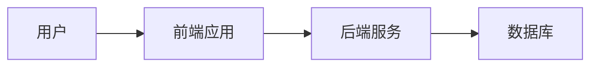

# 校园门户网系统详细设计与具体代码实现

作者：禅与计算机程序设计艺术

## 1. 背景介绍

### 1.1 项目背景

随着信息技术的不断发展，校园信息化建设已成为各大高校的重要任务之一。校园门户网系统作为高校信息化建设的重要组成部分，承载了学生、教师、管理人员等各类用户的多种需求。其主要功能包括课程信息查询、成绩查询、校园新闻发布、学术资源共享等。

### 1.2 设计目标

设计一个校园门户网系统，旨在为用户提供一个统一的入口，方便快捷地访问各类校园信息和服务。系统应具备良好的扩展性和可维护性，能够根据需求的变化进行功能扩展和调整。

### 1.3 技术选型

在本项目中，我们选择了以下技术栈：

- **前端**：React.js, Redux, Bootstrap
- **后端**：Spring Boot, Spring Security, Hibernate
- **数据库**：MySQL
- **其他**：Docker, Kubernetes, Jenkins

## 2. 核心概念与联系

### 2.1 系统架构

校园门户网系统采用前后端分离的架构设计，前端使用React.js构建用户界面，后端使用Spring Boot提供RESTful API服务。数据库采用MySQL存储数据，使用Docker和Kubernetes进行容器化部署和管理。



### 2.2 模块划分

系统主要划分为以下几个模块：

- **用户管理模块**：用户注册、登录、权限管理
- **信息发布模块**：校园新闻、公告发布
- **课程管理模块**：课程信息查询、选课
- **成绩管理模块**：成绩查询、导入导出
- **资源共享模块**：学术资源上传下载

### 2.3 数据流

用户通过前端应用访问系统，前端应用向后端服务发送请求，后端服务处理请求并与数据库交互，最终将结果返回给前端应用。

## 3. 核心算法原理具体操作步骤

### 3.1 用户认证与授权

用户认证采用JWT（JSON Web Token）机制，用户登录成功后，服务器生成一个JWT并返回给客户端。客户端在后续请求中携带该JWT，服务器通过验证JWT来确认用户身份。

### 3.2 数据库设计

数据库设计采用关系型数据库MySQL，主要表结构包括用户表、课程表、成绩表、新闻表、资源表等。

```sql
CREATE TABLE users (
    id INT AUTO_INCREMENT PRIMARY KEY,
    username VARCHAR(50) NOT NULL,
    password VARCHAR(100) NOT NULL,
    role VARCHAR(20) NOT NULL
);

CREATE TABLE courses (
    id INT AUTO_INCREMENT PRIMARY KEY,
    course_name VARCHAR(100) NOT NULL,
    description TEXT
);

CREATE TABLE grades (
    id INT AUTO_INCREMENT PRIMARY KEY,
    user_id INT NOT NULL,
    course_id INT NOT NULL,
    grade FLOAT,
    FOREIGN KEY (user_id) REFERENCES users(id),
    FOREIGN KEY (course_id) REFERENCES courses(id)
);
```

### 3.3 课程管理算法

课程管理模块的核心算法包括课程查询、选课操作。选课操作需要检查课程容量是否已满，并更新课程的已选人数。

```java
public boolean selectCourse(int userId, int courseId) {
    Course course = courseRepository.findById(courseId);
    if (course.getEnrolled() < course.getCapacity()) {
        course.setEnrolled(course.getEnrolled() + 1);
        courseRepository.save(course);
        Enrollment enrollment = new Enrollment(userId, courseId);
        enrollmentRepository.save(enrollment);
        return true;
    } else {
        return false;
    }
}
```

## 4. 数学模型和公式详细讲解举例说明

### 4.1 用户推荐算法

为了提高用户体验，我们可以在系统中引入推荐算法，根据用户的行为数据推荐课程或资源。常用的推荐算法包括协同过滤算法和基于内容的推荐算法。

#### 4.1.1 协同过滤算法

协同过滤算法通过计算用户之间的相似度，推荐其他用户喜欢的课程。相似度计算常用余弦相似度：

$$
\text{sim}(u, v) = \frac{\sum_{i \in I_{uv}} r_{ui} \cdot r_{vi}}{\sqrt{\sum_{i \in I_{u}} r_{ui}^2} \cdot \sqrt{\sum_{i \in I_{v}} r_{vi}^2}}
$$

其中，$I_{uv}$表示用户$u$和$v$共同评分的课程集合，$r_{ui}$表示用户$u$对课程$i$的评分。

#### 4.1.2 基于内容的推荐算法

基于内容的推荐算法通过分析课程的属性，推荐与用户喜欢的课程相似的其他课程。相似度计算常用TF-IDF（词频-逆文档频率）算法：

$$
\text{TF-IDF}(t, d) = \text{TF}(t, d) \cdot \text{IDF}(t)
$$

其中，$\text{TF}(t, d)$表示词$t$在文档$d$中的词频，$\text{IDF}(t)$表示词$t$的逆文档频率。

## 4. 项目实践：代码实例和详细解释说明

### 4.1 前端代码实例

前端使用React.js构建，以下是一个简单的课程查询组件：

```jsx
import React, { useState, useEffect } from 'react';
import axios from 'axios';

const CourseList = () => {
    const [courses, setCourses] = useState([]);

    useEffect(() => {
        axios.get('/api/courses')
            .then(response => {
                setCourses(response.data);
            })
            .catch(error => {
                console.error('There was an error fetching the courses!', error);
            });
    }, []);

    return (
        <div>
            <h2>Course List</h2>
            <ul>
                {courses.map(course => (
                    <li key={course.id}>{course.course_name}</li>
                ))}
            </ul>
        </div>
    );
};

export default CourseList;
```

### 4.2 后端代码实例

后端使用Spring Boot构建，以下是一个简单的课程查询接口：

```java
@RestController
@RequestMapping("/api/courses")
public class CourseController {

    @Autowired
    private CourseRepository courseRepository;

    @GetMapping
    public List<Course> getCourses() {
        return courseRepository.findAll();
    }
}
```

### 4.3 数据库操作实例

使用Hibernate进行数据库操作，以下是一个简单的课程实体类：

```java
@Entity
public class Course {

    @Id
    @GeneratedValue(strategy = GenerationType.IDENTITY)
    private int id;
    private String courseName;
    private String description;
    private int capacity;
    private int enrolled;

    // Getters and setters
}
```

## 5. 实际应用场景

### 5.1 学生信息管理

学生可以通过校园门户网系统查询个人信息、课程信息、成绩信息等，方便快捷地管理自己的学习生活。

### 5.2 教师教学管理

教师可以通过系统发布课程信息、管理学生成绩、共享教学资源，提高教学管理效率。

### 5.3 校园新闻发布

学校管理人员可以通过系统发布校园新闻、公告，及时传达重要信息。

## 6. 工具和资源推荐

### 6.1 开发工具

- **IDE**：IntelliJ IDEA, Visual Studio Code
- **版本控制**：Git, GitHub
- **容器化工具**：Docker, Kubernetes
- **持续集成**：Jenkins

### 6.2 在线资源

- **React.js 文档**：[https://reactjs.org/docs/getting-started.html](https://reactjs.org/docs/getting-started.html)
- **Spring Boot 文档**：[https://spring.io/projects/spring-boot](https://spring.io/projects/spring-boot)
- **MySQL 文档**：[https://dev.mysql.com/doc/](https://dev.mysql.com/doc/)

## 7. 总结：未来发展趋势与挑战

### 7.1 未来发展趋势

随着技术的不断发展，校园门户网系统将朝着智能化、个性化的方向发展。未来，我们可以引入更多的人工智能技术，如自然语言处理、机器学习等，提升系统的智能化水平，为用户提供更加个性化的服务。

### 7.2 面临的挑战

在系统的发展过程中，我们将面临以下挑战：

- **数据安全**：如何保护用户数据的安全，防止数据泄露和篡改。
- **性能优化**：如何在高并发访问情况下保证系统的性能和稳定性。
- **用户体验**：如何提升系统的用户体验，使其更加符合用户需求。

## 8. 附录：常见问题与解答

### 8.1 如何解决用户