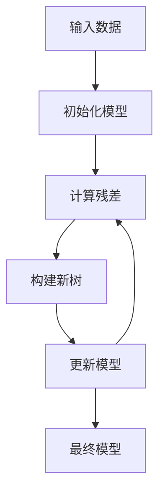

# 梯度提升树实战：构建金融风控模型

作者：禅与计算机程序设计艺术

## 1.背景介绍

### 1.1 金融风控的挑战

金融风控是金融行业中至关重要的一环。随着金融产品和服务的多样化，风险管理变得愈发复杂。传统的风控手段已经无法应对现代金融市场的快速变化和多样化需求，因此，借助机器学习和人工智能技术来提升风控模型的准确性和效率成为了必然选择。

### 1.2 机器学习在金融风控中的应用

机器学习技术在金融风控中得到了广泛应用，包括信用评分、欺诈检测、市场预测等。通过分析大量的历史数据，机器学习算法能够从中挖掘出潜在的模式和趋势，从而帮助金融机构做出更为准确的决策。

### 1.3 梯度提升树简介

梯度提升树（Gradient Boosting Decision Trees, GBDT）是一种强大的集成学习算法，广泛应用于分类和回归问题。它通过构建多个弱学习器（通常是决策树）并逐步优化模型性能，在处理非线性关系和高维数据时表现出色。

## 2.核心概念与联系

### 2.1 集成学习

集成学习是一种通过结合多个模型的预测结果来提高整体模型性能的技术。常见的集成学习方法包括Bagging、Boosting和Stacking。梯度提升树属于Boosting方法的一种。

### 2.2 决策树

决策树是一种树状结构的模型，用于分类和回归任务。每个内部节点表示一个特征的测试，每个分支代表测试结果，每个叶节点表示一个类别或回归值。决策树的优点是易于理解和解释，但单个决策树容易过拟合。

### 2.3 梯度提升

梯度提升是一种迭代优化算法，通过逐步构建新的模型来纠正前一模型的错误。每一步中，新的模型针对前一模型的残差进行训练，从而逐步提高整体模型的性能。

### 2.4 梯度提升树的工作原理

梯度提升树通过迭代地构建多个决策树，每个树都试图纠正前一树的错误。最终的预测结果是所有树的加权和。其核心思想是通过逐步减少预测误差来提高模型性能。



## 3.核心算法原理具体操作步骤

### 3.1 数据预处理

在构建梯度提升树之前，数据预处理是必不可少的一步。包括数据清洗、特征工程和数据分割等步骤。

### 3.2 初始化模型

首先，初始化一个简单的模型，通常是常数值模型。这个模型的预测结果是所有目标值的平均值。

### 3.3 计算残差

计算当前模型的预测误差（残差），残差是目标值与预测值之间的差异。

### 3.4 构建新树

使用残差作为新的目标值，构建一个新的决策树。这个新树试图拟合当前模型的残差。

### 3.5 更新模型

将新树的预测结果加到当前模型中，从而更新模型。这个过程会逐步减少残差，提高模型的预测准确性。

### 3.6 迭代过程

重复计算残差、构建新树和更新模型的过程，直到达到预设的迭代次数或模型性能不再显著提升。

## 4.数学模型和公式详细讲解举例说明

### 4.1 损失函数

梯度提升树通过最小化损失函数来优化模型。常见的损失函数包括均方误差（MSE）和对数损失（Log Loss）。

$$
L(y, \hat{y}) = \frac{1}{n} \sum_{i=1}^{n} (y_i - \hat{y}_i)^2
$$

### 4.2 梯度计算

在每次迭代中，计算损失函数相对于当前模型预测值的梯度。梯度表示损失函数的变化率，用于指导新树的构建。

$$
g_i = \frac{\partial L(y_i, \hat{y}_i)}{\partial \hat{y}_i}
$$

### 4.3 更新模型

使用新树的预测结果和学习率（$\eta$）来更新模型。学习率控制每次更新的步长，防止模型过拟合。

$$
\hat{y}_i^{(t+1)} = \hat{y}_i^{(t)} + \eta \cdot f_t(x_i)
$$

其中，$f_t(x_i)$ 是第 $t$ 棵树的预测结果。

## 5.项目实践：代码实例和详细解释说明

### 5.1 数据集介绍

我们将使用一个公开的信用卡欺诈检测数据集，该数据集包含了大量的交易记录和标签信息，用于标识交易是否为欺诈。

### 5.2 数据预处理

```python
import pandas as pd
from sklearn.model_selection import train_test_split
from sklearn.preprocessing import StandardScaler

# 读取数据
data = pd.read_csv('credit_card_fraud.csv')

# 数据清洗
data = data.dropna()

# 特征和标签分离
X = data.drop('Class', axis=1)
y = data['Class']

# 数据分割
X_train, X_test, y_train, y_test = train_test_split(X, y, test_size=0.2, random_state=42)

# 特征标准化
scaler = StandardScaler()
X_train = scaler.fit_transform(X_train)
X_test = scaler.transform(X_test)
```

### 5.3 构建梯度提升树模型

```python
from sklearn.ensemble import GradientBoostingClassifier
from sklearn.metrics import classification_report, confusion_matrix

# 构建模型
model = GradientBoostingClassifier(n_estimators=100, learning_rate=0.1, max_depth=3, random_state=42)

# 训练模型
model.fit(X_train, y_train)

# 预测
y_pred = model.predict(X_test)

# 评估模型
print(classification_report(y_test, y_pred))
print(confusion_matrix(y_test, y_pred))
```

### 5.4 模型解释

通过上述代码，我们构建了一个梯度提升树模型，并对测试集进行了预测和评估。梯度提升树通过迭代地构建多个决策树，逐步提高模型的预测性能。

## 6.实际应用场景

### 6.1 信用评分

梯度提升树可以用于构建信用评分模型，通过分析用户的历史信用记录和行为数据，评估其信用风险。

### 6.2 欺诈检测

在金融交易中，梯度提升树可以用于检测潜在的欺诈行为，通过分析交易数据和用户行为模式，识别异常交易。

### 6.3 市场预测

梯度提升树在市场预测中也有广泛应用，通过分析历史市场数据，预测未来的市场趋势和价格变化。

## 7.工具和资源推荐

### 7.1 工具

- **Scikit-learn**: Python中的机器学习库，提供了梯度提升树的实现。
- **XGBoost**: 一种高效的梯度提升树实现，广泛应用于各种机器学习竞赛中。
- **LightGBM**: 微软开发的梯度提升树库，具有更快的训练速度和更低的内存消耗。

### 7.2 资源

- **Kaggle**: 数据科学竞赛平台，提供大量公开数据集和代码实例。
- **Coursera**: 在线教育平台，提供机器学习和数据科学相关课程。
- **GitHub**: 开源代码托管平台，可以找到大量机器学习项目和代码资源。

## 8.总结：未来发展趋势与挑战

### 8.1 发展趋势

随着数据量的不断增加和计算能力的提升，梯度提升树在金融风控中的应用前景广阔。未来，结合深度学习和图神经网络等新技术，梯度提升树有望在处理复杂的金融数据和非结构化数据方面取得更大突破。

### 8.2 挑战

尽管梯度提升树在许多应用中表现出色，但仍面临一些挑战。例如，模型的训练时间较长，对高维数据的处理能力有限。此外，如何有效地解释和可视化模型结果也是一个重要问题。

## 9.附录：常见问题与解答

### 9.1 梯度提升树与随机森林的区别？

梯度提升树和随机森林都是集成学习方法，但它们的工作原