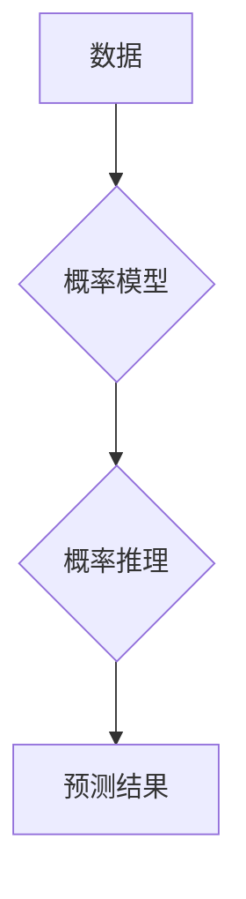

# 概率编程：用代码表达不确定性，开启AI新篇章

作者：禅与计算机程序设计艺术

## 1. 背景介绍

### 1.1 人工智能的挑战：处理不确定性

人工智能领域一直致力于构建能够像人类一样思考和行动的智能系统。然而，现实世界充满了不确定性，从传感器噪声到不完整的知识，都对构建稳健可靠的AI系统构成了巨大挑战。传统的确定性编程方法难以有效处理这些不确定性，而概率编程应运而生，为解决这一难题提供了全新的思路。

### 1.2 概率编程：将概率思维融入编程

概率编程是一种将概率论和统计学原理融入编程语言的范式。它允许开发者使用代码显式地对不确定性进行建模，并使用概率推理来进行预测、决策和学习。与传统的确定性编程不同，概率编程不关注于找到问题的单一“正确”答案，而是试图推断所有可能答案的概率分布，从而更全面地理解和解决问题。

### 1.3 概率编程的优势

概率编程相比于传统方法，具有以下显著优势：

* **更强大的表达能力:**  能够表达复杂的不确定性和依赖关系，更接近人类的思维方式。
* **更稳健的预测:**  提供概率性的预测结果，而非单一的确定性答案，更能应对现实世界的复杂性。
* **更有效的学习:**  能够从数据中学习概率模型，并随着数据的增加不断优化模型，实现更精准的预测。

## 2. 核心概念与联系

### 2.1 概率分布

概率分布是概率编程的核心概念，用于描述随机变量取不同值的可能性。常见的概率分布包括：

* **正态分布:** 用于描述连续型随机变量，例如身高、体重等。
* **伯努利分布:** 用于描述二元随机变量，例如抛硬币的结果（正面或反面）。
* **泊松分布:** 用于描述在固定时间或空间范围内事件发生的次数，例如网站每小时的访问量。

### 2.2 贝叶斯定理

贝叶斯定理是概率论中的重要定理，用于根据先验信息和观测数据更新对事件的信念。在概率编程中，贝叶斯定理被广泛用于概率推理和模型更新。

贝叶斯定理的公式如下：

$$
P(A|B) = \frac{P(B|A)P(A)}{P(B)}
$$

其中：

* $P(A|B)$ 表示在已知事件B发生的情况下，事件A发生的概率，称为后验概率。
* $P(B|A)$ 表示在已知事件A发生的情况下，事件B发生的概率，称为似然度。
* $P(A)$ 表示事件A发生的概率，称为先验概率。
* $P(B)$ 表示事件B发生的概率。

### 2.3 概率图模型

概率图模型是一种用图结构来表示随机变量之间依赖关系的工具。常见的概率图模型包括：

* **贝叶斯网络:**  有向无环图，用于表示随机变量之间的因果关系。
* **马尔可夫随机场:** 无向图，用于表示随机变量之间的相关性。

概率图模型可以直观地展示复杂系统中变量之间的关系，并 facilitate 推理和学习。

### 2.4 核心概念之间的联系

概率分布是构建概率模型的基础，贝叶斯定理提供了更新模型的理论依据，而概率图模型则为表示和推理复杂模型提供了有效工具。这些核心概念相互联系，共同构成了概率编程的理论基础。

## 3. 核心算法原理具体操作步骤

概率编程的核心算法是概率推理，其目的是根据已知的概率模型和观测数据，推断未知变量的后验概率分布。常用的概率推理算法包括：

### 3.1 精确推理

* **变量消元法:** 通过逐个消去概率图模型中的变量来计算目标变量的边缘概率分布。
* **信念传播:** 在概率图模型中传递消息，以计算每个变量的边缘概率分布。

精确推理方法能够得到精确的解，但计算复杂度较高，适用于规模较小的模型。

### 3.2 近似推理

* **马尔可夫链蒙特卡洛方法 (MCMC):** 通过构造马尔可夫链来模拟目标变量的后验概率分布。
* **变分推理:**  寻找一个简单分布来近似目标变量的后验概率分布。

近似推理方法能够在可接受的时间内得到近似解，适用于规模较大的模型。

## 4. 数学模型和公式详细讲解举例说明

本节以一个简单的例子来说明概率编程的数学模型和公式。

假设我们要预测一个学生是否能通过考试，已知该学生的学习时间和考试难度。我们可以建立一个简单的概率模型，如下所示：

* **随机变量:**
    *  $P$ : 学生通过考试的概率
    *  $S$ : 学生的学习时间 (单位: 小时)
    *  $D$ : 考试难度 (取值为 1, 2, 3，分别代表容易、中等、困难)

* **概率模型:**

$$
P(P=True | S, D) = \frac{1}{1 + exp(-(\beta_0 + \beta_1 * S + \beta_2 * D))}
$$

其中：

* $\beta_0$, $\beta_1$, $\beta_2$ 是模型的参数，可以通过训练数据学习得到。
* $exp(x)$ 表示 $e^x$。

这个模型是一个逻辑回归模型，它将学生的学习时间和考试难度作为输入，预测学生通过考试的概率。

假设我们有一个学生，他学习了 10 个小时，考试难度为 2 (中等)，我们可以使用上述模型来预测他通过考试的概率：

$$
P(P=True | S=10, D=2) = \frac{1}{1 + exp(-(\beta_0 + \beta_1 * 10 + \beta_2 * 2))}
$$

将学习时间和考试难度代入模型，并根据模型参数计算，就可以得到学生通过考试的概率。

## 5. 项目实践：代码实例和详细解释说明

本节将使用 Python 语言和 PyMC3 库来演示如何使用概率编程解决实际问题。

### 5.1 安装 PyMC3

```
pip install pymc3
```

### 5.2 代码实例: 线性回归

```python
import pymc3 as pm
import numpy as np
import matplotlib.pyplot as plt

# 生成模拟数据
np.random.seed(123)
x = np.linspace(0, 10, 100)
y = 2 * x + 1 + np.random.randn(100)

# 定义概率模型
with pm.Model() as model:
    # 定义先验分布
    beta = pm.Normal("beta", mu=0, sigma=10, shape=2)
    sigma = pm.HalfNormal("sigma", sigma=10)

    # 定义似然函数
    mu = beta[0] + beta[1] * x
    y_obs = pm.Normal("y_obs", mu=mu, sigma=sigma, observed=y)

    # 进行概率推理
    trace = pm.sample(2000, tune=1000)

# 打印模型参数的后验分布
pm.summary(trace)

# 绘制模型拟合结果
plt.plot(x, y, "o")
plt.plot(x, trace["beta"][:, 0] + trace["beta"][:, 1] * x, "C1-", alpha=0.1)
plt.xlabel("x")
plt.ylabel("y")
plt.show()
```

### 5.3 代码解释

* **导入库:** 导入所需的库，包括 PyMC3、NumPy 和 Matplotlib。
* **生成模拟数据:** 使用 NumPy 生成模拟的线性数据，包括自变量 `x` 和因变量 `y`。
* **定义概率模型:** 使用 `pm.Model()` 创建一个概率模型，并在其中定义先验分布和似然函数。
    * **先验分布:**  定义模型参数的先验分布，例如斜率 `beta` 和标准差 `sigma`。
    * **似然函数:** 定义数据的生成过程，例如线性回归模型 `y = beta[0] + beta[1] * x + error`。
* **进行概率推理:** 使用 `pm.sample()` 进行概率推理，得到模型参数的后验分布。
* **打印模型参数的后验分布:** 使用 `pm.summary()` 打印模型参数的后验分布的统计信息，例如均值、标准差和置信区间。
* **绘制模型拟合结果:** 使用 Matplotlib 绘制模型拟合结果，包括数据点和模型预测值。

## 6. 实际应用场景

概率编程在各个领域都有着广泛的应用，例如：

* **机器学习:**  贝叶斯优化、概率矩阵分解、高斯过程回归等。
* **自然语言处理:**  主题模型、情感分析、机器翻译等。
* **计算机视觉:**  目标检测、图像分割、视频分析等。
* **生物信息学:**  基因表达分析、蛋白质结构预测等。
* **金融工程:**  风险管理、投资组合优化等。

## 7. 工具和资源推荐

* **概率编程语言:**
    * PyMC3 (Python)
    * Stan (C++)
    * Edward2 (TensorFlow)
    * Turing.jl (Julia)
* **书籍:**
    * "Probabilistic Programming & Bayesian Methods for Hackers" by Cameron Davidson-Pilon
    * "Statistical Rethinking" by Richard McElreath
    * "Bayesian Data Analysis" by Andrew Gelman et al.
* **在线资源:**
    * PyMC3 文档: https://docs.pymc.io/
    * Stan 文档: https://mc-stan.org/
    * Edward2 文档: https://github.com/google/edward2
    * Turing.jl 文档: https://turinglang.org/

## 8. 总结：未来发展趋势与挑战

### 8.1 未来发展趋势

* **更强大的概率编程语言:**  支持更复杂模型和更高效推理的语言。
* **更广泛的应用领域:**  将概率编程应用于更多领域，例如医疗保健、自动驾驶等。
* **与深度学习的结合:**  将概率编程和深度学习相结合，构建更强大、更可解释的AI模型。

### 8.2 面临的挑战

* **计算复杂度:**  概率推理的计算复杂度较高，尤其对于复杂模型。
* **模型选择:**  选择合适的概率模型是一个挑战，需要领域知识和经验。
* **可解释性:**  概率模型的可解释性是一个挑战，需要开发新的方法来解释模型的预测结果。

## 9. 附录：常见问题与解答

### 9.1 什么是概率编程？

概率编程是一种将概率论和统计学原理融入编程语言的范式，它允许开发者使用代码显式地对不确定性进行建模，并使用概率推理来进行预测、决策和学习。

### 9.2 概率编程的优势是什么？

概率编程相比于传统方法，具有更强大的表达能力、更稳健的预测和更有效的学习能力。

### 9.3 概率编程有哪些应用场景？

概率编程在机器学习、自然语言处理、计算机视觉、生物信息学、金融工程等领域都有着广泛的应用。


## 10.  Mermaid 流程图



**图解：**

1.  从数据出发，构建概率模型。
2.  利用概率模型，进行概率推理。
3.  根据推理结果，得到预测结果。
