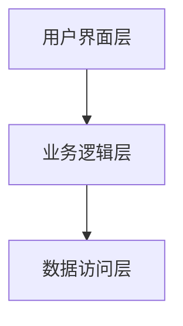

# 汽车销售管理信息系统详细设计与具体代码实现

## 1. 背景介绍

### 1.1 汽车销售行业现状

随着全球汽车市场的快速发展，汽车销售行业面临着日益激烈的竞争和日趋复杂的管理需求。汽车销售管理信息系统（Car Sales Management Information System, CSMIS）作为一种集成化的信息管理平台，旨在帮助汽车销售公司优化业务流程、提升管理效率、增强客户满意度，从而在市场竞争中获得优势。

### 1.2 信息系统的重要性

在现代商业环境中，信息系统的作用不可忽视。一个高效的汽车销售管理信息系统不仅能够帮助企业实时掌握销售动态、库存情况，还可以通过数据分析和预测，提供决策支持，帮助企业制定更为精准的销售策略。

### 1.3 本文目的

本文将详细介绍汽车销售管理信息系统的设计与实现，包括系统的核心概念、算法原理、数学模型、代码实例、实际应用场景、工具和资源推荐，以及未来发展趋势与挑战。通过本文的学习，读者将能够深入理解CSMIS的设计思想和实现过程，并能够在实际项目中应用所学知识。

## 2. 核心概念与联系

### 2.1 系统架构

汽车销售管理信息系统通常采用分层架构设计，包括用户界面层、业务逻辑层和数据访问层。每一层次的设计与实现都需要考虑其独特的职责和功能。



### 2.2 主要功能模块

CSMIS的主要功能模块包括客户管理、库存管理、销售管理、财务管理和报表管理。每个功能模块都承担着特定的业务职责，确保系统能够全面覆盖汽车销售业务的各个方面。

### 2.3 数据库设计

数据库是CSMIS的核心组成部分，负责存储和管理系统中的各类数据。数据库设计需要考虑数据的完整性、一致性和安全性，确保系统能够高效、稳定地运行。

## 3. 核心算法原理具体操作步骤

### 3.1 客户管理模块

客户管理模块的核心算法包括客户信息的录入、查询、修改和删除。通过这些操作，系统能够实现对客户信息的全面管理。

### 3.2 库存管理模块

库存管理模块的核心算法包括库存信息的录入、查询、修改和删除。系统需要实时更新库存信息，确保库存数据的准确性和及时性。

### 3.3 销售管理模块

销售管理模块的核心算法包括销售订单的生成、查询、修改和删除。系统需要对销售订单进行有效管理，确保销售数据的准确性和完整性。

### 3.4 财务管理模块

财务管理模块的核心算法包括财务数据的录入、查询、修改和删除。系统需要对财务数据进行有效管理，确保财务数据的准确性和完整性。

### 3.5 报表管理模块

报表管理模块的核心算法包括报表的生成、查询和导出。系统需要对各种业务数据进行分析，生成各类报表，为企业决策提供支持。

## 4. 数学模型和公式详细讲解举例说明

### 4.1 数据分析模型

在CSMIS中，数据分析模型是一个重要的组成部分。通过对销售数据、库存数据和客户数据进行分析，系统能够提供有价值的业务洞察。

$$
销售预测模型：Y_t = \alpha + \beta X_t + \epsilon_t
$$

其中，$Y_t$ 表示在时间 $t$ 的销售量，$X_t$ 表示在时间 $t$ 的影响因素（如市场需求、促销活动等），$\alpha$ 和 $\beta$ 是模型参数，$\epsilon_t$ 是随机误差。

### 4.2 库存管理模型

库存管理模型通过对库存数据的分析，帮助企业优化库存管理，降低库存成本。

$$
经济订货量（EOQ）模型：EOQ = \sqrt{\frac{2DS}{H}}
$$

其中，$D$ 表示年需求量，$S$ 表示每次订货的固定成本，$H$ 表示单位库存的年持有成本。

### 4.3 客户价值模型

客户价值模型通过对客户数据的分析，帮助企业识别高价值客户，制定精准的营销策略。

$$
客户终生价值（CLV）模型：CLV = \sum_{t=0}^{T} \frac{R_t - C_t}{(1 + r)^t}
$$

其中，$R_t$ 表示在时间 $t$ 的收入，$C_t$ 表示在时间 $t$ 的成本，$r$ 表示折现率，$T$ 表示客户生命周期。

## 5. 项目实践：代码实例和详细解释说明

### 5.1 客户管理模块代码实例

以下是客户管理模块的代码实例，展示了如何实现客户信息的录入、查询、修改和删除。

```python
# 客户管理模块代码示例

class Customer:
    def __init__(self, customer_id, name, contact_info):
        self.customer_id = customer_id
        self.name = name
        self.contact_info = contact_info

class CustomerManager:
    def __init__(self):
        self.customers = {}

    def add_customer(self, customer):
        self.customers[customer.customer_id] = customer

    def get_customer(self, customer_id):
        return self.customers.get(customer_id)

    def update_customer(self, customer_id, name=None, contact_info=None):
        customer = self.customers.get(customer_id)
        if customer:
            if name:
                customer.name = name
            if contact_info:
                customer.contact_info = contact_info

    def delete_customer(self, customer_id):
        if customer_id in self.customers:
            del self.customers[customer_id]

# 示例代码
customer_manager = CustomerManager()
customer = Customer(1, "John Doe", "123-456-7890")
customer_manager.add_customer(customer)
print(customer_manager.get_customer(1).name)
customer_manager.update_customer(1, contact_info="098-765-4321")
print(customer_manager.get_customer(1).contact_info)
customer_manager.delete_customer(1)
```

### 5.2 库存管理模块代码实例

以下是库存管理模块的代码实例，展示了如何实现库存信息的录入、查询、修改和删除。

```python
# 库存管理模块代码示例

class InventoryItem:
    def __init__(self, item_id, name, quantity):
        self.item_id = item_id
        self.name = name
        self.quantity = quantity

class InventoryManager:
    def __init__(self):
        self.inventory = {}

    def add_item(self, item):
        self.inventory[item.item_id] = item

    def get_item(self, item_id):
        return self.inventory.get(item_id)

    def update_item(self, item_id, name=None, quantity=None):
        item = self.inventory.get(item_id)
        if item:
            if name:
                item.name = name
            if quantity is not None:
                item.quantity = quantity

    def delete_item(self, item_id):
        if item_id in self.inventory:
            del self.inventory[item_id]

# 示例代码
inventory_manager = InventoryManager()
item = InventoryItem(1, "Car Model A", 10)
inventory_manager.add_item(item)
print(inventory_manager.get_item(1).name)
inventory_manager.update_item(1, quantity=15)
print(inventory_manager.get_item(1).quantity)
inventory_manager.delete_item(1)
```

### 5.3 销售管理模块代码实例

以下是销售管理模块的代码实例，展示了如何实现销售订单的生成、查询、修改和删除。

```python
# 销售管理模块代码示例

class SalesOrder:
    def __init__(self, order_id, customer_id, item_id, quantity):
        self.order_id = order_id
        self.customer_id = customer_id
        self.item_id = item_id
        self.quantity = quantity

class SalesOrderManager:
    def __init__(self):
        self.orders = {}

    def add_order(self, order):
        self.orders[order.order_id] = order

    def get_order(self, order_id):
        return self.orders.get(order_id)

    def update_order(self, order_id, customer_id=None, item_id=None, quantity=None):
        order = self.orders.get(order_id)
        if order:
            if customer_id:
                order.customer_id = customer_id
            if item_id:
                order.item_id = item_id
            if quantity is not None:
                order.quantity = quantity

    def delete_order(self, order_id):
        if order_id in self.orders:
            del self.orders[order_id]

# 示例代码
sales_order_manager = SalesOrderManager()
order = SalesOrder(1, 1, 1, 2)
sales_order_manager.add_order(order)
print(sales_order_manager.get_order(1).quantity)
sales_order_manager.update_order(1, quantity=3)
print(sales_order_manager.get_order(1).quantity)
sales_order_manager.delete_order(1)
```

### 