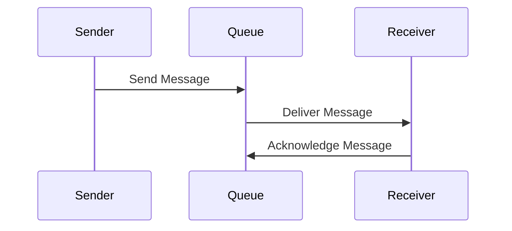
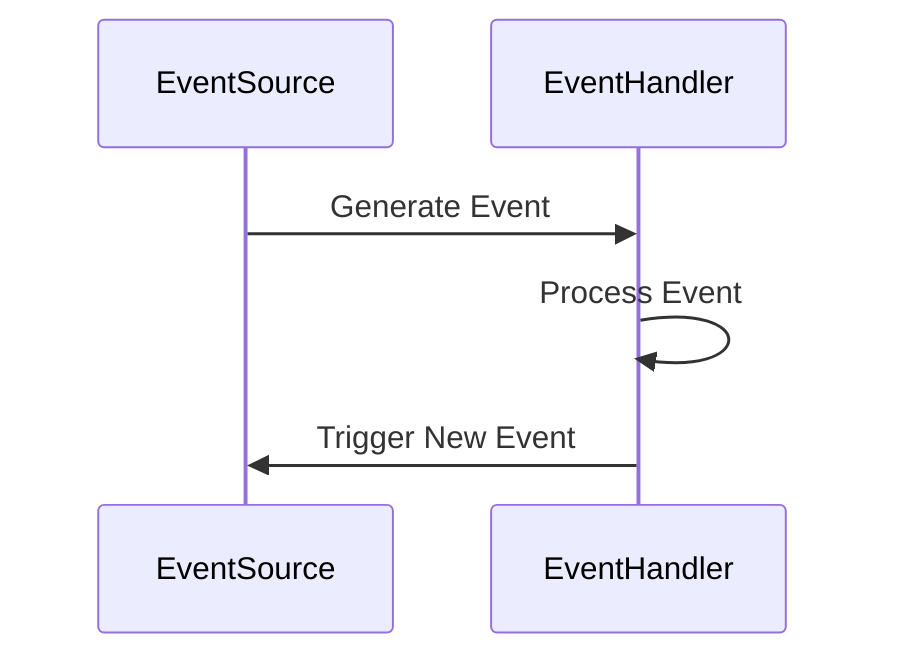
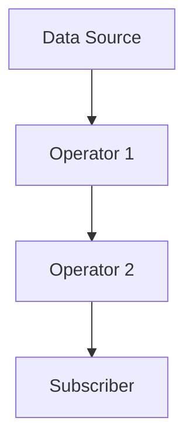

# 消息队列、事件驱动、响应式编程，三者究竟是什么关系?

作者：禅与计算机程序设计艺术

## 1. 背景介绍

在现代软件开发中，消息队列、事件驱动和响应式编程是三个常见且关键的概念。它们各自代表了不同的编程范式和架构模式，广泛应用于各种复杂的系统中。然而，许多开发者在实际工作中往往会对这三者的关系感到困惑。本篇文章将深入探讨消息队列、事件驱动和响应式编程的核心概念、具体操作步骤、数学模型和公式、项目实践、实际应用场景、工具和资源推荐，并总结其未来发展趋势与挑战，帮助读者更好地理解和应用这些技术。

## 2. 核心概念与联系

### 2.1 消息队列

消息队列是一种通信机制，用于在分布式系统中传递消息。它通过将消息存储在队列中，允许发送方和接收方异步地进行通信。消息队列的主要特点包括：

- **异步通信**：发送方和接收方不需要同时在线。
- **解耦**：发送方和接收方可以独立演化。
- **可靠性**：消息队列通常提供消息持久化和重试机制。

### 2.2 事件驱动

事件驱动是一种编程范式，它基于事件的发生来驱动程序的执行。事件可以是用户操作、系统信号或其他异步消息。事件驱动的主要特点包括：

- **异步处理**：事件处理程序在事件发生时被触发。
- **松耦合**：事件源和事件处理程序之间没有直接依赖关系。
- **扩展性**：可以方便地添加新的事件和处理程序。

### 2.3 响应式编程

响应式编程是一种声明式编程范式，强调数据流和变化传播。它允许开发者以更直观的方式处理异步数据流。响应式编程的主要特点包括：

- **数据流**：数据在流动过程中被处理和变换。
- **声明式**：通过声明数据依赖关系来自动管理数据更新。
- **组合性**：可以通过组合操作符构建复杂的数据处理逻辑。

### 2.4 三者之间的联系

消息队列、事件驱动和响应式编程虽然各自独立，但在实际应用中往往相互交织。消息队列可以作为事件驱动系统的基础设施，提供可靠的消息传递机制。而响应式编程则可以用于处理和变换事件流，使得事件驱动系统更加灵活和高效。

## 3. 核心算法原理具体操作步骤

### 3.1 消息队列的操作步骤

1. **消息发送**：发送方将消息发送到消息队列中。
2. **消息存储**：消息队列将消息存储起来，等待接收方消费。
3. **消息消费**：接收方从消息队列中读取消息并进行处理。
4. **消息确认**：接收方处理完消息后，向消息队列确认消息已被成功处理。



### 3.2 事件驱动的操作步骤

1. **事件生成**：事件源生成一个事件。
2. **事件分发**：事件被分发到相应的事件处理程序。
3. **事件处理**：事件处理程序对事件进行处理。
4. **事件响应**：处理结果可能触发新的事件，形成事件链。



### 3.3 响应式编程的操作步骤

1. **数据源**：定义数据源，通常是一个流。
2. **操作符**：使用操作符对数据流进行变换和处理。
3. **订阅者**：订阅数据流，获取处理后的数据。



## 4. 数学模型和公式详细讲解举例说明

### 4.1 消息队列的数学模型

消息队列可以用排队论中的M/M/1模型来描述，其中M表示泊松到达过程，M表示指数分布服务时间，1表示单服务台。其基本公式为：

$$
L = \frac{\lambda}{\mu - \lambda}
$$

其中，$L$ 是队列中的平均消息数，$\lambda$ 是消息到达率，$\mu$ 是消息处理率。

### 4.2 事件驱动的数学模型

事件驱动系统可以用离散事件仿真模型来描述。设事件到达时间为 $t_i$，处理时间为 $d_i$，则事件处理的完成时间 $T_i$ 为：

$$
T_i = t_i + d_i
$$

### 4.3 响应式编程的数学模型

响应式编程中的数据流可以用函数式编程中的组合子来描述。设数据流为 $x(t)$，操作符为 $f$ 和 $g$，则组合后的数据流为：

$$
y(t) = g(f(x(t)))
$$

## 5. 项目实践：代码实例和详细解释说明

### 5.1 消息队列的代码实例

以下是一个使用 RabbitMQ 的消息队列示例：

```python
import pika

# 连接到 RabbitMQ 服务器
connection = pika.BlockingConnection(pika.ConnectionParameters('localhost'))
channel = connection.channel()

# 声明队列
channel.queue_declare(queue='hello')

# 发送消息
channel.basic_publish(exchange='', routing_key='hello', body='Hello World!')
print(" [x] Sent 'Hello World!'")

# 关闭连接
connection.close()
```

### 5.2 事件驱动的代码实例

以下是一个使用 Node.js 的事件驱动示例：

```javascript
const EventEmitter = require('events');
class MyEmitter extends EventEmitter {}

const myEmitter = new MyEmitter();
myEmitter.on('event', () => {
  console.log('an event occurred!');
});
myEmitter.emit('event');
```

### 5.3 响应式编程的代码实例

以下是一个使用 RxJS 的响应式编程示例：

```javascript
const { fromEvent } = require('rxjs');
const { map } = require('rxjs/operators');

const clicks = fromEvent(document, 'click');
const positions = clicks.pipe(map(ev => ev.clientX));
positions.subscribe(x => console.log(x));
```

## 6. 实际应用场景

### 6.1 消息队列的应用场景

- **订单处理系统**：在电子商务系统中，订单的创建、支付、发货等操作可以通过消息队列来解耦和异步处理。
- **日志收集系统**：通过消息队列收集和处理分布式系统中的日志信息，提高系统的可靠性和可扩展性。

### 6.2 事件驱动的应用场景

- **用户界面交互**：在前端开发中，用户的点击、输入等操作可以通过事件驱动机制来处理，提高响应速度和用户体验。
- **物联网系统**：传感器数据的采集和处理可以通过事件驱动机制来实现，保证系统的实时性和可靠性。

### 6.3 响应式编程的应用场景

- **数据流处理**：在大数据处理和流式计算中，响应式编程可以用来处理和变换数据流，提高系统的灵活性和可维护性。
- **实时更新界面**：在前端开发中，响应式编程可以用来实现数据的实时更新和界面的自动刷新，提高用户体验。

## 7. 工具和资源推荐

### 7.1 消息队列工具

- **RabbitMQ**：一个开源的消息队列系统，支持多种协议，易于使用和扩展。
- **Apache Kafka**：一个分布式流处理平台，适用于高吞吐量的消息处理场景。

### 7.2 事件驱动工具

- **Node.js**：一个基于事件驱动的 JavaScript 运行环境，适用于构建高性能的网络应用。
- **EventEmitter**：Node.js 内置的事件驱动模块，提供了简单易用的事件处理接口。

### 7.3 响应式编程工具

- **RxJS**：一个用于响应式编程的 JavaScript 库，提供了丰富的数据流操作符。
- **Project Reactor**：一个用于 JVM 的