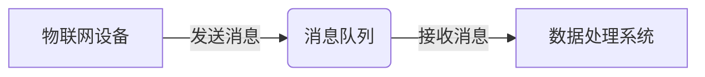
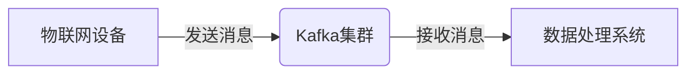

## 1. 背景介绍

### 1.1 物联网数据采集的挑战

物联网（IoT）的快速发展带来了海量数据的爆炸式增长。这些数据来自各种各样的传感器、设备和系统，具有规模庞大、种类繁多、实时性要求高等特点。传统的数据库和数据处理方式难以满足物联网数据采集的特殊需求，主要挑战包括：

* **高并发:** 物联网设备数量庞大，数据产生频率高，需要处理高并发的消息流。
* **数据异构:** 物联网设备类型多样，数据格式各异，需要进行数据清洗和转换。
* **实时性:** 部分物联网应用对数据处理的实时性要求较高，例如实时监控、预警等。
* **可扩展性:** 随着物联网设备数量的增加，数据采集系统需要具备良好的可扩展性。

### 1.2 消息队列的优势

消息队列（Message Queue）是一种异步通信模式，可以有效解决物联网数据采集面临的挑战。它具有以下优势：

* **异步通信:**  消息生产者可以将数据发送到消息队列后立即返回，无需等待数据处理完成，提高了系统吞吐量和响应速度。
* **解耦合:** 消息队列将数据生产者和消费者解耦，生产者无需关心消费者的状态，消费者也无需关心数据的来源，提高了系统的灵活性和可维护性。
* **削峰填谷:** 消息队列可以缓冲突发流量，防止系统过载，保证了系统的稳定性。
* **数据可靠性:**  消息队列可以保证消息的可靠传递，即使消费者出现故障，消息也不会丢失。

## 2. 核心概念与联系

### 2.1 消息队列的基本概念

* **消息（Message）:** 数据传输的基本单元，可以是任何格式的数据，例如JSON、XML、二进制等。
* **生产者（Producer）:**  负责创建消息并将其发送到消息队列的角色。
* **消费者（Consumer）:** 负责从消息队列接收消息并进行处理的角色。
* **队列（Queue）:**  存储消息的容器，遵循先进先出（FIFO）的原则。
* **主题（Topic）:**  一种消息路由机制，允许生产者将消息发送到多个主题，消费者可以订阅感兴趣的主题接收消息。

### 2.2 消息队列与物联网数据采集的关系

在物联网数据采集场景中，消息队列可以作为数据管道，连接数据生产者（物联网设备）和数据消费者（数据处理系统）。物联网设备将采集到的数据发送到消息队列，数据处理系统从消息队列接收数据进行处理，如下图所示：



## 3. 核心算法原理具体操作步骤

### 3.1 消息发布与订阅

消息队列通常采用发布-订阅模式进行消息传递。

1. **生产者发布消息:** 生产者将消息发送到指定的主题。
2. **消息队列存储消息:** 消息队列将消息存储到相应的主题队列中。
3. **消费者订阅主题:** 消费者订阅感兴趣的主题。
4. **消息队列推送消息:** 当消息队列中有新消息到达时，会将消息推送给订阅该主题的消费者。

### 3.2 消息确认机制

为了保证消息的可靠传递，消息队列通常采用消息确认机制。

1. **消费者接收消息:** 消息队列将消息推送给消费者后，消费者会发送确认消息给消息队列。
2. **消息队列确认消息:**  消息队列收到确认消息后，才会将消息从队列中删除。
3. **消息重传机制:** 如果消息队列在一定时间内没有收到消费者的确认消息，会将消息重新发送给其他消费者。

## 4. 数学模型和公式详细讲解举例说明

### 4.1 队列长度

队列长度是指队列中存储的消息数量。队列长度过大会导致消息延迟增加，队列长度过小会浪费系统资源。

假设消息到达速率为 $\lambda$，消息处理速率为 $\mu$，则队列长度的期望值为：

$$
L = \frac{\lambda}{\mu - \lambda}
$$

### 4.2 消息延迟

消息延迟是指消息从生产者发送到消费者接收的时间差。消息延迟受消息队列长度、消息处理时间等因素影响。

假设消息在队列中的等待时间为 $W$，消息处理时间为 $S$，则消息延迟为：

$$
D = W + S
$$

### 4.3 消息吞吐量

消息吞吐量是指单位时间内消息队列处理的消息数量。

假设消息队列的容量为 $C$，则消息吞吐量为：

$$
T = \frac{C}{D}
$$

## 5. 项目实践：代码实例和详细解释说明

### 5.1 基于Kafka的物联网数据采集系统

Apache Kafka 是一种高吞吐量、低延迟的分布式消息队列系统，非常适合用于物联网数据采集。

**系统架构:**



**代码示例:**

**生产者:**

```python
from kafka import KafkaProducer

# 创建 Kafka 生产者
producer = KafkaProducer(bootstrap_servers='localhost:9092')

# 发送消息
producer.send('iot-data', b'sensor_data')

# 关闭生产者
producer.close()
```

**消费者:**

```python
from kafka import KafkaConsumer

# 创建 Kafka 消费者
consumer = KafkaConsumer('iot-data',
                         group_id='my-group',
                         bootstrap_servers=['localhost:9092'])

# 接收消息
for message in consumer:
    # 处理消息
    print(message.value)
```

### 5.2 代码解释

* **生产者代码:**
    * `KafkaProducer` 类用于创建 Kafka 生产者。
    * `bootstrap_servers` 参数指定 Kafka 集群的地址。
    * `send()` 方法用于发送消息，第一个参数指定主题名称，第二个参数指定消息内容。
    * `close()` 方法用于关闭生产者连接。
* **消费者代码:**
    * `KafkaConsumer` 类用于创建 Kafka 消费者。
    * `group_id` 参数指定消费者组 ID，同一组内的消费者可以共同消费主题中的消息。
    * `bootstrap_servers` 参数指定 Kafka 集群的地址。
    * 循环遍历 `consumer` 对象，可以接收主题中的消息。

## 6. 实际应用场景

### 6.1 智能家居

在智能家居领域，消息队列可以用于连接各种智能设备，例如智能灯泡、智能门锁、智能空调等。智能设备将数据发送到消息队列，智能家居系统从消息队列接收数据进行处理，实现设备联动、场景控制等功能。

### 6.2 工业物联网

在工业物联网领域，消息队列可以用于连接各种工业设备，例如传感器、控制器、执行器等。工业设备将数据发送到消息队列，工业互联网平台从消息队列接收数据进行处理，实现设备监控、故障诊断、预测性维护等功能。

### 6.3 车联网

在车联网领域，消息队列可以用于连接车辆、路侧单元、云平台等。车辆将数据发送到消息队列，云平台从消息队列接收数据进行处理，实现车辆定位、导航、娱乐等功能。

## 7. 工具和资源推荐

### 7.1 消息队列产品

* **Apache Kafka:**  高吞吐量、低延迟的分布式消息队列系统。
* **RabbitMQ:**  功能丰富的开源消息队列系统。
* **ActiveMQ:**  成熟稳定的开源消息队列系统。
* **Amazon SQS:**  亚马逊云平台提供的托管消息队列服务。
* **阿里云消息队列 RocketMQ:** 阿里云平台提供的分布式消息队列服务。

### 7.2 学习资源

* **Apache Kafka 官方文档:** https://kafka.apache.org/documentation/
* **RabbitMQ 官方文档:** https://www.rabbitmq.com/documentation.html
* **ActiveMQ 官方文档:** https://activemq.apache.org/documentation/
* **Amazon SQS 开发者指南:** https://docs.aws.amazon.com/AWSSimpleQueueService/latest/SQSDeveloperGuide/welcome.html
* **阿里云消息队列 RocketMQ 官方文档:** https://help.aliyun.com/document_detail/29547.html

## 8. 总结：未来发展趋势与挑战

### 8.1 未来发展趋势

* **边缘计算:** 随着物联网设备数量的增加，边缘计算将成为趋势，消息队列需要支持边缘部署，实现数据在边缘侧的处理和分析。
* **实时流处理:**  物联网数据具有实时性要求，消息队列需要与流处理引擎集成，实现数据的实时处理和分析。
* **人工智能:**  人工智能技术可以用于分析物联网数据，消息队列需要支持与人工智能平台的集成，实现数据的智能化处理。

### 8.2 面临的挑战

* **安全性:**  物联网数据涉及到用户的隐私和安全，消息队列需要提供安全机制，保证数据的安全传输和存储。
* **可管理性:**  随着物联网设备数量的增加，消息队列的管理和维护将变得更加复杂，需要提供便捷的管理工具和监控手段。
* **成本控制:**  消息队列的使用会产生一定的成本，需要选择合适的方案，控制成本。

## 9. 附录：常见问题与解答

### 9.1 消息队列如何保证消息的顺序性？

消息队列可以通过分区和消息确认机制保证消息的顺序性。

* **分区:**  消息队列可以将主题划分为多个分区，每个分区内的消息可以保证顺序性。
* **消息确认机制:**  消费者只有在成功处理完当前消息后，才会发送确认消息给消息队列，消息队列才会将下一条消息发送给消费者。

### 9.2 消息队列如何处理消息积压？

消息队列可以通过增加消费者数量、扩展消息队列容量等方式处理消息积压。

* **增加消费者数量:**  增加消费者数量可以提高消息的消费速度，从而减少消息积压。
* **扩展消息队列容量:**  扩展消息队列容量可以存储更多消息，从而缓解消息积压。

### 9.3 消息队列如何保证消息的不丢失？

消息队列可以通过消息持久化、消息确认机制等方式保证消息的不丢失。

* **消息持久化:**  消息队列可以将消息存储到磁盘等持久化存储中，即使系统崩溃，消息也不会丢失。
* **消息确认机制:**  消费者只有在成功处理完消息后，才会发送确认消息给消息队列，消息队列才会将消息从队列中删除。
