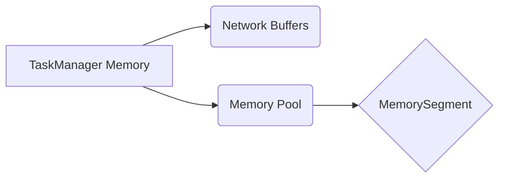

# 深入解读Flink内存管理源码:架构设计与实现细节

作者：禅与计算机程序设计艺术

## 1. 背景介绍

### 1.1 大数据时代对内存管理的挑战

随着大数据时代的到来，海量数据的处理对计算引擎的内存管理提出了更高的要求。传统的内存管理方式，如 JVM 堆内存管理，往往难以满足大规模数据处理的需求。主要挑战包括：

* **GC 停顿:**  频繁的垃圾回收会导致处理延迟，影响实时性。
* **内存碎片:**  长时间运行的任务容易产生内存碎片，降低内存利用率。
* **数据序列化/反序列化开销:**  频繁的对象创建和销毁会增加序列化和反序列化的开销，影响性能。

### 1.2 Flink 内存管理的优势

为了应对这些挑战，Flink 设计了独特的内存管理机制，其核心目标是：

* **减少 GC 停顿:**  通过自定义内存管理，减少甚至避免 JVM 垃圾回收的次数和时间。
* **提高内存利用率:**  高效地管理内存，减少内存碎片，提高内存利用率。
* **降低序列化/反序列化开销:**  通过直接操作二进制数据，减少数据序列化和反序列化的开销。

### 1.3 本文目标

本文将深入探讨 Flink 内存管理的源码实现，分析其架构设计和关键技术，帮助读者更好地理解 Flink 的内存管理机制，并为实际应用提供参考。

## 2. 核心概念与联系

### 2.1 内存模型

Flink 的内存模型主要包含以下几个部分：

* **Network Buffers:** 用于网络数据传输的缓冲区，由 Flink 自行管理，不属于 JVM 堆内存。
* **MemorySegment:**  Flink 内存管理的基本单元，表示一块固定大小的内存区域，类似于堆外内存。
* **MemoryPool:**  MemorySegment 的集合，用于管理多个 MemorySegment。
* **TaskManager Memory:**  每个 TaskManager 进程拥有的内存空间，包括 JVM 堆内存和堆外内存。

下图展示了 Flink 内存模型的结构：



### 2.2 核心组件

Flink 内存管理涉及以下几个核心组件：

* **MemoryManager:**  负责管理 TaskManager 的所有内存资源，包括 MemoryPool 的创建和销毁、MemorySegment 的分配和回收等。
* **NetworkBufferPool:**  负责管理 Network Buffers，包括 Network Buffer 的分配和回收。
* **IOManager:**  负责数据的读写操作，包括从磁盘读取数据到 MemorySegment、将 MemorySegment 中的数据写入磁盘等。

### 2.3 核心流程

Flink 内存管理的核心流程如下：

1.  **初始化阶段:** TaskManager 启动时，MemoryManager 会根据配置初始化 MemoryPool，并向 NetworkBufferPool 注册可用的内存空间。
2.  **数据读取阶段:**  IOManager 从外部数据源读取数据到 MemorySegment。
3.  **数据处理阶段:**  算子获取 MemorySegment 进行数据处理。
4.  **数据写出阶段:**  IOManager 将 MemorySegment 中的数据写入外部存储系统。
5.  **内存释放阶段:**  当 MemorySegment 不再使用时，将其归还给 MemoryPool。

## 3. 核心算法原理具体操作步骤

### 3.1 MemorySegment 的分配与回收

Flink 使用 **Buddy Allocation** 算法来管理 MemorySegment。Buddy Allocation 是一种高效的内存分配算法，其基本思想是将内存空间划分为大小相等的块，并按照伙伴关系组织起来。

* **分配 MemorySegment:**  当需要分配一块大小为 size 的 MemorySegment 时，MemoryPool 会找到第一个大于等于 size 的空闲块，并将该块划分为两个大小相等的块。其中一个块分配给申请者，另一个块保留为伙伴块。
* **回收 MemorySegment:**  当一块 MemorySegment 不再使用时，将其归还给 MemoryPool。MemoryPool 会检查其伙伴块是否空闲，如果空闲则将两个块合并成一个更大的块。

### 3.2 Network Buffer 的管理

Flink 使用 **Netty** 框架进行网络通信，并使用 Netty 的 **PooledByteBufAllocator** 来管理 Network Buffer。PooledByteBufAllocator 使用 **jemalloc** 算法来分配和回收内存，jemalloc 是一种高效的内存分配器，可以有效地减少内存碎片。

### 3.3 数据序列化/反序列化

Flink 使用自定义的序列化/反序列化框架，可以直接操作二进制数据，避免了 Java 对象的创建和销毁，从而提高了性能。

## 4. 数学模型和公式详细讲解举例说明

### 4.1 Buddy Allocation 算法

Buddy Allocation 算法可以使用数学公式来描述：

* **内存块大小:**  $2^k$，其中 k 为正整数。
* **伙伴块:**  两个大小相等且地址连续的内存块互为伙伴块。
* **分配:**  找到第一个大于等于请求大小的空闲块，将其划分为两个伙伴块，分配其中一个块，另一个块保留为伙伴块。
* **释放:**  将释放的块与其伙伴块合并，直到不能合并为止。

**举例说明:**

假设内存空间大小为 16KB，初始状态下所有内存块都为空闲状态。

1.  **分配 4KB 内存:**  找到第一个大于等于 4KB 的空闲块，即 8KB 的块，将其划分为两个 4KB 的伙伴块，分配其中一个块。
2.  **分配 2KB 内存:**  找到第一个大于等于 2KB 的空闲块，即 4KB 的块，将其划分为两个 2KB 的伙伴块，分配其中一个块。
3.  **释放 2KB 内存:**  将释放的 2KB 块与其伙伴块合并，得到一个 4KB 的空闲块。
4.  **释放 4KB 内存:**  将释放的 4KB 块与其伙伴块合并，得到一个 8KB 的空闲块。

### 4.2 jemalloc 算法

jemalloc 算法是一种基于 **arena** 的内存分配器，每个 arena 独立管理一块内存空间。jemalloc 使用 **bin** 来组织不同大小的内存块，每个 bin 负责管理特定大小范围内的内存块。

* **arena:**  一块独立管理的内存空间。
* **bin:**  用于管理特定大小范围内的内存块。
* **chunk:**  bin 中的基本分配单元。

**举例说明:**

假设一个 arena 的大小为 1MB，该 arena 中包含多个 bin，每个 bin 负责管理不同大小范围内的内存块。

1.  **分配 1KB 内存:**  jemalloc 会找到负责管理 1KB 内存块的 bin，并从该 bin 中分配一个 chunk。
2.  **分配 2KB 内存:**  jemalloc 会找到负责管理 2KB 内存块的 bin，并从该 bin 中分配一个 chunk。
3.  **释放 1KB 内存:**  jemalloc 会将释放的 chunk 归还给对应的 bin。
4.  **释放 2KB 内存:**  jemalloc 会将释放的 chunk 归还给对应的 bin。

## 5. 项目实践：代码实例和详细解释说明

### 5.1 MemorySegment 的获取和释放

```java
// 获取一个大小为 1024 字节的 MemorySegment
MemorySegment segment = memoryManager.allocate(1024);

// 使用 MemorySegment

// 释放 MemorySegment
segment.free();
```

### 5.2 Network Buffer 的获取和释放

```java
// 获取一个 Network Buffer
BufferPool bufferPool = networkBufferPool.requestBufferPool(1024);
Buffer  buffer = bufferPool.allocateBuffer();

// 使用 Network Buffer

// 释放 Network Buffer
buffer.release();
```

## 6. 实际应用场景

### 6.1 批处理

在批处理场景下，Flink 可以使用自定义的内存管理机制来提高数据处理效率。例如，Flink 可以将中间结果存储在 MemorySegment 中，避免了频繁的磁盘读写操作，从而提高了性能。

### 6.2 流处理

在流处理场景下，Flink 可以使用自定义的内存管理机制来降低 GC 停顿。例如，Flink 可以将状态数据存储在 MemorySegment 中，避免了 JVM 堆内存的频繁 GC，从而提高了实时性。

## 7. 总结：未来发展趋势与挑战

### 7.1 未来发展趋势

* **更高效的内存管理算法:**  随着硬件技术的不断发展，未来可能会出现更高效的内存管理算法，进一步提高内存利用率和性能。
* **与云原生技术的深度融合:**  随着云计算的普及，Flink 需要更好地与云原生技术融合，例如支持 Kubernetes 等容器编排平台。

### 7.2 面临的挑战

* **内存管理的复杂性:**  Flink 的内存管理机制比较复杂，需要开发者对其有深入的理解才能更好地应用。
* **与其他系统的兼容性:**  Flink 需要与其他系统进行交互，例如 Hadoop、Kafka 等，需要保证内存管理机制的兼容性。

## 8. 附录：常见问题与解答

### 8.1 Flink 内存管理与 JVM 内存管理的区别？

Flink 的内存管理机制与 JVM 内存管理机制的主要区别在于：

* **内存空间:**  Flink 使用堆外内存和 JVM 堆内存，而 JVM 只使用堆内存。
* **内存分配算法:**  Flink 使用 Buddy Allocation 算法和 jemalloc 算法，而 JVM 使用 generational garbage collection 算法。
* **GC 停顿:**  Flink 的内存管理机制可以有效地减少 GC 停顿，而 JVM 的 GC 停顿可能会比较明显。

### 8.2 如何配置 Flink 内存大小？

可以通过以下参数来配置 Flink 内存大小：

* **taskmanager.memory.process.size:**  TaskManager 进程的总内存大小。
* **taskmanager.memory.flink.size:**  Flink 使用的内存大小，包括 Network Buffers、Memory Pool 等。
* **taskmanager.memory.managed.size:**  Memory Pool 的大小。

### 8.3 如何监控 Flink 内存使用情况？

可以通过 Flink Web UI 或指标监控系统来监控 Flink 内存使用情况。