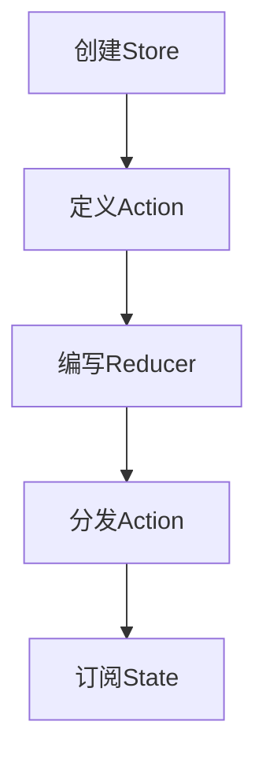
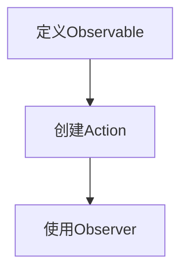
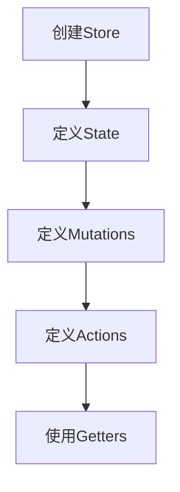

# 状态管理 原理与代码实例讲解

作者：禅与计算机程序设计艺术

## 1.背景介绍

### 1.1 状态管理的必要性

在现代前端开发中，应用的复杂性不断增加，组件之间的数据共享和状态同步变得愈发重要。无论是单页应用（SPA）还是多页应用，状态管理都是一个关键问题。状态管理不仅影响应用的性能，还直接关系到用户体验。因此，理解状态管理的原理和实现方法，对于开发高质量的前端应用至关重要。

### 1.2 常见的状态管理方案

目前，业界常用的状态管理方案包括：
- **Redux**：一个可预测的状态容器，广泛应用于React生态系统。
- **MobX**：一个简单、可扩展的状态管理库，基于响应式编程。
- **Vuex**：Vue.js的官方状态管理库，集成度高，易于使用。
- **Context API**：React提供的内置状态管理工具，适合中小型应用。

### 1.3 本文的目标

本文旨在深入探讨状态管理的原理，提供具体的算法步骤和代码实例，帮助读者全面理解和应用状态管理技术。我们将从核心概念、算法原理、数学模型、项目实践、实际应用场景、工具和资源推荐等方面进行详细讲解。

## 2.核心概念与联系

### 2.1 状态的定义

状态（State）是指应用在某一时刻的数据集合。状态的变化通常由用户操作或系统事件触发。

### 2.2 状态管理的基本原则

状态管理的基本原则包括：
- **单一数据源**：应用的状态应集中存储在一个地方。
- **不可变性**：状态的变化应通过创建新的状态对象来实现，而不是直接修改原有状态。
- **纯函数更新**：状态的更新应通过纯函数来实现，确保相同的输入总是产生相同的输出。

### 2.3 状态管理与组件通信

在组件化开发中，状态管理的核心在于如何高效地在组件之间传递和共享状态。常见的组件通信方式包括：
- **父子组件通信**：通过props和回调函数传递数据和事件。
- **兄弟组件通信**：通过状态管理工具（如Redux、Vuex）或事件总线实现。
- **跨层级组件通信**：通过Context API或状态管理工具实现。

## 3.核心算法原理具体操作步骤

### 3.1 Redux的工作原理

Redux的核心思想是将应用的状态存储在一个全局的状态树中，通过纯函数（reducer）来描述状态的变化。其主要步骤包括：

1. **创建Store**：使用`createStore`方法创建全局状态树。
2. **定义Action**：描述状态变化的事件，通常是一个包含`type`属性的对象。
3. **编写Reducer**：一个纯函数，根据不同的Action类型返回新的状态。
4. **分发Action**：通过`dispatch`方法触发状态变化。
5. **订阅State**：通过`subscribe`方法监听状态变化，更新UI。



### 3.2 MobX的工作原理

MobX采用响应式编程思想，通过观察者模式实现状态管理。其主要步骤包括：

1. **定义Observable**：将状态定义为可观察对象。
2. **创建Action**：定义修改状态的方法。
3. **使用Observer**：将组件包装成观察者，使其能够自动响应状态变化。



### 3.3 Vuex的工作原理

Vuex是Vue.js的官方状态管理库，采用集中式存储管理应用的所有组件状态。其主要步骤包括：

1. **创建Store**：使用`Vuex.Store`实例化全局状态树。
2. **定义State**：在`state`对象中定义应用的状态。
3. **定义Mutations**：在`mutations`对象中定义修改状态的方法。
4. **定义Actions**：在`actions`对象中定义业务逻辑和异步操作。
5. **使用Getters**：在`getters`对象中定义派生状态。



## 4.数学模型和公式详细讲解举例说明

### 4.1 状态转移矩阵

状态管理可以用数学中的状态转移矩阵来表示。假设有一个状态集合 $S = \{s_1, s_2, \ldots, s_n\}$ 和一个动作集合 $A = \{a_1, a_2, \ldots, a_m\}$，状态转移矩阵 $P$ 表示在执行动作 $a_j$ 后，从状态 $s_i$ 转移到状态 $s_k$ 的概率。

$$
P = \begin{bmatrix}
p_{11} & p_{12} & \cdots & p_{1n} \\
p_{21} & p_{22} & \cdots & p_{2n} \\
\vdots & \vdots & \ddots & \vdots \\
p_{n1} & p_{n2} & \cdots & p_{nn}
\end{bmatrix}
$$

其中，$p_{ij}$ 表示从状态 $s_i$ 转移到状态 $s_j$ 的概率。

### 4.2 状态转移方程

状态转移方程描述了状态在时间上的变化。假设 $s(t)$ 表示时刻 $t$ 的状态，$a(t)$ 表示时刻 $t$ 的动作，则状态转移方程可以表示为：

$$
s(t+1) = f(s(t), a(t))
$$

其中，$f$ 是一个状态转移函数，根据当前状态和动作返回新的状态。

### 4.3 示例：Redux状态转移

在Redux中，状态转移可以表示为：

$$
state_{new} = reducer(state_{old}, action)
$$

例如，假设我们有一个计数器应用，初始状态为0，定义一个增加计数的动作：

```javascript
const initialState = { count: 0 };

const reducer = (state = initialState, action) => {
  switch (action.type) {
    case 'INCREMENT':
      return { count: state.count + 1 };
    case 'DECREMENT':
      return { count: state.count - 1 };
    default:
      return state;
  }
};
```

在这个例子中，状态转移函数 $f$ 对应于`reducer`函数，动作 $a(t)$ 对应于`action`对象。

## 5.项目实践：代码实例和详细解释说明

### 5.1 使用Redux实现一个简单的计数器

#### 5.1.1 创建Redux Store

首先，我们需要安装`redux`和`react-redux`库：

```bash
npm install redux react-redux
```

然后，创建一个Redux Store：

```javascript
import { createStore } from 'redux';

// 初始状态
const initialState = { count: 0 };

// Reducer函数
const reducer = (state = initialState, action) => {
  switch (action.type) {
    case 'INCREMENT':
      return { count: state.count + 1 };
    case 'DECREMENT':
      return { count: state.count - 1 };
    default:
      return state;
  }
};

// 创建Store
const store = createStore(reducer);
```

#### 5.1.2 定义Action

接下来，定义两个动作：增加计数和减少计数：

```javascript
const incrementAction = { type: 'INCREMENT' };
const decrementAction = { type: 'DECREMENT' };
```

#### 5.1.3 连接React组件

使用`react-redux`的`Provider`组件将Store注入到React应用中，并使用`connect`函数将状态和动作映射到组件的props中：

```javascript
import React from 'react';
import ReactDOM from 'react-dom';
import { Provider, connect } from 'react-redux';

// 计数器组件
const Counter = ({ count, increment, decrement }) => (
  <div>
    <h1>{count}</h1>
    <button onClick={increment}>Increment</button>
    <button onClick={decrement}>Decrement</button>
  </div>
);

// 将状态映射到组件的props
const mapStateToProps = state => ({
  count: state.count,
});

// 将动作映射到组件的props
const mapDispatchToProps = dispatch => ({
  increment: () => dispatch(incrementAction),
  decrement: () => dispatch(decrementAction),
});

// 连接组件
const ConnectedCounter