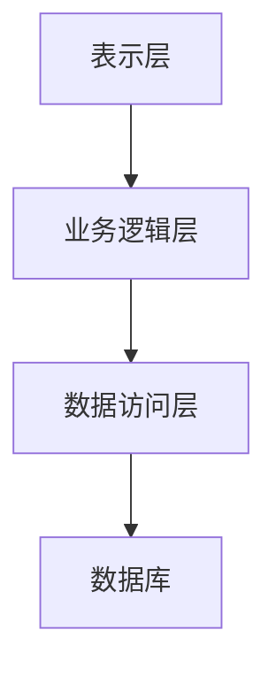

# 电脑商城销售管理系统详细设计与具体代码实现

## 1.背景介绍

### 1.1 项目背景

在现代商业环境中，电脑商城的销售管理系统是必不可少的工具。它不仅能提高销售效率，还能优化库存管理，提升客户满意度。本文旨在详细介绍一个电脑商城销售管理系统的设计与实现，从系统架构到具体代码，全面覆盖各个技术细节。

### 1.2 项目目标

本项目的目标是开发一个功能全面、性能优越的电脑商城销售管理系统，涵盖商品管理、库存管理、订单处理、客户管理和销售分析等模块。

### 1.3 技术栈

项目采用的技术栈包括：

- 前端：HTML5、CSS3、JavaScript、React
- 后端：Node.js、Express
- 数据库：MongoDB
- 其他：Docker、Kubernetes、Jenkins

## 2.核心概念与联系

### 2.1 系统架构

系统采用分层架构，包括表示层、业务逻辑层和数据访问层。每一层都具有明确的职责，确保系统的可维护性和扩展性。



### 2.2 模块划分

系统主要分为以下几个模块：

- 商品管理：负责商品的添加、修改、删除和查询。
- 库存管理：负责库存的管理和预警。
- 订单处理：处理客户订单的创建、修改和查询。
- 客户管理：管理客户信息和客户关系。
- 销售分析：提供销售数据的分析和报表。

### 2.3 数据流

数据流从表示层开始，通过业务逻辑层，最终到达数据访问层。每一层都进行必要的数据处理和验证，确保数据的准确性和一致性。

## 3.核心算法原理具体操作步骤

### 3.1 商品管理算法

商品管理模块的核心算法包括商品的添加、修改、删除和查询。以下是商品添加的具体步骤：

1. 接收前端传来的商品信息。
2. 验证商品信息的合法性。
3. 将商品信息存入数据库。
4. 返回操作结果给前端。

### 3.2 库存管理算法

库存管理模块的核心算法包括库存的增加、减少和预警。以下是库存预警的具体步骤：

1. 定期检查库存数量。
2. 对低于预警值的商品发出预警。
3. 生成库存预警报表。

### 3.3 订单处理算法

订单处理模块的核心算法包括订单的创建、修改和查询。以下是订单创建的具体步骤：

1. 接收前端传来的订单信息。
2. 验证订单信息的合法性。
3. 检查库存是否充足。
4. 将订单信息存入数据库。
5. 更新库存信息。
6. 返回操作结果给前端。

### 3.4 客户管理算法

客户管理模块的核心算法包括客户信息的添加、修改、删除和查询。以下是客户信息添加的具体步骤：

1. 接收前端传来的客户信息。
2. 验证客户信息的合法性。
3. 将客户信息存入数据库。
4. 返回操作结果给前端。

### 3.5 销售分析算法

销售分析模块的核心算法包括销售数据的统计和分析。以下是销售数据统计的具体步骤：

1. 从数据库中提取销售数据。
2. 对销售数据进行清洗和整理。
3. 生成销售统计报表。
4. 返回报表给前端。

## 4.数学模型和公式详细讲解举例说明

### 4.1 库存预警模型

库存预警模型采用简单的阈值模型。当库存数量低于预设的阈值时，系统发出预警。设定库存阈值为 $T$，当前库存数量为 $S$，则预警条件为：

$$
S < T
$$

### 4.2 销售预测模型

销售预测模型采用时间序列分析方法。设定时间序列为 $X(t)$，预测时间为 $t+n$，则预测模型为：

$$
\hat{X}(t+n) = \alpha X(t) + \beta X(t-1) + \gamma X(t-2) + \cdots
$$

其中，$\alpha, \beta, \gamma$ 为模型参数，通过历史数据训练得到。

### 4.3 客户价值模型

客户价值模型采用 RFM 模型。RFM 模型包括三个指标：最近一次购买时间（Recency），购买频率（Frequency），购买金额（Monetary）。设定客户 $i$ 的 RFM 值分别为 $R_i, F_i, M_i$，则客户价值 $V_i$ 为：

$$
V_i = w_1 R_i + w_2 F_i + w_3 M_i
$$

其中，$w_1, w_2, w_3$ 为权重，通过历史数据训练得到。

## 5.项目实践：代码实例和详细解释说明

### 5.1 商品管理模块代码实例

以下是商品添加功能的代码实例：

```javascript
// 商品添加路由
app.post('/api/products', async (req, res) => {
  try {
    const { name, price, stock } = req.body;
    if (!name || !price || !stock) {
      return res.status(400).json({ message: '所有字段都是必填的' });
    }

    const newProduct = new Product({ name, price, stock });
    await newProduct.save();
    res.status(201).json(newProduct);
  } catch (error) {
    res.status(500).json({ message: '服务器错误' });
  }
});
```

### 5.2 库存管理模块代码实例

以下是库存预警功能的代码实例：

```javascript
// 库存预警定时任务
const checkStock = async () => {
  try {
    const products = await Product.find();
    products.forEach(product => {
      if (product.stock < product.warningThreshold) {
        console.log(`商品 ${product.name} 库存不足`);
      }
    });
  } catch (error) {
    console.error('库存检查错误:', error);
  }
};

// 每天检查一次库存
setInterval(checkStock, 24 * 60 * 60 * 1000);
```

### 5.3 订单处理模块代码实例

以下是订单创建功能的代码实例：

```javascript
// 订单创建路由
app.post('/api/orders', async (req, res) => {
  try {
    const { customerId, products } = req.body;
    if (!customerId || !products || products.length === 0) {
      return res.status(400).json({ message: '所有字段都是必填的' });
    }

    const newOrder = new Order({ customerId, products });
    await newOrder.save();

    // 更新库存
    for (const product of products) {
      const existingProduct = await Product.findById(product.productId);
      existingProduct.stock -= product.quantity;
      await existingProduct.save();
    }

    res.status(201).json(newOrder);
  } catch (error) {
    res.status(500).json({ message: '服务器错误' });
  }
});
```

### 5.4 客户管理模块代码实例

以下是客户信息添加功能的代码实例：

```javascript
// 客户添加路由
app.post('/api/customers', async (req, res) => {
  try {
    const { name, email, phone } = req.body;
    if (!name || !email || !phone) {
      return res.status(400).json({ message: '所有字段都是必填的' });
    }

    const newCustomer = new Customer({ name, email, phone });
    await newCustomer.save();
    res.status(201).json(newCustomer);
  } catch (error) {
    res.status(500).json({ message: '服务器错误' });
  }
});
```

### 5.5 销售分析模块代码实例

以下是销售数据统计功能的代码实例：

```javascript
// 销售数据统计路由
app.get('/api/sales', async (req, res) => {
  try {
    const sales = await Order.aggregate([
      {
        $group: {
          _id: null,
          totalSales: { $sum: '$totalAmount' },
          totalOrders: { $sum: 1 }
        }
      }
    ]);

    res.status(200).json(sales[0]);
  } catch (error) {
    res.status(500).json({ message: '服务器错误' });
  }
});
```

## 6.实际应用场景

### 6.1 中小型电脑商城

本系统适用于中小型电脑商城，帮助商家高效管理商品、库存和订单，提升运营效率。

### 6.2 电子商务平台

本系统也可以作为电子商务平台的一部分，与其他系统模块集成，实现全面的电商解决方案。

### 6.3 连锁店管理

对于拥有多个分