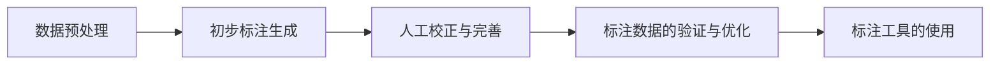

# 目标检测的人机交互式标注技术

作者：禅与计算机程序设计艺术

## 1. 背景介绍

### 1.1 目标检测的定义与重要性

目标检测是计算机视觉领域中的一项关键任务，其目标是识别图像或视频中的所有目标对象，并确定这些对象的位置。目标检测在自动驾驶、医疗影像分析、安防监控、工业自动化等领域具有广泛的应用。随着深度学习技术的快速发展，目标检测算法的性能得到了显著提升，但高质量的训练数据仍然是提升算法性能的关键。

### 1.2 标注数据的重要性

高质量的标注数据对于训练有效的目标检测模型至关重要。标注数据的准确性和丰富性直接影响模型的性能。然而，手动标注数据是一项耗时且繁琐的任务，尤其是在需要标注大量数据时。因此，如何提高标注效率和准确性成为了一个重要的研究课题。

### 1.3 人机交互式标注技术的引入

人机交互式标注技术通过将人工智能与人工标注相结合，极大地提高了标注效率和准确性。该技术利用机器学习模型自动生成初步标注，然后由人工进行校正和完善，从而大幅减少了人工标注的工作量。本文将深入探讨目标检测的人机交互式标注技术，包括其核心概念、算法原理、数学模型、项目实践、实际应用场景、工具和资源推荐、未来发展趋势与挑战以及常见问题与解答。

## 2. 核心概念与联系

### 2.1 目标检测

目标检测是指在图像中识别并定位目标物体的技术。常见的目标检测算法包括基于区域的卷积神经网络（R-CNN）、单阶段检测器（如YOLO和SSD）等。

### 2.2 数据标注

数据标注是指为图像或视频中的目标对象添加标签和边界框的过程。高质量的标注数据是训练有效目标检测模型的基础。

### 2.3 人机交互

人机交互是指人类与计算机系统之间的互动过程。在标注过程中，人机交互技术通过结合人工智能和人工标注，提高了标注效率和准确性。

### 2.4 人机交互式标注

人机交互式标注技术结合了自动化标注和人工校正的优势。首先，机器学习模型自动生成初步标注，然后由人工进行校正和完善，从而提高标注效率和准确性。

### 2.5 深度学习与目标检测

深度学习在目标检测中扮演着重要角色。通过训练深度神经网络，模型能够自动学习图像中的特征，并进行目标识别和定位。人机交互式标注技术可以利用深度学习模型生成初步标注，从而减少人工标注的工作量。

## 3. 核心算法原理具体操作步骤

### 3.1 数据预处理

数据预处理是目标检测任务中的重要步骤，包括图像的归一化、数据增强和标签格式转换等。数据预处理的质量直接影响模型的训练效果。

### 3.2 初步标注生成

在初步标注生成阶段，使用预训练的目标检测模型对图像进行自动标注。常用的目标检测模型包括Faster R-CNN、YOLO和SSD等。

### 3.3 人工校正与完善

在初步标注生成后，由人工对标注结果进行校正和完善。人工校正的主要任务是修正模型的错误标注、补充遗漏的目标和调整边界框的位置和大小。

### 3.4 标注数据的验证与优化

在完成标注后，对标注数据进行验证和优化，确保标注的准确性和一致性。可以通过交叉验证、标注一致性检查等方法对标注数据进行质量控制。

### 3.5 标注工具的使用

为了提高标注效率，可以使用一些专门的标注工具。这些工具通常提供友好的用户界面和强大的功能，支持自动标注、人工校正、数据管理等。



## 4. 数学模型和公式详细讲解举例说明

### 4.1 目标检测模型的数学原理

目标检测模型通常包括两个主要任务：目标分类和目标定位。目标分类任务通过卷积神经网络（CNN）对图像中的目标进行分类；目标定位任务通过回归模型预测目标的边界框。

### 4.2 目标分类的数学模型

目标分类任务可以表示为一个多分类问题。假设图像中的目标类别为 $C$，模型的输出为一个大小为 $C$ 的向量 $p$，表示每个类别的概率。目标分类的损失函数通常使用交叉熵损失：

$$
L_{\text{cls}} = -\sum_{i=1}^C y_i \log(p_i)
$$

其中，$y_i$ 表示目标类别的真实标签，$p_i$ 表示模型预测的类别概率。

### 4.3 目标定位的数学模型

目标定位任务可以表示为一个回归问题。假设目标的边界框为 $b = (x, y, w, h)$，其中 $(x, y)$ 表示边界框的中心坐标，$(w, h)$ 表示边界框的宽度和高度。目标定位的损失函数通常使用平滑 $L_1$ 损失：

$$
L_{\text{loc}} = \sum_{i \in \{x, y, w, h\}} \text{smooth}_{L_1}(t_i - t_i^*)
$$

其中，$t_i$ 表示模型预测的边界框参数，$t_i^*$ 表示真实的边界框参数，$\text{smooth}_{L_1}$ 损失定义为：

$$
\text{smooth}_{L_1}(x) = 
\begin{cases} 
0.5x^2 & \text{if } |x| < 1 \\
|x| - 0.5 & \text{otherwise}
\end{cases}
$$

### 4.4 总损失函数

目标检测模型的总损失函数通常是目标分类损失和目标定位损失的加权和：

$$
L = L_{\text{cls}} + \lambda L_{\text{loc}}
$$

其中，$\lambda$ 是一个权重参数，用于平衡分类损失和定位损失。

## 5. 项目实践：代码实例和详细解释说明

### 5.1 数据预处理代码示例

```python
import cv2
import numpy as np

def preprocess_image(image):
    # 图像归一化
    image = image / 255.0
    # 数据增强（例如随机翻转、旋转等）
    if np.random.rand() > 0.5:
        image = cv2.flip(image, 1)
    return image
```

### 5.2 初步标注生成代码示例

```python
import torch
from torchvision import models, transforms

def generate_initial_annotations(image, model):
    transform = transforms.Compose([
        transforms.ToTensor(),
        transforms.Normalize(mean=[0.485, 0.456, 0.406], std=[0.229, 0.224, 0.225]),
    ])
    image = transform(image).unsqueeze(0)
    with torch.no_grad():
        outputs = model(image)
    return outputs
```

### 5.3 人工校正与完善

在实际项目中，人工校正与完善通常需要使用专门的标注工具，如LabelImg、VIA等。这些工具提供了友好的用户界面，支持自动标注和人工校正的结合。

### 5.4 标注数据的验证与优化

```python
def validate_annotations(annotations):
    # 检查标注数据的一致性和准确性
    for annotation in annotations:
        if annotation['bbox'][2] <= 0 or annotation['bbox'][3] <= 0:
            return False
    return True

def optimize_annotations(annotations):
    # 优化标注数据，例如合并重叠的边界框
    optimized_annotations = []
    for annotation in annotations:
        if not any(is_overlapping(annotation, ann) for ann in optimized_annotations):
            optimized_annotations.append(annotation)
    return optimized_annotations
```

### 5.5 标注工具的使用

使用标注工具如LabelImg、VIA等，可以显著提高标注效率。这些工具通常支持自动标注和人工校正的结合，提供了友好的用户界面和强大的功能。

## 6. 实际应用场景

### 6.1 自动驾驶

在自动驾驶领域，目标检测用于识别和定位道路