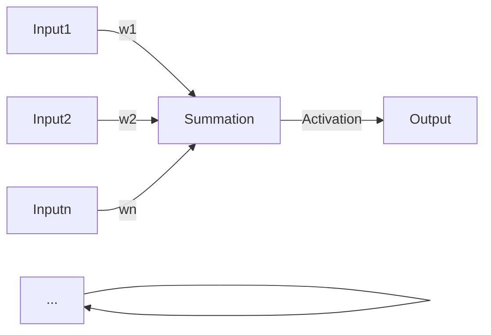

##  1. 背景介绍

### 1.1 人工智能与机器学习的崛起

近年来，人工智能（AI）经历了爆炸式的增长，其应用已经渗透到我们生活的方方面面，从自动驾驶汽车到个性化推荐系统，人工智能正在改变着我们的世界。而机器学习作为人工智能的核心技术之一，也随之得到了蓬勃发展。机器学习的核心思想是让计算机从数据中学习，并根据学习到的知识进行预测和决策，而无需进行显式的编程。

### 1.2 神经网络：模拟人脑的强大工具

在众多机器学习算法中，神经网络由于其强大的学习能力和对复杂非线性关系的建模能力而备受瞩目。神经网络的灵感来源于生物神经系统，它通过模拟人脑神经元的结构和功能，构建起能够学习和处理信息的计算模型。神经网络在图像识别、自然语言处理、语音识别等领域都取得了突破性的进展，成为了推动人工智能发展的重要力量。

### 1.3 本文目标：深入浅出，解析神经网络

本文旨在为读者深入浅出地讲解神经网络的基本原理、算法实现以及实际应用。我们将从神经网络的基本单元——神经元开始，逐步介绍神经网络的结构、学习算法以及常见的应用场景。为了帮助读者更好地理解，本文将结合代码实例进行讲解，并提供一些实用的工具和资源推荐。

## 2. 核心概念与联系

### 2.1 神经元：神经网络的基本单元

神经元是神经网络的基本单元，它模拟了生物神经元的结构和功能。一个典型的神经元模型包括以下几个部分：

* **输入（Input）：** 神经元接收来自其他神经元或外部环境的输入信号。
* **权重（Weight）：** 每个输入信号都与一个权重相关联，表示该输入信号对神经元输出的影响程度。
* **激活函数（Activation Function）：** 激活函数用于对神经元的加权输入进行非线性变换，从而使神经网络能够学习复杂的非线性关系。
* **输出（Output）：** 神经元的输出信号可以作为其他神经元的输入，或者作为整个神经网络的最终输出。

下图展示了一个典型的神经元模型：



### 2.2 神经网络的结构：层层递进，构建复杂模型

神经网络通常由多个层级的神经元组成，每一层的神经元都与上一层的所有神经元相连接，形成一个层级结构。根据网络结构的不同，神经网络可以分为以下几种类型：

* **前馈神经网络（Feedforward Neural Network）：** 信息流单向传递，没有反馈回路。
* **循环神经网络（Recurrent Neural Network）：** 存在反馈回路，可以处理序列数据。
* **卷积神经网络（Convolutional Neural Network）：** 特别适用于处理图像数据。

### 2.3 学习算法：反向传播，优化网络参数

神经网络的学习过程就是不断调整网络参数（权重和偏置），使得网络的输出能够尽可能地逼近真实值。反向传播算法是目前最常用的神经网络学习算法之一，它的基本思想是：

1. 将训练数据输入网络，计算网络的输出。
2. 计算网络输出与真实值之间的误差。
3. 将误差反向传播到网络的各个层级，并根据误差信号更新网络参数。

## 3. 核心算法原理具体操作步骤

### 3.1 前向传播：计算网络输出

前向传播是指将输入数据从网络的输入层传递到输出层的过程，其具体步骤如下：

1. 将输入数据输入网络的输入层。
2. 计算每个神经元的加权输入，即对所有输入信号与其对应权重的乘积求和。
3. 将加权输入代入激活函数，计算神经元的输出。
4. 将当前层神经元的输出作为下一层神经元的输入，重复步骤2-3，直到计算出网络的最终输出。

### 3.2 反向传播：计算误差梯度并更新参数

反向传播是指将误差信号从网络的输出层传递到输入层的过程，其具体步骤如下：

1. 计算网络输出与真实值之间的误差。
2. 计算输出层神经元的误差项，即误差对输出层神经元输出的偏导数。
3. 根据链式法则，将误差项逐层反向传播到网络的各个层级，并计算每个神经元的误差项。
4. 根据误差项和学习率，更新网络参数（权重和偏置）。

## 4. 数学模型和公式详细讲解举例说明

### 4.1 神经元模型

一个典型的神经元模型可以用以下公式表示：

$$
y = f(\sum_{i=1}^{n} w_i x_i + b)
$$

其中：

* $y$ 表示神经元的输出。
* $x_i$ 表示第 $i$ 个输入信号。
* $w_i$ 表示第 $i$ 个输入信号对应的权重。
* $b$ 表示神经元的偏置。
* $f(\cdot)$ 表示激活函数。

### 4.2 激活函数

常用的激活函数包括：

* **Sigmoid 函数：** 将输入值映射到 0 到 1 之间。
$$
\sigma(x) = \frac{1}{1 + e^{-x}}
$$

* **ReLU 函数：** 当输入值大于 0 时，输出等于输入值；当输入值小于等于 0 时，输出等于 0。
$$
ReLU(x) = max(0, x)
$$

* **Tanh 函数：** 将输入值映射到 -1 到 1 之间。
$$
tanh(x) = \frac{e^x - e^{-x}}{e^x + e^{-x}}
$$

### 4.3 损失函数

损失函数用于衡量网络输出与真实值之间的差异，常用的损失函数包括：

* **均方误差（Mean Squared Error, MSE）：** 
$$
MSE = \frac{1}{n} \sum_{i=1}^{n} (y_i - \hat{y_i})^2
$$

* **交叉熵（Cross Entropy）：** 
$$
CE = -\frac{1}{n} \sum_{i=1}^{n} [y_i log(\hat{y_i}) + (1-y_i) log(1-\hat{y_i})]
$$

### 4.4 梯度下降

梯度下降是一种迭代优化算法，用于寻找损失函数的最小值。其基本思想是沿着损失函数梯度的反方向更新参数，直到找到损失函数的最小值。梯度下降算法的更新公式如下：

$$
\theta_{t+1} = \theta_t - \alpha \nabla J(\theta_t)
$$

其中：

* $\theta_t$ 表示第 $t$ 次迭代的参数值。
* $\alpha$ 表示学习率，用于控制参数更新的步长。
* $\nabla J(\theta_t)$ 表示损失函数 $J(\theta)$ 在 $\theta_t$ 处的梯度。

## 5. 项目实践：代码实例和详细解释说明

### 5.1 使用 Python 实现一个简单的神经网络

以下代码使用 Python 和 NumPy 库实现了一个简单的神经网络，用于对手写数字进行分类：

```python
import numpy as np

# 定义 sigmoid 函数
def sigmoid(x):
    return 1 / (1 + np.exp(-x))

# 定义 sigmoid 函数的导数
def sigmoid_derivative(x):
    return sigmoid(x) * (1 - sigmoid(x))

# 定义神经网络类
class NeuralNetwork:
    def __init__(self, input_size, hidden_size, output_size):
        # 初始化权重和偏置
        self.weights_input_hidden = np.random.randn(input_size, hidden_size)
        self.bias_hidden = np.random.randn(1, hidden_size)
        self.weights_hidden_output = np.random.randn(hidden_size, output_size)
        self.bias_output = np.random.randn(1, output_size)

    # 定义前向传播函数
    def forward(self, X):
        # 计算隐藏层输出
        self.hidden_input = np.dot(X, self.weights_input_hidden) + self.bias_hidden
        self.hidden_output = sigmoid(self.hidden_input)

        # 计算输出层输出
        self.output_input = np.dot(self.hidden_output, self.weights_hidden_output) + self.bias_output
        self.output = sigmoid(self.output_input)

        return self.output

    # 定义训练函数
    def train(self, X, y, learning_rate, epochs):
        for epoch in range(epochs):
            # 前向传播
            output = self.forward(X)

            # 计算误差
            error = y - output

            # 反向传播
            # 计算输出层梯度
            output_delta = error * sigmoid_derivative(self.output_input)
            hidden_error = output_delta.dot(self.weights_hidden_output.T)

            # 计算隐藏层梯度
            hidden_delta = hidden_error * sigmoid_derivative(self.hidden_input)

            # 更新权重和偏置
            self.weights_hidden_output += self.hidden_output.T.dot(output_delta) * learning_rate
            self.bias_output += np.sum(output_delta, axis=0, keepdims=True) * learning_rate
            self.weights_input_hidden += X.T.dot(hidden_delta) * learning_rate
            self.bias_hidden += np.sum(hidden_delta, axis=0, keepdims=True) * learning_rate

# 创建神经网络实例
neural_network = NeuralNetwork(input_size=784, hidden_size=128, output_size=10)

# 加载 MNIST 数据集
(X_train, y_train), (X_test, y_test) = mnist.load_data()

# 对数据进行预处理
X_train = X_train.reshape(60000, 784) / 255
X_test = X_test.reshape(10000, 784) / 255
y_train = np.eye(10)[y_train]
y_test = np.eye(10)[y_test]

# 训练神经网络
neural_network.train(X_train, y_train, learning_rate=0.1, epochs=100)

# 测试神经网络
predictions = neural_network.forward(X_test)
accuracy = np.mean(np.argmax(predictions, axis=1) == np.argmax(y_test, axis=1))
print("Accuracy:", accuracy)
```

### 5.2 代码解释

* **`sigmoid(x)` 函数：** 实现 sigmoid 激活函数。
* **`sigmoid_derivative(x)` 函数：** 实现 sigmoid 函数的导数。
* **`NeuralNetwork` 类：** 定义神经网络类，包括初始化函数、前向传播函数和训练函数。
* **`__init__(self, input_size, hidden_size, output_size)` 函数：** 初始化神经网络的权重和偏置。
* **`forward(self, X)` 函数：** 实现神经网络的前向传播过程。
* **`train(self, X, y, learning_rate, epochs)` 函数：** 实现神经网络的训练过程，包括前向传播、误差计算、反向传播和参数更新。

## 6. 实际应用场景

神经网络在各个领域都有着广泛的应用，以下列举一些常见的应用场景：

* **图像识别：** 图像分类、目标检测、图像分割等。
* **自然语言处理：** 文本分类、情感分析、机器翻译等。
* **语音识别：** 语音转文本、语音识别等。
* **推荐系统：** 商品推荐、电影推荐等。
* **金融风控：** 信用评估、欺诈检测等。

## 7. 工具和资源推荐

以下是一些学习神经网络的工具和资源推荐：

* **TensorFlow：** Google 开源的机器学习框架，支持多种神经网络模型。
* **PyTorch：** Facebook 开源的机器学习框架，以其灵活性和易用性著称。
* **Keras：** 基于 TensorFlow 和 Theano 的高级神经网络 API，易于学习和使用。
* **Coursera：** 提供 Andrew Ng 教授的机器学习课程，深入浅出地讲解了神经网络的原理和应用。
* **Stanford CS231n：** Stanford 大学的深度学习课程，内容丰富，讲解深入。

## 8. 总结：未来发展趋势与挑战

神经网络作为人工智能的核心技术之一，未来将会继续朝着更加智能化、高效化、通用化的方向发展。以下是一些未来发展趋势和挑战：

* **更深、更复杂的网络结构：** 随着计算能力的提升，神经网络的层数和神经元数量将会越来越多，网络结构也会更加复杂。
* **更高效的学习算法：** 研究更高效的学习算法，例如 Adam 算法、RMSprop 算法等，以加速神经网络的训练过程。
* **更丰富的应用场景：** 将神经网络应用到更多的领域，例如医疗诊断、自动驾驶等。
* **可解释性：** 提高神经网络的可解释性，使其决策过程更加透明化。

## 9. 附录：常见问题与解答

**Q1：神经网络中的激活函数有什么作用？**

**A1：** 激活函数用于对神经元的加权输入进行非线性变换，从而使神经网络能够学习复杂的非线性关系。如果没有激活函数，神经网络就只能学习线性关系，表达能力有限。

**Q2：反向传播算法的原理是什么？**

**A2：** 反向传播算法的原理是利用链式法则，将误差信号从网络的输出层逐层反向传播到输入层，并根据误差信号更新网络参数。

**Q3：如何选择神经网络的超参数？**

**A3：** 选择神经网络的超参数，例如学习率、隐藏层层数、每层神经元数量等，通常需要进行实验和调参。可以使用交叉验证等方法来评估不同超参数组合的性能，并选择性能最佳的超参数组合。