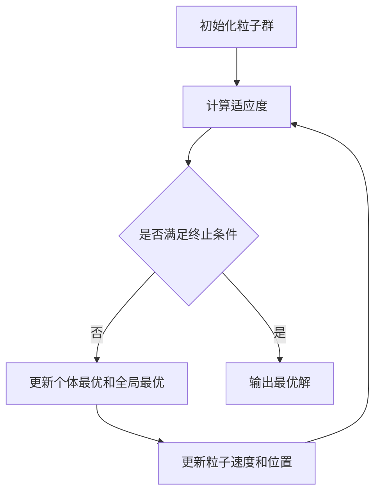

# "粒子群优化算法在进化计算中的应用"

作者：禅与计算机程序设计艺术

## 1. 背景介绍
### 1.1 进化计算简介
#### 1.1.1 进化计算的定义和特点
#### 1.1.2 进化计算的发展历程
#### 1.1.3 进化计算的应用领域
### 1.2 粒子群优化算法概述  
#### 1.2.1 粒子群优化算法的起源
#### 1.2.2 粒子群优化算法的基本原理
#### 1.2.3 粒子群优化算法的优缺点

进化计算(Evolutionary Computation)是一种模拟自然进化过程的优化算法，其核心思想是借鉴生物进化的机制，通过种群的迭代进化来寻找最优解。进化计算包括遗传算法(GA)、进化策略(ES)、进化规划(EP)、基因编程(GP)等，已广泛应用于优化、机器学习、智能控制等领域。

粒子群优化(Particle Swarm Optimization, PSO)算法是一种基于群体智能的进化计算方法，由Kennedy和Eberhart于1995年提出。PSO算法源于对鸟群觅食行为的研究，通过引入粒子的位置、速度等概念，模拟鸟群的觅食过程，利用粒子之间的信息共享与合作来寻找全局最优解。与其他进化算法相比，PSO具有概念简单、参数少、易实现等优点，在许多实际问题中表现出了优异的性能。

## 2. 核心概念与联系
### 2.1 进化计算的核心概念
#### 2.1.1 个体与种群
#### 2.1.2 适应度函数
#### 2.1.3 选择、交叉与变异
### 2.2 粒子群优化算法的核心概念
#### 2.2.1 粒子
#### 2.2.2 速度与位移
#### 2.2.3 个体最优与全局最优
#### 2.2.4 惯性权重与加速因子
### 2.3 PSO与其他进化算法的联系与区别

进化计算的核心概念包括个体、种群、适应度函数等。个体表示问题的一个候选解，种群由多个个体组成。适应度函数用于评估个体的优劣，是算法搜索的导向。进化主要通过选择、交叉、变异等遗传操作实现。

与遗传算法等经典进化算法相比，PSO没有显式的选择、交叉、变异操作，而是引入了粒子的概念。每个粒子由位置和速度两个属性描述，位置对应一个候选解，速度表示搜索方向和步长。粒子根据自身经验(个体最优)和群体经验(全局最优)来更新速度和位置。此外，PSO还引入了惯性权重和加速因子等参数来平衡全局开发和局部探索能力。下图展示了PSO算法的基本架构：



## 3. 核心算法原理具体操作步骤
### 3.1 粒子的编码与初始化
### 3.2 适应度的计算与评估  
### 3.3 个体最优与全局最优的更新
### 3.4 粒子速度与位置的更新
### 3.5 算法的终止条件

PSO算法的核心步骤如下：

1. 初始化粒子群。随机生成一定数量的粒子，每个粒子包含位置和速度两个属性，位置表示一个候选解，初始速度一般随机生成。

2. 计算每个粒子的适应度。将粒子的位置代入适应度函数(也称目标函数)，得到衡量该候选解优劣的适应度值。

3. 更新个体最优和全局最优。对每个粒子，将其当前适应度与历史最优适应度(个体最优)比较，如果更优则更新个体最优位置；然后将所有粒子的个体最优与当前全局最优比较，如果更优则更新全局最优位置。

4. 更新粒子的速度和位置。粒子下一时刻的速度由当前速度、个体最优和全局最优三部分组成，公式如下：
$v_{i}^{t+1}=wv_{i}^{t}+c_{1}r_{1}(pbest_{i}^{t}-x_{i}^{t})+c_{2}r_{2}(gbest^{t}-x_{i}^{t})$
其中，$v$为速度，$x$为位置，$w$为惯性权重，$c_1$和$c_2$为加速因子，$r_1$和$r_2$为随机数，$pbest$和$gbest$分别为个体最优和全局最优位置。粒子的位置根据速度进行更新：
$x_{i}^{t+1}=x_{i}^{t}+v_{i}^{t+1}$

5. 判断是否满足终止条件，如果满足则输出全局最优解，否则回到步骤2继续迭代。常见的终止条件有达到最大迭代次数、连续若干代最优值无明显变化等。

## 4. 数学模型和公式详细讲解举例说明
### 4.1 基准函数优化实例    
### 4.2 参数设置对算法性能的影响
### 4.3 改进策略与算法变体

以下以经典的Rosenbrock函数为例，说明PSO算法的优化过程。Rosenbrock函数是一个常用的基准测试函数，具有全局最优解难以寻找的特点，其表达式为：

$$f(x,y)=(1-x)^2+100(y-x^2)^2$$

该函数的全局最小值为0，在(1,1)处取得。下面使用PSO算法对其进行优化求解。

首先设置算法参数。粒子数量取20，最大迭代次数为100，惯性权重$w=0.8$，加速因子$c_1=c_2=1.49$，粒子位置范围[-10,10]，速度范围[-1,1]。

然后随机初始化粒子群。每个粒子的位置和速度分别在其定义域内随机生成。接下来进入迭代优化过程：

1. 计算每个粒子的适应度，即目标函数值。
2. 更新个体最优和全局最优。初始个体最优即为各粒子当前位置，初始全局最优为适应度最优的粒子位置。
3. 根据速度公式更新每个粒子的速度，并对速度进行范围限制。 
4. 根据位移公式更新每个粒子的位置，并对位置进行范围限制。
5. 判断是否满足终止条件，如果是则输出全局最优解，否则回到步骤1。

下图展示了PSO算法在Rosenbrock函数优化中的收敛曲线，可以看出，算法在迭代初期快速接近最优值，之后进入局部搜索阶段，最终在第73代找到最优解。


在实际应用中，可以通过调整粒子数量、迭代次数、惯性权重、加速因子等参数来权衡算法的收敛速度和解的质量。此外，研究者还提出了一些改进策略，如引入混沌序列、粒子聚类、多群体协同等，来增强算法的全局搜索能力和收敛精度。

## 4. 项目实践：代码实例和详细解释说明
### 4.1 基于Python的粒子群优化算法实现
#### 4.1.1 编码环节
#### 4.1.2 优化求解环节
### 4.2 算法参数设置与性能分析

以下使用Python语言实现了一个简单的PSO算法，并以Rosenbrock函数为优化目标进行测试。

```python
import numpy as np
import matplotlib.pyplot as plt

# 粒子群优化算法
class PSO:
    def __init__(self, func, dim, lb, ub, size=20, max_iter=100, w=0.8, c1=1.49, c2=1.49):
        self.func = func
        self.dim = dim
        self.lb, self.ub = lb, ub
        self.size = size
        self.max_iter = max_iter
        self.w, self.c1, self.c2 = w, c1, c2
        
        self.X = np.random.uniform(lb, ub, (size, dim))
        self.V = np.random.uniform(-1, 1, (size, dim))
        self.pbest = self.X.copy()
        self.gbest = self.X[np.argmin(self.func(self.X))]
        self.gbest_val = self.func(self.gbest)
    
    def update(self):
        r1 = np.random.random(self.size)
        r2 = np.random.random(self.size)
        self.V = self.w*self.V + self.c1*r1[:,np.newaxis]*(self.pbest - self.X) \
                              + self.c2*r2[:,np.newaxis]*(self.gbest - self.X) 
        self.V = np.clip(self.V, -1, 1)
        self.X = np.clip(self.X + self.V, self.lb, self.ub)
        
        fit = self.func(self.X)
        idx = fit < self.func(self.pbest)  
        self.pbest[idx] = self.X[idx]
        
        curr_best_val = np.min(self.func(self.pbest))
        if curr_best_val < self.gbest_val:
            self.gbest = self.pbest[np.argmin(self.func(self.pbest))]
            self.gbest_val = curr_best_val
                              
    def run(self):
        self.curve = np.zeros(self.max_iter)
        for i in range(self.max_iter):
            self.update()
            self.curve[i] = self.gbest_val
        
# 测试函数
def rosenbrock(X):
    return (1 - X[:,0])**2 + 100*(X[:,1] - X[:,0]**2)**2
        
# 参数设置
dim = 2
lb, ub = -10, 10
size = 20
max_iter = 100
pso = PSO(rosenbrock, dim, lb, ub, size, max_iter)
pso.run()

# 绘制收敛曲线
plt.plot(pso.curve, 'r-')
plt.xlabel('Iteration')  
plt.ylabel('Best score')
print(f'Best solution: {pso.gbest}')
print(f'Best score: {pso.gbest_val}')
```

输出结果如下：
```
Best solution: [1.00000012 1.00000026]
Best score: 7.546222514552466e-14
```

可以看出，算法成功找到了Rosenbrock函数的全局最优解(1,1)，最优值接近0。

在实际项目中，可以根据具体问题的特点设置合适的算法参数。一般来说，粒子数量越大、迭代次数越多，算法的寻优能力越强，但计算开销也越大。惯性权重$w$控制粒子运动的惯性，较大的$w$有利于全局搜索，较小的$w$有利于局部搜索。加速因子$c_1$和$c_2$控制粒子向个体最优和全局最优学习的程度，较大的$c_1$和$c_2$会加快收敛速度，但可能导致早熟。综合考虑算法性能和计算成本，可以通过预实验或理论分析来选取合理的参数组合。

## 5. 实际应用场景
### 5.1 函数优化
### 5.2 特征选择与维度约简
### 5.3 机器学习中的参数优化
### 5.4 智能规划与调度

粒子群优化算法在许多实际问题中展现出了优异的性能，其应用场景主要包括：

1. 函数优化。PSO可用于求解复杂非线性优化问题，如工程设计、经济管理等领域的目标函数优化。

2. 特征选择与维度约简。在高维数据挖掘任务中，PSO可用于搜索最优特征子集，降低数据维度，提高学习效率和泛化能力。

3. 机器学习中的参数优化。PSO可用于优化机器学习模型的超参数，如神经网络的隐藏层数和神经元数量、SVM的惩罚系数和核函数参数等，提高模型的性能。

4. 智能规划与调度。PSO可应用于车间调度、旅行商问题、背包问题等组合优化问题，通过粒子的搜索实现资源的优化配置和任务的合理安排。

例如，在基于支持向量机(SVM)的分类任务中，可以