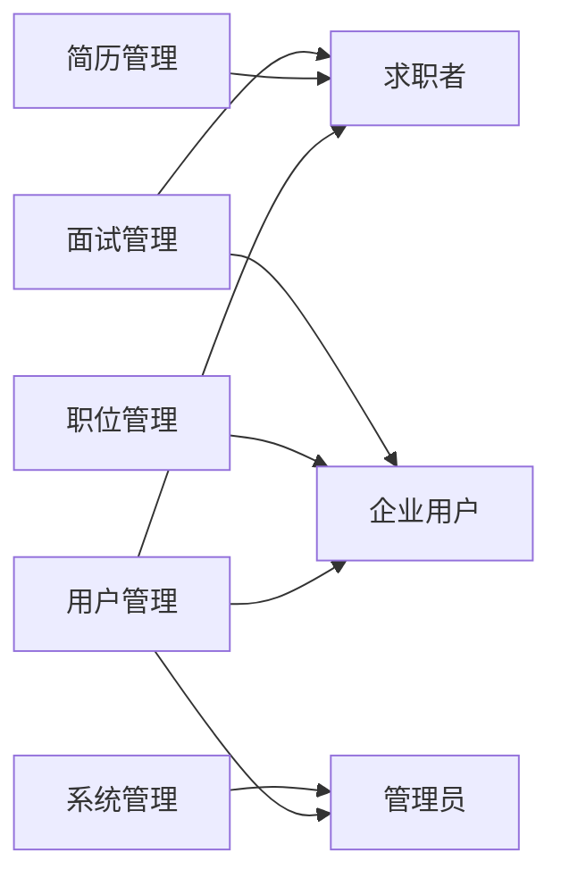

## 网上人才招聘系统详细设计与具体代码实现

作者：禅与计算机程序设计艺术

##  1. 背景介绍

### 1.1 人才招聘行业现状与挑战

随着互联网的快速发展和普及，传统的人才招聘模式已经难以满足企业和求职者的需求。企业招聘面临着信息不对称、招聘成本高、效率低下等问题，而求职者则面临着求职渠道狭窄、信息获取困难、求职成本高等困境。

### 1.2 网上人才招聘系统的优势与价值

网上人才招聘系统应运而生，它利用互联网技术搭建了一个高效、便捷、低成本的人才招聘平台，为企业和求职者提供了更广阔的空间和更优质的服务。

- **对企业而言:** 
    - **扩大招聘范围：**突破地域限制，吸引更广泛的人才。
    - **降低招聘成本：**减少招聘广告、场地租赁等费用。
    - **提高招聘效率：** 简化招聘流程，快速筛选合适人选。
    - **提升企业形象：** 展示企业文化和价值观，吸引优秀人才。
- **对求职者而言:**
    - **拓宽求职渠道：**  提供更多更优质的职位信息。
    - **便捷求职体验：** 在线投递简历，随时随地查看招聘进度。
    - **降低求职成本：**  减少交通、住宿等费用。
    - **获得更多机会：**  接触更多不同类型的企业和职位。

### 1.3 本文目标与结构

本文旨在详细介绍一个功能完善、性能优越的网上人才招聘系统的架构设计与具体代码实现，帮助读者深入理解网上人才招聘系统的核心技术和实现方法。

本文结构如下：

- 第一章：背景介绍
- 第二章：核心概念与联系
- 第三章：核心算法原理与具体操作步骤
- 第四章：数学模型和公式详细讲解与举例说明
- 第五章：项目实践：代码实例和详细解释说明
- 第六章：实际应用场景
- 第七章：工具和资源推荐
- 第八章：总结：未来发展趋势与挑战
- 第九章：附录：常见问题与解答

## 2. 核心概念与联系

### 2.1 用户角色

系统主要包含以下用户角色：

- **求职者：**  注册用户，可以浏览职位、搜索职位、投递简历、查看面试邀请等。
- **企业用户：** 注册企业用户，可以发布职位、搜索简历、筛选简历、发送面试邀请等。
- **管理员：**  维护系统正常运行，管理用户、职位、简历等信息。


### 2.2 功能模块

系统主要功能模块包括：

- **用户管理模块：**  实现用户注册、登录、信息修改、密码找回等功能。
- **职位管理模块：**  实现职位发布、编辑、删除、搜索等功能。
- **简历管理模块：**  实现简历创建、编辑、删除、搜索、投递等功能。
- **面试管理模块：**  实现面试邀请、确认、取消、评价等功能。
- **系统管理模块：**  实现系统配置、数据统计、日志管理等功能。

### 2.3  核心概念关系图



## 3. 核心算法原理与具体操作步骤

### 3.1  职位推荐算法

#### 3.1.1 基于内容的推荐算法

- **原理：**  根据求职者的求职意向和历史行为，分析其感兴趣的职位特征，推荐与其相似的职位。
- **步骤：**
    1. 收集求职者简历信息，如工作经验、教育背景、技能特长等。
    2. 对职位信息进行文本分析，提取关键词和特征向量。
    3. 计算求职者简历与职位信息之间的相似度。
    4. 根据相似度排序，推荐相似度高的职位。

#### 3.1.2  协同过滤推荐算法

- **原理：**  根据具有相似兴趣爱好的用户行为数据，预测目标用户可能感兴趣的职位。
- **步骤：**
    1. 收集用户对职位的浏览、收藏、投递等行为数据。
    2. 构建用户-职位评分矩阵。
    3. 计算用户之间的相似度或职位之间的相似度。
    4. 根据相似度预测目标用户对未浏览职位的评分。
    5. 推荐评分高的职位。

### 3.2 简历匹配算法

#### 3.2.1 基于规则的匹配算法

- **原理：**  根据预先设定的规则，对简历和职位信息进行匹配。
- **步骤：**
    1. 定义匹配规则，如学历要求、工作经验要求、技能要求等。
    2. 提取简历和职位信息中的关键字段。
    3. 根据匹配规则，判断简历是否符合职位要求。

#### 3.2.2 基于语义分析的匹配算法

- **原理：**  利用自然语言处理技术，分析简历和职位信息的语义，计算两者之间的相似度。
- **步骤：**
    1. 对简历和职位信息进行分词、词性标注、命名实体识别等预处理。
    2. 构建简历和职位的语义向量表示。
    3. 计算简历和职位语义向量之间的相似度。


## 4. 数学模型和公式详细讲解与举例说明

### 4.1  余弦相似度

余弦相似度是一种常用的计算文本相似度的算法，其计算公式如下：

$$
similarity(A,B) = \frac{A \cdot B}{||A|| ||B||} = \frac{\sum_{i=1}^{n}A_iB_i}{\sqrt{\sum_{i=1}^{n}A_i^2}\sqrt{\sum_{i=1}^{n}B_i^2}}
$$

其中，A 和 B 分别表示两个文本的向量表示，$A_i$ 和 $B_i$ 分别表示向量 A 和 B 中第 i 个元素的值。

**举例说明：**

假设有两个职位信息 A 和 B，其特征向量分别为：

```
A = [1, 0, 1, 1, 0]
B = [1, 1, 0, 1, 1]
```

则 A 和 B 的余弦相似度为：

```
similarity(A,B) = (1*1 + 0*1 + 1*0 + 1*1 + 0*1) / (sqrt(1^2 + 0^2 + 1^2 + 1^2 + 0^2) * sqrt(1^2 + 1^2 + 0^2 + 1^2 + 1^2)) = 0.6
```

### 4.2 TF-IDF 算法

TF-IDF 算法是一种常用的文本关键词提取算法，其计算公式如下：

$$
TF-IDF(t,d) = TF(t,d) * IDF(t)
$$

其中：

- **TF(t,d)** 表示词语 t 在文档 d 中出现的频率，计算公式为：

$$
TF(t,d) = \frac{词语 t 在文档 d 中出现的次数}{文档 d 中所有词语出现的总次数}
$$

- **IDF(t)** 表示词语 t 的逆文档频率，计算公式为：

$$
IDF(t) = log\frac{语料库中文档总数}{包含词语 t 的文档数 + 1}
$$

**举例说明：**

假设有一个简历文档 d，其内容为："精通 Java 开发，熟悉 Spring 框架"。

则 "Java" 的 TF-IDF 值为：

```
TF("Java",d) = 1 / 6
IDF("Java") = log(10000 / 1000) = 2.3
TF-IDF("Java",d) = 1 / 6 * 2.3 = 0.38
```

## 5. 项目实践：代码实例和详细解释说明

### 5.1 技术选型

- **后端：**  Spring Boot
- **数据库：**  MySQL
- **缓存：**  Redis
- **搜索引擎：**  Elasticsearch
- **消息队列：**  RabbitMQ

### 5.2  数据库设计

```sql
-- 用户表
CREATE TABLE `user` (
  `id` int(11) NOT NULL AUTO_INCREMENT COMMENT '用户ID',
  `username` varchar(255) NOT NULL COMMENT '用户名',
  `password` varchar(255) NOT NULL COMMENT '密码',
  `role` int(11) NOT NULL COMMENT '角色：1-求职者，2-企业用户，3-管理员',
  `create_time` datetime NOT NULL DEFAULT CURRENT_TIMESTAMP COMMENT '创建时间',
  `update_time` datetime NOT NULL DEFAULT CURRENT_TIMESTAMP ON UPDATE CURRENT_TIMESTAMP COMMENT '更新时间',
  PRIMARY KEY (`id`)
) ENGINE=InnoDB DEFAULT CHARSET=utf8mb4 COMMENT='用户表';

-- 职位表
CREATE TABLE `job` (
  `id` int(11) NOT NULL AUTO_INCREMENT COMMENT '职位ID',
  `company_id` int(11) NOT NULL COMMENT '企业ID',
  `title` varchar(255) NOT NULL COMMENT '职位名称',
  `salary` varchar(255) NOT NULL COMMENT '薪资范围',
  `location` varchar(255) NOT NULL COMMENT '工作地点',
  `description` text NOT NULL COMMENT '职位描述',
  `create_time` datetime NOT NULL DEFAULT CURRENT_TIMESTAMP COMMENT '创建时间',
  `update_time` datetime NOT NULL DEFAULT CURRENT_TIMESTAMP ON UPDATE CURRENT_TIMESTAMP COMMENT '更新时间',
  PRIMARY KEY (`id`)
) ENGINE=InnoDB DEFAULT CHARSET=utf8mb4 COMMENT='职位表';

-- 简历表
CREATE TABLE `resume` (
  `id` int(11) NOT NULL AUTO_INCREMENT COMMENT '简历ID',
  `user_id` int(11) NOT NULL COMMENT '用户ID',
  `name` varchar(255) NOT NULL COMMENT '姓名',
  `phone` varchar(255) NOT NULL COMMENT '联系电话',
  `email` varchar(255) NOT NULL COMMENT '邮箱',
  `work_experience` text COMMENT '工作经验',
  `education_background` text COMMENT '教育背景',
  `skills` text COMMENT '技能特长',
  `create_time` datetime NOT NULL DEFAULT CURRENT_TIMESTAMP COMMENT '创建时间',
  `update_time` datetime NOT NULL DEFAULT CURRENT_TIMESTAMP ON UPDATE CURRENT_TIMESTAMP COMMENT '更新时间',
  PRIMARY KEY (`id`)
) ENGINE=InnoDB DEFAULT CHARSET=utf8mb4 COMMENT='简历表';
```

### 5.3 代码实现

#### 5.3.1  用户注册

```java
@RestController
@RequestMapping("/user")
public class UserController {

    @Autowired
    private UserService userService;

    @PostMapping("/register")
    public Result register(@RequestBody User user) {
        // 校验参数
        if (StringUtils.isEmpty(user.getUsername()) || StringUtils.isEmpty(user.getPassword())) {
            return Result.fail("用户名或密码不能为空");
        }
        // 注册用户
        userService.register(user);
        return Result.success();
    }
}
```

#### 5.3.2  职位发布

```java
@RestController
@RequestMapping("/job")
public class JobController {

    @Autowired
    private JobService jobService;

    @PostMapping("/publish")
    public Result publish(@RequestBody Job job) {
        // 校验参数
        // ...
        // 发布职位
        jobService.publish(job);
        return Result.success();
    }
}
```

#### 5.3.3  职位搜索

```java
@RestController
@RequestMapping("/job")
public class JobController {

    @Autowired
    private JobService jobService;

    @GetMapping("/search")
    public Result search(@RequestParam String keyword) {
        // 搜索职位
        List<Job> jobList = jobService.search(keyword);
        return Result.success(jobList);
    }
}
```

## 6. 实际应用场景

- **大型企业招聘：**  大型企业招聘需求量大，职位类型多，候选人数量庞大，需要一个功能完善、性能稳定的网上人才招聘系统来提高招聘效率。
- **猎头公司：**  猎头公司需要快速、准确地匹配企业需求和候选人信息，网上人才招聘系统可以帮助猎头公司提高工作效率。
- **垂直招聘网站：**  垂直招聘网站专注于某个特定行业或领域的招聘，网上人才招聘系统可以帮助垂直招聘网站快速搭建平台，提供专业的招聘服务。

## 7. 工具和资源推荐

- **Spring Boot:** https://spring.io/projects/spring-boot
- **MySQL:** https://www.mysql.com/
- **Redis:** https://redis.io/
- **Elasticsearch:** https://www.elastic.co/
- **RabbitMQ:** https://www.rabbitmq.com/

## 8. 总结：未来发展趋势与挑战

### 8.1  未来发展趋势

- **人工智能化：**  利用人工智能技术，实现简历自动筛选、智能推荐、面试评估等功能，进一步提高招聘效率。
- **移动化：**  随着移动互联网的普及，网上人才招聘系统需要适应移动端的使用习惯，提供更便捷的求职体验。
- **数据化：**  通过收集和分析招聘数据，为企业提供数据支持，帮助企业优化招聘策略。

### 8.2  挑战

- **数据安全：**  网上人才招聘系统存储了大量的用户信息和企业信息，如何保障数据安全是一个重要的挑战。
- **用户体验：**  如何提高用户体验，吸引更多用户使用，是网上人才招聘系统需要不断探索和改进的方向。
- **技术更新迭代：**  互联网技术发展迅速，网上人才招聘系统需要不断更新迭代，才能保持竞争力。

## 9. 附录：常见问题与解答

### 9.1  问：如何保证用户信息安全？

**答：**

- 对用户密码进行加密存储。
- 对敏感数据进行脱敏处理。
- 定期进行安全漏洞扫描和安全测试。
- 加强用户安全意识教育。

### 9.2  问：如何提高职位推荐的准确率？

**答：**

- 优化推荐算法，使用更精准的算法模型。
- 收集更多用户行为数据，用于训练推荐模型。
- 对职位信息进行更细粒度的分类和标签化。

### 9.3  问：如何处理用户投诉？

**答：**

- 建立完善的投诉处理机制。
- 及时响应用户投诉，并给出合理的解决方案。
- 对投诉进行记录和分析，不断改进系统和服务。
