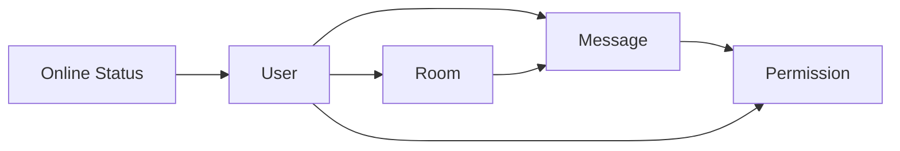

# 聊天室管理系统详细设计与具体代码实现

作者：禅与计算机程序设计艺术

## 1. 背景介绍
随着互联网的飞速发展,网络聊天室已经成为人们日常交流和娱乐的重要场所。一个功能完善、性能优异、易于管理的聊天室系统对于提升用户体验和管理效率至关重要。本文将从需求分析、系统设计到代码实现,全面讲解如何开发一个高质量的聊天室管理系统。

### 1.1 聊天室的发展历程
#### 1.1.1 早期的文字聊天室
#### 1.1.2 多媒体聊天室的兴起
#### 1.1.3 移动端聊天室的普及

### 1.2 聊天室管理系统的必要性
#### 1.2.1 提升用户体验
#### 1.2.2 便于管理和运营
#### 1.2.3 安全和法律合规性

### 1.3 本文的目标和意义
#### 1.3.1 系统分析与设计方法
#### 1.3.2 架构和关键技术选型
#### 1.3.3 代码实现与最佳实践

## 2. 核心概念与联系
聊天室管理系统涉及到诸多概念,理解它们之间的联系对于系统设计至关重要。本节将介绍聊天室管理系统的核心概念,并阐述它们之间的逻辑关系。

### 2.1 用户管理
#### 2.1.1 用户身份与角色
#### 2.1.2 用户信息存储 
#### 2.1.3 用户状态管理

### 2.2 消息管理
#### 2.2.1 消息类型与格式
#### 2.2.2 消息存储与同步
#### 2.2.3 消息推送与广播

### 2.3 房间管理
#### 2.3.1 房间的概念与分类
#### 2.3.2 房间的创建与销毁
#### 2.3.3 房间的约束条件

### 2.4 权限控制
#### 2.4.1 操作权限划分
#### 2.4.2 权限校验机制
#### 2.4.3 特殊权限的设计

### 2.5 在线状态管理
#### 2.5.1 在线状态的表示
#### 2.5.2 心跳机制
#### 2.5.3 异常下线处理

### 2.6 概念之间的关系



## 3. 核心算法原理与具体操作步骤
本节将详细讲解聊天室管理系统中涉及的几个核心算法的原理,并给出具体的操作步骤。

### 3.1 一致性哈希算法
#### 3.1.1 一致性哈希的基本原理
#### 3.1.2 哈希环与虚拟节点
#### 3.1.3 节点的添加与删除
#### 3.1.4 聊天室中的应用场景

### 3.2 Raft协议
#### 3.2.1 Raft协议的基本概念
#### 3.2.2 Leader选举
#### 3.2.3 日志复制
#### 3.2.4 安全性与活性 
#### 3.2.5 在聊天室中的应用

### 3.3 向量时钟
#### 3.3.1 向量时钟的基本概念
#### 3.3.2 并发事件的偏序关系
#### 3.3.3 向量时钟的更新规则
#### 3.3.4 在分布式聊天系统中的应用

### 3.4 Gossip协议
#### 3.4.1 Gossip的基本原理
#### 3.4.2 Gossip中的节点选择策略
#### 3.4.3 消息的传播与收敛 
#### 3.4.4 应用于聊天室的可扩展性设计

## 4. 数学模型和公式详细讲解举例说明
聊天系统的设计和优化离不开数学模型的支撑,本节将介绍几个常用的数学模型,并配合例子详细讲解。 

### 4.1 排队论模型
#### 4.1.1 Little定律
$L=\lambda W$
其中,$L$表示系统中的平均顾客数,$\lambda$表示单位时间内到达的顾客数,$W$表示每个顾客在系统中逗留的平均时间。

举例:假设一个聊天室系统平均每秒有50个消息请求到达,每个请求的平均处理时间为20ms,则系统中的平均请求数为:

$$L=50 \times 0.02 = 1$$

#### 4.1.2 M/M/1排队系统
#### 4.1.3 Erlang-C公式

### 4.2 半同步/半异步模型
#### 4.2.1 模型定义
#### 4.2.2 同步任务与异步任务
#### 4.2.3 多线程并发处理

### 4.3 CAP理论
#### 4.3.1 一致性,可用性,分区容错性
#### 4.3.2 三者的关系和取舍
#### 4.3.3 聊天室架构的选择策略

## 5. 项目实践：代码实例和详细解释说明
理论结合实践才能让设计落地。本节将给出聊天管理系统中几个关键功能模块的代码实例,并配合详细的注释解释说明。

### 5.1 用户上下线管理
```java
public class UserManager {
    // 用户ID到User对象的映射
    private Map<String, User> users = new ConcurrentHashMap<>();
    
    // 添加用户,登录
    public void addUser(User user) {
        users.put(user.getId(), user);
    }
    
    // 移除用户,退出
    public void removeUser(String userId) {
        users.remove(userId);
    }
    
    // 判断用户是否在线
    public boolean isOnline(String userId) {
        return users.containsKey(userId);
    }
}
```

### 5.2 消息广播
```java
public class MessageBroadcaster {
    // 房间ID到所有用户的映射
    private Map<String, Set<User>> roomUsers = new ConcurrentHashMap<>();
    
    // 用户加入房间
    public void joinRoom(User user, String roomId) {
        roomUsers.computeIfAbsent(roomId, k -> new HashSet<>()).add(user);
    }
    
    // 用户离开房间
    public void leaveRoom(User user, String roomId) {
        roomUsers.getOrDefault(roomId, Collections.emptySet()).remove(user);
    }

    // 在房间中广播消息
    public void broadcast(String roomId, Message message) {
        for (User user : roomUsers.getOrDefault(roomId, Collections.emptySet())) {
            user.sendMessage(message);
        }
    }
}
```

### 5.3 心跳检测
```java
public class HeartbeatDetector {
    // 用户ID到最近一次心跳时间的映射
    private Map<String, Long> lastHeartbeatTime = new ConcurrentHashMap<>();

    // 心跳超时阈值,30s
    private static final long HEARTBEAT_TIMEOUT = 30 * 1000; 

    // 处理心跳请求
    public void onHeartbeat(String userId) {
        lastHeartbeatTime.put(userId, System.currentTimeMillis());
    }

    // 检查用户是否下线
    public boolean isOffline(String userId) {
        long last = lastHeartbeatTime.getOrDefault(userId, 0L);
        return System.currentTimeMillis() - last > HEARTBEAT_TIMEOUT;
    }
}
```

## 6. 实际应用场景
聊天室管理系统可以应用于多种实际场景,本节将列举几个典型应用,并分析其特点和需求。

### 6.1 在线客服系统
#### 6.1.1 多客服协作
#### 6.1.2 会话转接与升级
#### 6.1.3 服务质量评估

### 6.2 直播间互动系统
#### 6.2.1 弹幕聊天 
#### 6.2.2 礼物打赏
#### 6.2.3 人数统计与控制

### 6.3 企业内部沟通平台
#### 6.3.1 组织架构管理
#### 6.3.2 消息审计与保密 
#### 6.3.3 多端整合与同步

### 6.4 在线教育平台
#### 6.4.1 师生互动
#### 6.4.2 小组讨论
#### 6.4.3 课堂测试与反馈

## 7. 工具和资源推荐
开发聊天室管理系统离不开优秀的工具和资源支持,本节推荐几个实用的开发工具和学习资源。

### 7.1 开发工具
#### 7.1.1 IntelliJ IDEA
#### 7.1.2 Visual Studio Code
#### 7.1.3 Postman

### 7.2 开源框架
#### 7.2.1 Netty
#### 7.2.2 Spring Boot
#### 7.2.3 Akka

### 7.3 学习资源
#### 7.3.1 《Netty in Action》
#### 7.3.2 《Designing Data-Intensive Applications》
#### 7.3.3 《分布式系统原理与范型(第二版)》

## 8. 总结：未来发展趋势与挑战
随着技术的发展与用户需求的提升,聊天室管理系统也面临诸多的发展机遇和挑战。

### 8.1 人工智能驱动的聊天室
#### 8.1.1 智能客服
#### 8.1.2 智能内容审核
#### 8.1.3 个性化推荐

### 8.2 虚拟现实与聊天室结合
#### 8.2.1 虚拟场景构建
#### 8.2.2 虚拟形象与动作同步
#### 8.2.3 沉浸式社交体验

### 8.3 去中心化聊天平台
#### 8.3.1 基于区块链的聊天
#### 8.3.2 端到端加密
#### 8.3.3 数据隐私保护

### 8.4 海量用户与高并发挑战
#### 8.4.1 分布式架构设计
#### 8.4.2 消息队列与流处理
#### 8.4.3 弹性伸缩与容灾备份

## 9. 附录：常见问题与解答
### 9.1 如何防止消息丢失?
### 9.2 如何保障消息时序?
### 9.3 如何优化Socket的建连与断连?
### 9.4 如何应对恶意刷屏与攻击?
### 9.5 如何平衡功能性与性能?

聊天室管理系统涉及诸多技术细节和实现挑战,本文从需求分析、架构设计到代码实现进行了全面的阐述和讲解。一个优秀的聊天室系统需要在性能、可用性、一致性、安全性等多个维度进行权衡,并且要紧跟技术发展潮流,拥抱变化。希望本文能给广大开发者以一定的启发和指引,共同打造更加智能、高效、人性化的网络社交平台。