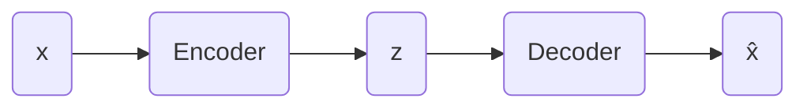

## 1. 背景介绍

### 1.1 数据表示学习的意义

在机器学习和深度学习领域，如何有效地表示数据一直是一个核心问题。良好的数据表示能够提取出数据的关键特征，简化后续的学习任务，并提升模型的性能。传统的数据表示方法，例如主成分分析 (PCA) 和线性判别分析 (LDA)，通常依赖于数据的线性假设，难以捕捉到数据中复杂的非线性关系。

### 1.2 自动编码器的起源与发展

为了克服传统方法的局限性，研究者们提出了自动编码器 (Autoencoder)。自动编码器是一种无监督学习算法，其目标是学习一个恒等函数，即将输入数据映射到自身。然而，与简单的恒等映射不同，自动编码器通过引入瓶颈层 (Bottleneck Layer) 来强制模型学习数据的压缩表示。这种压缩表示能够捕捉到数据中的关键特征，并过滤掉噪声和冗余信息。

### 1.3 自动编码器的优势与应用

自动编码器具有以下几个显著优势：

* **无监督学习:** 自动编码器不需要数据的标签信息，因此可以利用大量的无标签数据进行训练。
* **特征提取:** 自动编码器可以学习到数据的低维表示，这些表示可以作为特征用于其他机器学习任务。
* **数据降维:** 自动编码器可以将高维数据映射到低维空间，从而实现数据降维的目的。
* **异常检测:** 自动编码器可以用于异常检测，因为异常样本的重构误差通常较大。

自动编码器已被广泛应用于各种领域，例如：

* **图像处理:** 图像去噪、图像压缩、图像生成
* **自然语言处理:** 文本表示、机器翻译、情感分析
* **语音识别:** 语音特征提取、语音降噪

## 2. 核心概念与联系

### 2.1 自动编码器的基本结构

自动编码器通常由编码器 (Encoder) 和解码器 (Decoder) 两部分组成：

* **编码器:** 编码器将输入数据  $x$ 映射到低维表示 $z$，也称为编码 (Code) 或潜在表示 (Latent Representation)。
* **解码器:** 解码器将低维表示 $z$ 映射回原始数据空间，得到重构数据  $\hat{x}$。

自动编码器的训练目标是最小化重构误差，即最小化输入数据 $x$ 和重构数据 $\hat{x}$ 之间的差异。



### 2.2 欠完备自动编码器 (Undercomplete Autoencoder)

欠完备自动编码器的瓶颈层维度小于输入数据的维度，即 $dim(z) < dim(x)$。这种结构迫使模型学习数据的压缩表示，从而提取出数据的关键特征。

### 2.3 正则化自动编码器 (Regularized Autoencoder)

正则化自动编码器在损失函数中添加了正则化项，以防止模型过拟合。常见的正则化方法包括：

* **稀疏自动编码器 (Sparse Autoencoder):**  通过在损失函数中添加稀疏性约束，使得编码层的激活值尽可能稀疏，即只有少量的隐藏单元被激活。
* **去噪自动编码器 (Denoising Autoencoder):**  在训练过程中，对输入数据添加噪声，并要求模型重构出原始的无噪声数据。
* **变分自动编码器 (Variational Autoencoder):**  将编码器学习到的潜在表示约束为服从某种先验分布，例如高斯分布。

### 2.4 自动编码器的变体

除了上述几种常见的自动编码器，还有一些其他的变体，例如：

* **卷积自动编码器 (Convolutional Autoencoder):**  使用卷积神经网络作为编码器和解码器，适用于处理图像数据。
* **循环自动编码器 (Recurrent Autoencoder):**  使用循环神经网络作为编码器和解码器，适用于处理序列数据。
* **堆叠自动编码器 (Stacked Autoencoder):**  将多个自动编码器堆叠在一起，形成一个深层网络。


## 3. 核心算法原理具体操作步骤

### 3.1 构建自动编码器模型

构建自动编码器模型主要包括以下步骤：

1. **定义编码器网络:** 编码器网络可以是任何类型的神经网络，例如全连接神经网络、卷积神经网络或循环神经网络。
2. **定义解码器网络:** 解码器网络的结构通常与编码器网络对称。
3. **连接编码器和解码器:** 将编码器的输出作为解码器的输入，连接两个网络。

### 3.2 选择损失函数

自动编码器的训练目标是最小化重构误差，常用的损失函数包括：

* **均方误差 (Mean Squared Error, MSE):**  适用于数值型数据。
* **交叉熵 (Cross Entropy):**  适用于分类问题。
* **二元交叉熵 (Binary Cross Entropy):**  适用于二分类问题。

### 3.3 选择优化器

优化器的作用是更新模型的参数，常用的优化器包括：

* **随机梯度下降 (Stochastic Gradient Descent, SGD)**
* **Adam**
* **RMSprop**

### 3.4 训练自动编码器

训练自动编码器的步骤如下：

1. 将数据输入编码器，得到潜在表示。
2. 将潜在表示输入解码器，得到重构数据。
3. 计算重构误差。
4. 根据重构误差，使用优化器更新模型的参数。
5. 重复步骤 1-4，直到模型收敛。

## 4. 数学模型和公式详细讲解举例说明

### 4.1 欠完备自动编码器的数学模型

欠完备自动编码器的数学模型可以表示为：

$$
\begin{aligned}
z &= f(Wx + b) \\
\hat{x} &= g(W'z + b')
\end{aligned}
$$

其中：

* $x$ 表示输入数据
* $z$ 表示潜在表示
* $\hat{x}$ 表示重构数据
* $f(\cdot)$ 表示编码器函数
* $g(\cdot)$ 表示解码器函数
* $W$ 和 $W'$ 表示权重矩阵
* $b$ 和 $b'$ 表示偏置向量

### 4.2 稀疏自动编码器的损失函数

稀疏自动编码器的损失函数可以表示为：

$$
L = L_{reconstruction} + \lambda L_{sparse}
$$

其中：

* $L_{reconstruction}$ 表示重构误差
* $L_{sparse}$ 表示稀疏性约束
* $\lambda$ 表示稀疏性惩罚系数

### 4.3 去噪自动编码器的数学模型

去噪自动编码器的数学模型可以表示为：

$$
\begin{aligned}
\tilde{x} &= x + \epsilon \\
z &= f(W\tilde{x} + b) \\
\hat{x} &= g(W'z + b')
\end{aligned}
$$

其中：

* $\tilde{x}$ 表示添加噪声后的输入数据
* $\epsilon$ 表示噪声

### 4.4 变分自动编码器的数学模型

变分自动编码器的数学模型可以表示为：

$$
\begin{aligned}
z &\sim q(z|x) \\
\hat{x} &= g(z)
\end{aligned}
$$

其中：

* $q(z|x)$ 表示编码器学习到的潜在表示的分布
* $g(z)$ 表示解码器函数

## 5. 项目实践：代码实例和详细解释说明

### 5.1 使用 Keras 实现简单的自动编码器

```python
import keras
from keras import layers

# 定义编码器
encoder = keras.Sequential([
    layers.Input(shape=(784,)),
    layers.Dense(128, activation='relu'),
    layers.Dense(64, activation='relu'),
    layers.Dense(32, activation='relu')
])

# 定义解码器
decoder = keras.Sequential([
    layers.Input(shape=(32,)),
    layers.Dense(64, activation='relu'),
    layers.Dense(128, activation='relu'),
    layers.Dense(784, activation='sigmoid')
])

# 连接编码器和解码器
autoencoder = keras.Sequential([
    encoder,
    decoder
])

# 编译模型
autoencoder.compile(optimizer='adam', loss='mse')

# 加载 MNIST 数据集
(x_train, _), (x_test, _) = keras.datasets.mnist.load_data()

# 数据预处理
x_train = x_train.astype('float32') / 255.0
x_test = x_test.astype('float32') / 255.0
x_train = x_train.reshape((len(x_train), 784))
x_test = x_test.reshape((len(x_test), 784))

# 训练模型
autoencoder.fit(x_train, x_train, epochs=10, batch_size=32, validation_data=(x_test, x_test))

# 使用训练好的模型对测试集进行编码和解码
encoded_imgs = encoder.predict(x_test)
decoded_imgs = decoder.predict(encoded_imgs)

# 显示原始图像和重构图像
import matplotlib.pyplot as plt

n = 10  # 显示的图像数量
plt.figure(figsize=(20, 4))
for i in range(n):
    # 显示原始图像
    ax = plt.subplot(2, n, i + 1)
    plt.imshow(x_test[i].reshape(28, 28))
    plt.gray()
    ax.get_xaxis().set_visible(False)
    ax.get_yaxis().set_visible(False)

    # 显示重构图像
    ax = plt.subplot(2, n, i + 1 + n)
    plt.imshow(decoded_imgs[i].reshape(28, 28))
    plt.gray()
    ax.get_xaxis().set_visible(False)
    ax.get_yaxis().set_visible(False)
plt.show()
```

### 5.2 代码解释

* 首先，我们使用 Keras 定义了编码器和解码器网络。
* 然后，我们将编码器和解码器连接起来，构建自动编码器模型。
* 接下来，我们编译模型，选择优化器和损失函数。
* 然后，我们加载 MNIST 数据集，并对数据进行预处理。
* 接下来，我们训练自动编码器模型。
* 最后，我们使用训练好的模型对测试集进行编码和解码，并显示原始图像和重构图像。

## 6. 实际应用场景

### 6.1 图像去噪

自动编码器可以用于图像去噪，方法是将带有噪声的图像作为输入，训练模型重构出原始的无噪声图像。

### 6.2 图像压缩

自动编码器可以用于图像压缩，方法是将图像编码成低维表示，然后使用解码器将低维表示解码成图像。

### 6.3 特征提取

自动编码器可以用于特征提取，方法是使用编码器学习到的潜在表示作为特征，用于其他机器学习任务。

### 6.4 异常检测

自动编码器可以用于异常检测，方法是计算样本的重构误差，如果重构误差超过某个阈值，则认为该样本是异常样本。

## 7. 工具和资源推荐

### 7.1 Keras

Keras 是一个用 Python 编写的高级神经网络 API，它能够以 TensorFlow, CNTK, 或者 Theano 作为后端运行。Keras 的开发重点是支持快速的实验。能够以最小的时延把你的想法转换为实验结果，是做好研究的关键。

### 7.2 TensorFlow

TensorFlow 是一个端到端开源机器学习平台。它拥有一个包含各种工具、库和社区资源的全面、灵活的生态系统，可以让你轻松构建和部署 ML 支持的应用。

### 7.3 PyTorch

PyTorch 是一个开源的机器学习框架，提供两个高级功能：

* 具有强大的 GPU 加速的张量计算（如 NumPy）
* 基于磁带的自动微分系统，构建和训练神经网络

## 8. 总结：未来发展趋势与挑战

### 8.1 未来发展趋势

* **更深、更复杂的自动编码器:** 随着计算能力的提升，我们可以构建更深、更复杂的自动编码器，以学习更抽象、更高级的数据表示。
* **与其他深度学习模型的结合:** 自动编码器可以与其他深度学习模型，例如卷积神经网络、循环神经网络等结合，以解决更复杂的任务。
* **应用于更广泛的领域:** 自动编码器可以应用于更广泛的领域，例如自然语言处理、语音识别、推荐系统等。

### 8.2 挑战

* **模型的可解释性:** 自动编码器学习到的潜在表示通常难以解释，这限制了其在某些领域的应用。
* **训练数据的需求:** 训练自动编码器通常需要大量的标记数据，这在某些情况下可能难以获得。
* **模型的泛化能力:** 自动编码器的泛化能力取决于训练数据的质量和数量，如果训练数据不足或质量不高，模型的泛化能力可能会受到影响。

## 9. 附录：常见问题与解答

### 9.1 什么是瓶颈层？

瓶颈层是自动编码器中维度小于输入数据维度的层，它迫使模型学习数据的压缩表示，从而提取出数据的关键特征。

### 9.2 如何选择自动编码器的隐藏层维度？

选择自动编码器的隐藏层维度是一个经验性的问题，通常需要根据具体的数据集和任务进行调整。一般来说，较小的隐藏层维度可以学习到更抽象、更高级的特征，但可能会损失一些信息。

### 9.3 自动编码器和主成分分析 (PCA) 有什么区别？

自动编码器和 PCA 都是数据降维方法，但它们有一些区别：

* 自动编码器可以学习非线性映射，而 PCA 只能学习线性映射。
* 自动编码器可以处理各种类型的数据，而 PCA 主要适用于数值型数据。

### 9.4 如何评估自动编码器的性能？

评估自动编码器的性能通常使用重构误差，即输入数据和重构数据之间的差异。常用的指标包括均方误差 (MSE) 和结构相似性指数 (SSIM)。