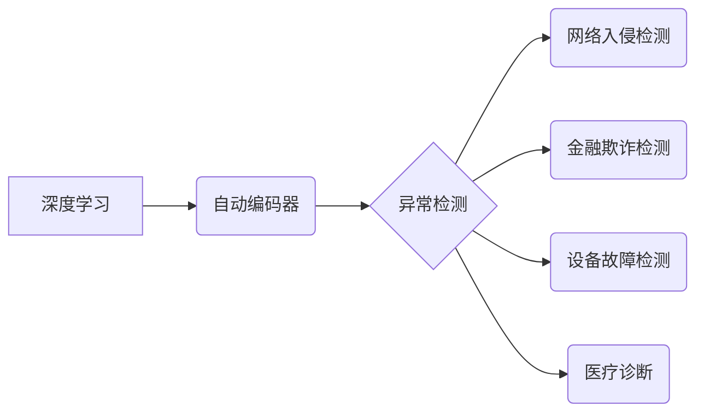

# 自动编码器在异常检测中的应用与实践

作者：禅与计算机程序设计艺术

## 1. 背景介绍

### 1.1 异常检测的意义

在当今信息爆炸的时代，数据规模呈指数级增长，各种类型的异常数据也随之涌现。异常检测作为数据挖掘领域的重要分支，其目标是从海量数据中识别出与正常数据模式存在显著差异的异常数据。 这些异常数据往往蕴藏着重要的信息，例如：

* **金融欺诈**: 信用卡盗刷、洗钱等非法金融活动。
* **网络入侵**:  DDoS攻击、恶意软件入侵等网络安全事件。
* **设备故障**:  机械设备异常运行、传感器数据异常等。
* **医疗诊断**:  疾病的早期预警、肿瘤的识别等。

及时准确地检测出异常数据，对于保障系统安全、提高服务质量、促进科学研究等方面具有重要意义。

### 1.2 传统异常检测方法的局限性

传统的异常检测方法主要包括基于统计的方法、基于距离的方法、基于密度的方法等。这些方法在处理低维、线性可分的数据集时能够取得较好的效果，但面对高维、非线性、复杂多变的数据时，往往面临以下挑战：

* **维数灾难**:  高维数据会导致计算量急剧增加，传统方法难以有效处理。
* **非线性可分**:  许多异常数据与正常数据之间不存在清晰的线性边界，传统方法难以准确区分。
* **模型假设**:  传统方法通常需要对数据的分布做出一些假设，而实际数据往往不满足这些假设，导致模型效果不佳。

### 1.3 深度学习与自动编码器

近年来，深度学习技术在图像识别、自然语言处理等领域取得了突破性进展。深度学习模型能够自动学习数据中的复杂模式，具有强大的特征表达能力，为解决传统异常检测方法面临的挑战提供了新的思路。

自动编码器（Autoencoder, AE）作为一种经典的深度学习模型，其核心思想是通过学习数据的压缩表示来捕捉数据的本质特征。自动编码器由编码器和解码器两部分组成：

* **编码器**:  将高维输入数据映射到低维特征空间，得到数据的压缩表示。
* **解码器**:  将低维特征空间中的表示映射回原始数据空间，重建输入数据。

自动编码器在训练过程中，通过最小化输入数据与重建数据之间的差异来学习数据的压缩表示。由于异常数据与正常数据存在差异，因此自动编码器在重建异常数据时会产生较大的误差。基于此，我们可以利用自动编码器的重建误差来进行异常检测。

## 2. 核心概念与联系

### 2.1 自动编码器的结构

自动编码器的结构可以分为以下几个部分：

* **输入层**:  接收原始数据。
* **编码器**:  由多个神经网络层组成，用于将输入数据映射到低维特征空间。
* **瓶颈层**:  编码器的最后一层，也称为特征表示层，其维度远小于输入层维度，用于表示数据的压缩表示。
* **解码器**:  由多个神经网络层组成，用于将瓶颈层的特征表示映射回原始数据空间。
* **输出层**:  输出重建数据。

### 2.2 自动编码器的训练过程

自动编码器的训练过程可以使用反向传播算法，其目标是最小化输入数据与重建数据之间的差异，即损失函数。常用的损失函数包括均方误差（MSE）、交叉熵等。

### 2.3 自动编码器与异常检测

自动编码器在异常检测中的应用主要基于以下原理：

* 自动编码器在训练过程中学习正常数据的压缩表示，因此对于正常数据能够进行较好的重建。
* 异常数据与正常数据存在差异，因此自动编码器在重建异常数据时会产生较大的误差。

基于此，我们可以利用自动编码器的重建误差来进行异常检测，例如：

* 设置一个阈值，将重建误差大于阈值的数据判定为异常数据。
* 对重建误差进行排序，选取误差最大的 K 个数据作为异常数据。

### 2.4 核心概念之间的联系

下图展示了自动编码器、异常检测、深度学习等核心概念之间的联系：



## 3. 核心算法原理具体操作步骤

### 3.1 数据预处理

在使用自动编码器进行异常检测之前，需要对数据进行预处理，主要包括以下步骤：

* **数据清洗**:  处理缺失值、异常值等。
* **数据归一化**:  将数据缩放到相同的范围，例如 [0, 1] 或 [-1, 1]。
* **特征工程**:  根据实际问题进行特征选择、特征提取等操作。

### 3.2 模型构建

构建自动编码器模型，需要确定以下参数：

* **编码器和解码器的层数**:  层数越多，模型的表达能力越强，但同时也增加了训练难度。
* **每层的节点数**:  节点数越多，模型的表达能力越强，但同时也增加了训练难度。
* **激活函数**:  常用的激活函数包括 sigmoid、ReLU、tanh 等。
* **损失函数**:  常用的损失函数包括 MSE、交叉熵等。
* **优化器**:  常用的优化器包括 Adam、SGD 等。

### 3.3 模型训练

使用预处理后的正常数据训练自动编码器模型，直到模型收敛。

### 3.4 异常检测

使用训练好的自动编码器模型对新数据进行预测，计算重建误差。根据重建误差的大小来判断数据是否异常。

## 4. 数学模型和公式详细讲解举例说明

### 4.1 自动编码器的数学模型

自动编码器的数学模型可以表示为：

```
# 编码器
h = f(x)

# 解码器
r = g(h)

# 损失函数
L = ||x - r||^2
```

其中：

* $x$ 表示输入数据。
* $h$ 表示瓶颈层的特征表示。
* $r$ 表示重建数据。
* $f(\cdot)$ 表示编码器函数。
* $g(\cdot)$ 表示解码器函数。
* $||\cdot||^2$ 表示均方误差。

### 4.2 举例说明

假设我们有一个包含 10000 条正常数据的数据集，每条数据包含 100 个特征。我们想要使用自动编码器来检测异常数据。

1. **数据预处理**:  对数据进行归一化处理。
2. **模型构建**:  构建一个包含 3 层编码器和 3 层解码器的自动编码器模型，每层节点数分别为 50、20、10。
3. **模型训练**:  使用预处理后的正常数据训练自动编码器模型，直到模型收敛。
4. **异常检测**:  使用训练好的自动编码器模型对新数据进行预测，计算重建误差。设置一个阈值，将重建误差大于阈值的数据判定为异常数据。

## 5. 项目实践：代码实例和详细解释说明

### 5.1 Python 代码实例

```python
import numpy as np
from keras.layers import Input, Dense
from keras.models import Model

# 设置随机种子
np.random.seed(123)

# 加载数据
data = np.loadtxt("normal_data.csv", delimiter=",")

# 数据预处理
data = (data - data.min()) / (data.max() - data.min())

# 构建自动编码器模型
input_layer = Input(shape=(data.shape[1],))
encoder1 = Dense(50, activation="relu")(input_layer)
encoder2 = Dense(20, activation="relu")(encoder1)
encoder3 = Dense(10, activation="relu")(encoder2)
decoder1 = Dense(20, activation="relu")(encoder3)
decoder2 = Dense(50, activation="relu")(decoder1)
output_layer = Dense(data.shape[1], activation="sigmoid")(decoder2)
autoencoder = Model(inputs=input_layer, outputs=output_layer)

# 编译模型
autoencoder.compile(optimizer="adam", loss="mse")

# 训练模型
autoencoder.fit(data, data, epochs=100, batch_size=32)

# 异常检测
test_data = np.loadtxt("test_data.csv", delimiter=",")
test_data = (test_data - test_data.min()) / (test_data.max() - test_data.min())
reconstructions = autoencoder.predict(test_data)
mse = np.mean(np.power(test_data - reconstructions, 2), axis=1)
threshold = np.percentile(mse, 95)
anomalies = mse > threshold
```

### 5.2 代码解释

* **加载数据**:  使用 `np.loadtxt()` 函数加载数据。
* **数据预处理**:  对数据进行归一化处理。
* **模型构建**:  使用 Keras 构建一个包含 3 层编码器和 3 层解码器的自动编码器模型。
* **编译模型**:  使用 `adam` 优化器和 `mse` 损失函数编译模型。
* **训练模型**:  使用正常数据训练自动编码器模型。
* **异常检测**:  使用训练好的模型对测试数据进行预测，计算重建误差。设置一个阈值，将重建误差大于阈值的数据判定为异常数据。

## 6. 实际应用场景

自动编码器在异常检测领域有着广泛的应用，例如：

* **网络入侵检测**:  检测网络流量中的异常模式，例如 DDoS 攻击、端口扫描等。
* **金融欺诈检测**:  检测信用卡交易、保险索赔等金融活动中的异常行为。
* **设备故障检测**:  检测机械设备、传感器等设备的异常运行状态。
* **医疗诊断**:  检测医学图像、生理信号等数据中的异常模式，用于疾病的早期预警和诊断。

## 7. 工具和资源推荐

* **Keras**:  一个开源的深度学习库，提供构建和训练自动编码器模型的接口。
* **TensorFlow**:  另一个开源的深度学习库，也提供构建和训练自动编码器模型的接口。
* **Scikit-learn**:  一个常用的机器学习库，提供了一些用于异常检测的算法，例如 One-Class SVM、Isolation Forest 等。

## 8. 总结：未来发展趋势与挑战

自动编码器作为一种强大的深度学习模型，在异常检测领域有着广泛的应用前景。未来，自动编码器在异常检测领域的发展趋势主要包括以下几个方面：

* **更强大的模型**:  研究人员将继续探索更深、更复杂的自动编码器模型，以提高模型的表达能力和检测精度。
* **更鲁棒的算法**:  研究人员将致力于开发更鲁棒的自动编码器算法，以应对噪声、缺失值等数据问题。
* **更广泛的应用**:  随着自动编码器技术的不断成熟，其应用领域将不断扩展到更多领域，例如物联网安全、智能交通等。

当然，自动编码器在异常检测领域也面临着一些挑战，例如：

* **可解释性**:  自动编码器模型通常是一个黑盒模型，难以解释其检测结果。
* **计算复杂度**:  训练和使用自动编码器模型需要较高的计算资源。
* **数据需求**:  训练自动编码器模型需要大量的正常数据。


## 9. 附录：常见问题与解答

### 9.1 如何选择合适的自动编码器模型？

选择合适的自动编码器模型需要考虑以下因素：

* **数据的维度**:  对于高维数据，可以选择层数较多、节点数较多的模型。
* **数据的复杂度**:  对于复杂的数据，可以选择非线性激活函数，例如 ReLU、tanh 等。
* **应用场景**:  不同的应用场景对模型的性能要求不同，需要根据实际情况选择合适的模型。

### 9.2 如何评估自动编码器模型的性能？

可以使用以下指标评估自动编码器模型的性能：

* **重建误差**:  重建误差越小，说明模型的性能越好。
* **ROC 曲线和 AUC 值**:  ROC 曲线和 AUC 值可以用来评估模型对异常数据的识别能力。
* **精确率和召回率**:  精确率和召回率可以用来评估模型在不同阈值下的性能。

### 9.3 如何提高自动编码器模型的性能？

可以尝试以下方法提高自动编码器模型的性能：

* **增加训练数据**:  训练数据越多，模型的泛化能力越强。
* **调整模型结构**:  可以尝试增加层数、节点数，或者使用不同的激活函数。
* **使用正则化**:  可以使用 L1 或 L2 正则化来防止模型过拟合。
* **使用预训练**:  可以使用预训练的模型来初始化模型参数，可以加快模型的收敛速度。


## 10. 参考资料

* [Keras documentation](https://keras.io/)
* [TensorFlow documentation](https://www.tensorflow.org/docs)
* [Scikit-learn documentation](https://scikit-learn.org/stable/documentation.html)