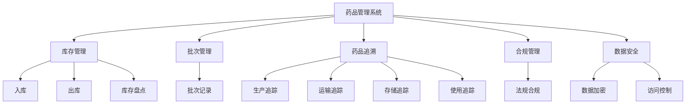
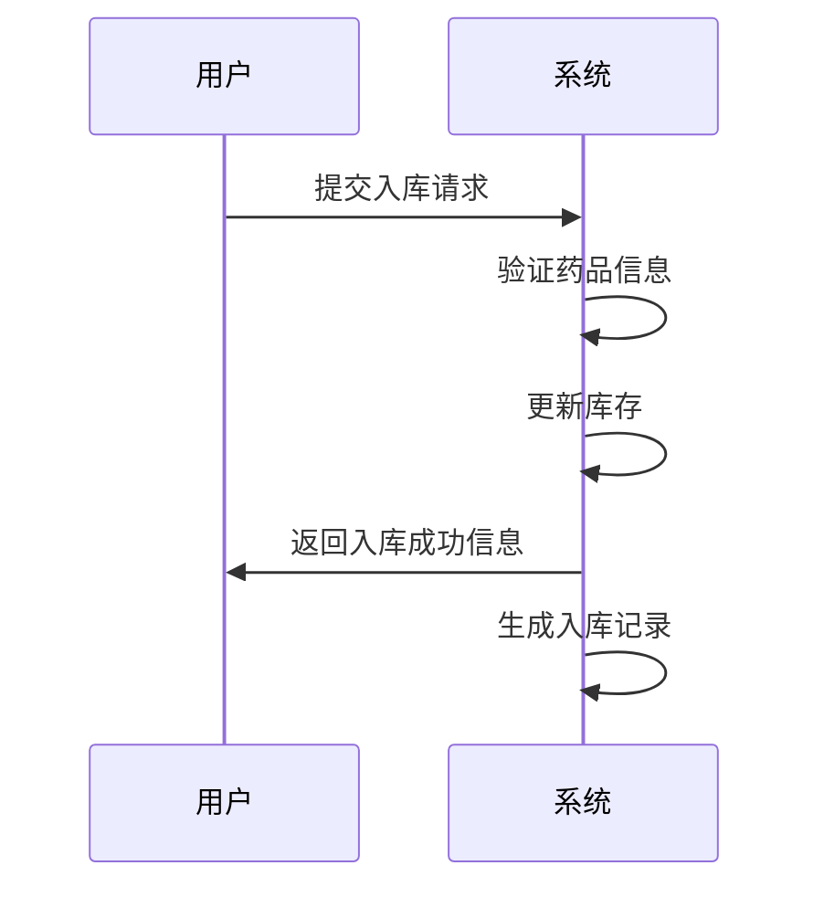
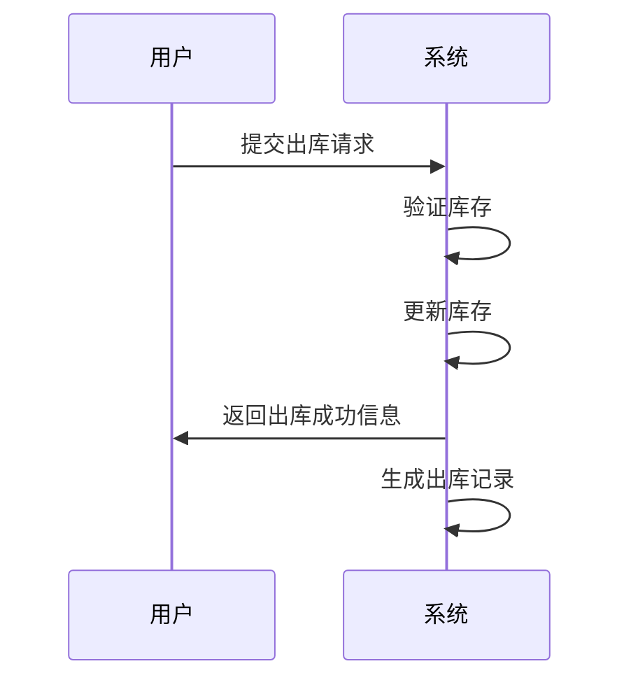
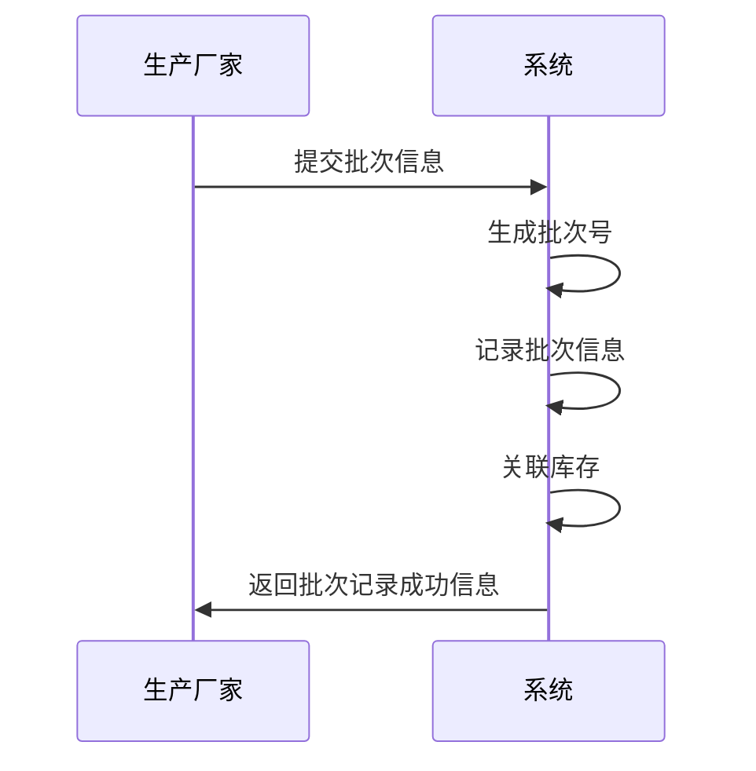
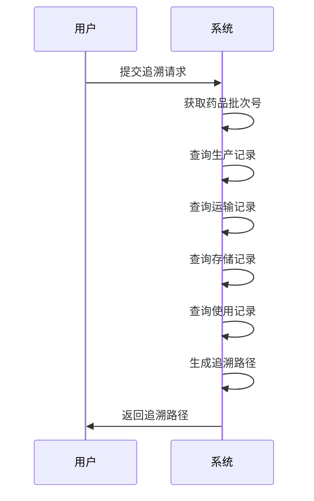

# 药品管理系统详细设计与具体代码实现

作者：禅与计算机程序设计艺术

## 1. 背景介绍

### 1.1 药品管理系统的重要性

药品管理系统在现代医疗和制药行业中扮演着至关重要的角色。随着药品种类的不断增加和医疗需求的多样化，如何高效地管理药品库存、追踪药品流通、确保药品质量成为了医疗机构和制药企业面临的重大挑战。一个高效的药品管理系统不仅能够提高药品管理的效率，还能降低药品浪费，确保患者用药安全。

### 1.2 当前药品管理的挑战

目前，药品管理面临的主要挑战包括：

- **库存管理复杂**：药品种类繁多，保质期不同，管理难度大。
- **追溯性要求高**：药品从生产到使用的全流程追踪要求高。
- **法规合规性**：需要满足各类药品管理法规和标准。
- **数据安全和隐私**：药品管理系统中包含大量敏感数据，需确保其安全性和隐私性。

### 1.3 本文目标

本文旨在详细介绍一个高效的药品管理系统的设计与实现，包括核心概念、算法原理、数学模型、代码实例、实际应用场景、工具和资源推荐，并探讨其未来发展趋势与挑战。

## 2. 核心概念与联系

### 2.1 药品管理系统的基本概念

药品管理系统的基本概念涵盖以下几个方面：

- **库存管理**：包括药品入库、出库、库存盘点等功能。
- **批次管理**：对药品的生产批次进行管理，确保可追溯性。
- **药品追溯**：从生产、运输、存储到使用的全流程追踪。
- **合规管理**：满足各类法规和标准的要求。
- **数据安全**：确保系统中数据的安全性和隐私性。

### 2.2 各模块之间的联系

药品管理系统中的各个模块相互联系，形成一个完整的系统。下图展示了各模块之间的关系：



## 3. 核心算法原理具体操作步骤

### 3.1 库存管理算法

#### 3.1.1 入库算法

入库算法的主要步骤如下：

1. **接收入库请求**：接收药品入库请求，获取药品信息。
2. **验证药品信息**：验证药品信息的完整性和正确性。
3. **更新库存**：将药品信息添加到库存数据库中。
4. **生成入库记录**：生成入库记录，包含药品名称、批次号、数量、入库时间等信息。



#### 3.1.2 出库算法

出库算法的主要步骤如下：

1. **接收出库请求**：接收药品出库请求，获取药品信息。
2. **验证库存**：检查库存中是否有足够的药品。
3. **更新库存**：从库存中扣除相应数量的药品。
4. **生成出库记录**：生成出库记录，包含药品名称、批次号、数量、出库时间等信息。



### 3.2 批次管理算法

#### 3.2.1 批次记录算法

批次记录算法的主要步骤如下：

1. **生成批次号**：根据生产日期和其他信息生成唯一的批次号。
2. **记录批次信息**：记录批次信息，包括生产日期、生产厂家、药品名称等。
3. **关联库存**：将批次信息与库存中的药品关联。



### 3.3 药品追溯算法

#### 3.3.1 追溯路径生成算法

追溯路径生成算法的主要步骤如下：

1. **获取药品批次号**：获取需要追溯的药品批次号。
2. **查询生产记录**：根据批次号查询生产记录。
3. **查询运输记录**：根据批次号查询运输记录。
4. **查询存储记录**：根据批次号查询存储记录。
5. **查询使用记录**：根据批次号查询使用记录。
6. **生成追溯路径**：将查询到的记录按时间顺序生成追溯路径。



## 4. 数学模型和公式详细讲解举例说明

### 4.1 库存管理模型

库存管理可以用库存模型来描述，常用的库存模型有经济订货量（Economic Order Quantity, EOQ）模型。EOQ模型的公式如下：

$$
EOQ = \sqrt{\frac{2DS}{H}}
$$

其中：
- $D$ 表示年需求量
- $S$ 表示每次订货成本
- $H$ 表示每单位年持有成本

### 4.2 批次管理模型

批次管理可以用批次模型来描述，常用的批次模型有生产批次管理模型。生产批次管理模型的公式如下：

$$
Batch\_Size = \frac{Total\_Production}{Number\_of\_Batches}
$$

其中：
- $Total\_Production$ 表示总生产量
- $Number\_of\_Batches$ 表示批次数量

### 4.3 药品追溯模型

药品追溯可以用追溯模型来描述，常用的追溯模型有追溯路径模型。追溯路径模型的公式如下：

$$
Trace\_Path = \{Production\_Record, Transportation\_Record, Storage\_Record, Usage\_Record\}
$$

其中：
- $Production\_Record$ 表示生产记录
- $Transportation\_Record$ 表示运输记录
- $Storage\_Record$ 表示存储记录
- $Usage\_Record$ 表示使用记录

## 5. 项目实践：代码实例和详细解释说明

### 5.1 库存管理代码实例

#### 5.1.1 入库代码实例

```python
def add_to_inventory(inventory, drug_name, batch_number, quantity):
    # 验证药品信息
    if not drug_name or not batch_number or quantity <= 0:
        raise ValueError("Invalid drug information")
    
    # 更新库存
    if drug_name not in inventory:
        inventory[drug_name] = {}
    if batch_number not in inventory[drug_name]:
        inventory[drug_name][batch_number] = 0
    inventory[drug_name][batch_number] += quantity
    
    # 生成入库记录
    record = {
        "drug_name": drug_name,
        "batch_number": batch_number