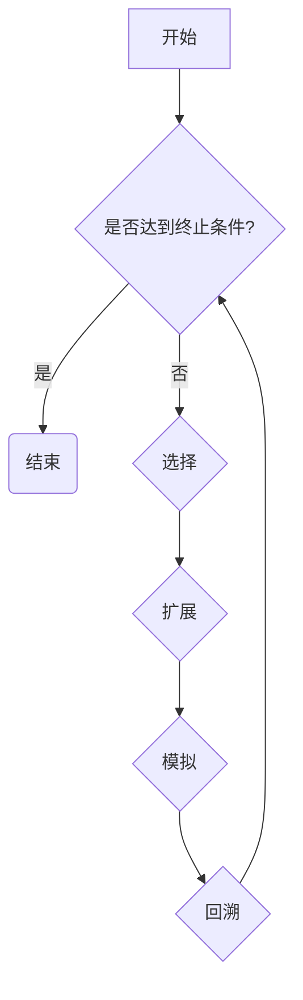

# 蒙特卡洛树搜索(MCTS)原理与代码实战案例讲解

作者：禅与计算机程序设计艺术

## 1. 背景介绍

### 1.1  什么是蒙特卡洛树搜索？

蒙特卡洛树搜索（Monte Carlo Tree Search，MCTS）是一种人工智能（AI）中的搜索算法，用于决策问题，尤其是在游戏中的应用最为广泛。它结合了随机模拟（蒙特卡洛方法）和树搜索的优势，能够在巨大的搜索空间中高效地找到接近最优解的方案。

### 1.2  蒙特卡洛树搜索的由来

MCTS 的历史可以追溯到 20 世纪 90 年代后期，但直到 2006 年才在围棋程序中取得突破性进展，当时 Rémi Coulom 的 Crazy Stone 程序使用 MCTS 击败了职业棋手。此后，MCTS 迅速成为游戏 AI 领域的主流算法，并在其他领域如机器人控制、推荐系统等方面得到应用。

### 1.3  蒙特卡洛树搜索的应用领域

MCTS 在游戏 AI 中的成功应用使其成为解决复杂决策问题的强大工具。除了游戏，MCTS 还被应用于以下领域：

* **机器人控制:**  MCTS 可以帮助机器人在不确定环境中进行路径规划和决策。
* **推荐系统:** MCTS 可以根据用户的历史行为和偏好，推荐个性化的产品或服务。
* **运筹优化:** MCTS 可以用于解决复杂的优化问题，例如物流调度、资源分配等。
* **金融建模:** MCTS 可以用于预测股票价格、评估投资风险等。

## 2. 核心概念与联系

### 2.1  搜索树

MCTS 的核心数据结构是搜索树，它表示了游戏或决策问题的所有可能状态和动作。

* **节点:**  每个节点代表一个游戏状态。
* **边:** 每条边代表一个从父节点到子节点的动作。
* **根节点:**  代表当前游戏状态。
* **叶节点:**  代表游戏结束状态或未探索状态。

### 2.2  选择、扩展、模拟、回溯

MCTS 算法的核心是四个步骤的迭代循环：选择、扩展、模拟、回溯。

1. **选择 (Selection):** 从根节点开始，根据一定的策略选择一个最有希望的子节点进行探索。
2. **扩展 (Expansion):**  如果选择的节点不是叶节点，则创建一个或多个子节点，表示执行不同动作后的新状态。
3. **模拟 (Simulation):**  从新扩展的节点开始，进行随机模拟直到游戏结束，得到一个模拟结果（例如，胜利或失败）。
4. **回溯 (Backpropagation):**  根据模拟结果更新从根节点到新扩展节点路径上所有节点的统计信息，例如访问次数、胜率等。

### 2.3  UCT (Upper Confidence Bound 1 applied to Trees)

UCT 是一种常用的选择策略，它平衡了探索和利用的关系。UCT 值越高，表示该节点越值得探索。

$$
UCT(s, a) = Q(s, a) + C * \sqrt{\frac{\ln{N(s)}}{N(s, a)}}
$$

其中:

*  $s$ 表示当前状态
*  $a$ 表示动作
*  $Q(s, a)$ 表示状态 $s$ 下执行动作 $a$ 的平均奖励 (例如，胜率)
*  $N(s)$ 表示状态 $s$ 的访问次数
*  $N(s, a)$ 表示状态 $s$ 下执行动作 $a$ 的访问次数
*  $C$ 是一个控制探索程度的常数，通常设置为 $\sqrt{2}$

## 3. 核心算法原理具体操作步骤

### 3.1 算法流程图



### 3.2 算法步骤详解

1. **初始化:** 创建一个根节点，代表当前游戏状态。
2. **迭代:**  重复以下步骤直到达到终止条件（例如，时间限制、迭代次数）：
   * **选择:** 从根节点开始，使用 UCT 策略递归地选择最优子节点，直到到达一个叶节点或未完全扩展的节点。
   * **扩展:** 如果选择的节点不是叶节点，则创建一个或多个子节点，表示执行不同动作后的新状态。
   * **模拟:** 从新扩展的节点开始，进行随机模拟直到游戏结束，得到一个模拟结果（例如，胜利或失败）。
   * **回溯:**  根据模拟结果更新从根节点到新扩展节点路径上所有节点的统计信息，例如访问次数、胜率等。
3. **选择最佳动作:**  选择访问次数最多或胜率最高的子节点对应的动作作为最佳动作。

## 4. 数学模型和公式详细讲解举例说明

### 4.1  UCT 公式推导

UCT 公式的推导基于多臂老虎机问题和 Hoeffding 不等式。

**多臂老虎机问题:**  假设你面对多台老虎机，每台老虎机的期望回报不同，但你并不知道它们的具体值。你的目标是在有限的时间内最大化你的总回报。

**Hoeffding 不等式:**  对于独立同分布的随机变量序列，Hoeffding 不等式给出了样本均值与期望值之间偏差的概率上界。

$$
P(|\bar{X} - E[X]| \ge \epsilon) \le 2e^{-2n\epsilon^2}
$$

其中:

* $\bar{X}$ 是样本均值
* $E[X]$ 是期望值
* $\epsilon$ 是偏差
* $n$ 是样本数量

UCT 公式将多臂老虎机问题中的每个老虎机看作搜索树中的一个节点，将每个老虎机的期望回报看作节点的真实价值。UCT 公式通过平衡探索和利用，试图在有限的时间内找到价值最高的节点。

### 4.2  举例说明

假设我们有一个简单的游戏，玩家可以选择两个动作：A 或 B。每个动作都有一定的概率导致胜利或失败。

*  动作 A: 
    * 胜利概率: 0.6
    * 失败概率: 0.4
*  动作 B:
    * 胜利概率: 0.4
    * 失败概率: 0.6

我们使用 MCTS 来选择最佳动作。

**初始化:**

*  创建一个根节点，代表当前游戏状态。
*  创建两个子节点，分别代表执行动作 A 和动作 B 后的状态。

**第一次迭代:**

1. **选择:** 由于两个子节点都没有被访问过，UCT 值相同，我们随机选择一个子节点，例如动作 A 对应的子节点。
2. **扩展:**  由于选择的节点是叶节点，我们不对其进行扩展。
3. **模拟:**  我们进行随机模拟，例如，模拟结果为胜利。
4. **回溯:**  我们将动作 A 对应的子节点的访问次数加 1，胜率更新为 1。

**第二次迭代:**

1. **选择:**  我们计算两个子节点的 UCT 值：
   * 动作 A:  $UCT(root, A) = 1 + \sqrt{2} * \sqrt{\frac{\ln{1}}{1}} \approx 2.414$
   * 动作 B:  $UCT(root, B) = 0 + \sqrt{2} * \sqrt{\frac{\ln{1}}{0}} = \infty$
   由于动作 B 的 UCT 值为无穷大，我们选择动作 B 对应的子节点。
2. **扩展:**  由于选择的节点是叶节点，我们不对其进行扩展。
3. **模拟:**  我们进行随机模拟，例如，模拟结果为失败。
4. **回溯:**  我们将动作 B 对应的子节点的访问次数加 1，胜率更新为 0。

**第三次迭代:**

1. **选择:**  我们计算两个子节点的 UCT 值：
   * 动作 A:  $UCT(root, A) = 1 + \sqrt{2} * \sqrt{\frac{\ln{2}}{1}} \approx 2.121$
   * 动作 B:  $UCT(root, B) = 0 + \sqrt{2} * \sqrt{\frac{\ln{2}}{1}} \approx 1.657$
   由于动作 A 的 UCT 值更高，我们选择动作 A 对应的子节点。
2. **扩展:**  由于选择的节点是叶节点，我们不对其进行扩展。
3. **模拟:**  我们进行随机模拟，例如，模拟结果为胜利。
4. **回溯:**  我们将动作 A 对应的子节点的访问次数加 1，胜率更新为 1。

**选择最佳动作:**

经过三次迭代，动作 A 对应的子节点的访问次数为 2，胜率为 1，而动作 B 对应的子节点的访问次数为 1，胜率为 0。因此，我们选择动作 A 作为最佳动作。

## 5. 项目实践：代码实例和详细解释说明

### 5.1  Python 代码实现

```python
import math
import random

class Node:
    """
    蒙特卡洛树节点
    """

    def __init__(self, state, parent=None, action=None):
        self.state = state  # 游戏状态
        self.parent = parent  # 父节点
        self.action = action  # 从父节点到当前节点的动作
        self.children = []  # 子节点列表
        self.visits = 0  # 访问次数
        self.value = 0  # 价值（例如，胜率）

    def is_leaf(self):
        """
        判断是否为叶节点
        """
        return len(self.children) == 0

    def is_fully_expanded(self):
        """
        判断是否已完全扩展
        """
        # 判断当前状态是否还有可行的动作
        return len(self.state.get_legal_actions()) == len(self.children)

    def best_child(self, c=math.sqrt(2)):
        """
        选择 UCT 值最高的子节点
        """
        best_score = float('-inf')
        best_child = None
        for child in self.children:
            # 计算 UCT 值
            score = child.value / child.visits + c * math.sqrt(
                math.log(self.visits) / child.visits)
            if score > best_score:
                best_score = score
                best_child = child
        return best_child

    def expand(self):
        """
        扩展节点
        """
        # 获取当前状态可行的动作
        legal_actions = self.state.get_legal_actions()
        # 随机选择一个动作
        action = random.choice(legal_actions)
        # 创建一个新的子节点
        new_state = self.state.take_action(action)
        child = Node(new_state, parent=self, action=action)
        self.children.append(child)
        return child

    def simulate(self):
        """
        随机模拟游戏直到结束
        """
        state = self.state.copy()
        while not state.is_terminal():
            # 随机选择一个动作
            action = random.choice(state.get_legal_actions())
            # 执行动作
            state = state.take_action(action)
        # 返回模拟结果（例如，胜利或失败）
        return state.get_reward()

    def backpropagate(self, result):
        """
        回溯更新节点统计信息
        """
        self.visits += 1
        self.value += result
        if self.parent:
            self.parent.backpropagate(result)

class MCTS:
    """
    蒙特卡洛树搜索
    """

    def __init__(self, exploration_constant=math.sqrt(2)):
        self.exploration_constant = exploration_constant

    def search(self, state, iterations=1000):
        """
        执行蒙特卡洛树搜索
        """
        # 创建根节点
        root = Node(state)
        # 迭代搜索
        for i in range(iterations):
            # 选择节点
            node = self.select(root)
            # 扩展节点
            if not node.is_leaf():
                node = node.expand()
            # 模拟游戏
            result = node.simulate()
            # 回溯更新节点统计信息
            node.backpropagate(result)
        # 返回访问次数最多的子节点对应的动作
        best_child = root.best_child(c=0)
        return best_child.action

    def select(self, node):
        """
        选择节点
        """
        while not node.is_leaf():
            if not node.is_fully_expanded():
                return node.expand()
            else:
                node = node.best_child(c=self.exploration_constant)
        return node
```

### 5.2  代码解释

*  **Node 类:**  表示蒙特卡洛树中的一个节点。
    *  `state`: 游戏状态。
    *  `parent`: 父节点。
    *  `action`: 从父节点到当前节点的动作。
    *  `children`: 子节点列表。
    *  `visits`: 访问次数。
    *  `value`: 价值（例如，胜率）。
    *  `is_leaf()`: 判断是否为叶节点。
    *  `is_fully_expanded()`: 判断是否已完全扩展。
    *  `best_child()`: 选择 UCT 值最高的子节点。
    *  `expand()`: 扩展节点。
    *  `simulate()`: 随机模拟游戏直到结束。
    *  `backpropagate()`: 回溯更新节点统计信息。
*  **MCTS 类:**  表示蒙特卡洛树搜索算法。
    *  `exploration_constant`: 控制探索程度的常数。
    *  `search()`: 执行蒙特卡洛树搜索。
    *  `select()`: 选择节点。

### 5.3  使用示例

```python
# 创建一个游戏状态
state = GameState()

# 创建一个蒙特卡洛树搜索对象
mcts = MCTS()

# 执行蒙特卡洛树搜索
action = mcts.search(state, iterations=1000)

# 打印最佳动作
print(f"最佳动作: {action}")
```

## 6. 实际应用场景

### 6.1 游戏 AI

MCTS 在游戏 AI 中的应用最为广泛，例如：

*  **围棋:** AlphaGo 和 DeepZenGo 等顶级围棋程序都使用了 MCTS 算法。
*  **国际象棋:** Stockfish 和 Komodo 等顶级国际象棋程序也使用了 MCTS 算法。
*  **扑克:** Libratus 和 Pluribus 等顶级扑克程序也使用了 MCTS 算法。

### 6.2  其他领域

除了游戏 AI，MCTS 还被应用于其他领域，例如：

*  **机器人控制:** MCTS 可以帮助机器人在不确定环境中进行路径规划和决策。
*  **推荐系统:** MCTS 可以根据用户的历史行为和偏好，推荐个性化的产品或服务。
*  **运筹优化:** MCTS 可以用于解决复杂的优化问题，例如物流调度、资源分配等。
*  **金融建模:** MCTS 可以用于预测股票价格、评估投资风险等。

## 7. 工具和资源推荐

### 7.1  Python 库

*  **OpenAI Gym:**  一个用于开发和比较强化学习算法的工具包，包含许多经典游戏环境，例如 Atari 游戏、棋盘游戏等。
*  **Pachi:** 一个开源的围棋程序，使用了 MCTS 算法。
*  **Shobu:** 一个开源的日本象棋程序，也使用了 MCTS 算法。

### 7.2  书籍和论文

*  **Bandit Algorithms for Website Optimization:** 一本介绍多臂老虎机问题及其在网站优化中应用的书籍。
*  **A Survey of Monte Carlo Tree Search Methods:** 一篇综述蒙特卡洛树搜索方法的论文。

## 8. 总结：未来发展趋势与挑战

### 8.1  未来发展趋势

*  **与深度学习的结合:** 将 MCTS 与深度学习相结合，可以进一步提高 MCTS 的性能。
*  **应用于更广泛的领域:** 随着 MCTS 算法的不断发展，它将被应用于更广泛的领域，例如医疗诊断、自动驾驶等。

### 8.2  挑战

*  **计算复杂度:** MCTS 算法的计算复杂度较高，尤其是在搜索空间较大的情况下。
*  **参数调整:** MCTS 算法的性能对参数比较敏感，需要进行精细的调整。

## 9. 附录：常见问题与解答

### 9.1  MCTS 与其他搜索算法的区别？

MCTS 与其他搜索算法（例如，极大极小算法、Alpha-Beta 剪枝）的主要区别在于：

*  **随机模拟:** MCTS 使用随机模拟来评估节点的价值，而其他搜索算法通常使用评估函数。
*  **探索与利用:** MCTS 通过 UCT 公式平衡了探索和利用的关系，而其他搜索算法通常只关注利用。

### 9.2  MCTS 的优缺点？

**优点:**

*  **能够处理高维状态空间:** MCTS 可以处理状态空间维度较高的问题，例如围棋、国际象棋等。
*  **不需要先验知识:** MCTS 不需要先验知识，可以从零开始学习。
*  **能够处理随机性:** MCTS 能够处理游戏中的