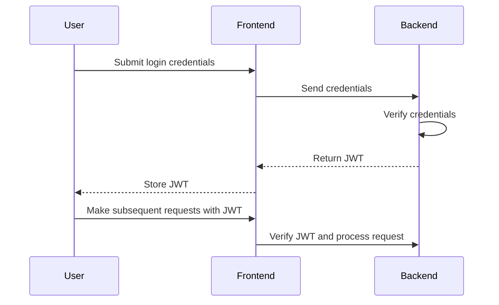
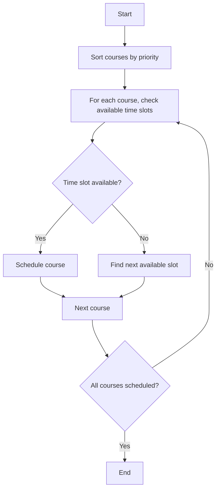
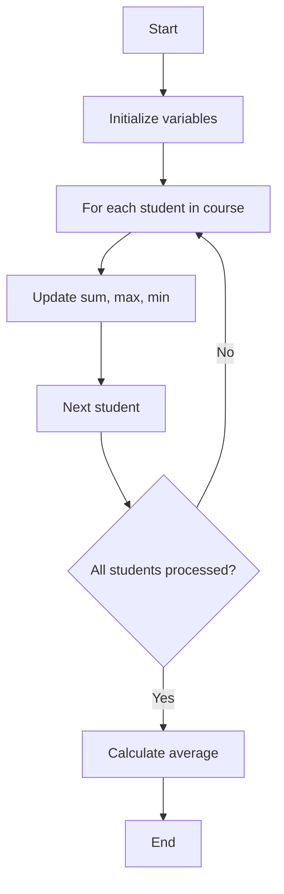

# 课程管理系统详细设计与具体代码实现

作者：禅与计算机程序设计艺术

## 1.背景介绍

### 1.1 项目背景

在现代教育体系中，课程管理系统（Course Management System, CMS）扮演着至关重要的角色。它不仅帮助教育机构高效地管理课程、教师和学生，还能提升教学质量和学生的学习体验。随着在线教育的普及，CMS的需求日益增长，功能也越来越复杂和多样化。

### 1.2 需求分析

设计一个高效的课程管理系统，需要满足以下基本需求：

- **课程管理**：创建、更新和删除课程信息。
- **教师管理**：分配教师到课程，管理教师信息。
- **学生管理**：注册、更新和删除学生信息。
- **课程安排**：制定课程时间表，避免冲突。
- **成绩管理**：记录和查询学生成绩。
- **通知系统**：向学生和教师发送通知。

### 1.3 技术选型

在技术选型方面，我们选择以下技术栈：

- **前端**：React.js
- **后端**：Node.js + Express.js
- **数据库**：MongoDB
- **身份验证**：JWT (JSON Web Token)
- **部署**：Docker + Kubernetes

## 2.核心概念与联系

### 2.1 系统架构

一个典型的CMS系统架构包括前端、后端和数据库三大部分。前端负责用户界面的展示和交互，后端处理业务逻辑和数据存储，数据库则用于持久化数据。

### 2.2 数据模型

核心数据模型包括以下几部分：

- **课程（Course）**：课程ID、名称、描述、教师ID、时间表等。
- **教师（Teacher）**：教师ID、姓名、联系方式、所授课程等。
- **学生（Student）**：学生ID、姓名、联系方式、注册课程等。
- **成绩（Grade）**：学生ID、课程ID、成绩等。

### 2.3 功能模块

系统的主要功能模块包括：

- **用户管理模块**：实现用户的注册、登录、权限管理等功能。
- **课程管理模块**：实现课程的增删改查、课程安排等功能。
- **成绩管理模块**：实现成绩的录入、查询和统计等功能。
- **通知管理模块**：实现通知的发送和管理功能。

## 3.核心算法原理具体操作步骤

### 3.1 用户认证与授权

用户认证使用JWT实现。用户登录时，后端生成一个JWT令牌并返回给前端，前端在后续请求中携带该令牌进行身份验证。



### 3.2 课程安排算法

课程安排需要避免时间冲突。我们采用贪心算法，根据课程的优先级和时间段，逐一安排课程。



### 3.3 成绩统计算法

成绩统计包括计算平均分、最高分、最低分等。我们采用简单的迭代算法进行统计。



## 4.数学模型和公式详细讲解举例说明

### 4.1 课程安排模型

课程安排可以抽象为一个时间调度问题。设 $C = \{c_1, c_2, ..., c_n\}$ 为课程集合，$T = \{t_1, t_2, ..., t_m\}$ 为时间段集合。目标是找到一个函数 $f: C \rightarrow T$，使得没有冲突。

### 4.2 成绩统计公式

设 $S = \{s_1, s_2, ..., s_k\}$ 为学生集合，$g_i$ 为学生 $s_i$ 的成绩。平均成绩 $\bar{g}$ 计算公式为：

$$
\bar{g} = \frac{1}{k} \sum_{i=1}^{k} g_i
$$

最高成绩 $g_{max}$ 和最低成绩 $g_{min}$ 分别为：

$$
g_{max} = \max(g_1, g_2, ..., g_k)
$$

$$
g_{min} = \min(g_1, g_2, ..., g_k)
$$

## 5.项目实践：代码实例和详细解释说明

### 5.1 用户认证与授权代码

以下是用户登录和JWT生成的代码示例：

```javascript
// 用户登录
app.post('/login', async (req, res) => {
    const { username, password } = req.body;
    const user = await User.findOne({ username });
    if (!user || !bcrypt.compareSync(password, user.password)) {
        return res.status(401).send('Invalid credentials');
    }
    const token = jwt.sign({ id: user._id }, 'secret_key', { expiresIn: '1h' });
    res.json({ token });
});

// JWT验证中间件
const authenticateJWT = (req, res, next) => {
    const token = req.header('Authorization').split(' ')[1];
    if (!token) {
        return res.status(403).send('Token is required');
    }
    jwt.verify(token, 'secret_key', (err, user) => {
        if (err) {
            return res.status(403).send('Invalid token');
        }
        req.user = user;
        next();
    });
};
```

### 5.2 课程管理代码

以下是课程增删改查的代码示例：

```javascript
// 创建课程
app.post('/courses', authenticateJWT, async (req, res) => {
    const { name, description, teacherId, schedule } = req.body;
    const course = new Course({ name, description, teacherId, schedule });
    await course.save();
    res.status(201).json(course);
});

// 获取所有课程
app.get('/courses', authenticateJWT, async (req, res) => {
    const courses = await Course.find();
    res.json(courses);
});

// 更新课程
app.put('/courses/:id', authenticateJWT, async (req, res) => {
    const { name, description, teacherId, schedule } = req.body;
    const course = await Course.findByIdAndUpdate(req.params.id, { name, description, teacherId, schedule }, { new: true });
    res.json(course);
});

// 删除课程
app.delete('/courses/:id', authenticateJWT, async (req, res) => {
    await Course.findByIdAndDelete(req.params.id);
    res.status(204).send();
});
```

### 5.3 成绩管理代码

以下是成绩录入和查询的代码示例：

```javascript
// 录入成绩
app.post('/grades', authenticateJWT, async (req, res) => {
    const { studentId, courseId, grade } = req.body;
    const newGrade = new Grade({ studentId, courseId, grade });
    await newGrade.save();
    res.status(201).json(newGrade);
});

// 查询成绩
app.get('/grades', authenticateJWT, async (req, res) => {
    const grades = await Grade.find();
    res.json(grades);
});
```

## 6.实际应用场景

### 6.1 高校课程管理

在高校中，CMS可以帮助教务处高效地管理课程和教师，制定合理的课程安排，避免时间冲突，提高教学资源的利用率。

### 6.2 在线教育平台

对于在线教育平台，CMS可以实现在线课程的管理和学生的学习进度跟踪，提供个性化的学习建议，提升学生的学习体验。

### 6.3 企业培训系统

在企业培训中，CMS可以帮助企业制定培训计划，管理员工的培训课程和培训记录，提高培训的效果和效率。

## 7.工具和资源推荐

### 7.1 开发工具

- **Visual Studio Code**：一款流行的代码编辑器，支持多种编程语言和插件。
- **Postman**：用于API测试和调试的工具。
- **Docker**：用于容