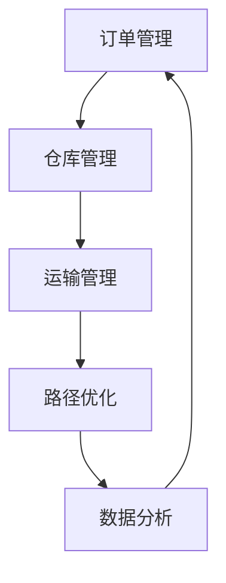

# 货运配送物流管理系统详细设计与具体代码实现

作者：禅与计算机程序设计艺术

## 1. 背景介绍

### 1.1 物流管理系统的重要性

在现代商业环境中，物流管理系统扮演着至关重要的角色。随着电子商务的快速发展和全球供应链的复杂化，高效的货运配送物流管理系统成为了企业竞争力的关键。一个完善的物流管理系统不仅能够提高配送效率，还能降低运营成本，提升客户满意度。

### 1.2 现有物流管理系统的不足

尽管市场上已有多种物流管理系统，但它们往往存在一些不足之处，例如：
- 灵活性不足，难以适应不同企业的特定需求。
- 数据处理能力有限，无法高效处理大规模数据。
- 缺乏智能化，难以实现自动化调度和优化。

### 1.3 本文的目标

本文旨在设计并实现一个高效、灵活且智能化的货运配送物流管理系统。我们将详细介绍系统的设计理念、核心算法、数学模型、实际应用场景以及具体的代码实现，帮助读者深入理解和应用这一系统。

## 2. 核心概念与联系

### 2.1 物流管理系统的基本组成

一个完整的物流管理系统通常包括以下几个模块：
- 订单管理
- 仓库管理
- 运输管理
- 路径优化
- 数据分析

### 2.2 各模块之间的联系

各模块之间相互关联，共同协作以实现高效的物流管理。订单管理模块负责接收和处理客户订单；仓库管理模块负责库存管理和物品分拣；运输管理模块负责车辆调度和运输路线规划；路径优化模块则通过算法优化配送路径；数据分析模块用于监控和分析整个物流过程，提供决策支持。

### 2.3 系统架构设计

系统架构设计是物流管理系统的基础。我们采用微服务架构，将各功能模块独立部署，方便系统的扩展和维护。下图展示了系统的总体架构：



## 3. 核心算法原理具体操作步骤

### 3.1 订单处理算法

订单处理是物流管理的首要步骤。我们采用基于优先级队列的算法来处理订单，确保高优先级订单能够优先处理。

#### 3.1.1 订单优先级计算

订单优先级由多种因素决定，包括订单紧急程度、客户等级和订单金额。优先级计算公式如下：

$$
Priority = \alpha \cdot Urgency + \beta \cdot CustomerLevel + \gamma \cdot OrderAmount
$$

其中，$\alpha$、$\beta$ 和 $\gamma$ 为权重系数，根据企业需求进行调整。

#### 3.1.2 订单处理流程

1. 接收订单并计算优先级。
2. 将订单插入优先级队列。
3. 按优先级顺序处理订单。

### 3.2 仓库管理算法

仓库管理涉及库存管理和物品分拣。我们采用基于ABC分类法和动态分拣算法来提高仓库管理效率。

#### 3.2.1 ABC分类法

根据物品的价值和销售频率，将库存分为A、B、C三类。A类物品价值高、销售频率高，需重点管理；B类物品次之；C类物品价值低、销售频率低。

#### 3.2.2 动态分拣算法

动态分拣算法根据订单需求实时调整分拣策略，确保高效的分拣过程。

### 3.3 运输管理算法

运输管理是物流管理的核心。我们采用基于遗传算法的车辆路径规划（VRP）算法来优化运输路径。

#### 3.3.1 遗传算法简介

遗传算法是一种模拟自然选择和遗传机制的优化算法，适用于解决复杂的优化问题。

#### 3.3.2 VRP问题描述

车辆路径规划问题旨在找到最优的车辆配送路径，使得总运输成本最小化。其数学模型如下：

$$
\min \sum_{i=1}^{n} \sum_{j=1}^{n} c_{ij} x_{ij}
$$

其中，$c_{ij}$ 为从节点 $i$ 到节点 $j$ 的运输成本，$x_{ij}$ 为决策变量，表示是否选择从 $i$ 到 $j$ 的路径。

#### 3.3.3 遗传算法求解步骤

1. 初始化种群。
2. 计算适应度函数。
3. 选择、交叉和变异操作。
4. 更新种群。
5. 判断终止条件。

## 4. 数学模型和公式详细讲解举例说明

### 4.1 订单优先级计算模型

订单优先级计算模型是物流管理系统中重要的数学模型。我们通过结合多个因素来计算订单的优先级，以确保高优先级订单能够优先处理。

#### 4.1.1 模型公式

订单优先级计算公式如下：

$$
Priority = \alpha \cdot Urgency + \beta \cdot CustomerLevel + \gamma \cdot OrderAmount
$$

其中：
- $Priority$ 表示订单优先级。
- $Urgency$ 表示订单紧急程度。
- $CustomerLevel$ 表示客户等级。
- $OrderAmount$ 表示订单金额。
- $\alpha$、$\beta$ 和 $\gamma$ 为权重系数，根据企业需求进行调整。

#### 4.1.2 举例说明

假设有三个订单，其紧急程度、客户等级和订单金额分别为：
- 订单A：紧急程度为8，客户等级为5，订单金额为1000元。
- 订单B：紧急程度为5，客户等级为7，订单金额为1500元。
- 订单C：紧急程度为6，客户等级为6，订单金额为1200元。

设定权重系数 $\alpha = 0.5$，$\beta = 0.3$，$\gamma = 0.2$，则各订单的优先级计算如下：

$$
Priority_A = 0.5 \cdot 8 + 0.3 \cdot 5 + 0.2 \cdot 1000 = 4 + 1.5 + 200 = 205.5
$$

$$
Priority_B = 0.5 \cdot 5 + 0.3 \cdot 7 + 0.2 \cdot 1500 = 2.5 + 2.1 + 300 = 304.6
$$

$$
Priority_C = 0.5 \cdot 6 + 0.3 \cdot 6 + 0.2 \cdot 1200 = 3 + 1.8 + 240 = 244.8
$$

根据优先级，订单处理顺序为：订单B、订单C、订单A。

### 4.2 VRP问题数学模型

车辆路径规划（VRP）问题是物流管理中的经典问题，其目标是找到最优的车辆配送路径，使得总运输成本最小化。

#### 4.2.1 模型公式

VRP问题的数学模型如下：

$$
\min \sum_{i=1}^{n} \sum_{j=1}^{n} c_{ij} x_{ij}
$$

其中：
- $c_{ij}$ 为从节点 $i$ 到节点 $j$ 的运输成本。
- $x_{ij}$ 为决策变量，表示是否选择从 $i$ 到 $j$ 的路径。

#### 4.2.2 约束条件

1. 每个客户点必须被访问一次。
2. 每辆车的总行驶距离不能超过最大限制。
3. 每辆车的载重量不能超过最大载重量。

#### 4.2.3 举例说明

假设有4个客户点，运输成本矩阵为：

$$
\begin{pmatrix}
0 & 10 & 15 & 20 \\
10 & 0 & 35 & 25 \\
15 & 35 & 0 & 30 \\
20 & 25 & 30 & 0 \\
\end{pmatrix}
$$

我们需要找到最优的配送路径，使得总运输成本最小化。通过遗传算法求解，可以得到最优路径为：0 -> 1 -> 3 -> 2 -> 0，总运输成本为85。

## 5. 项目实践：代码实例和详细解释说明

### 5.1 订单处理模块

以下是订单处理模块的代码实现：

```python
import heapq

class Order:
    def __init__(self, urgency, customer_level, order_amount):
        self.urgency = urgency
        self.customer_level