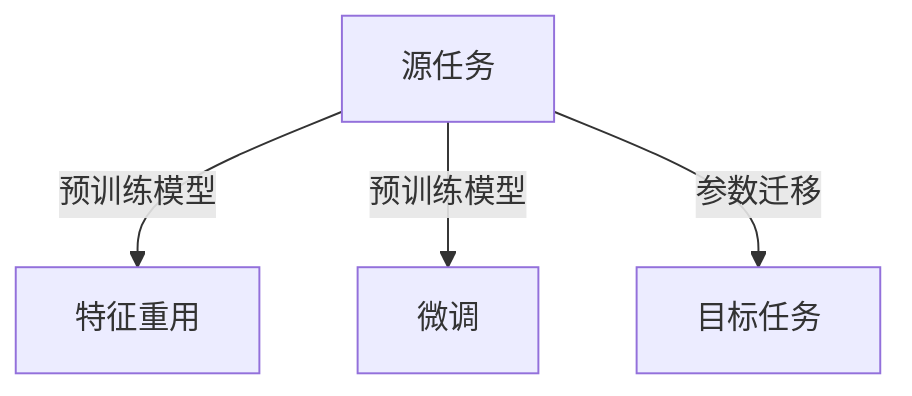

# 迁移学习：助力小样本学习

作者：禅与计算机程序设计艺术

## 1. 背景介绍

### 1.1 迁移学习的兴起

在过去的几年中，深度学习在计算机视觉、自然语言处理等领域取得了显著的进展。然而，训练深度学习模型通常需要大量标注数据，这在许多实际应用中是不可行的。迁移学习作为一种有效利用已有知识的方法，逐渐成为解决小样本学习问题的重要手段。

### 1.2 小样本学习的挑战

小样本学习面临的主要挑战包括数据稀缺、模型过拟合和泛化能力不足。传统机器学习方法在小样本数据集上往往表现不佳，因为它们无法充分学习到数据的潜在模式和特征。

### 1.3 迁移学习的定义与重要性

迁移学习旨在将从一个或多个源任务中学到的知识应用到目标任务中，以提高目标任务的学习效果。通过迁移学习，模型可以在小样本数据集上获得更好的性能，减少对大量标注数据的依赖。

## 2. 核心概念与联系

### 2.1 迁移学习的基本概念

迁移学习涉及源域（source domain）和目标域（target domain），以及源任务（source task）和目标任务（target task）。源域和目标域可以是不同的数据集，源任务和目标任务可以是不同的学习任务。

### 2.2 迁移学习的类型

迁移学习可以分为以下几种类型：

- **归纳迁移学习（Inductive Transfer Learning）**：目标域和源域相同，但任务不同。
- **迁移迁移学习（Transductive Transfer Learning）**：源域和目标域不同，但任务相同。
- **无监督迁移学习（Unsupervised Transfer Learning）**：源域和目标域不同，且任务也不同。

### 2.3 迁移学习与其他学习方法的关系

迁移学习与多任务学习（Multi-task Learning）、元学习（Meta-learning）等方法有着紧密的联系。多任务学习通过同时学习多个任务来提高模型的泛化能力，而元学习则关注如何通过少量数据快速适应新任务。

## 3. 核心算法原理具体操作步骤

### 3.1 特征重用（Feature Reuse）

特征重用是迁移学习中最常用的方法之一。通过在源任务中训练一个深度神经网络，然后将其特征提取层应用到目标任务中，可以有效地利用源任务中学到的特征。

### 3.2 微调（Fine-tuning）

微调是在源任务上预训练模型，然后在目标任务上进行微调的方法。微调的关键在于选择合适的学习率和优化策略，以避免过拟合。

### 3.3 参数迁移（Parameter Transfer）

参数迁移通过将源任务中学到的参数直接迁移到目标任务中。常见的方法包括权重共享和正则化技术。

### 3.4 关系图示



## 4. 数学模型和公式详细讲解举例说明

### 4.1 特征重用的数学模型

假设 $X_s$ 和 $Y_s$ 分别表示源域的数据和标签，$X_t$ 和 $Y_t$ 分别表示目标域的数据和标签。通过在源域上训练一个模型 $f_s$，我们可以得到其特征表示 $h_s = f_s(X_s)$。然后，我们将 $h_s$ 应用于目标域的数据 $X_t$，得到 $h_t = f_s(X_t)$。

### 4.2 微调的数学模型

微调的目标是通过最小化目标域上的损失函数来调整预训练模型的参数。假设预训练模型的参数为 $\theta_s$，目标域上的损失函数为 $L_t$，则微调的目标是最小化以下优化问题：

$$
\min_{\theta} L_t(f(X_t; \theta))
$$

其中，$\theta$ 是在源任务上预训练的初始参数。

### 4.3 参数迁移的数学模型

参数迁移的目标是通过将源任务中学到的参数迁移到目标任务中。假设源任务的参数为 $\theta_s$，目标任务的参数为 $\theta_t$，则参数迁移的优化问题可以表示为：

$$
\min_{\theta_t} L_t(f(X_t; \theta_t)) + \lambda \|\theta_t - \theta_s\|^2
$$

其中，$\lambda$ 是正则化参数，用于控制源任务参数和目标任务参数之间的差异。

## 4. 项目实践：代码实例和详细解释说明

### 4.1 特征重用的代码实例

```python
import tensorflow as tf
from tensorflow.keras.applications import VGG16
from tensorflow.keras.preprocessing.image import ImageDataGenerator
from tensorflow.keras.layers import Dense, Flatten
from tensorflow.keras.models import Model

# 加载预训练的VGG16模型，不包含顶层的全连接层
base_model = VGG16(weights='imagenet', include_top=False, input_shape=(224, 224, 3))

# 冻结所有的卷积层
for layer in base_model.layers:
    layer.trainable = False

# 添加新的全连接层
x = Flatten()(base_model.output)
x = Dense(256, activation='relu')(x)
predictions = Dense(10, activation='softmax')(x)

# 构建新的模型
model = Model(inputs=base_model.input, outputs=predictions)

# 编译模型
model.compile(optimizer='adam', loss='categorical_crossentropy', metrics=['accuracy'])

# 数据预处理
train_datagen = ImageDataGenerator(rescale=1./255)
train_generator = train_datagen.flow_from_directory(
    'data/train',
    target_size=(224, 224),
    batch_size=32,
    class_mode='categorical'
)

# 训练模型
model.fit(train_generator, epochs=10)
```

### 4.2 微调的代码实例

```python
import tensorflow as tf
from tensorflow.keras.applications import VGG16
from tensorflow.keras.preprocessing.image import ImageDataGenerator
from tensorflow.keras.layers import Dense, Flatten
from tensorflow.keras.models import Model

# 加载预训练的VGG16模型，包含顶层的全连接层
base_model = VGG16(weights='imagenet', include_top=False, input_shape=(224, 224, 3))

# 解冻部分卷积层
for layer in base_model.layers[:15]:
    layer.trainable = False

for layer in base_model.layers[15:]:
    layer.trainable = True

# 添加新的全连接层
x = Flatten()(base_model.output)
x = Dense(256, activation='relu')(x)
predictions = Dense(10, activation='softmax')(x)

# 构建新的模型
model = Model(inputs=base_model.input, outputs=predictions)

# 编译模型
model.compile(optimizer=tf.keras.optimizers.Adam(1e-5), loss='categorical_crossentropy', metrics=['accuracy'])

# 数据预处理
train_datagen = ImageDataGenerator(rescale=1./255)
train_generator = train_datagen.flow_from_directory(
    'data/train',
    target_size=(224, 224),
    batch_size=32,
    class_mode='categorical'
)

# 训练模型
model.fit(train_generator, epochs=10)
```

### 4.3 参数迁移的代码实例

```python
import tensorflow as tf
from tensorflow.keras.applications import VGG16
from tensorflow.keras.preprocessing.image import ImageDataGenerator
from tensorflow.keras.layers import Dense, Flatten
from tensorflow.keras.models import Model

# 加载预训练的VGG16模型，包含顶层的全连接层
base_model = VGG16(weights='imagenet', include_top=False, input_shape=(224, 224, 3))

# 复制源任务的参数
source_weights = base_model.get_weights()

# 添加新的全连接层
x = Flatten()(base_model.output)
x = Dense(256, activation='relu')(x)
predictions = Dense(10, activation='softmax')(x)

# 构建新的模型
model = Model(inputs=base_model.input, outputs=predictions)

# 设置源任务的参数为初始值
model.set_weights(source_weights)

# 编译模型
model.compile(optimizer='adam', loss='categorical_crossentropy', metrics=['accuracy'])

# 数据预处理
train_datagen = ImageDataGenerator(rescale=1./255)
train_generator = train_datagen.flow_from_directory(
    'data/train',
    target_size=(224, 224),
    batch_size=32,
    class_mode='categorical'
)

# 训练模型
model.fit(train_generator, epochs=10)
```

## 5. 实际应用场景

### 5.1 计算机视觉

迁移学习在计算机