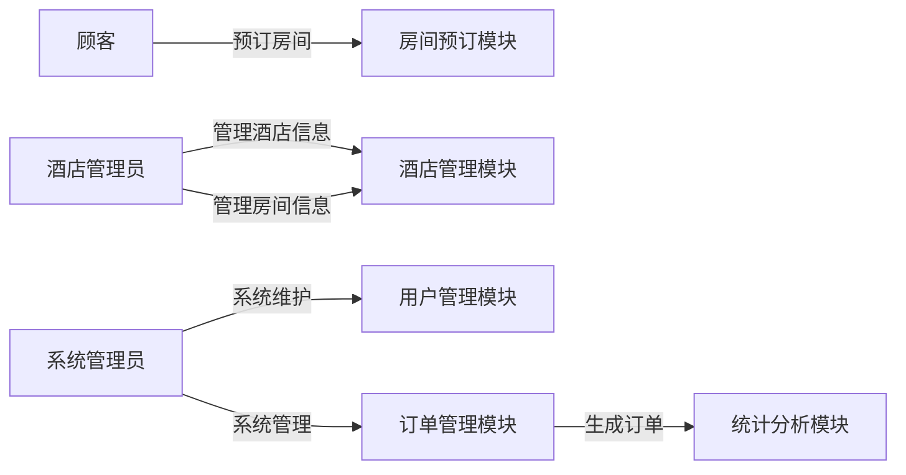

##  酒店房间预约系统详细设计与具体代码实现

作者：禅与计算机程序设计艺术

## 1. 背景介绍

### 1.1 酒店行业现状与挑战

随着旅游业的蓬勃发展和人们生活水平的提高，酒店行业近年来发展迅速。然而，传统的酒店预订方式存在着诸多弊端，例如：

* **信息不对称**:  顾客难以获取全面、准确的酒店信息，例如房间类型、价格、空房情况等。
* **预订流程繁琐**:  顾客需要通过电话、邮件或线下方式进行预订，效率低下且容易出错。
* **管理效率低下**:  酒店需要人工处理大量的预订信息，容易出现漏订、错订等问题。

为了解决这些问题，越来越多的酒店开始采用在线酒店房间预约系统，以提高运营效率和顾客满意度。

### 1.2 在线酒店房间预约系统的优势

在线酒店房间预约系统具有以下优势：

* **信息透明化**:  顾客可以随时随地在线查询酒店信息，包括房间类型、价格、空房情况等，方便快捷。
* **预订流程简化**:  顾客可以通过系统直接在线预订房间，无需繁琐的沟通和操作。
* **提高管理效率**:  系统可以自动处理预订信息，减少人工干预，提高工作效率和准确性。
* **提升顾客体验**:  系统可以提供个性化的服务，例如根据顾客的喜好推荐房间、提供优惠信息等，提升顾客满意度。

## 2. 核心概念与联系

### 2.1 系统用户角色

酒店房间预约系统主要涉及以下用户角色：

* **顾客**:  使用系统预订房间的用户。
* **酒店管理员**:  负责管理酒店信息、房间信息、价格信息等。
* **系统管理员**:  负责系统的维护和管理。

### 2.2 核心功能模块

酒店房间预约系统主要包括以下功能模块：

* **用户管理模块**:  负责用户注册、登录、信息管理等功能。
* **酒店管理模块**:  负责酒店信息管理，包括酒店基本信息、房间类型、价格设置等。
* **房间预订模块**:  负责房间预订、取消预订、修改预订等功能。
* **订单管理模块**:  负责订单查询、支付、退款等功能。
* **统计分析模块**:  提供酒店运营数据统计分析功能，例如房间入住率、收入统计等。

### 2.3  核心概念关系图



## 3. 核心算法原理具体操作步骤

### 3.1  房间预订算法

房间预订算法是酒店房间预约系统的核心算法之一，其主要功能是根据顾客的预订需求，查询符合条件的空闲房间，并完成房间预订操作。

#### 3.1.1 算法步骤

1. 接收顾客的预订请求，包括入住日期、离店日期、房间类型、房间数量等信息。
2. 查询数据库中所有符合条件的房间，包括房间类型、房间状态等信息。
3. 根据预订规则，例如先到先得、价格优先等，对查询结果进行排序。
4. 判断是否有足够的空闲房间满足顾客的预订需求。
5. 如果有足够的空闲房间，则将选中的房间状态更新为“已预订”，并生成预订订单。
6. 如果没有足够的空闲房间，则返回预订失败信息。

#### 3.1.2 算法优化

为了提高房间预订算法的效率，可以采用以下优化策略：

* **缓存机制**:  将常用的查询结果缓存起来，例如酒店的空房情况、房间价格等，减少数据库查询次数。
* **索引优化**:  在数据库中创建索引，提高查询效率。
* **异步处理**:  将预订请求放入消息队列中异步处理，提高系统并发处理能力。

### 3.2  价格计算算法

价格计算算法是酒店房间预约系统的另一个核心算法，其主要功能是根据顾客的入住时间、房间类型等信息，计算出房间的总价格。

#### 3.2.1 算法步骤

1. 获取顾客的入住日期、离店日期、房间类型等信息。
2. 查询数据库中该房间类型的价格信息，包括平日价格、周末价格、节假日价格等。
3. 根据顾客的入住时间，计算出入住天数，并区分平日、周末和节假日。
4. 根据不同的日期类型和房间价格，计算出每天的房间价格。
5. 将每天的房间价格累加，得到房间的总价格。

#### 3.2.2 算法优化

为了提高价格计算算法的效率，可以采用以下优化策略：

* **预先计算**:  将常用的价格信息预先计算好，例如每天的房间价格、不同入住时间的总价格等，减少实时计算量。
* **缓存机制**:  将计算结果缓存起来，减少重复计算。

## 4. 数学模型和公式详细讲解举例说明

### 4.1  房间预订模型

假设酒店有 $n$ 间房间，每间房间的类型为 $t_i$，状态为 $s_i$，其中 $i = 1, 2, ..., n$。顾客的预订请求为 $r = (t, s, d_1, d_2)$，其中 $t$ 为房间类型，$s$ 为房间数量，$d_1$ 为入住日期，$d_2$ 为离店日期。

房间预订模型可以使用如下数学公式表示：

$$
f(r) = 
\begin{cases}
1, & \text{如果存在 } s \text{ 间类型为 } t \text{ 且状态为空闲的房间，且这些房间在 } [d_1, d_2] \text{ 时间段内均为空闲} \\
0, & \text{否则}
\end{cases}
$$

其中，$f(r) = 1$ 表示预订成功，$f(r) = 0$ 表示预订失败。

### 4.2  价格计算模型

假设房间类型 $t$ 的价格信息为 $p = (p_w, p_e, p_h)$，其中 $p_w$ 为平日价格，$p_e$ 为周末价格，$p_h$ 为节假日价格。顾客的入住时间为 $[d_1, d_2]$。

价格计算模型可以使用如下数学公式表示：

$$
g(t, d_1, d_2) = \sum_{i=d_1}^{d_2} h(i, t)
$$

其中，$h(i, t)$ 表示日期 $i$ 房间类型 $t$ 的价格，其计算公式如下：

$$
h(i, t) = 
\begin{cases}
p_w, & \text{如果 } i \text{ 为平日} \\
p_e, & \text{如果 } i \text{ 为周末} \\
p_h, & \text{如果 } i \text{ 为节假日}
\end{cases}
$$

## 5. 项目实践：代码实例和详细解释说明

### 5.1  技术选型

本项目采用 Spring Boot 框架进行开发，数据库采用 MySQL，前端采用 Vue.js。

### 5.2  代码实例

#### 5.2.1  房间预订接口

```java
@RestController
@RequestMapping("/api/bookings")
public class BookingController {

    @Autowired
    private BookingService bookingService;

    @PostMapping
    public ResponseEntity<Booking> createBooking(@RequestBody BookingRequest bookingRequest) {
        Booking booking = bookingService.createBooking(bookingRequest);
        return ResponseEntity.ok(booking);
    }
}
```

#### 5.2.2  价格计算方法

```java
@Service
public class PriceCalculator {

    @Autowired
    private RoomRepository roomRepository;

    public BigDecimal calculatePrice(Long roomId, LocalDate checkinDate, LocalDate checkoutDate) {
        Room room = roomRepository.findById(roomId)
                .orElseThrow(() -> new ResourceNotFoundException("Room not found"));

        BigDecimal totalPrice = BigDecimal.ZERO;
        for (LocalDate date = checkinDate; date.isBefore(checkoutDate); date = date.plusDays(1)) {
            totalPrice = totalPrice.add(getPriceByDate(room, date));
        }

        return totalPrice;
    }

    private BigDecimal getPriceByDate(Room room, LocalDate date) {
        DayOfWeek dayOfWeek = date.getDayOfWeek();
        if (dayOfWeek == DayOfWeek.SATURDAY || dayOfWeek == DayOfWeek.SUNDAY) {
            return room.getWeekendPrice();
        } else {
            return room.getWeekdayPrice();
        }
    }
}
```

### 5.3  代码解释

* `BookingController` 类负责处理房间预订请求，调用 `BookingService` 类完成预订逻辑。
* `PriceCalculator` 类负责计算房间价格，根据入住时间和房间类型查询数据库获取价格信息，并根据日期类型计算总价格。

## 6. 实际应用场景

酒店房间预约系统可以应用于各种类型的酒店，例如：

* **星级酒店**:  提供在线预订、支付、入住、退房等一站式服务。
* **经济型酒店**:  提供便捷的预订方式和优惠的价格。
* **民宿**:  提供个性化的住宿体验和当地特色服务。

## 7. 工具和资源推荐

* **Spring Boot**:  快速构建 Spring 应用的框架。
* **MySQL**:  关系型数据库管理系统。
* **Vue.js**:  前端 JavaScript 框架。
* **Postman**:  API 测试工具。

## 8. 总结：未来发展趋势与挑战

### 8.1 未来发展趋势

* **个性化推荐**:  根据顾客的喜好和历史记录，推荐更符合其需求的酒店和房间。
* **智能客服**:  利用人工智能技术，提供 24 小时在线客服服务，解决顾客的疑问。
* **大数据分析**:  利用酒店运营数据，进行深度分析，为酒店经营决策提供数据支持。

### 8.2 面临的挑战

* **数据安全**:  如何保障顾客的隐私和支付安全。
* **系统稳定性**:  如何保证系统在高并发访问情况下稳定运行。
* **用户体验**:  如何不断提升用户体验，提高顾客满意度。

## 9. 附录：常见问题与解答

### 9.1  如何注册账号？

访问酒店房间预约系统网站，点击“注册”按钮，填写相关信息即可完成注册。

### 9.2  如何预订房间？

登录系统后，选择入住日期、离店日期、房间类型等信息，点击“预订”按钮即可完成预订。

### 9.3  如何取消预订？

登录系统后，在我的订单中找到需要取消的订单，点击“取消订单”按钮即可取消预订。
