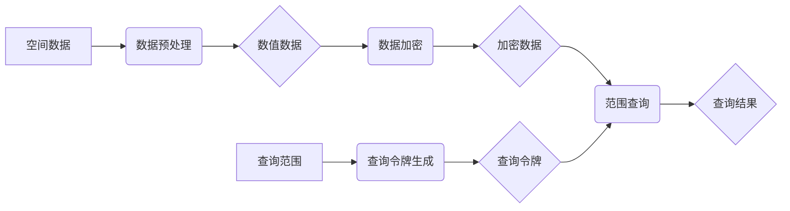

# 针对空间数据范围搜索的加密技术研究

作者：禅与计算机程序设计艺术

## 1. 背景介绍

### 1.1 空间数据与范围搜索

随着移动互联网和物联网技术的快速发展，空间数据呈现爆炸式增长，例如：共享单车的位置信息、用户的位置签到信息、城市基础设施的空间分布信息等。如何高效地管理和查询海量的空间数据成为一个重要的研究课题。其中，空间数据范围搜索作为一种基础的空间查询操作，在许多应用场景中扮演着至关重要的角色，例如：

* **兴趣点查询 (POI Query):** 用户想要查找附近特定类型的兴趣点，例如餐厅、加油站、银行等。
* **轨迹查询 (Trajectory Query):** 用户想要查询某个时间段内车辆或行人的移动轨迹。
* **地理围栏 (Geo-fencing):** 定义一个地理区域，当目标进入或离开该区域时触发相应的事件。

### 1.2 数据安全与隐私保护

然而，空间数据往往包含用户的敏感信息，例如用户的实时位置、历史轨迹等。直接存储和查询这些数据会泄露用户的隐私，甚至威胁用户的生命财产安全。因此，如何在保证数据安全和用户隐私的前提下，实现高效的空间数据范围搜索成为一个亟待解决的问题。

### 1.3 加密技术与空间数据范围搜索

加密技术作为保护数据安全和隐私的重要手段，近年来在空间数据范围搜索领域得到了广泛的应用。通过对空间数据进行加密处理，可以有效防止未授权用户访问和窃取数据。然而，传统的加密技术往往会导致数据无法被有效地索引和查询，从而无法满足空间数据范围搜索的需求。

## 2. 核心概念与联系

### 2.1 可搜索加密 (Searchable Encryption)

可搜索加密技术允许用户在不解密数据的情况下对加密数据进行检索。其基本思想是将用户的查询请求转换为密文形式，然后在加密数据上执行查询操作，最终返回满足条件的密文结果。

### 2.2 同态加密 (Homomorphic Encryption)

同态加密技术允许用户在不解密数据的情况下对加密数据进行计算。其基本思想是定义一种特殊的加密算法，使得对密文进行的计算操作等价于对明文进行相应的计算操作。

### 2.3 安全多方计算 (Secure Multi-Party Computation)

安全多方计算技术允许多个用户在不泄露各自私有数据的情况下，共同计算一个函数的结果。其基本思想是将计算任务分解成多个子任务，每个用户只负责计算其中一部分，最终通过安全协议将所有用户的计算结果汇总得到最终结果。

### 2.4 联系

可搜索加密、同态加密和安全多方计算技术都可以用于实现安全的空间数据范围搜索。其中，可搜索加密技术主要用于实现单用户场景下的安全搜索，同态加密技术可以用于实现多用户场景下的安全搜索，而安全多方计算技术则可以用于实现更为复杂的隐私保护需求。

## 3. 核心算法原理具体操作步骤

本节将介绍一种基于可搜索加密的空间数据范围搜索算法——**对称有序加密范围查询 (Symmetric Order-Preserving Encryption Range Query, SOP-ORQ)**。

### 3.1 算法原理

SOP-ORQ 算法的基本思想是将空间数据映射到一维数值空间，然后对数值数据进行加密，使得密文仍然保持数据的顺序关系。这样，用户就可以使用加密的数值数据进行范围查询，而无需解密数据。

### 3.2 具体操作步骤

SOP-ORQ 算法的具体操作步骤如下：

1. **数据预处理:** 将空间数据映射到一维数值空间，例如使用 Z-order 曲线或 Hilbert 曲线。
2. **密钥生成:** 生成一个密钥对 $(sk, pk)$，其中 $sk$ 用于加密数据，$pk$ 用于生成查询令牌。
3. **数据加密:** 使用密钥 $sk$ 对数值数据进行加密，得到加密数据。
4. **查询令牌生成:** 用户使用密钥 $pk$ 和查询范围生成查询令牌。
5. **范围查询:** 服务器使用加密数据和查询令牌执行范围查询，返回满足条件的加密数据。

### 3.3 算法流程图



## 4. 数学模型和公式详细讲解举例说明

### 4.1  对称有序加密 (Symmetric Order-Preserving Encryption, SOPE)

SOPE 算法是一种特殊的加密算法，它可以保证加密后的数据仍然保持明文数据的顺序关系。

**定义：**

设 $M$ 为明文空间，$C$ 为密文空间，$K$ 为密钥空间。一个 SOPE 方案是一个五元组 $(Gen, Enc, Dec, Comp, size)$，其中：

* $Gen(1^λ) → (sk, pk)$：密钥生成算法，输入安全参数 $λ$，输出密钥对 $(sk, pk)$。
* $Enc(sk, m) → c$：加密算法，输入密钥 $sk$ 和明文 $m ∈ M$，输出密文 $c ∈ C$。
* $Dec(sk, c) → m$：解密算法，输入密钥 $sk$ 和密文 $c ∈ C$，输出明文 $m ∈ M$。
* $Comp(pk, c_1, c_2) → b$：比较算法，输入公钥 $pk$ 和两个密文 $c_1, c_2 ∈ C$，输出一个比特 $b ∈ {0, 1}$，表示 $c_1$ 和 $c_2$ 对应的明文的大小关系。

**性质：**

* **正确性：** 对于任何 $m ∈ M$，$Dec(sk, Enc(sk, m)) = m$。
* **顺序保持性：** 对于任何 $m_1, m_2 ∈ M$，如果 $m_1 < m_2$，则 $Comp(pk, Enc(sk, m_1), Enc(sk, m_2)) = 0$；如果 $m_1 > m_2$，则 $Comp(pk, Enc(sk, m_1), Enc(sk, m_2)) = 1$。

### 4.2 SOP-ORQ 算法

SOP-ORQ 算法使用 SOPE 算法对数值数据进行加密，然后使用二叉搜索树 (Binary Search Tree, BST) 对加密数据进行索引。

**查询令牌生成:**

用户使用密钥 $pk$ 和查询范围 $[l, r]$ 生成查询令牌 $token = (c_l, c_r)$，其中 $c_l = Enc(sk, l)$，$c_r = Enc(sk, r)$。

**范围查询:**

服务器收到查询令牌 $token = (c_l, c_r)$ 后，在 BST 中查找满足 $c_l ≤ c ≤ c_r$ 的所有密文 $c$，并将对应的加密数据返回给用户。

### 4.3 举例说明

假设有如下空间数据：

| ID | 经度 | 纬度 |
|---|---|---|
| 1 | 116.3 | 39.9 |
| 2 | 116.4 | 40.0 |
| 3 | 116.5 | 39.8 |

1. **数据预处理:** 使用 Z-order 曲线将空间数据映射到一维数值空间，得到如下结果：

| ID | 经度 | 纬度 | Z-order 值 |
|---|---|---|---|
| 1 | 116.3 | 39.9 | 1 |
| 2 | 116.4 | 40.0 | 3 |
| 3 | 116.5 | 39.8 | 2 |

2. **密钥生成:** 生成一个密钥对 $(sk, pk)$。

3. **数据加密:** 使用密钥 $sk$ 对 Z-order 值进行加密，得到如下结果：

| ID | Z-order 值 | 加密值 |
|---|---|---|
| 1 | 1 | c1 |
| 2 | 3 | c3 |
| 3 | 2 | c2 |

4. **查询令牌生成:** 用户想要查询经度范围为 $[116.4, 116.5]$，纬度范围为 $[39.8, 40.0]$ 的数据。首先将查询范围映射到 Z-order 值范围 $[2, 3]$，然后使用密钥 $pk$ 生成查询令牌 $token = (c2, c3)$。

5. **范围查询:** 服务器收到查询令牌 $token = (c2, c3)$ 后，在 BST 中查找满足 $c2 ≤ c ≤ c3$ 的所有密文 $c$，找到 $c2$ 和 $c3$，并将对应的加密数据返回给用户。

## 5. 项目实践：代码实例和详细解释说明

### 5.1 Python 代码实例

```python
from cryptography.fernet import Fernet

# 生成密钥
key = Fernet.generate_key()
cipher = Fernet(key)

# 空间数据
data = [
    {"id": 1, "longitude": 116.3, "latitude": 39.9},
    {"id": 2, "longitude": 116.4, "latitude": 40.0},
    {"id": 3, "longitude": 116.5, "latitude": 39.8},
]

# 数据预处理：使用 Z-order 曲线将空间数据映射到一维数值空间
def z_order(x, y):
    # ...

# 数据加密
encrypted_data = []
for d in 
    z = z_order(d["longitude"], d["latitude"])
    encrypted_data.append(
        {"id": d["id"], "z": cipher.encrypt(str(z).encode()).decode()}
    )

# 查询令牌生成
def generate_token(lower_bound, upper_bound):
    return (
        cipher.encrypt(str(lower_bound).encode()).decode(),
        cipher.encrypt(str(upper_bound).encode()).decode(),
    )

# 范围查询
def range_query(encrypted_data, token):
    lower_bound, upper_bound = token
    result = []
    for d in encrypted_
        if lower_bound <= d["z"] <= upper_bound:
            result.append(d)
    return result

# 查询经度范围为 [116.4, 116.5]，纬度范围为 [39.8, 40.0] 的数据
lower_bound = z_order(116.4, 39.8)
upper_bound = z_order(116.5, 40.0)
token = generate_token(lower_bound, upper_bound)
result = range_query(encrypted_data, token)

# 打印查询结果
print(result)
```

### 5.2 代码解释

* 使用 `cryptography` 库中的 `Fernet` 类实现对称加密。
* 使用 `z_order()` 函数将空间数据映射到一维数值空间。
* 使用 `generate_token()` 函数生成查询令牌。
* 使用 `range_query()` 函数执行范围查询。

## 6. 实际应用场景

### 6.1 位置服务

* **附近的人：** 在社交应用中，用户可以使用自己的位置信息查询附近的其他用户。
* **兴趣点查询：** 用户可以使用自己的位置信息查询附近的餐厅、酒店、景点等。
* **路线规划：** 用户可以使用自己的位置信息和目的地信息规划最佳路线。

### 6.2 物联网

* **环境监测：** 部署在不同位置的传感器可以收集环境数据，例如温度、湿度、空气质量等。用户可以使用加密的空间数据范围搜索技术查询特定区域内的环境数据。
* **智能交通：** 车联网系统可以收集车辆的位置信息、速度信息等。用户可以使用加密的空间数据范围搜索技术查询特定路段的交通状况。
* **智慧城市：** 智慧城市系统可以收集城市基础设施的空间数据，例如道路、桥梁、管道等。用户可以使用加密的空间数据范围搜索技术查询特定区域内的基础设施信息。

## 7. 总结：未来发展趋势与挑战

### 7.1 未来发展趋势

* **更高效的加密算法：** 随着空间数据规模的不断增长，需要更高效的加密算法来满足性能需求。
* **更灵活的查询方式：** 未来需要支持更灵活的查询方式，例如 k 近邻查询、空间连接查询等。
* **更完善的隐私保护机制：** 未来需要更完善的隐私保护机制，例如差分隐私、联邦学习等。

### 7.2 挑战

* **效率与安全性的平衡：** 加密技术往往会带来一定的性能开销，如何在保证安全性的同时提高效率是一个挑战。
* **密钥管理：** 加密技术需要安全的密钥管理机制，以防止密钥泄露。
* **标准化：** 目前空间数据范围搜索的加密技术还没有统一的标准，这给应用和推广带来了一定的困难。

## 8. 附录：常见问题与解答

### 8.1 什么是 Z-order 曲线？

Z-order 曲线是一种将多维数据映射到一维空间的方法。它可以将空间中相邻的点映射到一维空间中相邻的位置，从而保留数据的局部性。

### 8.2 什么是二叉搜索树？

二叉搜索树是一种数据结构，它可以高效地支持数据的插入、删除、查找等操作。

### 8.3 如何选择合适的加密算法？

选择合适的加密算法需要考虑安全强度、性能、实现复杂度等因素。