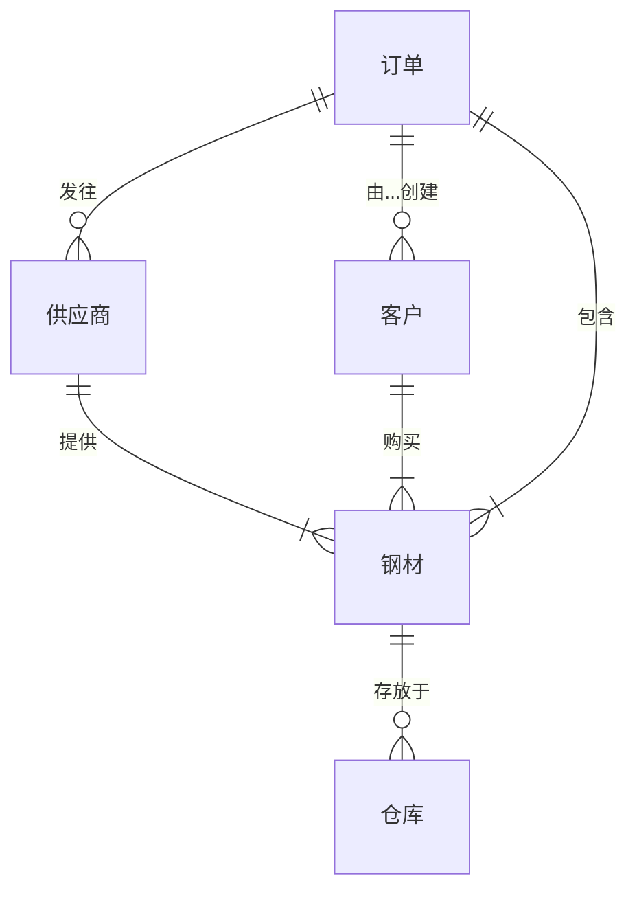

##  钢材管理系统详细设计与具体代码实现

作者：禅与计算机程序设计艺术

## 1. 背景介绍

### 1.1 钢材管理现状与挑战

随着我国经济的快速发展和城镇化进程的不断推进，建筑、制造等行业对钢材的需求量逐年攀升。然而，传统的钢材管理模式存在诸多弊端，例如：

* **信息化程度低:** 手工作业、信息孤岛现象严重，导致数据统计困难、信息传递不及时。
* **库存管理混乱:** 缺乏科学的库存预警机制，容易造成库存积压或短缺，影响生产进度。
* **追溯困难:**  难以追踪钢材的来源、去向以及加工、使用等环节的信息，存在安全隐患。

这些问题严重制约了企业的生产效率和经济效益，因此，开发一套高效、智能的钢材管理系统势在必行。

### 1.2 钢材管理系统概述

钢材管理系统旨在利用信息化手段，实现对钢材从采购、入库、存储、加工、销售到报废等全生命周期的管理，提高企业钢材管理水平，降低运营成本，提升市场竞争力。

## 2. 核心概念与联系

### 2.1 核心实体

钢材管理系统涉及的主要实体包括：

* **钢材:** 系统的核心对象，包含规格、材质、产地、批次、数量、重量等属性。
* **仓库:** 用于存放钢材的场所，包含名称、地址、容量、负责人等属性。
* **供应商:**  提供钢材的企业，包含名称、联系人、联系方式等属性。
* **客户:** 购买钢材的企业或个人，包含名称、联系人、联系方式等属性。
* **订单:**  记录钢材采购或销售的业务单据，包含订单号、日期、客户/供应商、钢材明细等信息。

### 2.2 实体关系图



## 3. 核心算法原理具体操作步骤

### 3.1 库存管理

#### 3.1.1 入库管理

* 当钢材到货时，系统根据采购订单信息自动生成入库单。
* 仓库管理员核对实物与入库单信息，确认无误后进行入库操作。
* 系统更新库存信息，记录入库时间、数量、批次等信息。

#### 3.1.2 出库管理

* 当需要领用或销售钢材时，用户提交出库申请。
* 仓库管理员审核出库申请，确认库存充足后进行出库操作。
* 系统更新库存信息，记录出库时间、数量、去向等信息。

#### 3.1.3 库存预警

* 系统根据设定的安全库存量和最低库存量，对库存进行实时监控。
* 当库存低于安全库存量时，系统自动发出预警提醒，提醒相关人员及时补充库存。
* 当库存低于最低库存量时，系统禁止出库操作，防止出现库存短缺的情况。

### 3.2  追溯管理

* 系统记录每批次钢材的来源、入库时间、存放位置、领用记录、销售记录等信息。
* 用户可以通过批次号、钢材规格等信息，快速查询钢材的流转情况，实现对钢材的全生命周期追溯。

## 4. 数学模型和公式详细讲解举例说明

### 4.1 库存周转率

库存周转率是衡量企业库存管理水平的重要指标，计算公式如下：

$$
库存周转率 = \frac{年销售成本}{平均库存}
$$

其中：

* 年销售成本 = 年初库存 + 本期采购成本 - 年末库存
* 平均库存 = (年初库存 + 年末库存) / 2

**举例说明:**

假设某企业2023年的钢材销售成本为1000万元，年初库存为100万元，年末库存为200万元，则该企业的库存周转率为：

$$
库存周转率 = \frac{1000}{ (100 + 200) / 2 } = 6.67
$$

**分析:**  该企业的库存周转率为6.67，说明该企业的库存管理水平较高，钢材的周转速度较快。

## 5. 项目实践：代码实例和详细解释说明

### 5.1 技术选型

* 后端：Spring Boot
* 数据库：MySQL
* 前端：Vue.js

### 5.2 代码示例

#### 5.2.1  钢材实体类

```java
@Entity
@Table(name = "steel")
public class Steel {

    @Id
    @GeneratedValue(strategy = GenerationType.IDENTITY)
    private Long id;

    @Column(nullable = false)
    private String name;

    @Column(nullable = false)
    private String specification;

    @Column(nullable = false)
    private String material;

    @Column(nullable = false)
    private Integer quantity;

    @Column(nullable = false)
    private Double weight;

    // 省略 getter 和 setter 方法
}
```

#### 5.2.2  入库接口

```java
@RestController
@RequestMapping("/api/inbounds")
public class InboundController {

    @Autowired
    private InboundService inboundService;

    @PostMapping
    public ResponseEntity<Inbound> createInbound(@RequestBody Inbound inbound) {
        Inbound createdInbound = inboundService.createInbound(inbound);
        return ResponseEntity.status(HttpStatus.CREATED).body(createdInbound);
    }
}
```

## 6. 实际应用场景

* **建筑行业:**  管理建筑工程所需的各种钢材，例如钢筋、钢管、型钢等。
* **制造行业:** 管理生产制造所需的各种原材料和半成品，例如钢板、钢卷、钢坯等。
* **物流行业:** 管理仓库中的钢材库存，跟踪钢材的运输情况，提高物流效率。

## 7. 总结：未来发展趋势与挑战

### 7.1 未来发展趋势

* **智能化:**  利用人工智能、大数据等技术，实现钢材需求预测、智能库存管理、自动化仓储等功能。
* **数字化:**  构建数字化平台，实现钢材信息共享、协同管理，提高产业链效率。
* **绿色化:** 推广使用环保型钢材，减少钢材生产和使用过程中的环境污染。

### 7.2 面临的挑战

* **数据安全:**  如何保障钢材数据的安全性和隐私性。
* **系统集成:** 如何与企业现有的 ERP、MES 等系统进行有效集成。
* **人才培养:** 缺乏专业的钢材管理人才。

## 8. 附录：常见问题与解答

### 8.1  问：如何保证钢材数据的准确性？

答：可以通过以下措施保证钢材数据的准确性：

*  加强数据源头管理，确保入库、出库等数据的真实可靠。
*  定期进行数据核查，及时发现和纠正数据错误。
*  建立数据追溯机制，方便查找和修正数据问题。

### 8.2  问：如何提高钢材库存周转率？

答：可以通过以下措施提高钢材库存周转率：

*  优化采购策略，避免过度采购。
*  加强库存预警管理，及时处理积压库存。
*  提高生产效率，缩短钢材的生产周期。
