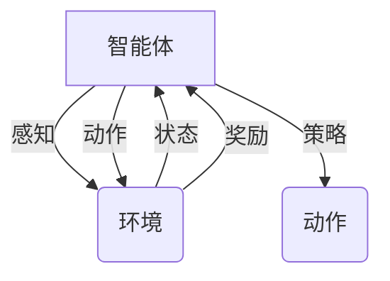

# AI人工智能 Agent：智能体与环境的交互理论

作者：禅与计算机程序设计艺术

## 1. 背景介绍

### 1.1 人工智能的演进与智能体概念的提出

人工智能(AI)自诞生以来，经历了符号主义、连接主义、深度学习等多个阶段的发展。早期，人们主要关注于构建能够模拟人类逻辑推理能力的系统，例如专家系统。然而，这类系统在处理复杂、动态的现实世界问题时显得力不从心。

随着计算能力的提升和数据量的爆炸式增长，机器学习，特别是深度学习，取得了突破性进展，并在图像识别、自然语言处理等领域取得了超越人类水平的表现。然而，这些成功大多局限于特定任务，缺乏通用性。

为了构建更加通用、智能的AI系统，研究者们开始关注**智能体(Agent)**的概念。智能体是指能够感知环境、做出决策并执行动作以实现特定目标的实体。与传统的AI系统不同，智能体强调与环境的交互，通过不断试错和学习来提高自身的能力。

### 1.2 智能体与环境交互的意义

智能体与环境的交互是人工智能的核心问题之一。通过与环境的交互，智能体可以：

* **获取信息:** 感知环境状态，收集数据，为决策提供依据。
* **执行动作:**  改变环境状态，影响环境发展，最终实现目标。
* **学习和适应:**  根据环境反馈调整自身行为策略，提高应对复杂环境的能力。

理解智能体与环境的交互机制，对于设计和构建高效、鲁棒的AI系统至关重要。

### 1.3 本文目标

本文旨在深入探讨AI智能体与环境的交互理论，涵盖以下内容：

* 核心概念与联系：介绍智能体、环境、状态、动作、奖励等基本概念，并阐述它们之间的关系。
* 核心算法原理：详细解释强化学习、模仿学习等主流智能体学习算法的原理和操作步骤。
* 数学模型和公式：  使用数学语言描述智能体与环境的交互过程，并推导关键公式。
* 项目实践：  提供代码实例，演示如何使用Python和相关库构建简单的智能体。
* 实际应用场景：  介绍智能体在游戏、机器人、推荐系统等领域的应用案例。
* 工具和资源推荐：  推荐学习智能体相关知识的书籍、课程、开源项目等资源。
* 未来发展趋势与挑战：  探讨智能体研究的未来方向和面临的挑战。
* 常见问题与解答：  解答读者在学习过程中可能遇到的常见问题。


## 2. 核心概念与联系

### 2.1 智能体 (Agent)

智能体是能够感知环境并采取行动以试图实现目标的任何事物。智能体可以是任何东西，从一个简单的恒温器到一个复杂的股票交易系统。

**关键特性:**

* **感知:**  智能体通过传感器感知环境。
* **行动:**  智能体通过执行器对环境采取行动。
* **目标:**  智能体被编程为试图实现一个或多个目标。
* **理性:**  智能体被认为是理性的，这意味着它们试图选择实现其目标的最佳行动。

### 2.2 环境 (Environment)

环境是智能体以外的一切。它可以是物理世界，也可以是模拟世界。

**关键特性:**

* **状态:**  环境在任何给定时间点的状态。
* **转换:**  环境状态如何随着时间的推移而变化。
* **奖励:**  环境提供给智能体的奖励信号，用于指示智能体的行动是好是坏。

### 2.3 状态 (State)

状态是对描述环境在任何给定时间点的配置信息的简洁总结。

* **完全可观察:**  智能体可以访问环境的完整状态信息。
* **部分可观察:**  智能体只能访问环境的部分状态信息。

### 2.4  动作 (Action)

动作是智能体可以在环境中执行的操作。

* **离散动作:**  从有限的动作集中选择一个动作。
* **连续动作:**  从连续的动作空间中选择一个动作。

### 2.5 奖励 (Reward)

奖励是由环境提供给智能体的标量反馈信号，用于指示智能体在给定时间步长内表现的好坏。

* **积极奖励:**  鼓励智能体重复导致奖励的行为。
* **消极奖励:**  鼓励智能体避免导致奖励的行为。

### 2.6  策略 (Policy)

策略是智能体用来决定在给定状态下采取何种行动的规则或函数。

* **确定性策略:**  在给定状态下，策略总是返回相同的动作。
* **随机性策略:**  在给定状态下，策略返回一个动作概率分布。

### 2.7  核心概念关系图




## 3. 核心算法原理具体操作步骤

### 3.1 强化学习 (Reinforcement Learning)

强化学习是一种机器学习范式，其中智能体通过与其环境交互来学习。智能体通过尝试不同的动作并观察所得到的奖励来学习采取哪些动作才能最大化其累积奖励。

#### 3.1.1  基本原理

* 智能体在环境中，根据当前状态选择一个动作。
* 环境根据动作更新状态，并返回一个奖励信号。
* 智能体根据奖励信号更新策略，以便在未来做出更好的决策。
* 重复以上步骤，直到智能体学习到一个最优策略。

#### 3.1.2  关键算法

* **Q-learning:** 一种基于值的强化学习算法，它学习每个状态-动作对的 Q 值，Q 值表示在给定状态下采取特定动作的预期累积奖励。
* **SARSA:** 一种 on-policy 的强化学习算法，它学习状态-动作-奖励-状态-动作序列的值。
* **深度 Q 网络 (DQN):**  使用深度神经网络来逼近 Q 函数，从而可以处理高维状态和动作空间。

#### 3.1.3  操作步骤

1. **定义环境:**  定义智能体与之交互的环境，包括状态空间、动作空间和奖励函数。
2. **创建智能体:**  创建强化学习智能体，并初始化其策略。
3. **训练智能体:**  让智能体与环境交互，并根据收到的奖励更新其策略。
4. **评估智能体:**  使用一组不同的环境来评估训练好的智能体。

### 3.2  模仿学习 (Imitation Learning)

模仿学习是一种机器学习范式，其中智能体通过观察和模仿专家的行为来学习。

#### 3.2.1  基本原理

* 收集专家演示的数据集，其中包括专家在不同状态下采取的动作。
* 训练一个模型，该模型可以根据当前状态预测专家的动作。
* 使用训练好的模型来控制智能体，使其模仿专家的行为。

#### 3.2.2  关键算法

* **行为克隆 (Behavioral Cloning):**  一种简单的模仿学习算法，它使用监督学习来训练一个模型，该模型可以将状态映射到动作。
* **逆强化学习 (Inverse Reinforcement Learning):**  一种模仿学习算法，它试图从专家的行为中推断出奖励函数。

#### 3.2.3  操作步骤

1. **收集专家演示:**  收集专家在任务中执行任务的演示数据集。
2. **训练模仿学习模型:**  使用收集到的演示数据来训练一个模仿学习模型。
3. **使用训练好的模型控制智能体:**  使用训练好的模型来控制智能体，使其模仿专家的行为。


## 4. 数学模型和公式详细讲解举例说明

### 4.1  马尔可夫决策过程 (Markov Decision Process, MDP)

马尔可夫决策过程是一种用于建模顺序决策问题的数学框架。

#### 4.1.1  定义

一个马尔可夫决策过程由一个五元组  $(S, A, P, R, \gamma)$ 定义，其中：

* $S$ 是状态空间，表示环境中所有可能的状态的集合。
* $A$ 是动作空间，表示智能体可以采取的所有可能动作的集合。
* $P$ 是状态转移概率函数，$P(s' | s, a)$ 表示在状态 $s$ 下采取动作 $a$ 后转移到状态 $s'$ 的概率。
* $R$ 是奖励函数，$R(s, a, s')$ 表示在状态 $s$ 下采取动作 $a$ 并转移到状态 $s'$ 时智能体收到的奖励。
* $\gamma$ 是折扣因子，$0 \le \gamma \le 1$，用于衡量未来奖励相对于当前奖励的重要性。

#### 4.1.2  目标

智能体的目标是找到一个策略 $\pi$，该策略最大化预期累积折扣奖励：

$$
J(\pi) = \mathbb{E} \left[ \sum_{t=0}^{\infty} \gamma^t R(s_t, a_t, s_{t+1}) | \pi \right]
$$

其中，$s_0$ 是初始状态，$a_t = \pi(s_t)$ 是在状态 $s_t$ 下根据策略 $\pi$ 选择的动作。

### 4.2  值函数 (Value Function)

值函数用于衡量在给定状态下采取特定策略的长期价值。

#### 4.2.1  状态值函数

状态值函数 $V^{\pi}(s)$ 表示在状态 $s$ 下遵循策略 $\pi$ 的预期累积折扣奖励：

$$
V^{\pi}(s) = \mathbb{E} \left[ \sum_{t=0}^{\infty} \gamma^t R(s_t, a_t, s_{t+1}) | s_0 = s, \pi \right]
$$

#### 4.2.2  动作值函数

动作值函数 $Q^{\pi}(s, a)$ 表示在状态 $s$ 下采取动作 $a$ 并随后遵循策略 $\pi$ 的预期累积折扣奖励：

$$
Q^{\pi}(s, a) = \mathbb{E} \left[ \sum_{t=0}^{\infty} \gamma^t R(s_t, a_t, s_{t+1}) | s_0 = s, a_0 = a, \pi \right]
$$

### 4.3  贝尔曼方程 (Bellman Equation)

贝尔曼方程是值函数的递归关系，它将当前状态的值与其后续状态的值联系起来。

#### 4.3.1  状态值函数的贝尔曼方程

$$
V^{\pi}(s) = \sum_{a \in A} \pi(a|s) \sum_{s' \in S} P(s' | s, a) \left[ R(s, a, s') + \gamma V^{\pi}(s') \right]
$$

#### 4.3.2  动作值函数的贝尔曼方程

$$
Q^{\pi}(s, a) = \sum_{s' \in S} P(s' | s, a) \left[ R(s, a, s') + \gamma \sum_{a' \in A} \pi(a'|s') Q^{\pi}(s', a') \right]
$$

### 4.4  举例说明

假设有一个简单的迷宫环境，智能体的目标是从起点到达终点。迷宫环境可以用一个二维网格表示，其中每个格子代表一个状态。智能体可以在四个方向上移动：上、下、左、右。如果智能体移动到终点，它将获得 +1 的奖励；如果智能体移动到墙壁或边界，它将获得 -1 的奖励；否则，它将获得 0 的奖励。

我们可以使用马尔可夫决策过程来建模这个迷宫环境。状态空间 $S$ 是所有格子的集合，动作空间 $A$ 是 {上，下，左，右}，状态转移概率函数 $P$ 决定了智能体在采取特定动作后移动到哪个格子的概率，奖励函数 $R$ 定义了智能体在每个状态下获得的奖励。

智能体的目标是找到一个策略，该策略最大化预期累积奖励。可以使用强化学习算法（如 Q-learning 或 SARSA）来找到最优策略。


## 5. 项目实践：代码实例和详细解释说明

### 5.1  使用 Q-learning 解决迷宫问题

```python
import numpy as np

# 定义迷宫环境
class Maze:
    def __init__(self, width, height, start, goal):
        self.width = width
        self.height = height
        self.start = start
        self.goal = goal
        self.grid = np.zeros((height, width))
        self.grid[self.goal] = 1

    def reset(self):
        self.state = self.start
        return self.state

    def step(self, action):
        x, y = self.state
        if action == 0:  # 上
            y = max(0, y - 1)
        elif action == 1:  # 下
            y = min(self.height - 1, y + 1)
        elif action == 2:  # 左
            x = max(0, x - 1)
        elif action == 3:  # 右
            x = min(self.width - 1, x + 1)
        self.state = (x, y)
        if self.state == self.goal:
            reward = 1
        elif self.grid[self.state] == -1:
            reward = -1
        else:
            reward = 0
        return self.state, reward

# 定义 Q-learning 智能体
class QLearningAgent:
    def __init__(self, width, height, actions, alpha=0.1, gamma=0.9, epsilon=0.1):
        self.width = width
        self.height = height
        self.actions = actions
        self.alpha = alpha
        self.gamma = gamma
        self.epsilon = epsilon
        self.q_table = np.zeros((height, width, len(actions)))

    def get_action(self, state):
        if np.random.rand() < self.epsilon:
            return np.random.choice(self.actions)
        else:
            return np.argmax(self.q_table[state])

    def update(self, state, action, next_state, reward):
        q_predict = self.q_table[state][action]
        q_target = reward + self.gamma * np.max(self.q_table[next_state])
        self.q_table[state][action] += self.alpha * (q_target - q_predict)

# 创建迷宫环境和 Q-learning 智能体
width = 5
height = 5
start = (0, 0)
goal = (4, 4)
maze = Maze(width, height, start, goal)
agent = QLearningAgent(width, height, actions=[0, 1, 2, 3])

# 训练智能体
for episode in range(1000):
    state = maze.reset()
    while state != goal:
        action = agent.get_action(state)
        next_state, reward = maze.step(action)
        agent.update(state, action, next_state, reward)
        state = next_state

# 打印 Q 表
print(agent.q_table)
```

### 5.2  代码解释

* **迷宫环境:**  `Maze` 类表示迷宫环境，它包含迷宫的大小、起点、终点和奖励函数。
* **Q-learning 智能体:**  `QLearningAgent` 类表示 Q-learning 智能体，它包含 Q 表、学习率、折扣因子和探索率。
* **训练循环:**  在每个 episode 中，智能体从起点开始，根据其策略选择动作，直到到达终点。智能体根据收到的奖励更新其 Q 表。
* **打印 Q 表:**  训练完成后，打印智能体的 Q 表，该表显示了在每个状态下采取每个动作的预期累积奖励。


## 6. 实际应用场景

### 6.1 游戏

* **AlphaGo:**  DeepMind 开发的围棋 AI，使用强化学习来学习如何玩围棋，并击败了世界冠军。
* **OpenAI Five:**  OpenAI 开发的 Dota 2 AI，使用强化学习来学习如何玩 Dota 2，并击败了职业玩家队伍。

### 6.2 机器人

* **导航:**  机器人可以使用强化学习来学习如何在复杂的环境中导航，例如仓库或工厂。
* **控制:**  机器人可以使用强化学习来学习如何控制其运动，例如抓取物体或行走。

### 6.3 推荐系统

* **个性化推荐:**  推荐系统可以使用强化学习来学习用户的偏好，并推荐用户可能喜欢的商品或内容。

## 7. 工具和资源推荐

### 7.1  书籍

* **Reinforcement Learning: An Introduction (Second Edition):**  强化学习领域的经典教材，全面介绍了强化学习的基本概念、算法和应用。
* **Deep Reinforcement Learning Hands-On:**  一本实践性很强的书籍，介绍了如何使用 Python 和 TensorFlow 实现各种深度强化学习算法。

### 7.2  课程

* **Reinforcement Learning Specialization (Coursera):**  由阿尔伯塔大学开设的强化学习在线课程，涵盖了强化学习的基本概念、算法和应用。
* **Deep Reinforcement Learning (Udacity):**  由 Georgia Tech 开设的深度强化学习在线课程，介绍了深度强化学习的最新进展。

### 7.3  开源项目

* **OpenAI Gym:**  一个用于开发和比较强化学习算法的工具包。
* **Dopamine:**  Google AI 开发的