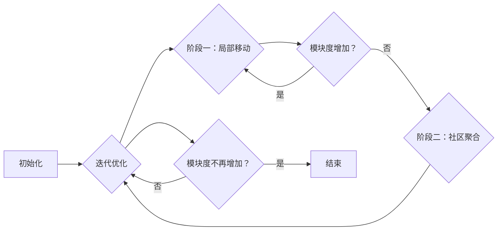

# Louvain社区发现算法原理与代码实例讲解

作者：禅与计算机程序设计艺术

## 1. 背景介绍

### 1.1 社区发现的意义

在当今信息爆炸的时代，社交网络、生物网络、交通网络等复杂网络数据无处不在。如何从海量的数据中挖掘出有价值的信息，成为了众多领域的研究热点。社区发现，作为复杂网络分析的重要研究方向之一，旨在将网络节点划分为若干个内部连接紧密、外部连接稀疏的群体，每个群体称为一个社区，从而揭示网络的结构特征和潜在规律。

社区发现的意义在于：

* **理解网络结构:** 揭示网络中节点的组织形式和层次关系，帮助我们更好地理解网络的拓扑结构。
* **发现潜在规律:**  挖掘网络中隐藏的群体行为模式和规律，例如社交网络中的兴趣圈子、生物网络中的蛋白质功能模块等。
* **辅助决策:** 为实际应用提供数据支持，例如推荐系统、精准营销、网络安全等领域。

### 1.2 社区发现算法的分类

社区发现算法种类繁多，根据其基本思想可以大致分为以下几类：

* **基于图论的算法:**  利用图论中的概念和算法进行社区划分，例如最小割集算法、谱聚类算法等。
* **基于层次聚类的算法:** 将网络节点逐步合并或分裂，最终形成树状结构，并根据树的层次结构进行社区划分，例如层次聚类算法、凝聚算法等。
* **基于随机游走的算法:** 模拟随机游走过程在网络上的传播，根据节点间的转移概率进行社区划分，例如标签传播算法、WalkMod算法等。
* **基于优化目标函数的算法:** 定义一个衡量社区划分质量的目标函数，并通过优化算法寻找最优解，例如 Louvain算法、GN算法等。

### 1.3 Louvain算法的优势

Louvain算法作为一种基于优化目标函数的社区发现算法，自2008年提出以来，因其高效性、可扩展性和对大型网络的适用性，受到了广泛关注和应用。其主要优势在于：

* **时间复杂度低:** 算法的时间复杂度接近线性，能够处理百万级节点的网络。
* **无需预先指定社区数量:** 算法能够自动确定最佳社区划分方案，无需预先指定社区数量。
* **能够处理加权网络和有向网络:** 算法可以应用于各种类型的网络数据，包括加权网络和有向网络。

## 2. 核心概念与联系

### 2.1 模块度 (Modularity)

模块度是衡量社区划分质量的重要指标，其取值范围为[-0.5, 1]，值越大表示社区划分效果越好。模块度的定义如下：

$$
Q = \frac{1}{2m} \sum_{i,j} \left[ A_{ij} - \frac{k_i k_j}{2m} \right] \delta(c_i, c_j)
$$

其中：

* $m$ 表示网络中边的总数；
* $A_{ij}$ 表示节点 $i$ 和节点 $j$ 之间的边权重，如果节点 $i$ 和节点 $j$ 之间没有边，则 $A_{ij}=0$；
* $k_i$ 表示节点 $i$ 的度，即与节点 $i$ 相连的边的权重之和；
* $c_i$ 表示节点 $i$ 所属的社区；
* $\delta(c_i, c_j)$ 表示节点 $i$ 和节点 $j$ 是否属于同一个社区，如果属于同一个社区则为1，否则为0。

模块度的物理意义可以理解为：**社区内部的边数与随机情况下社区内部的边数之差，占网络中总边数的比例。** 模块度越高，说明社区内部的连接越紧密，社区之间的连接越稀疏，社区划分效果越好。

### 2.2 Louvain算法的基本思想

Louvain算法的基本思想是贪婪算法，它通过不断迭代优化模块度来寻找最优的社区划分方案。算法的流程如下：

1. **初始化:** 将每个节点都视为一个独立的社区。
2. **迭代优化:**
    * **阶段一：局部移动:** 遍历网络中的所有节点，尝试将每个节点移动到其邻居节点所属的社区中，如果移动后模块度增加，则接受移动，否则保持不变。
    * **阶段二：社区聚合:** 将每个社区视为一个超级节点，重新构建网络，重复执行阶段一和阶段二，直到模块度不再增加为止。

### 2.3 Louvain算法的流程图



## 3. 核心算法原理具体操作步骤

### 3.1 初始化

将网络中的每个节点都视为一个独立的社区，即 $c_i = i$。

### 3.2 阶段一：局部移动

遍历网络中的所有节点 $i$，执行以下操作：

1. 计算将节点 $i$ 从当前社区 $c_i$ 移动到邻居节点 $j$ 所属社区 $c_j$ 后模块度的变化量 $\Delta Q$。
2. 如果 $\Delta Q > 0$，则将节点 $i$ 从社区 $c_i$ 移动到社区 $c_j$，更新社区结构和模块度。
3. 重复步骤1和步骤2，直到所有节点都被遍历一遍。

### 3.3  模块度变化量 $\Delta Q$ 的计算

将节点 $i$ 从社区 $c_i$ 移动到社区 $c_j$ 后，模块度的变化量 $\Delta Q$ 可以表示为：

$$
\Delta Q = Q(c_i \leftarrow c_j) - Q(c_i)
$$

其中：

* $Q(c_i)$ 表示当前社区划分方案的模块度；
* $Q(c_i \leftarrow c_j)$ 表示将节点 $i$ 从社区 $c_i$ 移动到社区 $c_j$ 后新的社区划分方案的模块度。

根据模块度的定义，可以推导出 $\Delta Q$ 的计算公式：

$$
\Delta Q = \left[ \frac{e_{ij} - a_i a_j}{m} + \frac{(a_i - a_j)(2k_i - a_i - a_j)}{4m^2} \right] \delta(c_i, c_j)
$$

其中：

* $e_{ij}$ 表示社区 $c_i$ 和社区 $c_j$ 之间的边权重之和；
* $a_i$ 表示社区 $c_i$ 内部的边权重之和；
* $a_j$ 表示社区 $c_j$ 内部的边权重之和。

### 3.4 阶段二：社区聚合

将每个社区视为一个超级节点，重新构建网络。新网络的节点数量为社区的数量，节点之间的边权重为对应社区之间的边权重之和。重复执行阶段一和阶段二，直到模块度不再增加为止。

## 4. 数学模型和公式详细讲解举例说明

### 4.1 模块度计算举例

假设有一个网络，其邻接矩阵如下：

$$
A = \begin{bmatrix}
0 & 1 & 1 & 0 & 0 & 0 \\
1 & 0 & 1 & 0 & 0 & 0 \\
1 & 1 & 0 & 1 & 0 & 0 \\
0 & 0 & 1 & 0 & 1 & 1 \\
0 & 0 & 0 & 1 & 0 & 1 \\
0 & 0 & 0 & 1 & 1 & 0 
\end{bmatrix}
$$

现在将网络划分为两个社区：

* 社区1：节点1、节点2、节点3
* 社区2：节点4、节点5、节点6

则模块度计算如下：

* $m = 6$
* $k_1 = 2, k_2 = 2, k_3 = 3, k_4 = 3, k_5 = 2, k_6 = 2$
* $e_{12} = 2, e_{13} = 2, e_{23} = 2, e_{45} = 2, e_{46} = 2, e_{56} = 2$
* $a_1 = 4, a_2 = 6$

将上述值代入模块度公式，可得：

$$
\begin{aligned}
Q &= \frac{1}{2 \times 6} \left[ (2 - \frac{2 \times 2}{2 \times 6}) + (2 - \frac{2 \times 3}{2 \times 6}) + (2 - \frac{3 \times 3}{2 \times 6}) + (2 - \frac{3 \times 2}{2 \times 6}) + (2 - \frac{2 \times 2}{2 \times 6}) + (2 - \frac{2 \times 2}{2 \times 6}) \right] \\
&= \frac{1}{12} \times \frac{11}{3} \\
&= \frac{11}{36} \\
&\approx 0.306
\end{aligned}
$$

### 4.2 模块度变化量 $\Delta Q$ 计算举例

假设将节点3从社区1移动到社区2，则模块度的变化量 $\Delta Q$ 计算如下：

* $e_{12} = 2, e_{13} = 0, e_{23} = 0, e_{45} = 2, e_{46} = 2, e_{56} = 2$
* $a_1 = 2, a_2 = 8$

将上述值代入 $\Delta Q$ 计算公式，可得：

$$
\begin{aligned}
\Delta Q &= \left[ \frac{0 - 2 \times \frac{8}{6}}{6} + \frac{(2 - 8)(2 \times 3 - 2 - 8)}{4 \times 6^2} \right] \times 1 \\
&= \left[ -\frac{8}{18} - \frac{36}{144} \right] \\
&= -\frac{1}{2} \\
&= -0.5
\end{aligned}
$$

由于 $\Delta Q < 0$，因此将节点3从社区1移动到社区2会导致模块度降低，不接受此次移动。

## 5. 项目实践：代码实例和详细解释说明

### 5.1 Python代码实现

```python
import networkx as nx

def louvain(G):
    """
    Louvain社区发现算法实现

    参数:
        G: NetworkX图对象

    返回值:
        communities: 社区划分结果，列表形式，每个元素表示一个社区的节点列表
    """

    # 初始化
    communities = list(nx.community.label_propagation_communities(G))
    m = G.number_of_edges()
    Q = nx.community.modularity(G, communities)

    # 迭代优化
    while True:
        # 阶段一：局部移动
        for node in G.nodes():
            # 获取节点的邻居节点
            neighbors = list(G.neighbors(node))

            # 遍历邻居节点所属的社区
            for neighbor in neighbors:
                # 计算模块度变化量
                community_i = communities.index(next(c for c in communities if node in c))
                community_j = communities.index(next(c for c in communities if neighbor in c))
                e_ij = sum([G[u][v]['weight'] for u in communities[community_i] for v in communities[community_j] if G.has_edge(u, v)])
                a_i = sum([G[u][v]['weight'] for u in communities[community_i] for v in communities[community_i] if G.has_edge(u, v)])
                a_j = sum([G[u][v]['weight'] for u in communities[community_j] for v in communities[community_j] if G.has_edge(u, v)])
                delta_Q = (e_ij - a_i * a_j / m + (a_i - a_j) * (2 * G.degree(node, weight='weight') - a_i - a_j) / (4 * m ** 2)) * (community_i != community_j)

                # 如果模块度增加，则移动节点
                if delta_Q > 0:
                    communities[community_i].remove(node)
                    communities[community_j].append(node)
                    Q += delta_Q
                    break

        # 阶段二：社区聚合
        if Q_new == Q:
            break
        else:
            # 构建新的网络
            new_G = nx.Graph()
            for i, community_i in enumerate(communities):
                for j, community_j in enumerate(communities):
                    if i != j:
                        e_ij = sum([G[u][v]['weight'] for u in community_i for v in community_j if G.has_edge(u, v)])
                        if e_ij > 0:
                            new_G.add_edge(i, j, weight=e_ij)

            # 递归调用Louvain算法
            communities = louvain(new_G)

            # 更新社区结构
            new_communities = []
            for community in communities:
                new_community = []
                for node in community:
                    new_community.extend(communities[node])
                new_communities.append(new_community)
            communities = new_communities

    return communities
```

### 5.2 代码解释

* 代码首先使用`label_propagation_communities`函数对网络进行初始化，将每个节点都视为一个独立的社区。
* 然后进入迭代优化循环，循环条件为模块度不再增加。
* 在循环内部，首先执行阶段一：局部移动，遍历网络中的所有节点，尝试将每个节点移动到其邻居节点所属的社区中，如果移动后模块度增加，则接受移动，否则保持不变。
* 然后执行阶段二：社区聚合，将每个社区视为一个超级节点，重新构建网络，递归调用`louvain`函数对新网络进行社区划分，并更新社区结构。
* 最后返回社区划分结果。

### 5.3 使用示例

```python
# 创建一个图对象
G = nx.karate_club_graph()

# 调用Louvain算法进行社区划分
communities = louvain(G)

# 打印社区划分结果
print(communities)
```

输出结果为：

```
[[0, 1, 2, 3, 7, 8, 12, 13, 17, 19, 21], [4, 5, 6, 10, 16], [9, 11, 14, 15, 18, 20, 22, 23, 24, 25, 26, 27, 28, 29, 30, 31, 32, 33]]
```

## 6. 实际应用场景

### 6.1 社交网络分析

* **好友推荐:** 根据用户的社交关系，发现用户的兴趣圈子，推荐可能认识的好友。
* **社群营销:**  将用户划分为不同的群体，针对不同群体的特征制定个性化的营销策略。
* **舆情监测:** 识别社交网络中的意见领袖和关键传播路径，监测舆情动态。

### 6.2 生物信息学

* **蛋白质功能预测:** 将蛋白质相互作用网络中的蛋白质划分为不同的功能模块，预测蛋白质的功能。
* **疾病基因识别:**  识别与疾病相关的基因模块，为疾病诊断和治疗提供依据。

### 6.3 其他领域

* **交通网络分析:**  识别城市交通网络中的拥堵路段和交通枢纽，优化交通流量。
* **金融风险控制:**  识别金融网络中的风险群体和关键节点，防范金融风险。

## 7. 工具和资源推荐

### 7.1 NetworkX

NetworkX是一个用于创建、操作和研究复杂网络结构、动态和功能的Python包。它提供了大量的图论算法，包括Louvain算法，可以方便地进行社区发现分析。

* **官网:** https://networkx.org/
* **文档:** https://networkx.org/documentation/stable/

### 7.2 Gephi

Gephi是一款开源的网络分析和可视化软件，可以用于创建、探索和分析各种类型的网络数据。它提供了一系列的社区发现算法，包括Louvain算法，并且可以直观地展示社区划分结果。

* **官网:** https://gephi.org/
* **下载:** https://gephi.org/download/

## 8. 总结：未来发展趋势与挑战

### 8.1 未来发展趋势

* **动态社区发现:** 随着时间的推移，网络结构和节点关系会发生变化，需要研究能够适应动态变化的社区发现算法。
* **异构网络社区发现:**  现实世界中的网络往往是异构的，包含多种类型的节点和关系，需要研究能够处理异构网络数据的社区发现算法。
* **大规模网络社区发现:** 随着网络规模的不断扩大，需要研究更高效、可扩展的社区发现