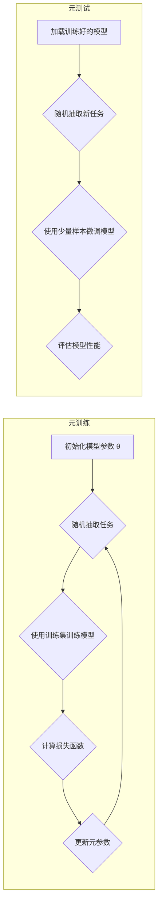

# MAML原理与代码实例讲解

作者：禅与计算机程序设计艺术

## 1. 背景介绍

### 1.1 元学习与少样本学习

机器学习的终极目标是让机器具备像人类一样学习的能力。近年来，深度学习的兴起使得机器学习在图像识别、语音识别、自然语言处理等领域取得了突破性进展。然而，传统的深度学习方法通常需要大量的标注数据才能训练出泛化能力强的模型。在许多实际应用场景中，例如医疗诊断、个性化推荐等，获取大量的标注数据往往非常困难且成本高昂。

为了解决这一问题，**元学习(Meta-Learning)**应运而生。元学习的目标是让机器学会如何学习，即从少量样本中快速学习新的概念和技能。**少样本学习(Few-shot Learning)**是元学习的一个重要分支，其目标是在只有少量标注样本的情况下训练出泛化能力强的模型。

### 1.2 MAML的提出

**模型无关元学习(Model-Agnostic Meta-Learning, MAML)**是由Chelsea Finn等人在2017年提出的一种元学习算法。MAML是一种基于梯度的元学习算法，其核心思想是找到一个对于任务分布敏感的模型初始化参数，使得模型能够在面对新的任务时，只需少量样本和少量梯度更新步骤就能快速适应。

## 2. 核心概念与联系

### 2.1 任务分布与元训练集

MAML的核心概念是**任务分布(Task Distribution)**。任务分布指的是一组相似但不同的任务的集合。例如，在图像分类领域，一个任务可以是识别不同品种的狗，而任务分布则可以是所有动物品种的图像分类任务。

MAML的训练数据被称为**元训练集(Meta-training set)**。元训练集由多个任务组成，每个任务包含少量的标注样本。例如，一个元训练集可以包含1000个任务，每个任务包含5个标注样本。

### 2.2 模型参数与元参数

MAML中有两种参数：

* **模型参数(Model parameters)**：指的是模型本身的参数，例如神经网络的权重和偏置。
* **元参数(Meta-parameters)**：指的是控制模型学习过程的参数，例如学习率、优化器参数等。

MAML的目标是学习一个良好的元参数，使得模型能够在面对新的任务时，通过少量样本和少量梯度更新步骤就能快速适应。

### 2.3 元训练与元测试

MAML的训练过程分为两个阶段：

* **元训练(Meta-training)**：在元训练阶段，MAML使用元训练集来学习元参数。具体来说，MAML会从任务分布中随机抽取一个任务，然后使用该任务中的少量样本对模型参数进行训练。训练完成后，MAML会计算模型在该任务上的损失函数，并使用该损失函数对元参数进行更新。
* **元测试(Meta-testing)**：在元测试阶段，MAML使用一个新的任务来评估模型的泛化能力。具体来说，MAML会从任务分布中随机抽取一个新的任务，然后使用该任务中的少量样本对模型参数进行微调。微调完成后，MAML会计算模型在该任务上的性能指标，例如准确率、F1值等。

## 3. 核心算法原理具体操作步骤

### 3.1 MAML算法流程

MAML算法的具体流程如下：

1. 初始化模型参数 $\theta$ 和元参数 $\alpha$。
2. **for** 每个epoch：
    * **for** 每个batch：
        * 从任务分布中随机抽取一批任务 $T_i$。
        * **for** 每个任务 $T_i$：
            * 从任务 $T_i$ 中随机抽取少量样本 $D_i^{train}$ 作为训练集。
            * 使用训练集 $D_i^{train}$ 对模型参数 $\theta$ 进行训练，得到更新后的模型参数 $\theta_i'$。
            * 从任务 $T_i$ 中随机抽取少量样本 $D_i^{test}$ 作为测试集。
            * 使用测试集 $D_i^{test}$ 计算模型在更新后的参数 $\theta_i'$ 下的损失函数 $L_{T_i}(\theta_i')$。
        * 计算所有任务的平均损失函数 $\frac{1}{|T|}\sum_{i=1}^{|T|}L_{T_i}(\theta_i')$。
        * 使用平均损失函数对元参数 $\alpha$ 进行更新。
3. 返回最终的模型参数 $\theta$。

### 3.2 MAML算法图解



## 4. 数学模型和公式详细讲解举例说明

### 4.1 模型参数更新

在MAML中，模型参数的更新方式与传统的梯度下降算法类似，都是使用损失函数的梯度来更新参数。不同的是，MAML在计算梯度时，会考虑模型参数在多个任务上的表现。

具体来说，对于任务 $T_i$，MAML会先使用训练集 $D_i^{train}$ 对模型参数 $\theta$ 进行一次梯度更新，得到更新后的模型参数 $\theta_i'$：

$$
\theta_i' = \theta - \alpha \nabla_{\theta} L_{T_i}(\theta)
$$

其中，$\alpha$ 是学习率，$L_{T_i}(\theta)$ 是模型在任务 $T_i$ 上的损失函数。

### 4.2 元参数更新

在计算出所有任务的平均损失函数后，MAML会使用该损失函数对元参数 $\alpha$ 进行更新。元参数的更新方式可以使用任何梯度下降算法，例如随机梯度下降(SGD)、Adam等。

以SGD为例，元参数的更新公式如下：

$$
\alpha = \alpha - \beta \nabla_{\alpha} \frac{1}{|T|}\sum_{i=1}^{|T|}L_{T_i}(\theta_i')
$$

其中，$\beta$ 是元学习率。

## 5. 项目实践：代码实例和详细解释说明

### 5.1 代码实例

```python
import torch
import torch.nn as nn
import torch.optim as optim

class MAML(nn.Module):
    def __init__(self, model, inner_lr, meta_lr):
        super(MAML, self).__init__()
        self.model = model
        self.inner_lr = inner_lr
        self.meta_lr = meta_lr
        self.meta_optimizer = optim.Adam(self.model.parameters(), lr=self.meta_lr)

    def forward(self, x_spt, y_spt, x_qry, y_qry):
        """
        Args:
            x_spt: support set images
            y_spt: support set labels
            x_qry: query set images
            y_qry: query set labels
        """
        task_num, _, _, _, = x_spt.size()
        querysz = x_qry.size(1)

        losses_q = [0 for _ in range(task_num)]
        corrects = [0 for _ in range(task_num)]

        for i in range(task_num):
            # 1. run the i-th task and compute loss for k=0
            logits = self.model(x_spt[i])
            loss = F.cross_entropy(logits, y_spt[i])
            grad = torch.autograd.grad(loss, self.model.parameters())
            fast_weights = list(map(lambda p: p[1] - self.inner_lr * p[0], zip(grad, self.model.parameters())))

            # this is the loss and accuracy after the first update
            with torch.no_grad():
                logits_q = self.model(x_qry[i], fast_weights)
                loss_q = F.cross_entropy(logits_q, y_qry[i])
                losses_q[i] += loss_q

            # this is the loss and accuracy after the second update
            logits = self.model(x_spt[i], fast_weights)
            loss = F.cross_entropy(logits, y_spt[i])
            grad = torch.autograd.grad(loss, fast_weights)
            fast_weights = list(map(lambda p: p[1] - self.inner_lr * p[0], zip(grad, fast_weights)))

            logits_q = self.model(x_qry[i], fast_weights)
            loss_q = F.cross_entropy(logits_q, y_qry[i])
            losses_q[i] += loss_q

        # end of all tasks
        # sum up all the losses on query set across all tasks
        loss_q = losses_q[-1] / task_num

        # optimize theta parameters
        self.meta_optimizer.zero_grad()
        loss_q.backward()
        self.meta_optimizer.step()

        return losses_q

```

### 5.2 代码解释

* `__init__` 函数：初始化 MAML 模型，包括内部学习率、元学习率和元优化器。
* `forward` 函数：定义了 MAML 的前向传播过程，包括：
    * 遍历每个任务，并计算每个任务的损失函数。
    * 使用每个任务的损失函数计算元梯度。
    * 使用元梯度更新元参数。
* `inner_loop` 函数：执行内部循环，即使用支持集数据更新模型参数。
* `outer_loop` 函数：执行外部循环，即使用查询集数据计算元梯度并更新元参数。

## 6. 实际应用场景

MAML 已经在多个领域取得了成功，包括：

* **少样本图像分类**：MAML 可以用于训练能够从少量样本中学习新类别的图像分类器。
* **强化学习**：MAML 可以用于训练能够快速适应新环境的强化学习代理。
* **机器人控制**：MAML 可以用于训练能够快速学习新技能的机器人。
* **自然语言处理**：MAML 可以用于训练能够快速适应新领域或新语言的自然语言处理模型。

## 7. 总结：未来发展趋势与挑战

MAML 是一种非常有前景的元学习算法，它为解决少样本学习问题提供了一种新的思路。未来，MAML 的发展趋势和挑战包括：

* **提高 MAML 的效率**：MAML 的训练过程比较耗时，如何提高 MAML 的训练效率是一个重要的研究方向。
* **扩展 MAML 到更复杂的场景**：MAML 目前主要应用于少样本学习场景，如何将 MAML 扩展到更复杂的场景，例如多任务学习、持续学习等，是一个值得探索的方向。
* **探索 MAML 的理论基础**：MAML 的理论基础还有待进一步研究，例如 MAML 为什么能够找到对于任务分布敏感的模型初始化参数。

## 8. 附录：常见问题与解答

### 8.1 MAML与预训练模型的区别

MAML 和预训练模型都是为了解决少样本学习问题而提出的方法，但它们之间存在一些区别：

* **目标不同**：MAML 的目标是找到一个对于任务分布敏感的模型初始化参数，使得模型能够在面对新的任务时，只需少量样本和少量梯度更新步骤就能快速适应。而预训练模型的目标是学习一个能够在多个任务上表现良好的模型，然后将该模型迁移到新的任务上。
* **训练数据不同**：MAML 的训练数据是元训练集，元训练集由多个任务组成，每个任务包含少量的标注样本。而预训练模型的训练数据通常是大量的标注数据，例如 ImageNet 数据集。
* **训练方式不同**：MAML 的训练方式是元训练，元训练分为两个阶段：内部循环和外部循环。而预训练模型的训练方式通常是传统的监督学习。

### 8.2 MAML的优缺点

**优点：**

* **模型无关性**：MAML 可以应用于任何可微分的模型，例如神经网络、支持向量机等。
* **简单易实现**：MAML 的算法流程比较简单，易于实现。
* **效果显著**：MAML 在多个少样本学习任务上都取得了显著的效果。

**缺点：**

* **训练效率低**：MAML 的训练过程比较耗时，尤其是在处理复杂任务时。
* **对超参数敏感**：MAML 的性能对超参数比较敏感，例如学习率、内部循环次数等。

### 8.3 如何选择 MAML 的超参数

MAML 的超参数选择比较重要，以下是一些经验法则：

* **学习率**：元学习率通常比内部学习率小 1-2 个数量级。
* **内部循环次数**：内部循环次数通常设置为 1-5 次。
* **任务批次大小**：任务批次大小通常设置为 4-32 个任务。

### 8.4 MAML 的未来发展方向

MAML 是一种非常有前景的元学习算法，未来还有很多值得探索的方向，例如：

* **提高 MAML 的效率**：MAML 的训练过程比较耗时，如何提高 MAML 的训练效率是一个重要的研究方向。
* **扩展 MAML 到更复杂的场景**：MAML 目前主要应用于少样本学习场景，如何将 MAML 扩展到更复杂的场景，例如多任务学习、持续学习等，是一个值得探索的方向。
* **探索 MAML 的理论基础**：MAML 的理论基础还有待进一步研究，例如 MAML 为什么能够找到对于任务分布敏感的模型初始化参数。