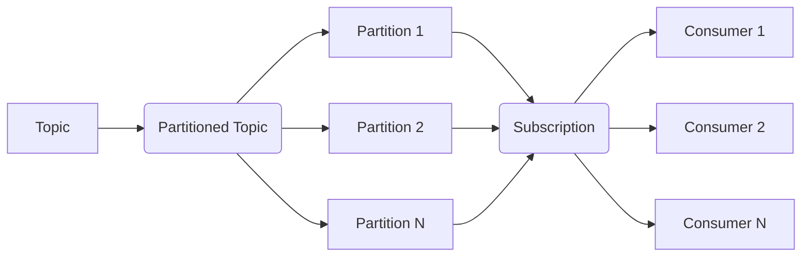

# Pulsar Consumer原理与代码实例讲解

## 1.背景介绍

### 1.1 Apache Pulsar 简介

Apache Pulsar 是一个云原生、分布式的消息流平台,旨在提供无限水平扩展的消息队列功能。它最初由 Yahoo 开发,后来捐赠给 Apache 软件基金会,成为了顶级开源项目。Pulsar 具有以下关键特性:

- 水平扩展
- 多租户
- 高性能
- 持久化存储

Pulsar 的架构设计灵感来自于 Apache BookKeeper,采用了分布式的日志存储机制,并在此基础上构建了一个消息传递系统。

### 1.2 消费者(Consumer)在消息队列中的作用

在消息队列系统中,消费者扮演着从队列或主题中获取消息并进行处理的角色。消费者订阅一个或多个主题,并持续从这些主题中拉取消息,对消息进行相应的业务逻辑处理。

消费者在消息队列系统中至关重要,因为它们是整个系统的"出口"。如果没有消费者,那么生产者产生的消息将永远滞留在队列中,无法被处理。因此,消费者的设计和实现对于整个系统的可靠性、性能和可扩展性至关重要。

## 2.核心概念与联系  

### 2.1 Pulsar Consumer 核心概念

在 Pulsar 中,Consumer 是指订阅某个主题并从中消费消息的客户端。Pulsar Consumer 涉及以下几个核心概念:

1. **Consumer**:消费消息的客户端实例。
2. **Subscription**:一个订阅,标识了一组 Consumer 实例的命名逻辑订阅。
3. **Partitioned Topic**:分区主题,用于提高并行度。
4. **Partitioned Consumer**:订阅分区主题的 Consumer。

这些概念之间的关系如下所示:



### 2.2 Consumer 与其他组件的关系

Consumer 在 Pulsar 系统中与其他组件也有着密切的联系:

- **Producer**: Producer 生产消息,Consumer 消费这些消息。
- **Broker**: Broker 负责存储和路由消息,Consumer 从 Broker 拉取消息。
- **BookKeeper**: BookKeeper 为消息提供持久化存储,Consumer 依赖它来保证消息不丢失。

## 3.核心算法原理具体操作步骤

Pulsar Consumer 的核心算法原理包括以下几个方面:

### 3.1 订阅模式

Pulsar 支持三种订阅模式:

1. **Exclusive**:在该模式下,只有一个 Consumer 实例可以附加到同一个订阅上。如果有新的 Consumer 加入,旧的 Consumer 将被移除。适用于具有高可用性要求的场景。
2. **Shared**:在该模式下,多个 Consumer 实例可以附加到同一个订阅上。消息将被传递到其中一个 Consumer 实例。适用于扩展消费能力的场景。
3. **Failover**:在该模式下,多个 Consumer 实例可以附加到同一个订阅上。不同于 Shared 模式,Failover 模式下,所有消息将被分发到同一个 Consumer 实例。只有当该实例失效时,消息才会分发给其他实例。适用于需要严格顺序的场景。

### 3.2 消费分区主题

当订阅一个分区主题时,Pulsar 会自动为每个分区创建一个 Consumer 实例。这些实例之间不会发生消息复制,从而实现了消费的并行化。

### 3.3 消费位移(Consumer Position)

Consumer Position 用于记录 Consumer 当前消费的位置。Pulsar 会自动为每个 Consumer 实例维护一个位移值,并在消费完消息后自动前进该位移值。

如果 Consumer 失效,Pulsar 可以根据最后的位移值,继续从该位置开始消费消息,从而实现消费的可靠性。

### 3.4 重新复制(Replication)

Pulsar 支持在集群内自动复制消息,以实现消息的高可用性。如果一个 Broker 失效,Consumer 可以从复制的 Broker 继续消费消息。

### 3.5 流控(Flow Control)

为了防止消息被消费过快或过慢,Pulsar 采用了基于许可证的流控机制。Consumer 需要先获取一定数量的许可证,才能从 Broker 拉取消息。这样可以避免消息被消费太快导致 Broker 过载,或者消费太慢导致消息积压。

## 4.数学模型和公式详细讲解举例说明

在 Pulsar 中,消费位移的计算涉及到一些数学模型和公式。我们来详细讲解一下。

假设一个主题有 N 个分区,每个分区有 M 个消息。我们定义以下变量:

- $C$: 消费者数量
- $P_i$: 第 i 个分区,其中 $0 \le i < N$
- $M_i$: 第 i 个分区中的消息数量
- $T_i$: 第 i 个分区的消息总数,即 $T_i = \sum_{j=0}^{M_i-1} M_i[j]$
- $S_k$: 第 k 个消费者,其中 $0 \le k < C$
- $pos(S_k, P_i)$: 消费者 $S_k$ 在分区 $P_i$ 上的消费位移

我们的目标是计算每个消费者在每个分区上的消费位移 $pos(S_k, P_i)$,以便在消费者失效时,新的消费者可以从该位置继续消费。

### 4.1 均匀分配

最简单的分配方式是将消息均匀分配给每个消费者。在这种情况下,我们有:

$$pos(S_k, P_i) = \left\lfloor\frac{k \times T_i}{C}\right\rfloor$$

其中 $\lfloor x \rfloor$ 表示向下取整。这种分配方式虽然简单,但可能会导致消息分布不均匀,从而影响消费的并行度。

### 4.2 一致性哈希分配

为了实现更加均匀的分配,Pulsar 采用了一致性哈希算法。具体来说,Pulsar 会为每个消费者分配一个哈希环上的Token范围。当需要分配消息时,Pulsar 会根据消息的哈希值,将其分配给Token范围覆盖该哈希值的消费者。

设 $hash(x)$ 为哈希函数,我们定义:

- $token(S_k)$: 消费者 $S_k$ 的 Token 范围
- $n$: 环的大小,通常取一个很大的质数,如 $2^{128} + 3$

则消费者 $S_k$ 的 Token 范围为:

$$token(S_k) = \left[\frac{k \times n}{C}, \frac{(k+1) \times n}{C}\right)$$

对于一条消息 $m$,它将被分配给满足以下条件的消费者 $S_k$:

$$\begin{align*}
k &= \arg\min_{0 \le j < C} \{hash(m) - token(S_j)\} \\
  &\text{其中} \quad token(S_j) \le hash(m) < token(S_{j+1})
\end{align*}$$

这种分配方式可以保证消息在消费者之间的分布更加均匀,从而提高并行度。

### 4.3 延迟队列模型

在某些场景下,我们需要延迟消费消息,即消息在被发送到消费者之前需要等待一段时间。Pulsar 通过延迟队列模型来实现这一功能。

假设我们有一条消息 $m$,它需要在时间 $t_0 + \Delta t$ 之后才能被消费,其中 $t_0$ 是消息的发送时间,$ \Delta t$ 是延迟时间。我们定义:

- $b$: 时间桶(Time Bucket)的大小,即两个相邻时间桶之间的时间间隔
- $i$: 时间桶的编号,满足 $i = \left\lfloor\frac{\Delta t}{b}\right\rfloor$
- $Q_i$: 第 i 个时间桶对应的延迟队列

那么,消息 $m$ 将被放入队列 $Q_i$。当时间达到 $t_0 + i \times b$ 时,队列 $Q_i$ 中的所有消息将被移动到普通的消费队列中,等待被消费。

通过这种延迟队列模型,Pulsar 可以很好地支持延迟消费的需求。

## 4.项目实践:代码实例和详细解释说明

接下来,我们通过一个实际的代码示例,来演示如何使用 Pulsar Consumer。

### 4.1 创建 Consumer

```java
PulsarClient client = PulsarClient.builder()
        .serviceUrl("pulsar://localhost:6650")
        .build();

Consumer<byte[]> consumer = client.newConsumer()
        .topic("my-topic")
        .subscriptionName("my-subscription")
        .subscribe();
```

在这个示例中,我们首先创建了一个 `PulsarClient` 实例,并指定了 Pulsar 集群的服务地址。然后,我们使用 `PulsarClient` 创建了一个 `Consumer` 实例,指定了要订阅的主题名称和订阅名称。

### 4.2 消费消息

```java
while (true) {
    // 从主题中获取消息
    Message<byte[]> msg = consumer.receive();

    // 处理消息
    try {
        System.out.printf("Received message: %s\n", new String(msg.getData()));

        // 确认消息已被成功处理
        consumer.acknowledge(msg);
    } catch (Exception e) {
        // 消息处理失败,重新发送消息
        consumer.negativeAcknowledge(msg);
    }
}
```

在这个示例中,我们使用一个无限循环来持续从主题中获取消息。每次获取到一条消息后,我们会打印出消息内容,并调用 `consumer.acknowledge(msg)` 确认该消息已被成功处理。

如果在处理消息的过程中发生了异常,我们可以调用 `consumer.negativeAcknowledge(msg)` 将该消息重新发送到队列中,等待下次被消费。

### 4.3 关闭 Consumer

```java
// 关闭 Consumer 并执行清理工作
consumer.close();

// 关闭 PulsarClient
client.close();
```

在程序退出之前,我们需要调用 `consumer.close()` 和 `client.close()` 来正确关闭 Consumer 和 PulsarClient,并执行必要的清理工作。

## 5.实际应用场景

Pulsar Consumer 在许多实际应用场景中发挥着重要作用,例如:

1. **数据管道(Data Pipeline)**: 在构建数据管道时,Pulsar 可以作为可靠的消息传输通道,Consumer 负责从 Pulsar 中获取数据,并将其传输到下游系统进行进一步处理。

2. **异步任务处理**: 在需要异步处理任务的场景下,我们可以将任务封装为消息,并发送到 Pulsar 中。Consumer 则负责从 Pulsar 中获取这些任务,并执行相应的处理逻辑。

3. **事件驱动架构**: 在事件驱动架构中,各个组件通过发送和消费事件进行通信。Pulsar 可以作为事件总线,Consumer 负责从 Pulsar 中获取事件,并触发相应的业务逻辑。

4. **物联网(IoT)数据收集**: 在物联网场景中,大量的传感器设备会不断产生数据。Pulsar 可以作为这些数据的中央集线器,Consumer 则负责从 Pulsar 中获取这些数据,并进行存储和分析。

5. **日志收集和处理**: 我们可以将应用程序的日志作为消息发送到 Pulsar 中。Consumer 则负责从 Pulsar 中获取这些日志,并进行集中式的日志处理和分析。

## 6.工具和资源推荐

在使用 Pulsar Consumer 时,以下工具和资源可能会对您有所帮助:

1. **Pulsar 官方文档**: Pulsar 的官方文档(https://pulsar.apache.org/docs/en/next/concepts-overview/) 提供了详细的概念介绍、架构设计和使用指南。

2. **Pulsar Client Libraries**: Pulsar 提供了多种语言的客户端库,如 Java、Python、Go 等,方便您在不同的编程语言中使用 Pulsar。

3. **Pulsar Manager**: Pulsar Manager(https://github.com/apache/pul