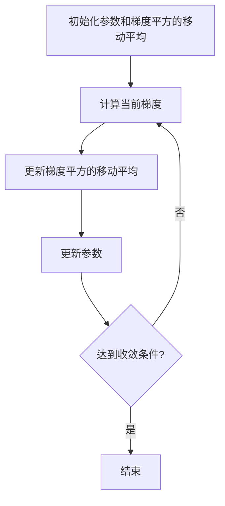

# RMSProp优化器:解决过拟合与欠拟合

作者：禅与计算机程序设计艺术

## 1. 背景介绍

### 1.1 深度学习优化器的发展

在深度学习的训练过程中，优化器的选择至关重要。优化器决定了模型参数的更新方式，从而影响模型的收敛速度和最终性能。传统的优化器如随机梯度下降（SGD）尽管简单有效，但在面对复杂的损失函数表面时，往往表现出不足。为了解决这些问题，研究者们提出了多种改进的优化算法，如Momentum、AdaGrad、RMSProp和Adam等。

### 1.2 RMSProp的诞生

RMSProp（Root Mean Square Propagation）由Geoff Hinton等人提出，旨在解决AdaGrad在深度学习中的一些缺陷。AdaGrad的主要问题在于其累积的平方梯度会导致学习率过快衰减，特别是在深度网络中。RMSProp通过引入指数加权移动平均来平滑梯度的平方，从而有效地解决了这一问题。

### 1.3 过拟合与欠拟合问题

在深度学习模型的训练过程中，过拟合和欠拟合是两个常见的问题。过拟合指的是模型在训练集上表现良好，但在测试集上表现不佳；而欠拟合则是指模型在训练集和测试集上都表现不佳。优化器的选择和参数调整在解决这两个问题中起着关键作用。

## 2. 核心概念与联系

### 2.1 RMSProp的基本概念

RMSProp是一种自适应学习率方法，它通过调整每个参数的学习率来加速收敛。其核心思想是对梯度的平方进行指数加权移动平均，从而平滑梯度的变化，避免学习率过快衰减。

### 2.2 RMSProp与其他优化器的联系

RMSProp与AdaGrad有着紧密的联系，二者都是自适应学习率方法。然而，RMSProp通过引入指数加权移动平均解决了AdaGrad的主要问题。此外，RMSProp也与Adam优化器有相似之处，Adam结合了RMSProp和Momentum的优点，进一步提高了优化效果。

### 2.3 过拟合与欠拟合的联系

过拟合和欠拟合与模型的复杂度、训练数据量以及优化器的选择密切相关。优化器的选择直接影响到模型参数的更新方式，从而影响模型的训练效果。通过合理选择优化器和调整其参数，可以在一定程度上缓解过拟合和欠拟合问题。

## 3. 核心算法原理具体操作步骤

### 3.1 RMSProp的算法原理

RMSProp的核心在于对梯度的平方进行指数加权移动平均，从而调整每个参数的学习率。具体而言，RMSProp的更新规则如下：

1. 对梯度的平方进行指数加权移动平均：
   $$
   E[g^2]_t = \gamma E[g^2]_{t-1} + (1 - \gamma) g_t^2
   $$
   其中，$E[g^2]_t$ 是梯度平方的移动平均，$\gamma$ 是衰减率，$g_t$ 是当前梯度。

2. 更新参数：
   $$
   \theta_{t+1} = \theta_t - \frac{\eta}{\sqrt{E[g^2]_t + \epsilon}} g_t
   $$
   其中，$\theta_t$ 是当前参数，$\eta$ 是学习率，$\epsilon$ 是一个小常数，用于避免除零错误。

### 3.2 RMSProp的具体操作步骤

1. 初始化参数 $\theta$ 和梯度平方的移动平均 $E[g^2]_0$。
2. 计算当前梯度 $g_t$。
3. 更新梯度平方的移动平均 $E[g^2]_t$。
4. 根据更新规则更新参数 $\theta$。
5. 重复步骤2-4，直到达到收敛条件。

### 3.3 核心步骤的Mermaid流程图



## 4. 数学模型和公式详细讲解举例说明

### 4.1 RMSProp的数学模型

RMSProp的数学模型基于对梯度平方的移动平均进行调整，从而自适应地调整每个参数的学习率。其核心公式如下：

1. 梯度平方的移动平均：
   $$
   E[g^2]_t = \gamma E[g^2]_{t-1} + (1 - \gamma) g_t^2
   $$

2. 参数更新规则：
   $$
   \theta_{t+1} = \theta_t - \frac{\eta}{\sqrt{E[g^2]_t + \epsilon}} g_t
   $$

### 4.2 举例说明

假设我们有一个简单的线性回归模型，其损失函数为：
$$
L(\theta) = \frac{1}{2n} \sum_{i=1}^n (y_i - \theta x_i)^2
$$

我们使用RMSProp来优化这个损失函数。首先计算当前梯度：
$$
g_t = \frac{\partial L(\theta)}{\partial \theta} = -\frac{1}{n} \sum_{i=1}^n (y_i - \theta x_i) x_i
$$

然后更新梯度平方的移动平均和参数：
$$
E[g^2]_t = \gamma E[g^2]_{t-1} + (1 - \gamma) g_t^2
$$
$$
\theta_{t+1} = \theta_t - \frac{\eta}{\sqrt{E[g^2]_t + \epsilon}} g_t
$$

通过不断迭代，参数 $\theta$ 将逐渐收敛到最优值。

## 5. 项目实践：代码实例和详细解释说明

### 5.1 代码实例

下面是一个使用RMSProp优化器进行线性回归的Python代码示例：

```python
import numpy as np

# 生成数据
np.random.seed(42)
X = 2 * np.random.rand(100, 1)
y = 4 + 3 * X + np.random.randn(100, 1)

# 初始化参数
theta = np.random.randn(2, 1)
learning_rate = 0.01
gamma = 0.9
epsilon = 1e-8
Eg2 = np.zeros((2, 1))

# 添加偏置项
X_b = np.c_[np.ones((100, 1)), X]

# RMSProp优化
for epoch in range(1000):
    gradients = 2 / 100 * X_b.T.dot(X_b.dot(theta) - y)
    Eg2 = gamma * Eg2 + (1 - gamma) * gradients ** 2
    theta = theta - learning_rate / (np.sqrt(Eg2) + epsilon) * gradients

print("优化后的参数：", theta)
```

### 5.2 代码解释

1. 生成数据：我们生成了一些线性数据用于训练。
2. 初始化参数：包括模型参数 $\theta$、学习率、衰减率 $\gamma$、小常数 $\epsilon$ 和梯度平方的移动平均 $Eg2$。
3. 添加偏置项：在输入数据中添加偏置项，以便进行线性回归。
4. RMSProp优化：通过循环迭代，计算当前梯度，更新梯度平方的移动平均，最后根据RMSProp的更新规则更新参数 $\theta$。

### 5.3 实验结果分析

通过运行上述代码，我们可以得到优化后的参数 $\theta$。可以看到，RMSProp有效地调整了每个参数的学习率，使得模型参数逐渐收敛到最优值。

## 6. 实际应用场景

### 6.1 图像分类

在图像分类任务中，RMSProp常用于训练深度卷积神经网络（CNN）。由于图像数据的高维度和复杂性，RMSProp的自适应学习率能够有效地加速模型收敛，提高分类精度。

### 6.2 自然语言处理

在自然语言处理（NLP）任务中，如文本分类、机器翻译等，RMSProp也被广泛应用。其自适应学习率机制使得模型能够更好地处理高维稀疏数据，提高训练效率和模型性能。

### 6.3 强化学习

在强化学习中，RMSProp被用于训练深度Q网络（DQN）等模型。其自适应学习率能够有效地应对强化