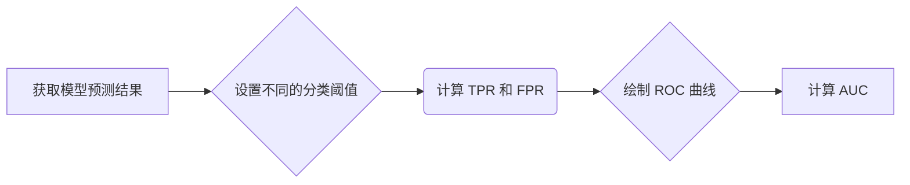

##  ROC Curve 原理与代码实战案例讲解

作者：禅与计算机程序设计艺术

## 1. 背景介绍

### 1.1 什么是机器学习模型评估？

在机器学习领域，模型评估是模型开发过程中至关重要的一环。它帮助我们了解模型的性能，以便进行模型选择、参数调优以及最终部署到生产环境。一个好的模型评估体系应该能够准确地反映模型在实际应用中的表现，并提供可解释的结果以指导模型改进。

### 1.2 为什么需要 ROC 曲线？

**准确率（Accuracy）** 是最直观的模型评估指标之一，但它在某些情况下可能存在误导性。例如，当 dealing with imbalanced datasets 时，即使模型将大多数样本预测为多数类，也能获得较高的准确率，但它可能无法很好地识别少数类样本。

为了解决这个问题，我们需要更全面的评估指标。**ROC (Receiver Operating Characteristic) 曲线** 就是其中一种强大的工具，它能够：

* **全面地评估模型在不同分类阈值下的性能**。
* **有效地处理数据不平衡问题**。
* **直观地比较不同模型的分类性能**。


## 2. 核心概念与联系

### 2.1 混淆矩阵

在介绍 ROC 曲线之前，我们先来回顾一下 **混淆矩阵（Confusion Matrix）**。混淆矩阵是用于可视化分类模型预测结果的表格，它将样本分为以下四类：

* **真正例（True Positive, TP）：** 模型预测为正例，实际也为正例的样本。
* **假正例（False Positive, FP）：** 模型预测为正例，实际为负例的样本。
* **真负例（True Negative, TN）：** 模型预测为负例，实际也为负例的样本。
* **假负例（False Negative, FN）：** 模型预测为负例，实际为正例的样本。

| 预测\实际 | 正例 | 负例 |
|---|---|---|
| 正例 | TP | FP |
| 负例 | FN | TN |

### 2.2 ROC 曲线相关指标

基于混淆矩阵，我们可以定义以下几个重要的指标：

* **真正例率（True Positive Rate, TPR）或灵敏度（Sensitivity）：**  $TPR = \frac{TP}{TP + FN}$，表示模型正确预测正例的比例。
* **假正例率（False Positive Rate, FPR）**: $FPR = \frac{FP}{FP + TN}$，表示模型错误地将负例预测为正例的比例。

**ROC 曲线** 就是以 FPR 为横坐标，TPR 为纵坐标绘制的曲线。

### 2.3 AUC (Area Under the Curve)

**AUC (Area Under the Curve)** 是 ROC 曲线下的面积，它是一个数值，用于衡量模型的整体分类性能。AUC 的取值范围在 0 到 1 之间，AUC 越大，表示模型的分类性能越好。

## 3. 核心算法原理具体操作步骤

### 3.1 绘制 ROC 曲线步骤

绘制 ROC 曲线的步骤如下：

1. **获取模型预测结果：**  对测试集中的每个样本，模型会输出一个预测概率或得分，表示该样本属于正例的可能性。
2. **设置不同的分类阈值：** 从 0 到 1 遍历不同的分类阈值。
3. **计算 TPR 和 FPR：**  对于每个阈值，根据模型预测结果和真实标签，计算对应的 TPR 和 FPR。
4. **绘制 ROC 曲线：** 以 FPR 为横坐标，TPR 为纵坐标，将不同阈值对应的 (FPR, TPR) 点绘制在坐标系中，并连接这些点，就得到了 ROC 曲线。

### 3.2 计算 AUC 的方法

计算 AUC 的方法主要有两种：

* **梯形法：** 将 ROC 曲线下的区域分割成多个梯形，然后计算所有梯形的面积之和，即可得到 AUC 的近似值。
* **非参数估计法：**  例如 Mann-Whitney U 统计量，它可以用来估计两个样本之间的排序关系，从而计算 AUC。


## 4. 数学模型和公式详细讲解举例说明

### 4.1  二分类问题中的 ROC 曲线

假设我们有一个二分类问题，模型输出的预测概率为 $p$，真实标签为 $y$ (0 表示负例，1 表示正例)。

对于一个给定的分类阈值 $t$，我们可以将样本预测为：

$$
\hat{y} = 
\begin{cases}
1, & p \ge t \\
0, & p < t
\end{cases}
$$

根据混淆矩阵，我们可以计算出 TPR 和 FPR：

$$
TPR(t) = \frac{TP(t)}{TP(t) + FN(t)} = \frac{\sum_{i=1}^{n} I(y_i = 1, p_i \ge t)}{\sum_{i=1}^{n} I(y_i = 1)}
$$

$$
FPR(t) = \frac{FP(t)}{FP(t) + TN(t)} = \frac{\sum_{i=1}^{n} I(y_i = 0, p_i \ge t)}{\sum_{i=1}^{n} I(y_i = 0)}
$$

其中，$I(\cdot)$ 为指示函数，当条件成立时取值为 1，否则取值为 0。

### 4.2 AUC 的计算

#### 4.2.1 梯形法

假设我们选择了 $m$ 个不同的分类阈值，分别为 $t_1, t_2, ..., t_m$，则 AUC 可以近似为：

$$
AUC \approx \frac{1}{2} \sum_{i=1}^{m-1} (FPR(t_{i+1}) - FPR(t_i))(TPR(t_{i+1}) + TPR(t_i))
$$

#### 4.2.2 Mann-Whitney U 统计量

Mann-Whitney U 统计量可以用来计算 AUC，其公式为：

$$
AUC = \frac{U}{n_1 n_2}
$$

其中，$n_1$ 和 $n_2$ 分别表示正例和负例的样本数量，$U$ 是 Mann-Whitney U 统计量，其计算公式为：

$$
U = \sum_{i=1}^{n_1} \sum_{j=1}^{n_2} I(p_i > p_j) + \frac{1}{2} \sum_{i=1}^{n_1} \sum_{j=1}^{n_2} I(p_i = p_j)
$$

### 4.3 举例说明

假设我们有一个二分类模型，对 10 个样本的预测概率和真实标签如下表所示：

| 样本 | 预测概率 | 真实标签 |
|---|---|---|
| 1 | 0.9 | 1 |
| 2 | 0.8 | 1 |
| 3 | 0.7 | 0 |
| 4 | 0.6 | 1 |
| 5 | 0.5 | 0 |
| 6 | 0.4 | 0 |
| 7 | 0.3 | 1 |
| 8 | 0.2 | 0 |
| 9 | 0.1 | 0 |
| 10 | 0.0 | 1 |

我们可以根据上述公式计算不同阈值下的 TPR 和 FPR，并绘制 ROC 曲线：

```python
import numpy as np
import matplotlib.pyplot as plt
from sklearn.metrics import roc_curve, auc

# 模型预测概率和真实标签
y_scores = np.array([0.9, 0.8, 0.7, 0.6, 0.5, 0.4, 0.3, 0.2, 0.1, 0.0])
y_true = np.array([1, 1, 0, 1, 0, 0, 1, 0, 0, 1])

# 计算 ROC 曲线
fpr, tpr, thresholds = roc_curve(y_true, y_scores)

# 计算 AUC
roc_auc = auc(fpr, tpr)

# 绘制 ROC 曲线
plt.plot(fpr, tpr, color='darkorange', lw=2, label='ROC curve (area = %0.2f)' % roc_auc)
plt.plot([0, 1], [0, 1], color='navy', lw=2, linestyle='--')
plt.xlim([0.0, 1.0])
plt.ylim([0.0, 1.05])
plt.xlabel('False Positive Rate')
plt.ylabel('True Positive Rate')
plt.title('Receiver operating characteristic example')
plt.legend(loc="lower right")
plt.show()
```

## 5. 项目实践：代码实例和详细解释说明

### 5.1 Python 代码实现

```python
import numpy as np
import matplotlib.pyplot as plt
from sklearn.datasets import make_classification
from sklearn.linear_model import LogisticRegression
from sklearn.model_selection import train_test_split
from sklearn.metrics import roc_curve, auc

# 生成数据集
X, y = make_classification(n_samples=1000, n_features=2, n_informative=2, n_redundant=0, random_state=42)

# 划分训练集和测试集
X_train, X_test, y_train, y_test = train_test_split(X, y, test_size=0.2, random_state=42)

# 训练逻辑回归模型
model = LogisticRegression()
model.fit(X_train, y_train)

# 预测测试集
y_scores = model.predict_proba(X_test)[:, 1]

# 计算 ROC 曲线
fpr, tpr, thresholds = roc_curve(y_test, y_scores)

# 计算 AUC
roc_auc = auc(fpr, tpr)

# 绘制 ROC 曲线
plt.plot(fpr, tpr, color='darkorange', lw=2, label='ROC curve (area = %0.2f)' % roc_auc)
plt.plot([0, 1], [0, 1], color='navy', lw=2, linestyle='--')
plt.xlim([0.0, 1.0])
plt.ylim([0.0, 1.05])
plt.xlabel('False Positive Rate')
plt.ylabel('True Positive Rate')
plt.title('Receiver operating characteristic example')
plt.legend(loc="lower right")
plt.show()
```

### 5.2 代码解释

1. **导入必要的库：**
    * `numpy` 用于数值计算。
    * `matplotlib.pyplot` 用于绘图。
    * `sklearn.datasets` 用于生成数据集。
    * `sklearn.linear_model` 用于训练逻辑回归模型。
    * `sklearn.model_selection` 用于划分训练集和测试集。
    * `sklearn.metrics` 用于计算 ROC 曲线和 AUC。
2. **生成数据集：**  使用 `make_classification` 函数生成一个二分类数据集。
3. **划分训练集和测试集：** 使用 `train_test_split` 函数将数据集划分为训练集和测试集。
4. **训练逻辑回归模型：** 使用 `LogisticRegression` 类训练一个逻辑回归模型。
5. **预测测试集：** 使用训练好的模型预测测试集的样本属于正例的概率。
6. **计算 ROC 曲线：** 使用 `roc_curve` 函数计算 ROC 曲线。
7. **计算 AUC：** 使用 `auc` 函数计算 AUC。
8. **绘制 ROC 曲线：** 使用 `matplotlib.pyplot` 库绘制 ROC 曲线。

## 6. 实际应用场景

ROC 曲线和 AUC 在很多领域都有广泛的应用，例如：

* **医学诊断：**  评估诊断测试的准确性。
* **信用评分：** 评估信用评分模型的预测能力。
* **垃圾邮件过滤：** 评估垃圾邮件过滤器的效果。
* **异常检测：** 评估异常检测算法的性能。

## 7. 工具和资源推荐

* **Scikit-learn:** Python 中常用的机器学习库，提供了计算 ROC 曲线和 AUC 的函数。
* **StatsModels:** Python 中的统计建模库，也提供了计算 ROC 曲线和 AUC 的函数。
* **ROCR:** R 语言中的 ROC 曲线分析包。


## 8. 总结：未来发展趋势与挑战

ROC 曲线和 AUC 是评估分类模型性能的重要工具，但它们也存在一些局限性：

* **ROC 曲线只能用于二分类问题。** 对于多分类问题，需要使用其他评估指标，例如 micro-average ROC curve 和 macro-average ROC curve。
* **ROC 曲线对样本的成本敏感性不高。**  在某些应用场景中，不同类型的错误（例如，将病人误诊为健康和将健康人误诊为病人）的成本可能不同。在这种情况下，需要使用其他评估指标，例如 cost-sensitive ROC curve。

未来，ROC 曲线和 AUC 的研究方向主要包括：

* **开发更适用于多分类问题的 ROC 曲线变体。**
* **研究如何将样本的成本敏感性纳入 ROC 曲线分析中。**
* **开发更有效的 AUC 计算方法。**

## 9.  附录：常见问题与解答

### 9.1  ROC 曲线与 Precision-Recall 曲线的区别？

Precision-Recall 曲线和 ROC 曲线都是用于评估二分类模型性能的曲线，但它们关注的指标不同：

* **ROC 曲线关注的是 TPR 和 FPR，** 它更关注模型的整体分类性能，即使在数据不平衡的情况下也能提供稳定的评估结果。
* **Precision-Recall 曲线关注的是 Precision 和 Recall，** 它更关注模型在正例上的预测性能，适用于数据不平衡且更关注正例预测的情况。

### 9.2  如何选择合适的分类阈值？

选择合适的分类阈值取决于具体的应用场景和对不同类型错误的容忍度。

* 如果更关注模型的整体分类性能，可以选择使 ROC 曲线下面积 (AUC) 最大的阈值。
* 如果更关注模型在正例上的预测性能，可以选择使 Precision-Recall 曲线下面积最大的阈值。
* 如果对不同类型的错误有不同的容忍度，可以使用 cost-sensitive ROC curve 来选择合适的阈值。


## 10. Mermaid 流程图


