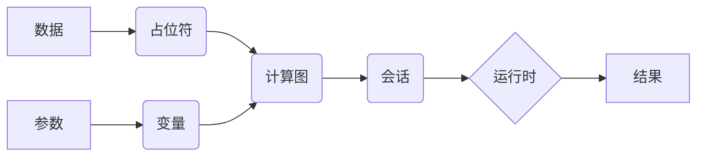

## 1. 背景介绍

### 1.1 人工智能与深度学习的兴起

近年来，人工智能 (AI) 正在以前所未有的速度发展，并逐渐渗透到各个领域。作为人工智能的核心技术之一，深度学习在图像识别、自然语言处理、语音识别等领域取得了突破性进展，极大地推动了人工智能的发展。

### 1.2 深度学习框架的意义

深度学习模型的训练和部署通常需要大量的计算资源和复杂的代码实现。为了降低深度学习的门槛，提高开发效率，各种深度学习框架应运而生。深度学习框架提供了一套完整的工具和接口，简化了深度学习模型的构建、训练和部署过程，使得开发者可以更加专注于模型的设计和优化。

### 1.3 TensorFlow 的诞生与发展

TensorFlow 是由 Google Brain 团队开发的开源深度学习框架，于 2015 年首次发布。凭借其强大的功能、灵活的架构和丰富的生态系统，TensorFlow 迅速成为最受欢迎的深度学习框架之一，被广泛应用于学术研究、工业生产和商业应用等各个领域。

## 2. 核心概念与联系

### 2.1 计算图与张量

TensorFlow 的核心概念是计算图 (Computational Graph) 和张量 (Tensor)。计算图是一种有向无环图，用于表示计算过程。在计算图中，节点表示操作 (Operation)，边表示数据 (Tensor) 的流动。张量是多维数组，可以表示各种类型的数据，例如标量、向量、矩阵等。

### 2.2 会话与运行时

在 TensorFlow 中，计算图的执行需要通过会话 (Session) 来完成。会话负责分配计算资源，并执行计算图中的操作。TensorFlow 的运行时 (Runtime) 支持多种硬件平台，包括 CPU、GPU 和 TPU，可以根据需要选择合适的硬件设备来加速计算。

### 2.3 变量与占位符

变量 (Variable) 是在计算图中存储和更新参数的张量。在模型训练过程中，变量的值会不断更新，以最小化损失函数。占位符 (Placeholder) 是用于输入数据的张量，其值在计算图执行时被指定。

### 2.4 核心概念之间的联系

下图展示了 TensorFlow 中核心概念之间的联系：



## 3. 核心算法原理具体操作步骤

### 3.1 梯度下降算法

梯度下降算法是深度学习中常用的优化算法之一，用于寻找损失函数的最小值。其基本思想是沿着损失函数梯度的反方向更新模型参数，直到找到损失函数的最小值。

#### 3.1.1 梯度计算

梯度是函数在某一点的变化率，表示函数在该点上升最快的方向。在深度学习中，梯度通常使用反向传播算法 (Backpropagation) 来计算。

#### 3.1.2 参数更新

参数更新是指根据计算得到的梯度，更新模型参数的过程。常用的参数更新方法包括：

* 随机梯度下降 (SGD)
* 动量梯度下降 (Momentum)
* Adagrad
* RMSprop
* Adam

### 3.2 反向传播算法

反向传播算法是一种高效计算梯度的算法，其基本思想是利用链式法则，将损失函数的梯度逐层传递到网络的每个参数。

#### 3.2.1 前向传播

反向传播算法的第一步是进行前向传播，即计算网络的输出。

#### 3.2.2 误差反向传播

前向传播完成后，计算网络输出与真实标签之间的误差，并将误差反向传播到网络的每一层。

#### 3.2.3 参数更新

根据反向传播得到的梯度，更新网络参数。

## 4. 数学模型和公式详细讲解举例说明

### 4.1 线性回归

线性回归是一种简单的机器学习模型，用于预测一个连续的目标变量。其数学模型可以表示为：

$$
y = wx + b
$$

其中，$y$ 是目标变量，$x$ 是特征向量，$w$ 是权重向量，$b$ 是偏置项。

#### 4.1.1 损失函数

线性回归的损失函数通常使用均方误差 (MSE)：

$$
MSE = \frac{1}{n} \sum_{i=1}^{n} (y_i - \hat{y_i})^2
$$

其中，$n$ 是样本数量，$y_i$ 是第 $i$ 个样本的真实值，$\hat{y_i}$ 是第 $i$ 个样本的预测值。

#### 4.1.2 梯度下降

使用梯度下降算法求解线性回归模型的参数：

$$
w = w - \alpha \frac{\partial MSE}{\partial w}
$$

$$
b = b - \alpha \frac{\partial MSE}{\partial b}
$$

其中，$\alpha$ 是学习率。

### 4.2 逻辑回归

逻辑回归是一种用于分类问题的机器学习模型。其数学模型可以表示为：

$$
p = \frac{1}{1 + e^{-(wx + b)}}
$$

其中，$p$ 是样本属于正类的概率，$x$ 是特征向量，$w$ 是权重向量，$b$ 是偏置项。

#### 4.2.1 损失函数

逻辑回归的损失函数通常使用交叉熵损失函数：

$$
L = -\frac{1}{n} \sum_{i=1}^{n} [y_i log(p_i) + (1-y_i)log(1-p_i)]
$$

其中，$n$ 是样本数量，$y_i$ 是第 $i$ 个样本的真实标签，$p_i$ 是第 $i$ 个样本属于正类的概率。

#### 4.2.2 梯度下降

使用梯度下降算法求解逻辑回归模型的参数：

$$
w = w - \alpha \frac{\partial L}{\partial w}
$$

$$
b = b - \alpha \frac{\partial L}{\partial b}
$$

其中，$\alpha$ 是学习率。

## 5. 项目实践：代码实例和详细解释说明

### 5.1 安装 TensorFlow

```
pip install tensorflow
```

### 5.2 线性回归代码实例

```python
import tensorflow as tf

# 定义模型参数
w = tf.Variable(0.0, dtype=tf.float32)
b = tf.Variable(0.0, dtype=tf.float32)

# 定义输入和输出
x = tf.placeholder(tf.float32)
y = tf.placeholder(tf.float32)

# 定义线性回归模型
y_pred = w * x + b

# 定义损失函数
loss = tf.reduce_mean(tf.square(y - y_pred))

# 定义优化器
optimizer = tf.train.GradientDescentOptimizer(0.01)
train_op = optimizer.minimize(loss)

# 创建会话
sess = tf.Session()

# 初始化变量
sess.run(tf.global_variables_initializer())

# 训练模型
for i in range(1000):
    # 生成训练数据
    x_train = [1.0, 2.0, 3.0, 4.0]
    y_train = [2.0, 4.0, 6.0, 8.0]

    # 训练模型
    _, loss_val = sess.run([train_op, loss], feed_dict={x: x_train, y: y_train})

    # 打印损失函数值
    if i % 100 == 0:
        print("Step:", i, "Loss:", loss_val)

# 打印模型参数
print("w:", sess.run(w))
print("b:", sess.run(b))
```

### 5.3 代码解释

* 首先，定义模型参数 `w` 和 `b`，并使用 `tf.Variable()` 将其声明为变量。
* 然后，定义输入 `x` 和输出 `y`，并使用 `tf.placeholder()` 将其声明为占位符。
* 接着，定义线性回归模型 `y_pred`，并使用均方误差定义损失函数 `loss`。
* 然后，使用梯度下降优化器 `tf.train.GradientDescentOptimizer()` 定义优化器，并使用 `optimizer.minimize()` 定义训练操作 `train_op`。
* 接着，创建会话 `tf.Session()`，并使用 `tf.global_variables_initializer()` 初始化变量。
* 最后，使用循环迭代训练模型，并在每次迭代中生成训练数据，训练模型，并打印损失函数值。

## 6. 实际应用场景

### 6.1 图像分类

TensorFlow 可以用于构建图像分类模型，例如卷积神经网络 (CNN)。CNN 在图像识别领域取得了巨大成功，可以用于识别各种物体、场景和人脸。

### 6.2 自然语言处理

TensorFlow 可以用于构建自然语言处理模型，例如循环神经网络 (RNN)。RNN 可以用于处理序列数据，例如文本、语音和时间序列数据。

### 6.3 语音识别

TensorFlow 可以用于构建语音识别模型，例如深度神经网络 (DNN) 和递归神经网络 (RNN)。语音识别技术可以用于语音助手、语音搜索和语音控制等应用。

## 7. 工具和资源推荐

### 7.1 TensorFlow 官方网站

TensorFlow 官方网站提供了丰富的文档、教程和示例代码，是学习 TensorFlow 的最佳资源。

### 7.2 TensorFlow Playground

TensorFlow Playground 是一个交互式的深度学习可视化工具，可以帮助用户直观地理解神经网络的工作原理。

### 7.3 TensorFlow Hub

TensorFlow Hub 是一个预训练模型库，可以方便地将预训练模型集成到自己的项目中。

## 8. 总结：未来发展趋势与挑战

### 8.1 未来发展趋势

* **模型压缩和加速**：随着深度学习模型的规模越来越大，模型压缩和加速技术将变得越来越重要。
* **自动机器学习**：自动机器学习 (AutoML) 技术可以自动搜索最佳的模型结构和超参数，将进一步降低深度学习的门槛。
* **边缘计算**：将深度学习模型部署到边缘设备，例如手机、智能家居设备等，将成为未来发展趋势。

### 8.2 挑战

* **数据隐私和安全**：深度学习模型的训练需要大量的数据，如何保护数据隐私和安全是一个重要挑战。
* **模型可解释性**：深度学习模型通常是一个黑盒子，如何解释模型的决策过程是一个挑战。
* **模型泛化能力**：如何提高深度学习模型的泛化能力，使其在未见过的数据上也能取得良好的性能，是一个重要挑战。

## 9. 附录：常见问题与解答

### 9.1 TensorFlow 与其他深度学习框架的区别？

TensorFlow 与其他深度学习框架，例如 PyTorch、Keras 等，在功能、易用性和生态系统等方面有所区别。

### 9.2 如何选择合适的深度学习框架？

选择合适的深度学习框架需要考虑项目需求、团队技能和技术生态等因素。

### 9.3 如何学习 TensorFlow？

学习 TensorFlow 可以参考官方文档、教程和示例代码，并参与开源项目和社区讨论。