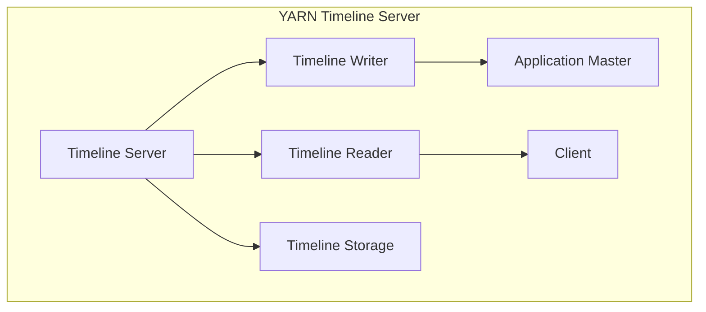
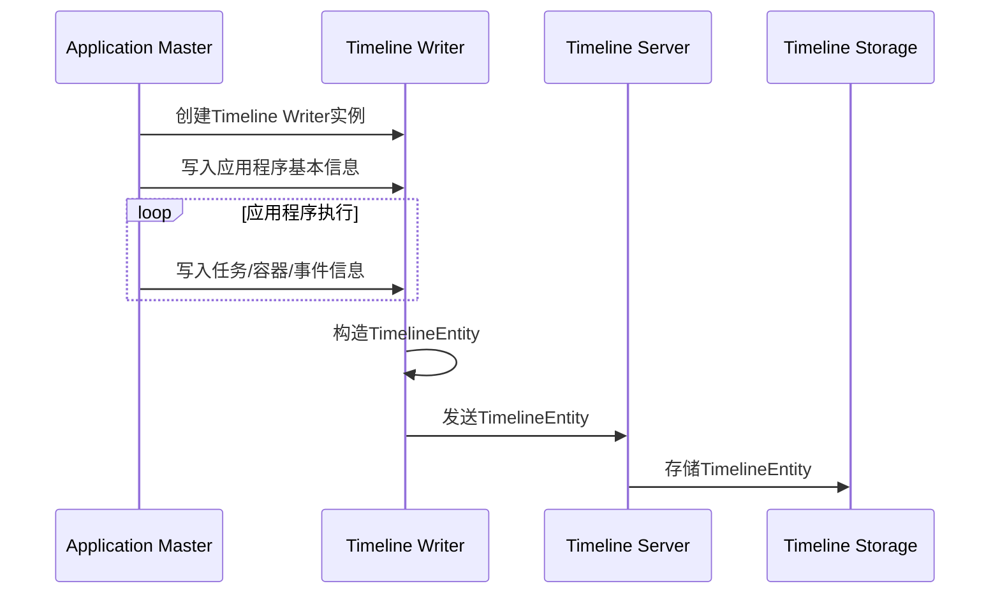
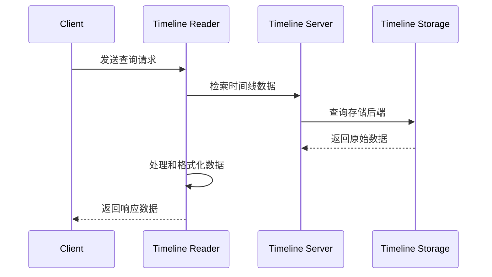

# YARN Timeline Server原理与代码实例讲解

## 1.背景介绍

### 1.1 什么是YARN Timeline Server?

YARN Timeline Server是Apache Hadoop YARN的一个重要组件,主要用于存储和检索YARN应用程序的历史信息和元数据。在YARN集群中,Timeline Server扮演着关键的角色,为用户提供了对已完成应用程序的详细信息进行查询和分析的能力。

### 1.2 YARN Timeline Server的作用

在大数据处理领域,能够有效地监控和分析应用程序的执行情况至关重要。YARN Timeline Server通过记录和存储应用程序的各种指标和事件,使得用户可以回顾和分析已完成作业的性能、资源利用率、任务执行情况等,从而优化作业配置、调试问题并提高整体集群效率。

### 1.3 YARN Timeline Server的应用场景

YARN Timeline Server在以下场景中发挥着重要作用:

- **性能分析和优化**: 通过分析作业执行时间、资源使用情况等,可以发现性能瓶颈并进行优化。
- **故障排查和调试**: 记录的事件数据有助于定位和解决应用程序执行过程中遇到的各种问题。
- **审计和安全合规性**: 保存应用程序的历史记录,有助于满足审计和合规性要求。
- **作业可重复性**: 存储作业配置和执行信息,便于重现和重复特定作业。

## 2.核心概念与联系

### 2.1 YARN Timeline Server架构

YARN Timeline Server由以下几个主要组件组成:

1. **Timeline Server**: 负责接收和存储应用程序的时间线数据。
2. **Timeline Reader**: 提供了查询和检索时间线数据的REST API。
3. **Timeline Writer**: 应用程序通过Timeline Writer将时间线数据写入Timeline Server。
4. **Timeline Storage**: 用于持久化存储时间线数据,支持多种存储后端,如内存存储、LevelDB等。

这些组件协同工作,形成了YARN Timeline Server的完整架构,如下Mermaid流程图所示:



### 2.2 时间线数据结构

YARN Timeline Server存储的时间线数据主要包括以下几个部分:

1. **应用程序信息**: 包括应用程序ID、队列名称、用户名、开始时间和结束时间等基本信息。
2. **任务信息**: 记录了应用程序中各个任务的执行情况,如任务ID、状态、开始时间、结束时间等。
3. **容器信息**: 包括容器ID、主机名、分配的资源等。
4. **事件**: 记录了应用程序执行过程中发生的各种事件,如容器启动、容器结束、任务状态变更等。

这些数据通过Timeline Writer以特定的数据格式(如JSON或Protobuf)写入Timeline Server,并由Timeline Reader提供查询接口。

## 3.核心算法原理具体操作步骤

### 3.1 Timeline Server数据写入流程

应用程序通过Timeline Writer将时间线数据写入Timeline Server,具体流程如下:

1. 应用程序的Application Master在初始化时创建一个Timeline Writer实例。
2. Application Master将应用程序的基本信息写入Timeline Writer。
3. 在应用程序运行过程中,Application Master将任务、容器和事件信息持续写入Timeline Writer。
4. Timeline Writer将收集到的数据按照指定的格式(如JSON或Protobuf)构造成时间线实体(TimelineEntity)。
5. Timeline Writer通过REST API将TimelineEntity发送给Timeline Server。
6. Timeline Server接收到TimelineEntity后,将其存储到配置的存储后端(如LevelDB)中。

该过程可以用下面的Mermaid流程图表示:



### 3.2 Timeline Server数据查询流程

用户可以通过Timeline Reader提供的REST API查询时间线数据,具体流程如下:

1. 用户通过Timeline Reader的REST API发送查询请求,指定查询条件(如应用程序ID、时间范围等)。
2. Timeline Reader根据查询条件从Timeline Server中检索相应的时间线数据。
3. Timeline Reader对检索到的原始数据进行处理和格式化,生成符合API规范的响应数据。
4. Timeline Reader将响应数据返回给用户。

该过程可以用下面的Mermaid流程图表示:



## 4.数学模型和公式详细讲解举例说明

在YARN Timeline Server中,并没有涉及复杂的数学模型和公式。不过,在分析和优化应用程序性能时,通常会使用一些统计学和概率论中的概念和公式,如平均值、标准差、百分位数等。

例如,在分析任务执行时间时,我们可以计算所有任务执行时间的平均值和标准差,从而发现异常值并进行优化。任务执行时间的平均值可以用以下公式计算:

$$\overline{x} = \frac{1}{n}\sum_{i=1}^{n}x_i$$

其中,\overline{x}表示平均值,$x_i$表示第$i$个任务的执行时间,$n$表示任务总数。

标准差则可以用下面的公式计算:

$$\sigma = \sqrt{\frac{1}{n}\sum_{i=1}^{n}(x_i - \overline{x})^2}$$

其中,$\sigma$表示标准差。

通过计算平均值和标准差,我们可以确定任务执行时间的分布情况,并将异常值(如执行时间过长的任务)视为优化目标。

此外,在分析资源利用率时,我们也可以使用百分位数等概念。例如,计算CPU利用率的95%百分位数,可以了解大部分时间内CPU利用率的水平,从而评估是否存在资源浪费或不足的情况。

## 4.项目实践:代码实例和详细解释说明

在本节中,我们将通过一个示例项目来演示如何使用YARN Timeline Server记录和查询应用程序的时间线数据。

### 4.1 项目概述

我们将开发一个简单的YARN应用程序,其中包含一个Application Master和多个容器任务。Application Master将负责向YARN Timeline Server写入时间线数据,而容器任务则模拟执行一些工作负载。

### 4.2 Application Master代码

Application Master的主要职责是初始化Timeline Writer,并在应用程序执行过程中持续写入时间线数据。下面是Application Master的核心代码:

```java
// 创建Timeline Writer实例
TimelineWriter timelineWriter = new TimelineWriter(appId, hostName, startTime);

// 写入应用程序基本信息
timelineWriter.putEntities(ApplicationMetricsConstants.APP_METADATA, appMetadata);

// 写入任务信息
for (Task task : tasks) {
    timelineWriter.putEntities(ApplicationMetricsConstants.TASK_METADATA, task.getMetadata());
}

// 写入容器信息和事件
for (Container container : containers) {
    timelineWriter.putEntities(ApplicationMetricsConstants.CONTAINER_METADATA, container.getMetadata());
    timelineWriter.putEntities(ApplicationMetricsConstants.CONTAINER_EVENTS, container.getEvents());
}

// 关闭Timeline Writer
timelineWriter.close();
```

在上面的代码中,我们首先创建了一个Timeline Writer实例,并向其写入了应用程序的基本信息、任务信息、容器信息和事件。最后,我们关闭了Timeline Writer实例。

### 4.3 容器任务代码

容器任务的主要职责是模拟执行一些工作负载,并将执行过程中的事件记录到Timeline Server中。下面是容器任务的核心代码:

```java
// 创建事件列表
List<TimelineEntity> events = new ArrayList<>();

// 模拟执行工作负载
for (int i = 0; i < workload; i++) {
    // 执行一些操作...

    // 记录事件
    TimelineEvent event = new TimelineEvent();
    event.setTimestamp(System.currentTimeMillis());
    event.setEventType("TASK_PROGRESS");
    event.setEventInfo("Task progress: " + (i + 1) + "/" + workload);
    events.add(event);
}

// 将事件写入Timeline Server
timelineWriter.putEntities(ApplicationMetricsConstants.CONTAINER_EVENTS, events);
```

在上面的代码中,我们首先创建了一个事件列表。然后,我们模拟执行了一些工作负载,并在每次迭代时记录了一个事件,表示任务的执行进度。最后,我们将事件列表写入了Timeline Server。

### 4.4 查询时间线数据

要查询Timeline Server中存储的时间线数据,我们可以使用Timeline Reader提供的REST API。下面是一个示例查询请求:

```
GET /ws/v2/timeline/clusters/cluster1/apps/application_1234567890_0001/entities?metrics=TASK_METADATA,CONTAINER_METADATA,CONTAINER_EVENTS&windowStart=1620000000000&windowEnd=1620086400000
```

在这个示例中,我们查询了应用程序`application_1234567890_0001`在指定时间范围内的任务信息、容器信息和容器事件。Timeline Reader将返回符合查询条件的时间线数据,格式为JSON或Protobuf。

## 5.实际应用场景

YARN Timeline Server在实际生产环境中有着广泛的应用场景,为用户提供了分析和优化大数据应用程序的强大工具。以下是一些典型的应用场景:

### 5.1 作业性能分析和优化

通过查询YARN Timeline Server中存储的时间线数据,我们可以分析作业的执行情况、资源利用率等指标,从而发现性能瓶颈并进行优化。例如,我们可以查看任务执行时间的分布情况,识别出耗时过长的任务,并调整作业配置或优化代码逻辑。

### 5.2 故障排查和调试

当应用程序执行过程中出现异常或失败时,YARN Timeline Server中记录的事件数据可以为我们提供宝贵的调试信息。我们可以查看容器的启动、结束时间,以及任务状态变更等事件,从而定位和解决问题的根源。

### 5.3 集群资源管理

通过分析YARN Timeline Server中的资源利用数据,我们可以更好地管理和优化集群资源。例如,我们可以查看CPU、内存等资源的使用情况,并根据需求调整资源分配策略或扩容集群。

### 5.4 审计和安全合规性

在某些行业或场景下,需要保留应用程序的执行记录以满足审计和安全合规性要求。YARN Timeline Server可以作为一种可靠的数据源,为用户提供应用程序的历史信息和元数据。

## 6.工具和资源推荐

在使用和管理YARN Timeline Server时,有一些有用的工具和资源可供参考:

### 6.1 YARN Timeline Server Web UI

Apache Hadoop提供了一个基于Web的用户界面,用于查看和管理YARN Timeline Server中的数据。通过Web UI,我们可以浏览应用程序列表、查看应用程序详情、搜索和过滤时间线数据等。

### 6.2 Apache Hadoop命令行工具

Apache Hadoop提供了一些命令行工具,可用于与YARN Timeline Server进行交互。例如,`yarn applicationattempt -status`命令可以查看应用程序的状态和进度。

### 6.3 开源监控工具

一些开源监控工具,如Prometheus和Grafana,可以与YARN Timeline Server集成,从而提供更加丰富的监控和可视化功能。这些工具可以帮助我们更好地理解和分析应用程序的执行情况。

### 6.4 社区资源

Apache Hadoop社区提供了丰富的文档、论坛和邮件列表,可以为用户解答疑问并分享最佳实践。此外,一些第三方公司也提供了商业支持和服务,可以帮助用户更好地利用YARN Timeline Server。

## 7.总结:未来发展趋势与挑战

YARN Timeline Server作为Apache Hadoop YARN的重要组件,为用户提供