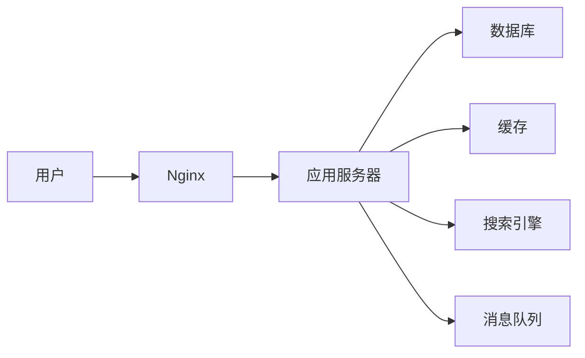

##  二手商品交易管理系统详细设计与具体代码实现

作者：禅与计算机程序设计艺术

## 1. 背景介绍

### 1.1 二手商品交易市场的兴起

近年来，随着可持续发展理念的普及和共享经济的兴起，二手商品交易市场规模不断扩大。越来越多的人选择购买或出售闲置物品，既节约资源，又获得了经济收益。

### 1.2 传统交易模式的弊端

传统的二手商品交易模式主要依赖于线下交易市场、二手物品中介等方式，存在着诸多弊端：

* 信息不对称：买卖双方难以获取全面、准确的商品信息，容易产生交易纠纷。
* 交易成本高：线下交易需要支付场地费、中介费等成本，线上交易平台的佣金也较高。
* 安全性差：线下交易存在人身安全和财产安全的风险，线上交易平台也存在虚假信息、欺诈等问题。

### 1.3  二手商品交易管理系统的优势

为了解决上述问题，开发一套高效、安全、便捷的二手商品交易管理系统显得尤为重要。相较于传统的交易模式，该系统具有以下优势：

* 信息透明化：系统可以集中展示商品信息，包括商品描述、图片、价格、交易记录等，提高交易透明度，减少信息不对称。
* 交易便捷化：用户可以在线完成商品发布、搜索、交易等操作，无需线下奔波，节省时间和精力。
* 安全性高：系统可以对用户身份进行验证，对商品信息进行审核，并提供安全的支付和物流保障，有效降低交易风险。

## 2. 核心概念与联系

### 2.1 用户模块

#### 2.1.1 用户类型

* 普通用户：注册用户，可以浏览商品、发布商品、购买商品、参与评论等。
* 商家用户：经过平台认证的商家，可以发布和管理商品，提供售后服务等。
* 管理员：负责平台的运营和维护，包括用户管理、商品管理、订单管理、数据统计等。

#### 2.1.2 用户信息

* 用户名
* 密码
* 昵称
* 头像
* 手机号码
* 邮箱地址
* 收货地址

### 2.2 商品模块

#### 2.2.1 商品分类

* 数码产品
* 服装鞋帽
* 家具家电
* 图书音像
* 其他

#### 2.2.2 商品信息

* 商品名称
* 商品描述
* 商品图片
* 商品价格
* 商品新旧程度
* 商品所在地区
* 商品发布时间

### 2.3 订单模块

#### 2.3.1 订单状态

* 待付款
* 待发货
* 待收货
* 已完成
* 已取消

#### 2.3.2 订单信息

* 订单编号
* 商品信息
* 买家信息
* 卖家信息
* 订单金额
* 下单时间
* 付款时间
* 发货时间
* 收货时间

### 2.4 支付模块

* 支持多种支付方式，如支付宝、微信支付等。
* 提供安全的支付接口，保障用户资金安全。

### 2.5 物流模块

* 对接第三方物流平台，提供实时物流信息查询。
* 支持用户选择不同的物流方式。

## 3. 核心算法原理具体操作步骤

### 3.1 商品推荐算法

#### 3.1.1 基于内容的推荐算法

根据用户的浏览历史、收藏记录、购买记录等信息，分析用户的兴趣偏好，推荐与其兴趣相似的商品。

#### 3.1.2 协同过滤推荐算法

根据用户的历史行为数据，找到与其兴趣相似的其他用户，推荐这些用户购买过的商品。

### 3.2 商品搜索算法

#### 3.2.1 倒排索引

建立关键词与商品的倒排索引，根据用户输入的关键词快速检索相关商品。

#### 3.2.2  分词技术

对商品名称、描述等文本信息进行分词处理，提高搜索结果的准确性。

### 3.3 商品排序算法

#### 3.3.1  综合排序

根据商品的销量、评分、发布时间等多个维度进行综合排序，将最优质的商品展示给用户。

#### 3.3.2  个性化排序

根据用户的兴趣偏好、历史行为等信息，对商品进行个性化排序，提高用户体验。

## 4. 数学模型和公式详细讲解举例说明

### 4.1 协同过滤算法中的相似度计算

协同过滤算法的核心是计算用户之间的相似度，常用的相似度计算方法有：

* 余弦相似度
* 皮尔逊相关系数
* Jaccard相似系数

以余弦相似度为例，假设用户A和用户B的评分向量分别为：

```
A = [1, 2, 3, 4, 5]
B = [2, 3, 4, 5, 0]
```

则用户A和用户B的余弦相似度为：

$$
sim(A,B) = \frac{A \cdot B}{||A|| ||B||} = \frac{2+6+12+20+0}{\sqrt{1+4+9+16+25} \sqrt{4+9+16+25}} \approx 0.94
$$

### 4.2  商品排序算法中的权重计算

综合排序算法需要对不同的排序因子赋予不同的权重，常用的权重计算方法有：

*  专家打分法
*  层次分析法
*  熵权法

以专家打分法为例，假设有三位专家对商品的销量、评分、发布时间三个排序因子进行打分，结果如下：

| 排序因子 | 专家1 | 专家2 | 专家3 |
|---|---|---|---|
| 销量 | 0.8 | 0.7 | 0.9 |
| 评分 | 0.7 | 0.8 | 0.6 |
| 发布时间 | 0.5 | 0.6 | 0.7 |

则三个排序因子的权重分别为：

```
w1 = (0.8 + 0.7 + 0.9) / 3 = 0.8
w2 = (0.7 + 0.8 + 0.6) / 3 = 0.7
w3 = (0.5 + 0.6 + 0.7) / 3 = 0.6
```

## 5. 项目实践：代码实例和详细解释说明

### 5.1 技术选型

* 后端框架：Spring Boot
* 数据库：MySQL
* 缓存：Redis
* 搜索引擎：Elasticsearch
* 消息队列：RabbitMQ
* 前端框架：Vue.js

### 5.2 代码实例

```java
// 商品实体类
@Entity
@Table(name = "product")
public class Product {

    @Id
    @GeneratedValue(strategy = GenerationType.IDENTITY)
    private Long id;

    @Column(nullable = false)
    private String name;

    @Column(nullable = false)
    private String description;

    @Column(nullable = false)
    private BigDecimal price;

    // ... other fields

    // Getters and setters
}
```

```java
// 商品服务类
@Service
public class ProductService {

    @Autowired
    private ProductRepository productRepository;

    public Page<Product> findAll(Pageable pageable) {
        return productRepository.findAll(pageable);
    }

    public Product findById(Long id) {
        return productRepository.findById(id).orElseThrow(() -> new ResourceNotFoundException("Product not found with id " + id));
    }

    public Product save(Product product) {
        return productRepository.save(product);
    }

    // ... other methods
}
```

### 5.3  部署架构



## 6. 实际应用场景

* 个人闲置物品交易平台
* 校园二手市场
* 企业内部资产交易平台

## 7. 总结：未来发展趋势与挑战

### 7.1 未来发展趋势

* 人工智能技术将更加深入地应用于二手商品交易领域，例如智能推荐、智能客服、智能定价等。
* 区块链技术将为二手商品交易提供更加安全、透明的保障。
* 线上线下融合发展，打造更加便捷、高效的交易体验。

### 7.2 面临的挑战

* 如何保障用户信息和交易安全。
* 如何提高商品质量和服务水平。
* 如何应对日益激烈的市场竞争。

## 8. 附录：常见问题与解答

### 8.1 如何发布商品？

1. 注册并登录平台账号。
2. 点击“发布商品”按钮。
3. 填写商品信息，包括商品名称、描述、图片、价格等。
4. 提交审核。

### 8.2 如何购买商品？

1. 浏览或搜索商品。
2. 选择心仪的商品，点击“立即购买”。
3. 选择支付方式并完成付款。
4. 等待卖家发货。

### 8.3 如何申请退款？

1. 进入“我的订单”页面。
2. 选择需要退款的订单。
3. 填写退款原因并提交申请。
4. 等待卖家或平台审核。