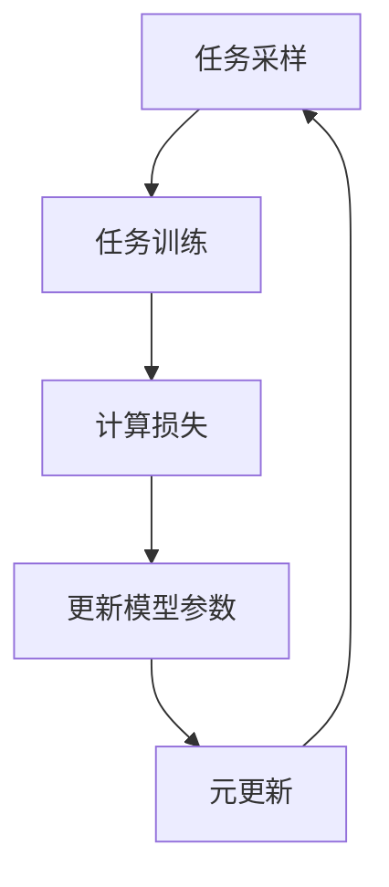
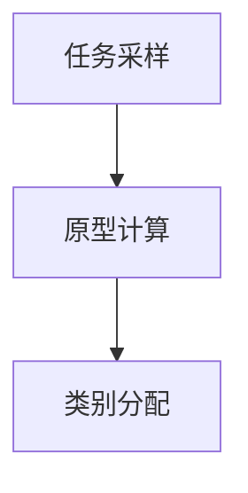

# 元学习与文本分类：构建高效的文本分类模型

作者：禅与计算机程序设计艺术

## 1. 背景介绍

### 1.1 什么是文本分类

文本分类是自然语言处理（NLP）中的一个重要任务，旨在将文本数据自动分配到预定义的类别中。无论是垃圾邮件检测、情感分析还是新闻分类，文本分类的应用都非常广泛。现代文本分类模型通常依赖于机器学习和深度学习技术，利用大量标注数据进行训练，以实现高效的分类性能。

### 1.2 元学习的兴起

元学习（Meta-Learning）是机器学习中的一个新兴领域，旨在通过学习如何学习来提高模型的泛化能力。与传统机器学习方法不同，元学习关注的是如何快速适应新任务，尤其是在数据稀缺的情况下。元学习的核心思想是从多个任务中提取共享的知识，从而在面对新任务时能够快速做出有效的预测。

### 1.3 元学习与文本分类的结合

将元学习应用于文本分类领域，可以显著提高模型在小样本数据上的表现。这种结合不仅能够减少对大规模标注数据的依赖，还能提升模型的适应性和泛化能力。本文将深入探讨元学习与文本分类的结合，介绍核心概念、算法原理、数学模型、项目实践以及实际应用场景。

## 2. 核心概念与联系

### 2.1 元学习的基本概念

元学习的目标是通过学习多个任务，提取共享的知识，从而在新任务上实现快速适应。元学习通常分为三类：

1. **基于模型的元学习**：通过学习一个模型的参数初始化，使其能够快速适应新任务。
2. **基于优化的元学习**：通过学习优化算法的超参数，提高模型的训练效率。
3. **基于记忆的元学习**：通过学习记忆机制，使模型能够记住并利用过去的经验。

### 2.2 文本分类的基本概念

文本分类的核心任务是将文本数据映射到预定义的类别。常见的文本分类方法包括：

1. **基于规则的方法**：通过预定义的规则进行分类。
2. **基于机器学习的方法**：通过训练分类器（如SVM、朴素贝叶斯）进行分类。
3. **基于深度学习的方法**：通过训练神经网络（如CNN、RNN）进行分类。

### 2.3 元学习与文本分类的联系

将元学习应用于文本分类，可以通过以下方式实现：

1. **任务级别的元学习**：从多个文本分类任务中提取共享的知识，以提高新任务的适应性。
2. **模型级别的元学习**：通过学习模型参数的初始化，使其能够快速适应新的文本分类任务。
3. **数据级别的元学习**：通过学习数据的表示方式，提高小样本文本分类的性能。

## 3. 核心算法原理具体操作步骤

### 3.1 MAML（Model-Agnostic Meta-Learning）

MAML是一种基于模型的元学习算法，旨在通过学习模型参数的初始化，使其能够快速适应新任务。MAML的具体操作步骤如下：

1. **任务采样**：从任务分布中采样多个任务。
2. **任务训练**：对于每个任务，使用当前模型参数进行训练，计算损失并更新模型参数。
3. **元更新**：将所有任务的更新结果进行汇总，更新初始模型参数。



### 3.2 ProtoNet（Prototypical Networks）

ProtoNet是一种基于记忆的元学习算法，通过学习每个类别的原型向量，实现小样本分类。ProtoNet的具体操作步骤如下：

1. **任务采样**：从任务分布中采样多个任务。
2. **原型计算**：对于每个任务，计算每个类别的原型向量。
3. **类别分配**：将新样本映射到最近的原型向量，进行分类。



### 3.3 其他元学习算法

除了MAML和ProtoNet，还有许多其他元学习算法，如Reptile、Meta-SGD、SNAIL等。这些算法在不同的应用场景中表现出色，可以根据具体需求选择合适的算法。

## 4. 数学模型和公式详细讲解举例说明

### 4.1 MAML的数学模型

MAML的核心思想是通过学习模型参数的初始化，使其能够快速适应新任务。具体来说，MAML的目标是找到一个初始参数 $\theta$，使得在少量梯度更新后，模型在新任务上的损失最小。

假设我们有一个任务分布 $p(\mathcal{T})$，每个任务 $\mathcal{T}_i$ 包含训练集 $\mathcal{D}_i^{train}$ 和验证集 $\mathcal{D}_i^{val}$。MAML的训练过程如下：

1. **任务采样**：从任务分布 $p(\mathcal{T})$ 中采样任务 $\mathcal{T}_i$。
2. **任务训练**：对于每个任务 $\mathcal{T}_i$，使用当前模型参数 $\theta$ 在训练集 $\mathcal{D}_i^{train}$ 上进行梯度更新，得到新的参数 $\theta_i$：
$$
\theta_i = \theta - \alpha \nabla_\theta \mathcal{L}_{\mathcal{T}_i} (\theta, \mathcal{D}_i^{train})
$$
3. **元更新**：在验证集 $\mathcal{D}_i^{val}$ 上计算损失，并更新初始参数 $\theta$：
$$
\theta \leftarrow \theta - \beta \nabla_\theta \sum_{\mathcal{T}_i \sim p(\mathcal{T})} \mathcal{L}_{\mathcal{T}_i} (\theta_i, \mathcal{D}_i^{val})
$$

### 4.2 ProtoNet的数学模型

ProtoNet的核心思想是通过学习每个类别的原型向量，实现小样本分类。具体来说，ProtoNet的目标是找到每个类别的原型向量，使得新样本可以根据与原型的距离进行分类。

假设我们有一个任务 $\mathcal{T}$，包含 $N$ 个类别，每个类别有 $K$ 个样本。ProtoNet的训练过程如下：

1. **原型计算**：对于每个类别 $c$，计算原型向量 $\mathbf{p}_c$：
$$
\mathbf{p}_c = \frac{1}{K} \sum_{i=1}^K \mathbf{x}_i^c
$$
2. **类别分配**：对于新样本 $\mathbf{x}$，计算其与每个原型向量的距离，并分配到最近的类别：
$$
\hat{y} = \arg\min_c d(\mathbf{x}, \mathbf{p}_c)
$$
其中 $d(\cdot, \cdot)$ 表示距离度量函数，如欧氏距离。

### 4.3 数学模型的实际应用

通过上述数学模型，我们可以在不同的应用场景中灵活应用元学习算法。无论是小样本文本分类还是其他任务，这些数学模型都提供了理论基础和实现方法。

## 5. 项目实践：代码实例和详细解释说明

### 5.1 MAML的实现

以下是一个基于PyTorch实现的MAML代码示例：

```python
import torch
import torch.nn as nn
import torch.optim as optim

class MAML(nn.Module):
    def __init__(self, model, lr_inner=0.01, lr_outer=0.001):
        super(MAML, self).__init__()
        self.model = model
        self.lr_inner = lr_inner
        self.lr_outer = lr_outer
        self.optimizer = optim.Adam(self.model.parameters(), lr=self.lr_outer)

    def forward(self, x):
        return self.model(x)

    def inner_update(self, x, y):
        loss = nn.CrossEntropyLoss()(self.model(x), y)
        grads = torch.autograd.grad(loss, self.model.parameters(), create_graph=True)
        updated_params = [p - self.lr_inner * g for p, g in zip(self.model.parameters(), grads)]
        return updated_params

    def outer_update(self, tasks):
        meta_loss = 0
        for task in tasks:
            x_train, y_train, x_val, y_val = task
            updated_params = self.inner_update(x_train, y_train)
            self.model.load_state_dict(dict(zip(self.model.state_dict().keys(), updated_params)))
           