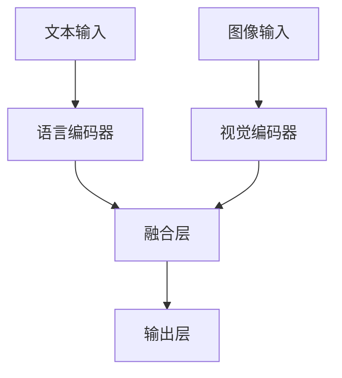

# 大语言模型原理基础与前沿 视觉增强语言建模

作者：禅与计算机程序设计艺术

## 1. 背景介绍

### 1.1 大语言模型的发展历程

大语言模型（Large Language Models, LLMs）近年来在自然语言处理（NLP）领域取得了显著的进展。从早期的统计语言模型到当前的基于深度学习的预训练模型，LLMs的演变展示了技术的飞速发展。早期的语言模型如n-gram模型和隐马尔可夫模型（HMM）主要依赖于统计方法，而近年来，Transformer架构的引入使得大规模预训练语言模型如GPT-3和BERT成为可能。

### 1.2 视觉增强语言建模的兴起

随着计算机视觉技术的成熟，研究者们开始探索将视觉信息引入语言建模的可能性。视觉增强语言建模（Vision-Enhanced Language Modeling, VELM）通过融合图像和文本信息，旨在提升模型的理解能力和生成能力。这一领域的研究不仅有助于改进多模态任务的性能，如图像描述生成和视觉问答，还为单一模态任务提供了新的思路和方法。

### 1.3 本文结构

本文将详细介绍大语言模型的核心概念和原理，深入探讨视觉增强语言建模的具体操作步骤和数学模型，并结合实际代码实例进行说明。最后，我们将探讨VELM的实际应用场景、推荐工具和资源，以及未来的发展趋势与挑战。

## 2. 核心概念与联系

### 2.1 语言模型

语言模型是自然语言处理的核心任务之一，其目标是根据给定的词序列预测下一个词。语言模型的性能直接影响到下游任务，如机器翻译、文本生成和问答系统。当前主流的语言模型包括基于RNN的LSTM和GRU，以及基于Transformer的BERT和GPT系列。

### 2.2 视觉模型

视觉模型主要用于处理和理解图像数据。经典的视觉模型包括卷积神经网络（CNN）、区域卷积神经网络（R-CNN）和最近的视觉Transformer（ViT）。这些模型在图像分类、目标检测和图像生成等任务中表现优异。

### 2.3 融合模型

融合模型旨在将语言模型和视觉模型结合起来，以处理多模态任务。典型的融合模型包括CLIP（Contrastive Language-Image Pre-Training）和ViLBERT（Vision-and-Language BERT）。这些模型通过联合训练语言和视觉数据，实现了跨模态的理解和生成能力。

### 2.4 视觉增强语言建模的优势

视觉增强语言建模通过引入视觉信息，可以显著提升模型的上下文理解能力和生成质量。例如，在图像描述生成任务中，VELM可以生成更加准确和生动的描述；在视觉问答任务中，VELM可以更好地理解问题和图像内容，从而提供更准确的答案。

## 3. 核心算法原理具体操作步骤

### 3.1 数据预处理

#### 3.1.1 文本数据预处理

文本数据预处理包括分词、去停用词、词干提取和词向量表示等步骤。对于大规模预训练模型，通常使用子词级别的分词方法，如BPE（Byte-Pair Encoding）和WordPiece。

#### 3.1.2 图像数据预处理

图像数据预处理包括图像缩放、归一化和数据增强等步骤。常用的数据增强方法包括随机裁剪、翻转和颜色抖动等。

### 3.2 模型架构设计

#### 3.2.1 基础架构

基础架构通常包括一个语言编码器和一个视觉编码器。语言编码器可以是BERT或GPT，视觉编码器可以是ResNet或ViT。



#### 3.2.2 融合层设计

融合层的设计是VELM的关键部分。常用的方法包括简单的拼接、注意力机制和跨模态变换器（Cross-Modal Transformer）。

### 3.3 模型训练

#### 3.3.1 预训练

预训练阶段通常采用大规模的图文对齐数据集，如COCO Caption和Visual Genome。预训练任务包括图像描述生成、视觉问答和图文匹配等。

#### 3.3.2 微调

微调阶段针对具体的下游任务进行训练，如图像描述生成或视觉问答。微调数据集通常较小，但更具针对性。

### 3.4 模型评估

#### 3.4.1 评估指标

常用的评估指标包括BLEU、ROUGE、CIDEr和SPICE等。这些指标主要用于评估生成文本的质量。

#### 3.4.2 实验结果分析

通过对比不同模型架构和训练策略的实验结果，可以分析VELM的性能和优势。

## 4. 数学模型和公式详细讲解举例说明

### 4.1 语言模型的数学基础

语言模型的核心任务是根据给定的上下文预测下一个词。其基本公式为：

$$ P(w_t | w_{t-1}, w_{t-2}, ..., w_1) $$

基于Transformer的语言模型通过自注意力机制计算词向量的加权和，从而捕捉长距离依赖关系。

### 4.2 视觉模型的数学基础

视觉模型通过卷积操作提取图像的特征表示。卷积操作的数学公式为：

$$ (f * g)(t) = \int_{-\infty}^{\infty} f(\tau) g(t - \tau) \, d\tau $$

其中，$f$表示输入图像，$g$表示卷积核。

### 4.3 融合模型的数学基础

融合模型通过联合优化语言和视觉损失函数，实现跨模态的理解和生成。其基本公式为：

$$ \mathcal{L} = \alpha \mathcal{L}_{text} + \beta \mathcal{L}_{image} + \gamma \mathcal{L}_{joint} $$

其中，$\mathcal{L}_{text}$表示语言损失，$\mathcal{L}_{image}$表示视觉损失，$\mathcal{L}_{joint}$表示跨模态损失，$\alpha$、$\beta$和$\gamma$为权重超参数。

### 4.4 举例说明

假设我们有一个图像描述生成任务，输入为图像$I$和对应的描述$T$。模型的目标是最大化描述$T$的生成概率：

$$ P(T | I) = \prod_{t=1}^{N} P(w_t | w_{t-1}, ..., w_1, I) $$

通过联合优化文本和图像的损失函数，模型可以更好地生成符合图像内容的描述。

## 5. 项目实践：代码实例和详细解释说明

### 5.1 环境配置

首先，我们需要配置开发环境，包括安装必要的库和工具。

```bash
pip install transformers torchvision
```

### 5.2 数据集准备

我们使用COCO Caption数据集进行预训练和微调。

```python
from torchvision import datasets, transforms

transform = transforms.Compose([
    transforms.Resize((224, 224)),
    transforms.ToTensor(),
])

coco_train = datasets.CocoCaptions(root='path/to/coco/train2017',
                                   annFile='path/to/annotations/captions_train2017.json',
                                   transform=transform)
```

### 5.3 模型定义

我们定义一个简单的视觉增强语言模型，包括语言编码器、视觉编码器和融合层。

```python
import torch
from transformers import BertModel, BertTokenizer
from torchvision.models import resnet50

class VELM(torch.nn.Module):
    def __init__(self):
        super(VELM, self).__init__()
        self.tokenizer = BertTokenizer.from_pretrained('bert-base-uncased')
        self.text_encoder = BertModel.from_pretrained('bert-base-uncased')
        self.image_encoder = resnet50(pretrained=True)
        self.fusion_layer = torch.nn.Linear(768 + 1000, 768)
        self.decoder = torch.nn.Linear(768, self.tokenizer.vocab_size)

    def forward(self, text, image):
        text_tokens = self.tokenizer(text, return_tensors='pt', padding=True, truncation=True)
        text_embeddings = self.text_encoder(**text_tokens).last_hidden_state
        image_embeddings = self.image_encoder(image)
        combined_embeddings = torch.cat((text_embeddings, image_embeddings), dim=1)
        fused_embeddings = self.fusion_layer(combined_embeddings)
        output = self.decoder(fused_embeddings)
        return output
```

### 5.4 训练过程

我们定义训练过程，包括损失函数和优化器