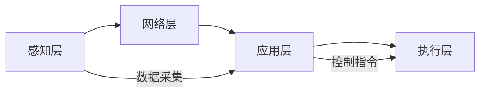

## 1. 背景介绍

### 1.1 智能家居的兴起与发展

近年来，随着物联网、人工智能等技术的飞速发展，智能家居的概念逐渐深入人心。智能家居是指利用先进的计算机、网络通信、自动控制等技术，将家居生活相关的设施集成，构建高效的住宅设施与家庭日程事务的管理系统，提升家居安全性、便利性、舒适性和艺术性，并实现环保节能的居住环境。

### 1.2 家庭管家系统的需求分析

在智能家居的浪潮下，家庭管家系统应运而生。家庭管家系统作为智能家居的核心组成部分，旨在为用户提供更加便捷、舒适、安全的居住体验。用户可以通过手机、语音等方式远程控制家电、监控家庭环境、管理家庭事务等，从而解放双手，提高生活质量。

### 1.3 本文目标与结构

本文将详细介绍如何设计和实现一个功能完善的家庭管家系统。首先，我们将介绍家庭管家系统的核心概念和技术架构；其次，我们将详细讲解系统的设计思路和实现细节，并提供完整的代码示例；最后，我们将探讨家庭管家系统的未来发展趋势和挑战。

## 2. 核心概念与联系

### 2.1 系统架构

家庭管家系统通常采用分层架构设计，主要包括以下几个层次：

* **感知层：** 负责采集家庭环境数据，例如温度、湿度、光照强度等，以及用户行为数据，例如语音指令、手机操作等。
* **网络层：** 负责将感知层采集的数据传输到应用层，并接收应用层的控制指令，将其转发给执行层。
* **应用层：** 负责处理用户请求，实现家庭管家系统的核心功能，例如家电控制、环境监测、安全防护等。
* **执行层：** 负责接收应用层的控制指令，并控制相应的硬件设备执行相应的操作，例如打开空调、关闭灯光等。

### 2.2 关键技术

* **物联网技术：** 用于连接和管理各种智能家居设备，实现设备间的互联互通。
* **人工智能技术：** 用于实现语音识别、图像识别、智能决策等功能，提升用户体验。
* **云计算技术：** 用于提供数据存储、计算、分析等服务，支持系统的高效运行。
* **移动互联网技术：** 用于实现用户与系统之间的交互，方便用户随时随地控制家庭设备。

### 2.3 概念关系图



## 3. 核心算法原理具体操作步骤

### 3.1 语音控制模块

#### 3.1.1 语音识别

语音识别是将用户说的话转换成文本的技术。本系统采用基于深度学习的语音识别引擎，例如百度语音识别、讯飞语音识别等。

#### 3.1.2 语义理解

语义理解是将识别出来的文本转换成计算机可以理解的指令。本系统采用基于规则和统计的语义理解方法，结合上下文信息和用户习惯，准确识别用户意图。

#### 3.1.3 指令执行

指令执行是根据语义理解的结果，控制相应的硬件设备执行相应的操作。例如，用户说“打开客厅的灯”，系统会识别出“打开”、“客厅”、“灯”等关键词，并根据预先设定的规则，控制客厅的灯打开。

### 3.2 环境监测模块

#### 3.2.1 数据采集

环境监测模块通过各种传感器采集家庭环境数据，例如温度、湿度、光照强度、PM2.5等。

#### 3.2.2 数据处理

采集到的数据经过预处理、过滤、校准等步骤，去除异常数据，保证数据的准确性。

#### 3.2.3 数据展示

处理后的数据可以通过图表、曲线等形式展示给用户，方便用户了解家庭环境状况。

### 3.3 安全防护模块

#### 3.3.1 入户检测

安全防护模块可以通过门磁传感器、红外传感器等设备检测是否有人非法入侵。

#### 3.3.2 报警联动

当检测到非法入侵时，系统会立即触发报警装置，并向用户发送报警信息。

#### 3.3.3 视频监控

用户可以通过手机远程查看家中的实时视频，及时了解家中情况。

## 4. 数学模型和公式详细讲解举例说明

### 4.1 温度湿度预测模型

为了更加智能地控制空调和加湿器，本系统采用基于时间序列分析的温度湿度预测模型。该模型可以根据历史数据预测未来一段时间内的温度和湿度变化趋势，从而提前调整空调和加湿器的运行状态，保证室内环境的舒适度。

#### 4.1.1 模型选择

本系统采用 ARIMA 模型进行温度湿度预测。ARIMA 模型是一种常用的时间序列预测模型，可以有效地捕捉数据的趋势性和周期性。

#### 4.1.2 模型训练

利用历史温度湿度数据对 ARIMA 模型进行训练，确定模型的参数。

#### 4.1.3 模型预测

利用训练好的模型对未来一段时间内的温度和湿度进行预测。

### 4.2 公式举例

#### 4.2.1 ARIMA 模型公式

$$
Y_t = c + \sum_{i=1}^p \phi_i Y_{t-i} + \sum_{i=1}^q \theta_i \epsilon_{t-i} + \epsilon_t
$$

其中：

* $Y_t$ 表示 t 时刻的预测值
* $c$ 表示常数项
* $\phi_i$ 表示自回归系数
* $p$ 表示自回归阶数
* $\theta_i$ 表示移动平均系数
* $q$ 表示移动平均阶数
* $\epsilon_t$ 表示 t 时刻的白噪声

## 5. 项目实践：代码实例和详细解释说明

### 5.1 开发环境搭建

* 操作系统：Windows 10
* 开发语言：Python 3.7
* 开发工具：PyCharm
* 相关库：requests, json, time, datetime, sklearn, statsmodels

### 5.2 代码实例

#### 5.2.1 语音控制模块

```python
import speech_recognition as sr

# 初始化语音识别引擎
r = sr.Recognizer()

# 获取麦克风输入
with sr.Microphone() as source:
    print("请说出您的指令：")
    audio = r.listen(source)

# 语音识别
try:
    text = r.recognize_sphinx(audio, language="zh-CN")
    print("您说的是：" + text)
except sr.UnknownException:
    print("无法识别语音")
except sr.RequestError as e:
    print("请求错误：" + str(e))

# 语义理解
# ...

# 指令执行
# ...
```

#### 5.2.2 环境监测模块

```python
import Adafruit_DHT

# 传感器类型
sensor = Adafruit_DHT.DHT11

# 传感器引脚
pin = 4

# 读取传感器数据
humidity, temperature = Adafruit_DHT.read_retry(sensor, pin)

# 数据处理
# ...

# 数据展示
# ...
```

## 6. 实际应用场景

* **智能家居控制：** 用户可以通过语音或手机 APP 控制家中的各种设备，例如灯光、空调、电视、窗帘等。
* **环境监测与调节：** 系统可以实时监测家庭环境的温度、湿度、空气质量等指标，并根据预设规则自动调节空调、加湿器、空气净化器等设备，为用户提供舒适健康的居住环境。
* **安全防护：** 系统可以实时监控家庭安全状况，例如门窗状态、烟雾浓度、燃气泄漏等，并在异常情况下及时报警，保障家庭安全。
* **家庭娱乐：** 系统可以播放音乐、视频，提供新闻资讯、天气预报等服务，丰富用户的家庭娱乐生活。
* **家庭健康管理：** 系统可以记录用户的健康数据，例如体重、血压、血糖等，并提供健康分析和建议。

## 7. 总结：未来发展趋势与挑战

### 7.1 未来发展趋势

* **更加智能化：** 随着人工智能技术的不断发展，家庭管家系统将会变得更加智能，能够更好地理解用户的需求，提供更加个性化的服务。
* **更加人性化：** 家庭管家系统将更加注重用户体验，提供更加便捷、舒适、自然的人机交互方式。
* **更加开放化：** 家庭管家系统将更加开放，支持更多设备和服务的接入，构建更加丰富的智能家居生态系统。

### 7.2 面临的挑战

* **数据安全与隐私保护：** 家庭管家系统收集了大量的用户数据，如何保障数据的安全和用户隐私是一个重要挑战。
* **技术标准不统一：** 目前智能家居行业缺乏统一的技术标准，导致不同厂商的设备之间难以互联互通。
* **用户使用习惯的改变：** 智能家居的概念还比较新颖，用户需要一定的时间去适应和接受新的生活方式。

## 8. 附录：常见问题与解答

### 8.1 如何连接新设备？

用户可以通过手机 APP 扫描设备二维码，将新设备添加到家庭管家系统中。

### 8.2 如何设置定时任务？

用户可以在手机 APP 上设置定时任务，例如定时开关灯、定时启动空调等。

### 8.3 如何保障系统安全？

系统采用多重安全机制保障用户数据安全，例如数据加密、访问控制、安全审计等。