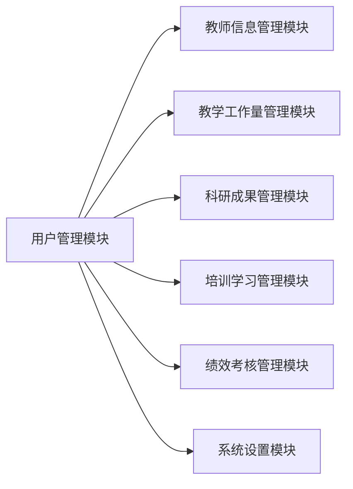
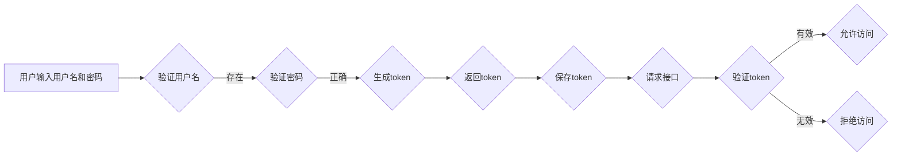

## 教师管理系统详细设计与具体代码实现

作者：禅与计算机程序设计艺术

## 1. 背景介绍

### 1.1 教师管理系统概述

教师管理系统是现代教育信息化建设中不可或缺的一部分，它旨在提高学校对教师信息的管理效率，减轻教师工作负担，提升教学质量。通过该系统，学校可以实现对教师基本信息、教学工作量、科研成果、培训学习、绩效考核等方面的全面管理。

### 1.2 系统开发背景

随着教育信息化进程的不断推进，传统的教师管理模式已经无法满足现代学校的需求。传统的管理方式存在着信息分散、统计困难、效率低下等问题，严重制约了学校的发展。为了解决这些问题，开发一套功能完善、操作便捷、安全可靠的教师管理系统势在必行。

### 1.3 系统目标

* 实现教师信息的集中化、数字化管理，提高信息管理效率。
* 规范教师管理流程，实现对教师工作量、科研成果、培训学习等方面的量化考核。
* 为学校领导提供决策支持，促进学校教育教学质量的提升。

## 2. 核心概念与联系

### 2.1 系统用户角色

* **管理员：** 拥有最高权限，负责系统维护、用户管理、数据备份等工作。
* **教师：** 可以查看个人信息、填写工作量、上传科研成果、报名参加培训学习等。
* **部门领导：** 可以查看本部门教师信息，审批教师工作量、科研成果等。

### 2.2  核心功能模块

* **用户管理模块：**  实现用户注册、登录、密码修改、权限管理等功能。
* **教师信息管理模块：**  实现教师基本信息、学历学位、职称评定、获奖情况等信息的录入、修改、查询、统计等功能。
* **教学工作量管理模块：**  实现教师教学任务安排、课程表管理、课时统计等功能。
* **科研成果管理模块：**  实现教师科研项目申报、论文发表、专利申请等信息的录入、修改、查询、统计等功能。
* **培训学习管理模块：**  发布培训计划、记录教师参加培训情况、生成培训证书等。
* **绩效考核管理模块：**  制定考核指标体系，对教师进行量化考核，生成考核结果。
* **系统设置模块：**  设置系统参数、数据字典等。

### 2.3  模块间关系



## 3. 核心算法原理具体操作步骤

### 3.1 用户登录认证流程

1. 用户输入用户名和密码。
2. 系统验证用户名是否存在。
3. 若用户名存在，则验证密码是否正确。
4. 若密码正确，则生成token，并将token返回给用户。
5. 用户将token保存在本地，每次请求接口时携带token。
6. 系统验证token是否有效，若有效则允许访问，否则拒绝访问。



### 3.2  教师工作量计算方法

教师工作量 = 理论教学工作量 + 实践教学工作量 + 科研工作量 + 其他工作量

* 理论教学工作量 = ∑(课程学分 * 周课时 * 教学周数)
* 实践教学工作量 = ∑(实践环节学分 * 学生人数)
* 科研工作量 = ∑(科研项目级别系数 * 项目经费) + ∑(论文级别系数 * 发表刊物级别系数) + ∑(专利级别系数)
* 其他工作量 =  根据学校实际情况制定

## 4. 数学模型和公式详细讲解举例说明

### 4.1  教师工作量计算公式

$$
教师工作量 = \sum_{i=1}^{n} (C_i \times H_i \times W_i) + \sum_{j=1}^{m} (P_j \times S_j) + \sum_{k=1}^{l} (R_k \times F_k) + O
$$

其中：

* $n$：教师承担的理论教学课程数量
* $C_i$：第 $i$ 门课程的学分
* $H_i$：第 $i$ 门课程的周课时
* $W_i$：第 $i$ 门课程的教学周数
* $m$：教师承担的实践教学环节数量
* $P_j$：第 $j$ 个实践环节的学分
* $S_j$：第 $j$ 个实践环节的学生人数
* $l$：教师承担的科研项目、发表的论文、获得的专利数量
* $R_k$：第 $k$ 项科研成果的级别系数
* $F_k$：第 $k$ 项科研成果的经费（论文发表刊物级别系数、专利级别系数）
* $O$：其他工作量

### 4.2  实例分析

假设某教师承担了以下教学科研任务：

* **理论教学：**
    * 《数据结构》课程，3 学分，每周 4 课时，18 周
    * 《数据库原理》课程，2 学分，每周 2 课时，18 周
* **实践教学：**
    * 《数据库应用》课程设计，1 学分，30 人
* **科研成果：**
    * 主持国家级科研项目 1 项，级别系数 2，经费 100 万元
    * 发表核心期刊学术论文 2 篇，级别系数 1，发表刊物级别系数 0.8

根据上述公式，该教师的工作量为：

```
理论教学工作量 = (3 * 4 * 18) + (2 * 2 * 18) = 288
实践教学工作量 = 1 * 30 = 30
科研工作量 = (2 * 100) + (1 * 2 * 0.8) = 201.6
其他工作量 = 0
总工作量 = 288 + 30 + 201.6 + 0 = 519.6
```

## 5. 项目实践：代码实例和详细解释说明

### 5.1 开发环境

* 操作系统：Windows 10
* 开发语言：Java
* 数据库：MySQL
* 开发工具：Eclipse

### 5.2 数据库设计

```sql
-- 创建数据库
CREATE DATABASE teacher_management_system;

-- 使用数据库
USE teacher_management_system;

-- 创建用户表
CREATE TABLE user (
  id INT PRIMARY KEY AUTO_INCREMENT,
  username VARCHAR(255) NOT NULL UNIQUE,
  password VARCHAR(255) NOT NULL,
  role VARCHAR(255) NOT NULL
);

-- 创建教师信息表
CREATE TABLE teacher (
  id INT PRIMARY KEY AUTO_INCREMENT,
  user_id INT NOT NULL UNIQUE,
  name VARCHAR(255) NOT NULL,
  gender VARCHAR(10) NOT NULL,
  birthday DATE,
  department VARCHAR(255),
  title VARCHAR(255),
  FOREIGN KEY (user_id) REFERENCES user(id)
);

-- 创建课程信息表
CREATE TABLE course (
  id INT PRIMARY KEY AUTO_INCREMENT,
  name VARCHAR(255) NOT NULL,
  credit INT NOT NULL,
  hours INT NOT NULL
);

-- 创建教学任务表
CREATE TABLE teaching_task (
  id INT PRIMARY KEY AUTO_INCREMENT,
  teacher_id INT NOT NULL,
  course_id INT NOT NULL,
  semester VARCHAR(255) NOT NULL,
  FOREIGN KEY (teacher_id) REFERENCES teacher(id),
  FOREIGN KEY (course_id) REFERENCES course(id)
);
```

### 5.3 代码实现

```java
// 用户实体类
public class User {
  private Integer id;
  private String username;
  private String password;
  private String role;
  // getter and setter methods
}

// 教师实体类
public class Teacher {
  private Integer id;
  private User user;
  private String name;
  private String gender;
  private Date birthday;
  private String department;
  private String title;
  // getter and setter methods
}

// 教师服务层接口
public interface TeacherService {
  // 添加教师
  void addTeacher(Teacher teacher);
  // 根据用户名查询教师信息
  Teacher getTeacherByUsername(String username);
}

// 教师服务层实现类
@Service
public class TeacherServiceImpl implements TeacherService {

  @Autowired
  private TeacherRepository teacherRepository;

  @Autowired
  private UserRepository userRepository;

  @Override
  public void addTeacher(Teacher teacher) {
    // 保存用户信息
    User user = teacher.getUser();
    userRepository.save(user);

    // 保存教师信息
    teacher.setUser(user);
    teacherRepository.save(teacher);
  }

  @Override
  public Teacher getTeacherByUsername(String username) {
    // 根据用户名查询用户信息
    User user = userRepository.findByUsername(username);

    if (user != null) {
      // 根据用户ID查询教师信息
      return teacherRepository.findByUserId(user.getId());
    }

    return null;
  }
}
```

## 6. 实际应用场景

### 6.1  高校教师管理

*  高校教师数量众多，信息管理复杂，教师管理系统可以有效地解决这些问题。
*  系统可以记录教师的学历背景、职称评定、教学科研成果等信息，方便学校进行人才引进、职称评审、绩效考核等工作。

### 6.2  中小学教师管理

*  中小学教师管理系统可以帮助学校规范教师管理流程，提高教师管理效率。
*  系统可以记录教师的教学工作量、学生评价、培训学习情况等信息，为教师的专业发展提供数据支持。

### 6.3  培训机构教师管理

*  培训机构的教师流动性较大，教师管理系统可以帮助机构建立完善的教师档案，方便管理。
*  系统可以记录教师的授课记录、学生评价、薪资发放等信息，提高机构的管理效率。

## 7.  总结：未来发展趋势与挑战

### 7.1 未来发展趋势

*  **智能化：**  利用人工智能技术，实现教师信息的自动采集、分析和应用，为学校提供更加智能化的管理服务。
*  **个性化：**  根据不同学校、不同教师的需求，提供个性化的功能定制和服务。
*  **移动化：**  开发移动端应用，方便教师随时随地进行信息查询、工作汇报等操作。

### 7.2 面临的挑战

*  **数据安全：** 教师信息属于敏感数据，需要加强系统安全防护，防止数据泄露。
*  **系统更新：** 随着教育信息化的发展，教师管理系统的功能需要不断更新迭代，以满足学校不断变化的需求。
*  **用户体验：**  系统操作需要简单易用，方便教师快速上手使用。

## 8. 附录：常见问题与解答

### 8.1  如何修改密码？

用户登录系统后，点击个人中心，进入修改密码页面，输入旧密码、新密码和确认密码，点击确定即可修改密码。

### 8.2  如何找回密码？

用户忘记密码后，可以点击登录页面上的“忘记密码”，输入注册邮箱，系统会发送一封邮件到该邮箱，用户点击邮件中的链接即可重置密码。

### 8.3  如何联系管理员？

用户在使用系统过程中遇到问题，可以联系学校信息中心管理员，管理员会及时为您解决问题。
