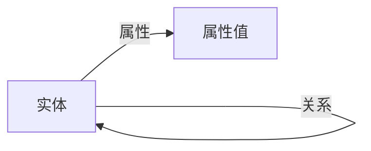

## 1. 背景介绍

### 1.1  什么是知识图谱？

知识图谱（Knowledge Graph）是一种用图模型来表示知识和建模世界万物之间关联关系的大规模语义网络。它由节点和边组成，节点表示实体（entity）或概念（concept），边表示实体/概念之间的关系（relation）。

简单来说，可以将知识图谱看作是一个巨大的“知识库”，它存储了海量的实体信息及其之间的关系，并以一种结构化的形式组织起来，方便计算机理解和利用。

### 1.2 知识图谱的起源与发展

知识图谱的概念最早可以追溯到上世纪七八十年代的专家系统，但真正将其发扬光大的是 Google 公司。2012年，Google 正式推出 Google Knowledge Graph，并将其应用于搜索引擎，极大地提升了搜索结果的准确性和用户体验。

近年来，随着人工智能技术的飞速发展，特别是深度学习、自然语言处理等技术的突破，知识图谱技术也得到了长足的进步，并在各个领域得到了广泛的应用，如：

* **搜索引擎**: 提供更精准的搜索结果、智能问答、语义搜索等服务。
* **推荐系统**: 根据用户的兴趣和历史行为，推荐更符合用户需求的商品、服务或信息。
* **金融风控**:  构建反欺诈、反洗钱等风险控制模型。
* **智能客服**:  提供更加智能化的问答和问题解决方案。
* **医疗健康**:  辅助疾病诊断、药物研发等。

### 1.3 知识图谱的优势

相比于传统的关系型数据库，知识图谱具有以下优势：

* **更强的表达能力**:  能够表达实体之间的复杂关系，而不仅仅是简单的表格数据。
* **更丰富的语义信息**:  包含实体的属性、关系的类型等语义信息，更接近人类的认知方式。
* **更高的数据质量**:  通过数据清洗、实体消歧、关系抽取等技术，可以有效提高数据的准确性和一致性。
* **更强的推理能力**:  可以基于图谱结构和逻辑规则进行推理，发现隐含的知识。

## 2. 核心概念与联系

### 2.1 实体 (Entity)

实体是知识图谱中的基本单元，表示现实世界中客观存在的事物或抽象概念。例如：

* 人物：姚明、李小龙
* 地点：北京、上海
* 机构：谷歌、微软
* 事件：奥运会、世界杯
* 概念：人工智能、机器学习

### 2.2  关系 (Relation)

关系表示实体之间的关联方式，是连接实体的桥梁。例如：

* 出生地：姚明 - 上海
* 职业：李小龙 - 演员
* 首席执行官：谷歌 - 桑达尔·皮查伊
* 举办地点：奥运会 - 北京
* 研究领域：人工智能 - 机器学习

### 2.3  属性 (Property)

属性描述实体的特征或特性，例如：

* 姚明：身高 - 2.26米
* 北京：面积 - 1.641万平方公里
* 谷歌：成立时间 - 1998年

### 2.4 三元组 (Triple)

三元组是知识图谱的基本组成单元，由两个实体和一个关系构成，表示实体之间的一种特定关系。例如：

* (姚明, 出生地, 上海)
* (李小龙, 职业, 演员)
* (谷歌, 首席执行官, 桑达尔·皮查伊)

### 2.5  概念图

为了更好地理解这些概念之间的联系，可以用一个简单的概念图来表示：



## 3. 核心算法原理具体操作步骤

构建知识图谱是一个复杂的过程，通常包括以下步骤：

### 3.1 知识抽取 (Knowledge Extraction)

从非结构化、半结构化和结构化数据中抽取实体、关系和属性信息。常用的技术包括：

* **命名实体识别 (Named Entity Recognition, NER)**:  识别文本中的实体，例如人名、地名、机构名等。
* **关系抽取 (Relation Extraction)**:  识别实体之间的关系，例如父子关系、夫妻关系、工作关系等。
* **属性抽取 (Attribute Extraction)**:  抽取实体的属性信息，例如年龄、性别、身高、体重等。

### 3.2 知识融合 (Knowledge Fusion)

将来自不同数据源的知识进行整合，消除数据冲突和冗余，构建统一的知识库。常用的技术包括：

* **实体消歧 (Entity Disambiguation)**:  将指代同一个实体的不同名称或描述进行统一。
* **关系消歧 (Relation Disambiguation)**:  将语义相同但表达不同的关系进行统一。
* **知识合并 (Knowledge Merging)**:  将来自不同数据源的相同实体或关系的信息进行合并。

### 3.3  知识存储 (Knowledge Storage)

将抽取和融合后的知识存储到数据库中，常用的存储方式包括：

* **关系型数据库 (Relational Database)**:  例如 MySQL、Oracle 等。
* **图数据库 (Graph Database)**:  例如 Neo4j、OrientDB 等。
* **三元组数据库 (Triple Store)**:  例如 Jena、Sesame 等。

### 3.4  知识推理 (Knowledge Reasoning)

基于已有的知识进行推理，发现隐含的知识，例如：

* **基于规则的推理 (Rule-based Reasoning)**:  根据预先定义的规则进行推理。
* **基于图的推理 (Graph-based Reasoning)**:  根据图谱结构和路径进行推理。
* **基于机器学习的推理 (Machine Learning-based Reasoning)**:  利用机器学习算法进行推理。

### 3.5  知识应用 (Knowledge Application)

将构建好的知识图谱应用到实际场景中，例如：

* **语义搜索**:  理解用户的搜索意图，返回更精准的搜索结果。
* **智能问答**:  根据用户的自然语言问题，从知识图谱中找到答案。
* **推荐系统**:  根据用户的兴趣和历史行为，推荐更符合用户需求的商品或服务。

## 4. 数学模型和公式详细讲解举例说明

### 4.1  基于统计的知识抽取

#### 4.1.1  隐马尔可夫模型 (Hidden Markov Model, HMM)

HMM 是一种统计模型，用于对序列数据进行建模。在 NER 任务中，可以将句子看作是一个词语序列，每个词语对应一个状态，HMM 可以用来预测每个词语对应的实体类型。

HMM 的数学模型可以用以下公式表示：

$$
\begin{aligned}
P(S,O|\lambda) &= \sum_{t=1}^T P(O_t|S_t,\lambda)P(S_t|S_{t-1},\lambda) \\
&= \prod_{t=1}^T P(O_t|S_t,\lambda)P(S_t|S_{t-1},\lambda)
\end{aligned}
$$

其中：

* $S$ 表示状态序列，$O$ 表示观测序列。
* $\lambda$ 表示 HMM 的参数，包括状态转移概率矩阵 $A$、观测概率矩阵 $B$ 和初始状态概率分布 $\pi$。
* $P(S,O|\lambda)$ 表示在给定模型参数 $\lambda$ 的情况下，观测到序列 $O$ 并且状态序列为 $S$ 的概率。
* $P(O_t|S_t,\lambda)$ 表示在给定状态 $S_t$ 和模型参数 $\lambda$ 的情况下，观测到 $O_t$ 的概率。
* $P(S_t|S_{t-1},\lambda)$ 表示在给定前一时刻状态 $S_{t-1}$ 和模型参数 $\lambda$ 的情况下，当前时刻状态为 $S_t$ 的概率。

#### 4.1.2  条件随机场 (Conditional Random Field, CRF)

CRF 是一种判别式概率模型，用于对序列数据进行标注。与 HMM 相比，CRF 可以考虑当前词语的上下文信息，因此可以取得更好的标注效果。

CRF 的数学模型可以用以下公式表示：

$$
P(y|x,w) = \frac{1}{Z(x,w)} \exp \left( \sum_{i=1}^n \sum_{k=1}^K w_k f_k(y_i, y_{i-1}, x, i) \right)
$$

其中：

* $y$ 表示标注序列，$x$ 表示观测序列。
* $w$ 表示 CRF 的参数，$f_k(y_i, y_{i-1}, x, i)$ 表示特征函数。
* $Z(x,w)$ 表示归一化因子，确保概率之和为 1。

### 4.2  基于图的知识推理

#### 4.2.1  路径排序算法 (Path Ranking Algorithm, PRA)

PRA 是一种基于图的推理算法，用于预测两个实体之间是否存在某种关系。PRA 的基本思想是，如果两个实体之间存在多条路径，并且这些路径上的关系都是已知的，那么可以通过计算这些路径的得分来预测这两个实体之间是否存在目标关系。

PRA 的数学模型可以用以下公式表示：

$$
score(s, r, t) = \sum_{p \in paths(s, t)} score(p)
$$

其中：

* $s$ 和 $t$ 表示两个实体，$r$ 表示目标关系。
* $paths(s, t)$ 表示连接实体 $s$ 和 $t$ 的所有路径。
* $score(p)$ 表示路径 $p$ 的得分，可以通过路径上关系的置信度来计算。

## 5. 项目实践：代码实例和详细解释说明

### 5.1  使用 Python 构建简单的知识图谱

```python
import networkx as nx

# 创建一个空的图
graph = nx.Graph()

# 添加实体
graph.add_node("姚明", type="人物")
graph.add_node("上海", type="城市")
graph.add_node("演员", type="职业")

# 添加关系
graph.add_edge("姚明", "上海", relation="出生地")
graph.add_edge("姚明", "演员", relation="职业")

# 查询姚明的出生地
birthplace = [target for source, target, relation in graph.edges(data=True) 
              if source == "姚明" and relation['relation'] == "出生地"]
print(birthplace) # 输出：['上海']
```

### 5.2  使用 Neo4j 图数据库存储知识图谱

```cypher
// 创建实体
CREATE (yao:Person { name: "姚明", height: 2.26 })
CREATE (shanghai:City { name: "上海" })
CREATE (actor:Occupation { name: "演员" })

// 创建关系
CREATE (yao)-[:BORN_IN]->(shanghai)
CREATE (yao)-[:OCCUPATION]->(actor)

// 查询姚明的出生地
MATCH (yao:Person { name: "姚明" })-[:BORN_IN]->(city)
RETURN city.name
```

## 6. 实际应用场景

### 6.1  搜索引擎

* **语义理解**: 理解用户的搜索意图，例如区分“苹果手机”和“苹果公司”。
* **知识卡片**:  展示实体的详细信息，例如人物简介、电影信息等。
* **相关推荐**:  推荐与搜索词相关的实体或主题。

### 6.2  推荐系统

* **个性化推荐**:  根据用户的兴趣和历史行为，推荐更符合用户需求的商品或服务。
* **知识解释**:  解释推荐理由，例如“因为你购买过类似的商品”。
* **冷启动问题**:  解决新用户或新商品的推荐问题。

### 6.3  金融风控

* **反欺诈**:  识别虚假交易、虚假账户等欺诈行为。
* **反洗钱**:  追踪资金流动，识别洗钱行为。
* **风险评估**:  评估客户的信用风险、市场风险等。

## 7. 总结：未来发展趋势与挑战

### 7.1  未来发展趋势

* **更大规模的知识图谱**:  构建包含数百亿甚至数千亿实体和关系的超大规模知识图谱。
* **多模态知识图谱**:  融合文本、图像、音频、视频等多模态信息，构建更全面的知识表示。
* **动态知识图谱**:  实时更新知识图谱，反映最新的知识变化。
* **知识图谱与深度学习的融合**:  将深度学习技术应用于知识图谱的构建、推理和应用。

### 7.2  挑战

* **知识获取**:  如何高效地从海量数据中获取高质量的知识。
* **知识融合**:  如何解决知识冲突和冗余问题，构建统一的知识库。
* **知识推理**:  如何进行高效、准确的知识推理。
* **知识应用**:  如何将知识图谱应用到更广泛的领域。


## 8. 附录：常见问题与解答

### 8.1  什么是知识图谱嵌入？

知识图谱嵌入 (Knowledge Graph Embedding) 是将知识图谱中的实体和关系映射到低维向量空间的技术，可以有效解决数据稀疏性和计算效率问题。

### 8.2  什么是知识图谱补全？

知识图谱补全 (Knowledge Graph Completion) 是指预测知识图谱中缺失的关系或实体，可以用于知识发现和推理。

### 8.3  有哪些常用的知识图谱工具和资源？

* **工具**:  Neo4j、OrientDB、Jena、Sesame、Protégé
* **资源**:  DBpedia、Freebase、YAGO、NELL、ConceptNet

### 8.4  学习知识图谱需要哪些基础知识？

* 数据结构与算法
* 数据库原理
* 人工智能基础
* 自然语言处理
* 机器学习