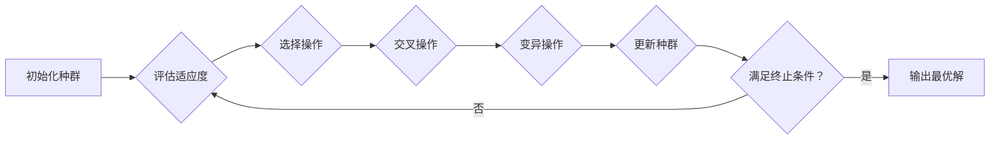

# 遗传算法与其他启发式算法的比较

作者：禅与计算机程序设计艺术

## 1. 背景介绍

### 1.1 优化问题的普遍性和挑战性

在科学、工程、金融等各个领域，我们经常面临着寻找最优解的问题。这些问题通常涉及到大量的变量、复杂的约束条件以及非线性的目标函数，使用传统的数学优化方法难以求解。

### 1.2 启发式算法的兴起

为了解决这些复杂的优化问题，人们发展了一系列启发式算法。启发式算法是一种基于直觉和经验的优化方法，它不追求找到全局最优解，而是致力于在可接受的时间内找到一个近似最优解。

### 1.3 遗传算法：一种模拟自然选择的优化算法

遗传算法（Genetic Algorithm, GA）是一种模拟自然选择和遗传机制的启发式算法。它将问题的解编码为染色体，通过模拟种群的遗传和进化过程，不断迭代优化，最终得到问题的近似最优解。

## 2. 核心概念与联系

### 2.1 遗传算法的核心概念

* **染色体（Chromosome）**:  问题的解被编码成一串符号，称为染色体。
* **基因（Gene）**: 染色体上的每个符号代表一个基因，对应着问题的一个变量。
* **种群（Population）**: 一组染色体构成一个种群，代表着一组候选解。
* **适应度函数（Fitness Function）**: 用于评估每个染色体（解）的优劣。
* **选择（Selection）**:  根据适应度函数，选择优秀的染色体进行繁殖。
* **交叉（Crossover）**: 将两个父代染色体的一部分基因进行交换，产生新的子代染色体。
* **变异（Mutation）**:  随机改变染色体上的某个基因，增加种群的多样性。

### 2.2 遗传算法与其他启发式算法的联系

遗传算法与其他启发式算法，如模拟退火算法、粒子群算法等，都属于元启发式算法（Metaheuristic Algorithm）。它们都具有以下共同特点：

* **不依赖于问题的具体领域知识**: 可以应用于各种类型的优化问题。
* **能够处理复杂的非线性问题**: 对目标函数和约束条件没有严格的限制。
* **具有较强的全局搜索能力**:  能够跳出局部最优解，找到更好的解。

## 3. 核心算法原理具体操作步骤

### 3.1 遗传算法的流程图



### 3.2 遗传算法的操作步骤

1. **初始化种群**: 随机生成一定数量的染色体，构成初始种群。
2. **评估适应度**:  根据适应度函数，计算每个染色体的适应度值。
3. **选择操作**:  根据适应度值，选择优秀的染色体进入下一代。常用的选择方法有轮盘赌选择、锦标赛选择等。
4. **交叉操作**:  将两个父代染色体的一部分基因进行交换，产生新的子代染色体。常用的交叉方法有单点交叉、多点交叉等。
5. **变异操作**:  随机改变染色体上的某个基因，增加种群的多样性。常用的变异方法有位翻转变异、高斯变异等。
6. **更新种群**: 用新生成的子代种群替换父代种群。
7. **判断终止条件**:  判断是否满足终止条件，例如达到最大迭代次数、找到满足要求的解等。如果满足终止条件，则输出最优解；否则，返回步骤2继续迭代。

## 4. 数学模型和公式详细讲解举例说明

### 4.1 适应度函数

适应度函数是遗传算法的核心，它用于评估每个染色体的优劣。适应度函数的设计应该与具体的问题相关联，能够准确地反映解的质量。

**举例:**

假设我们要解决一个旅行商问题（TSP），目标是找到一条访问所有城市且总距离最短的路径。我们可以将路径编码成一个染色体，每个基因代表一个城市。适应度函数可以定义为路径的总距离，距离越短，适应度越高。

### 4.2 选择操作

选择操作的目的是选择适应度高的染色体进入下一代，常用的选择方法有：

* **轮盘赌选择（Roulette Wheel Selection）**:  每个染色体被选中的概率与其适应度值成正比。
* **锦标赛选择（Tournament Selection）**:  每次随机选择 k 个染色体，选择其中适应度最高的染色体进入下一代。

**公式:**

* **轮盘赌选择**:  $P_i = \frac{f_i}{\sum_{j=1}^{N} f_j}$，其中 $P_i$ 表示第 i 个染色体被选中的概率，$f_i$ 表示第 i 个染色体的适应度值，N 表示种群大小。
* **锦标赛选择**:  $P_i = \frac{1}{k} \sum_{j=1}^{k} I(f_i \ge f_j)$，其中 $I(x)$ 表示指示函数，当 x 为真时，$I(x) = 1$，否则 $I(x) = 0$。

### 4.3 交叉操作

交叉操作的目的是将两个父代染色体的基因进行交换，产生新的子代染色体。常用的交叉方法有：

* **单点交叉（Single-Point Crossover）**:  随机选择一个交叉点，将两个父代染色体在交叉点处断裂，并将断裂后的片段进行交换。
* **多点交叉（Multi-Point Crossover）**:  随机选择多个交叉点，将两个父代染色体在交叉点处断裂，并将断裂后的片段进行交换。

**举例:**

假设有两个父代染色体：

```
父代 1: 1 0 1 1 0
父代 2: 0 1 0 0 1
```

如果选择单点交叉，交叉点为 2，则生成的子代染色体为：

```
子代 1: 1 0 0 0 1
子代 2: 0 1 1 1 0
```

### 4.4 变异操作

变异操作的目的是随机改变染色体上的某个基因，增加种群的多样性。常用的变异方法有：

* **位翻转变异（Bit Flip Mutation）**:  随机选择一个基因，将其值取反。
* **高斯变异（Gaussian Mutation）**:  将基因的值加上一个服从高斯分布的随机数。

**举例:**

假设有一个染色体：

```
染色体: 1 0 1 1 0
```

如果选择位翻转变异，变异点为 3，则变异后的染色体为：

```
变异后的染色体: 1 0 0 1 0
```

## 5. 项目实践：代码实例和详细解释说明

### 5.1 Python 代码实现

```python
import random

# 定义适应度函数
def fitness_function(chromosome):
    # 计算染色体的适应度值
    # ...
    return fitness

# 定义遗传算法类
class GeneticAlgorithm:
    def __init__(self, population_size, chromosome_length, fitness_function,
                 selection_rate=0.5, crossover_rate=0.7, mutation_rate=0.01):
        self.population_size = population_size
        self.chromosome_length = chromosome_length
        self.fitness_function = fitness_function
        self.selection_rate = selection_rate
        self.crossover_rate = crossover_rate
        self.mutation_rate = mutation_rate

    # 初始化种群
    def initialize_population(self):
        population = []
        for i in range(self.population_size):
            chromosome = [random.randint(0, 1) for j in range(self.chromosome_length)]
            population.append(chromosome)
        return population

    # 评估适应度
    def evaluate_fitness(self, population):
        fitness_values = []
        for chromosome in population:
            fitness = self.fitness_function(chromosome)
            fitness_values.append(fitness)
        return fitness_values

    # 选择操作
    def selection(self, population, fitness_values):
        selected_population = []
        # ...
        return selected_population

    # 交叉操作
    def crossover(self, population):
        offspring_population = []
        # ...
        return offspring_population

    # 变异操作
    def mutation(self, population):
        mutated_population = []
        # ...
        return mutated_population

    # 运行遗传算法
    def run(self, max_generations):
        # 初始化种群
        population = self.initialize_population()

        # 迭代进化
        for generation in range(max_generations):
            # 评估适应度
            fitness_values = self.evaluate_fitness(population)

            # 选择操作
            selected_population = self.selection(population, fitness_values)

            # 交叉操作
            offspring_population = self.crossover(selected_population)

            # 变异操作
            mutated_population = self.mutation(offspring_population)

            # 更新种群
            population = mutated_population

            # 输出当前最优解
            best_chromosome = max(population, key=self.fitness_function)
            best_fitness = self.fitness_function(best_chromosome)
            print(f"Generation {generation}: Best fitness = {best_fitness}")

        # 输出最终最优解
        best_chromosome = max(population, key=self.fitness_function)
        best_fitness = self.fitness_function(best_chromosome)
        print(f"Final solution: {best_chromosome}, fitness = {best_fitness}")

# 实例化遗传算法对象
ga = GeneticAlgorithm(population_size=100, chromosome_length=10, fitness_function=fitness_function)

# 运行遗传算法
ga.run(max_generations=100)
```

### 5.2 代码解释

* `fitness_function(chromosome)`: 定义适应度函数，根据染色体计算适应度值。
* `GeneticAlgorithm` 类: 定义遗传算法类，包含初始化种群、评估适应度、选择、交叉、变异、运行等方法。
* `initialize_population()`: 初始化种群，随机生成一定数量的染色体。
* `evaluate_fitness(population)`: 评估适应度，根据适应度函数计算每个染色体的适应度值。
* `selection(population, fitness_values)`: 选择操作，根据适应度值选择优秀的染色体进入下一代。
* `crossover(population)`: 交叉操作，将两个父代染色体的基因进行交换，产生新的子代染色体。
* `mutation(population)`: 变异操作，随机改变染色体上的某个基因，增加种群的多样性。
* `run(max_generations)`: 运行遗传算法，迭代进化，直到达到最大迭代次数。

## 6. 实际应用场景

### 6.1 函数优化

遗传算法可以用于求解各种类型的函数优化问题，例如：

* **连续函数优化**:  例如，求解 $f(x) = x^2 + 2x + 1$ 的最小值。
* **离散函数优化**:  例如，求解背包问题，选择价值总和最大且重量不超过背包容量的物品组合。

### 6.2 组合优化

遗传算法也适用于解决各种组合优化问题，例如：

* **旅行商问题（TSP）**:  找到一条访问所有城市且总距离最短的路径。
* **调度问题**:  例如，安排机器加工任务的顺序，使得总加工时间最短。
* **资源分配问题**:  例如，将有限的资源分配给不同的任务，使得收益最大化。

### 6.3 机器学习

遗传算法可以用于机器学习中的特征选择、参数优化等方面，例如：

* **特征选择**:  从众多特征中选择最优的特征子集，用于构建机器学习模型。
* **参数优化**:  自动调整机器学习模型的参数，提高模型的性能。

## 7. 工具和资源推荐

### 7.1 Python 库

* **DEAP**:  一个用于快速原型设计和测试进化算法的 Python 框架。
* **PyGAD**:  一个用于实现遗传算法的 Python 库。

### 7.2 在线资源

* **遗传算法教程**:  https://www.tutorialspoint.com/genetic_algorithms/index.htm
* **遗传算法维基百科**:  https://en.wikipedia.org/wiki/Genetic_algorithm

## 8. 总结：未来发展趋势与挑战

### 8.1 未来发展趋势

* **并行遗传算法**:  利用多核 CPU 或 GPU 加速遗传算法的运行速度。
* **多目标遗传算法**:  同时优化多个目标函数。
* **自适应遗传算法**:  根据算法的运行状态，动态调整算法的参数。

### 8.2 挑战

* **参数设置**:  遗传算法的性能对参数设置比较敏感，需要根据具体的问题进行调整。
* **早熟收敛**:  遗传算法容易陷入局部最优解，需要采取措施避免早熟收敛。
* **计算复杂度**:  对于大规模问题，遗传算法的计算复杂度较高。

## 9. 附录：常见问题与解答

### 9.1 遗传算法与其他启发式算法相比，有什么优缺点？

**优点**:

* **全局搜索能力强**:  遗传算法能够跳出局部最优解，找到更好的解。
* **适用范围广**:  遗传算法可以应用于各种类型的优化问题。
* **易于实现**:  遗传算法的原理简单，易于实现。

**缺点**:

* **参数设置困难**:  遗传算法的性能对参数设置比较敏感，需要根据具体的问题进行调整。
* **早熟收敛**:  遗传算法容易陷入局部最优解，需要采取措施避免早熟收敛。
* **计算复杂度高**:  对于大规模问题，遗传算法的计算复杂度较高。

### 9.2 如何选择合适的遗传算法参数？

遗传算法的参数设置是一个比较复杂的问题，需要根据具体的问题进行调整。一般来说，可以采用以下方法：

* **经验法**:  根据经验选择参数，例如种群大小、交叉率、变异率等。
* **实验法**:  通过实验比较不同参数设置下的算法性能，选择性能最好的参数。
* **自适应方法**:  根据算法的运行状态，动态调整算法的参数。


### 9.3 如何避免遗传算法的早熟收敛？

为了避免遗传算法的早熟收敛，可以采取以下措施：

* **增加种群多样性**:  例如，采用不同的初始化方法、增加变异率等。
* **改进选择操作**:  例如，采用锦标赛选择、排序选择等方法，避免适应度高的染色体过早地占据种群。
* **引入精英策略**:  将每一代最优的个体直接保留到下一代，避免优秀基因的丢失。
