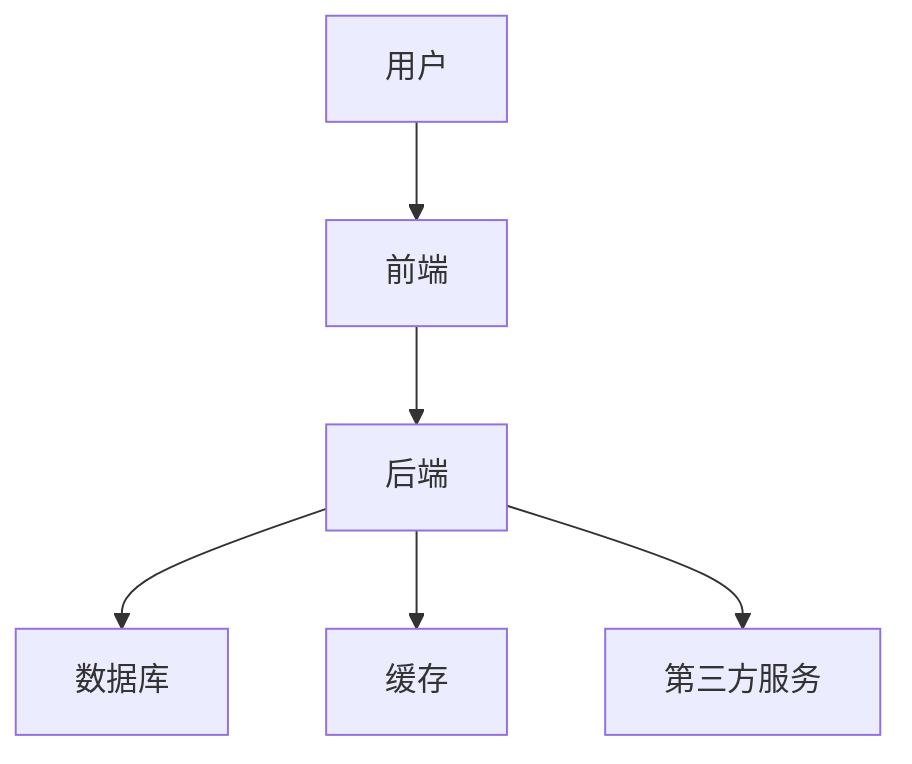

# 音像销售系统的设计与实现

作者：禅与计算机程序设计艺术

## 1. 背景介绍

### 1.1 音像销售系统的背景

音像产品一直是文化产业的重要组成部分，随着互联网的发展，音像产品的销售渠道从传统的实体店逐渐转向线上平台。音像销售系统的设计与实现旨在满足用户便捷购买音像产品的需求，同时为商家提供高效的管理工具。本文将深入探讨音像销售系统的设计与实现，从系统架构、核心算法、项目实践等多个方面进行详细阐述。

### 1.2 研究的意义和目的

设计和实现一个高效的音像销售系统不仅能够提升用户体验，还能显著提高商家的运营效率。通过系统化的设计，商家可以更好地管理库存、订单和客户信息，从而实现业务的快速增长。本研究旨在提供一个全面的解决方案，涵盖从系统设计到实际应用的各个环节。

### 1.3 文章结构

本文将按照以下结构展开：
- 背景介绍
- 核心概念与联系
- 核心算法原理具体操作步骤
- 数学模型和公式详细讲解举例说明
- 项目实践：代码实例和详细解释说明
- 实际应用场景
- 工具和资源推荐
- 总结：未来发展趋势与挑战
- 附录：常见问题与解答

## 2. 核心概念与联系

### 2.1 系统架构

音像销售系统的架构设计是实现系统高效运行的基础。系统架构通常包括以下几个部分：

- 前端：用户界面，负责与用户交互
- 后端：业务逻辑，处理用户请求并与数据库交互
- 数据库：存储用户、订单、产品等数据
- 缓存：提高系统响应速度
- 第三方服务：支付、物流等



### 2.2 数据流分析

数据流是系统设计中的重要环节，合理的数据流设计可以提高系统的效率和稳定性。在音像销售系统中，主要的数据流包括：

- 用户注册、登录
- 浏览和搜索音像产品
- 添加商品到购物车
- 提交订单
- 支付和确认订单
- 订单发货和收货确认
- 用户评价和反馈

### 2.3 业务流程

音像销售系统的业务流程可以分为以下几个主要步骤：

1. 用户注册和登录：用户通过注册成为系统的合法用户，并通过登录获取访问权限。
2. 商品浏览和搜索：用户可以浏览系统中的音像产品，或者通过搜索功能快速找到目标商品。
3. 购物车管理：用户可以将心仪的商品加入购物车，并进行数量和规格的调整。
4. 订单提交和支付：用户确认购物车中的商品后，提交订单并进行支付。
5. 订单处理：系统接收到订单后，进行库存检查、订单生成和发货处理。
6. 用户评价和反馈：用户收到商品后，可以对商品和服务进行评价和反馈。

## 3. 核心算法原理具体操作步骤

### 3.1 用户推荐算法

用户推荐算法是音像销售系统中的关键算法之一，通过分析用户的购买行为和兴趣偏好，为用户推荐可能感兴趣的商品。常用的推荐算法包括协同过滤、基于内容的推荐和混合推荐。

#### 3.1.1 协同过滤算法

协同过滤算法分为基于用户的协同过滤和基于项目的协同过滤。基于用户的协同过滤通过计算用户之间的相似度，推荐相似用户喜欢的商品；基于项目的协同过滤通过计算商品之间的相似度，推荐相似商品。

#### 3.1.2 基于内容的推荐

基于内容的推荐通过分析商品的属性和用户的兴趣偏好，推荐与用户历史购买记录相似的商品。

#### 3.1.3 混合推荐

混合推荐结合了协同过滤和基于内容的推荐，综合利用两者的优势，提高推荐的准确性和多样性。

### 3.2 库存管理算法

库存管理算法是保障系统稳定运行的重要环节，通过合理的库存管理，避免缺货和积压。常用的库存管理算法包括：

- 经济订货量（EOQ）模型
- 安全库存模型
- 动态库存管理

### 3.3 订单处理算法

订单处理算法包括订单生成、支付确认、发货处理等步骤。订单处理的关键在于提高处理效率，减少用户等待时间。常用的订单处理算法包括：

- 订单优先级排序
- 并行处理
- 异步处理

## 4. 数学模型和公式详细讲解举例说明

### 4.1 经济订货量（EOQ）模型

经济订货量模型用于确定最优的订货量，以最小化总成本。EOQ模型的公式为：

$$
EOQ = \sqrt{\frac{2DS}{H}}
$$

其中：
- $D$ 为年需求量
- $S$ 为每次订货的固定成本
- $H$ 为单位库存的年持有成本

### 4.2 协同过滤算法中的相似度计算

在协同过滤算法中，常用的相似度计算方法包括余弦相似度和皮尔逊相关系数。

#### 4.2.1 余弦相似度

余弦相似度用于计算两个用户或商品之间的相似度，其公式为：

$$
\text{Cosine Similarity} = \frac{\sum_{i=1}^{n} A_iB_i}{\sqrt{\sum_{i=1}^{n} A_i^2} \cdot \sqrt{\sum_{i=1}^{n} B_i^2}}
$$

#### 4.2.2 皮尔逊相关系数

皮尔逊相关系数用于计算两个变量之间的线性相关性，其公式为：

$$
\text{Pearson Correlation} = \frac{\sum_{i=1}^{n} (A_i - \bar{A})(B_i - \bar{B})}{\sqrt{\sum_{i=1}^{n} (A_i - \bar{A})^2} \cdot \sqrt{\sum_{i=1}^{n} (B_i - \bar{B})^2}}
$$

### 4.3 动态库存管理

动态库存管理通过实时监控库存水平，动态调整订货策略。常用的动态库存管理模型包括：

#### 4.3.1 (s, S) 策略

(s, S) 策略规定当库存水平下降到 $s$ 时，订货使库存水平上升到 $S$。其公式为：

$$
Q = S - I
$$

其中：
- $Q$ 为订货量
- $I$ 为当前库存水平

## 5. 项目实践：代码实例和详细解释说明

### 5.1 用户推荐算法的实现

以下是一个基于协同过滤的用户推荐算法的实现：

```python
import numpy as np
from sklearn.metrics.pairwise import cosine_similarity

# 用户-商品评分矩阵
user_item_matrix = np.array([
    [5, 4, 0, 0],
    [4, 0, 0, 2],
    [0, 0, 5, 4],
    [0, 3, 4, 0]
])

# 计算用户相似度矩阵
user_similarity = cosine_similarity(user_item_matrix)

# 为用户进行推荐
def recommend_items(user_id, user_item_matrix, user_similarity, top_n=2):
    user_ratings = user_item_matrix[user_id]
    similar_users = np.argsort(-user_similarity[user_id])
    
    recommendations = []
    for similar_user in similar_users:
        if similar_user != user_id:
            similar_user_ratings = user_item_matrix[similar_user]
            for item_id, rating in enumerate(similar_user_ratings):
                if rating > 0 and user_ratings[item_id] == 0:
                    recommendations.append((item_id, rating))
        if len(recommendations) >= top_n:
            break
    return recommendations

# 为用户0推荐商品
recommendations = recommend_items(0, user_item_matrix, user_similarity)
print(f"Recommendations for user 0: {recommendations}")
```

### 5.2 库存管理算法的实现

以下是一个简单的经济订货量（EOQ）模型的实现：

```python
import math

# 经济订货量模型
def eoq(demand, order_cost, holding_cost):
    return math.sqrt((2 * demand * order_cost) / holding_cost)

# 示例参数
annual_demand = 1000
order_cost = 50
holding_cost = 5

# 计算经济