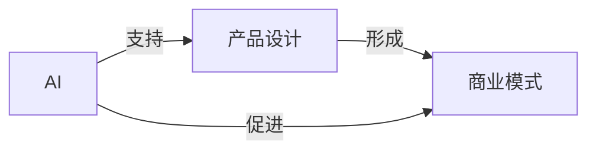

## 1.背景介绍

在当前的科技环境中，人工智能（Artificial Intelligence，AI）已经渗透到我们生活的各个方面。从自动驾驶汽车到语音识别，AI的应用越来越广泛。尤其是在商业领域，AI正在逐渐改变我们的生产方式和消费模式。然而，如何有效地将AI技术融合到产品设计和商业模式中，仍然是一个具有挑战性的问题。本文将深入探讨AI商业模式和产品设计的原理，并通过实战案例进行讲解。

## 2.核心概念与联系

在我们深入讨论之前，首先需要理解几个核心概念：AI、商业模式和产品设计。

- **AI**：AI是模拟人类智能的系统，通过学习、推理、问题解决、感知、语言理解等过程来实现。

- **商业模式**：商业模式是公司创造、传递和获取价值的方式。这包括了公司的产品或服务、目标市场、营销策略等。

- **产品设计**：产品设计是创建新产品或改进现有产品的过程，以满足用户的需求或解决特定问题。

这三者之间的关系可以用以下的Mermaid流程图来表示：



## 3.核心算法原理具体操作步骤

AI的核心算法包括机器学习（Machine Learning）、深度学习（Deep Learning）等。这些算法通过从大量数据中学习，使AI系统能够进行预测、决策等操作。

例如，我们可以使用深度学习算法来设计一个推荐系统。以下是操作步骤：

1. **数据收集**：收集用户的历史购买记录、浏览记录等数据。
2. **数据预处理**：清洗数据，将非结构化数据转化为结构化数据。
3. **模型训练**：使用深度学习算法训练模型，使其能够根据用户的历史行为预测其未来的行为。
4. **模型测试**：使用测试数据来评估模型的性能。
5. **模型部署**：将训练好的模型部署到生产环境中，为用户提供推荐服务。

## 4.数学模型和公式详细讲解举例说明

在深度学习中，我们常常使用神经网络（Neural Networks）作为模型。神经网络由多个层组成，每一层都包含了一些神经元（Neurons）。每个神经元都有一个权重（Weight）和偏置（Bias），通过这两个参数，神经元可以对输入数据进行线性变换。

神经元的输出可以用以下的公式表示：

$$
y = f(\sum_{i=1}^{n} w_i x_i + b)
$$

其中，$y$ 是神经元的输出，$f$ 是激活函数（Activation Function），$w_i$ 是第 $i$ 个输入的权重，$x_i$ 是第 $i$ 个输入，$b$ 是偏置。

例如，我们可以使用 ReLU（Rectified Linear Unit）作为激活函数，它的公式为：

$$
f(x) = max(0, x)
$$

这意味着，如果神经元的输入大于0，那么输出就是输入本身；如果输入小于0，那么输出就是0。

## 4.项目实践：代码实例和详细解释说明

以下是一个使用 Python 和 TensorFlow 构建深度学习模型的例子。我们将使用 MNIST 数据集，这是一个包含了手写数字的图像数据集。

首先，我们需要导入所需的库：

```python
import tensorflow as tf
from tensorflow.keras.datasets import mnist
from tensorflow.keras.models import Sequential
from tensorflow.keras.layers import Dense, Dropout, Flatten
from tensorflow.keras.layers import Conv2D, MaxPooling2D
```

然后，我们可以加载 MNIST 数据集：

```python
(x_train, y_train), (x_test, y_test) = mnist.load_data()
```

接下来，我们需要对数据进行预处理：

```python
x_train = x_train.reshape(x_train.shape[0], 28, 28, 1)
x_test = x_test.reshape(x_test.shape[0], 28, 28, 1)
x_train = x_train.astype('float32')
x_test = x_test.astype('float32')
x_train /= 255
x_test /= 255
```

现在，我们可以定义我们的模型了：

```python
model = Sequential()
model.add(Conv2D(32, kernel_size=(3, 3),
                 activation='relu',
                 input_shape=(28, 28, 1)))
model.add(Conv2D(64, (3, 3), activation='relu'))
model.add(MaxPooling2D(pool_size=(2, 2)))
model.add(Dropout(0.25))
model.add(Flatten())
model.add(Dense(128, activation='relu'))
model.add(Dropout(0.5))
model.add(Dense(10, activation='softmax'))
```

最后，我们可以训练模型，并对其进行评估：

```python
model.compile(loss=tf.keras.losses.sparse_categorical_crossentropy,
              optimizer=tf.keras.optimizers.Adadelta(),
              metrics=['accuracy'])

model.fit(x_train, y_train,
          batch_size=128,
          epochs=10,
          verbose=1,
          validation_data=(x_test, y_test))

score = model.evaluate(x_test, y_test, verbose=0)
print('Test loss:', score[0])
print('Test accuracy:', score[1])
```

## 5.实际应用场景

AI在商业模式和产品设计中的应用非常广泛。例如：

- **个性化推荐**：如Netflix和Amazon的推荐系统，根据用户的历史行为和兴趣，推荐他们可能喜欢的电影或商品。

- **智能客服**：如Apple的Siri和Google的Assistant，可以自动回答用户的问题，提供服务。

- **预测分析**：如Google的预测流量工具，可以预测未来的网站流量，帮助企业进行决策。

- **自动驾驶**：如Tesla的自动驾驶汽车，可以自动驾驶，提供安全和便捷的出行服务。

## 6.工具和资源推荐

以下是一些有用的AI工具和资源：

- **TensorFlow**：Google开发的开源深度学习框架。
- **Keras**：基于Python的开源深度学习库，可以方便地构建和训练深度学习模型。
- **Scikit-learn**：基于Python的开源机器学习库，包含了大量的机器学习算法。
- **PyTorch**：Facebook开发的开源深度学习框架，支持GPU加速。

## 7.总结：未来发展趋势与挑战

随着AI技术的发展，我们可以预见到更多的商业模式和产品设计将被AI所改变。然而，同时也面临着一些挑战，如数据安全、隐私保护、算法公平性等问题。我们需要在发展AI的同时，也要关注这些问题，以实现AI的可持续发展。

## 8.附录：常见问题与解答

1. **Q：AI的商业模式有哪些？**
   A：AI的商业模式有很多，例如SaaS（Software as a Service），即将AI作为服务提供给客户；还有通过AI驱动的广告投放，如Google AdSense等。

2. **Q：如何将AI融入到产品设计中？**
   A：首先，需要明确产品的目标和用户需求；然后，选择合适的AI技术，如机器学习、深度学习等；最后，通过迭代和优化，不断提高产品的性能和用户体验。

3. **Q：AI在商业中的应用有哪些？**
   A：AI在商业中的应用非常广泛，包括个性化推荐、预测分析、智能客服、自动驾驶等。

4. **Q：如何学习AI？**
   A：可以通过在线课程、书籍、教程等资源来学习AI。重要的是，需要动手实践，通过项目来提升自己的技能。

5. **Q：AI的未来发展趋势是什么？**
   A：AI的未来发展趋势包括AI的自动化、解释性AI、AI的安全性和隐私保护等。

希望这篇文章能帮助你对AI商业模式与产品设计有更深入的理解，也期待你在AI的世界中探索出更多的可能性。