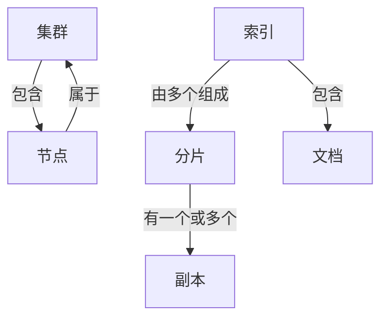

# ElasticSearch 原理与代码实例讲解

## 1.背景介绍

### 1.1 什么是ElasticSearch

ElasticSearch是一个分布式、RESTful风格的搜索和数据分析引擎,它能够以接近实时的速度存储、搜索和分析大量数据。它基于Apache Lucene构建,并扩展了其功能,提供了分布式多租户能力、高可用性、可水平扩展等特性。

ElasticSearch被广泛应用于日志处理、全文搜索、数据分析等场景,并且与Logstash和Kibana一起构成了ELK(ElasticSearch、Logstash、Kibana)技术栈,被大量企业和组织使用。

### 1.2 ElasticSearch的优势

- **高性能** - ElasticSearch能够快速处理大规模数据,提供近实时的搜索体验。
- **分布式** - ElasticSearch可以轻松地扩展到数百台服务器,处理PB级数据。
- **多租户** -支持多索引、多用户、安全控制等功能,保证数据安全。
- **RESTful** - ElasticSearch提供简单的RESTful API,任何编程语言都可以方便地和它进行交互。
- **集群扩展性** - ElasticSearch可以在任何时候轻松地扩展和缩小。
- **高可用** - ElasticSearch提供了多种高可用特性,保证数据不会丢失。

### 1.3 ElasticSearch的应用场景

- **日志处理和分析**
- **全文搜索**
- **数据分析**
- **安全分析**
- **商业数据分析**
- **地理位置查询**
- **自动完成和建议**

## 2.核心概念与联系

### 2.1 核心概念

在开始深入了解ElasticSearch之前,我们需要先理解一些核心概念:

- **集群(Cluster)** - 一个集群是由一个或多个节点组成的,它们共同保存整个数据,并在所有节点上提供联合索引和搜索功能。
- **节点(Node)** - 节点是指运行ElasticSearch的单个服务器实例,作为集群的一部分,它可以存储数据,也可以参与集群的索引和搜索功能。
- **索引(Index)** - 索引是ElasticSearch中的逻辑数据空间,用于存储关联的文档数据。
- **类型(Type)** - 类型是索引的逻辑分类/分区,通常用于区分同一索引下不同类型的数据。(注:ElasticSearch 7.x 版本中已经移除了类型的概念)
- **文档(Document)** - 文档是ElasticSearch中可被索引的基本数据单元,以JSON格式表示。
- **分片(Shard)** - 分片是索引的水平分区,每个分片实际上是一个Lucene索引。
- **副本(Replica)** - 副本是分片的水平副本,用于提高数据冗余性,防止数据丢失。

### 2.2 核心概念之间的关系

ElasticSearch的核心概念之间存在以下关系:

- **集群** 包含 **多个节点**
- **节点** 属于 **一个集群**
- **索引** 由 **多个分片**组成
- **分片** 有 **一个或多个副本**
- **索引** 包含 **多个文档**

这些概念之间的关系如下图所示:



理解这些概念及其关系对于正确使用和管理ElasticSearch至关重要。

## 3.核心算法原理具体操作步骤

### 3.1 倒排索引

ElasticSearch的核心是**倒排索引**,它是对传统的两级索引(文档->单词列表)的一种改进。倒排索引由两部分组成:

1. **单词词典(Term Dictionary)** - 记录所有不重复的单词
2. **倒排文件(Postings File)** - 记录了单词对应的文档列表

这种索引结构可以高效地响应诸如"查找包含单词X的文档"之类的查询。

倒排索引的创建过程大致如下:

1. **收集文档** - 收集需要建立索引的文档数据
2. **文本分析** - 对文档内容进行分词、小写、去除标点等文本处理
3. **创建单词词典** - 统计并记录所有不重复的单词
4. **创建倒排文件** - 为每个单词记录其所在文档的列表
5. **持久化存储** - 将倒排索引持久化存储到磁盘

### 3.2 查询流程

当用户发出一个查询请求时,ElasticSearch的查询流程大致如下:

1. **查询解析** - 解析并分析查询字符串
2. **单词词典查找** - 查找单词词典,获取单词对应的倒排文件列表
3. **合并结果** - 根据查询需求(AND、OR等)合并倒排文件列表
4. **排序结果** - 根据相关性算分规则对结果进行排序
5. **返回结果** - 将排序后的结果返回给用户

这个过程非常高效,可以在海量数据中快速找到匹配的结果。

### 3.3 分布式架构

为了支持大规模数据和高并发场景,ElasticSearch采用了分布式架构。主要原理如下:

1. **数据分片** - 索引被水平分片存储在多个分片上
2. **节点分布** - 每个分片被分布在不同的节点上
3. **副本机制** - 每个分片都有一个或多个副本,提高数据冗余性
4. **集群发现** - 节点通过集群发现机制自动找到彼此,组成集群
5. **请求路由** - 请求被智能路由到正确的分片节点上

这种分布式架构可以实现数据和查询的水平扩展,提高系统的吞吐量和可用性。

## 4.数学模型和公式详细讲解举例说明

### 4.1 相关性算分模型

ElasticSearch使用**BM25**算法来计算查询与文档的相关性得分。BM25算法的公式如下:

$$
\mathrm{score}(D,Q) = \sum_{q \in Q} \mathrm{IDF}(q) \cdot \frac{f(q,D) \cdot (k_1+1)}{f(q,D)+k_1\cdot\left(1-b+b\cdot\frac{|D|}{avgdl}\right)}
$$

其中:

- $D$ 表示文档
- $Q$ 表示查询
- $q$ 表示查询中的单词
- $f(q,D)$ 表示单词 $q$ 在文档 $D$ 中出现的频率
- $|D|$ 表示文档 $D$ 的长度(字数)
- $avgdl$ 表示文档集合的平均长度
- $k_1$ 和 $b$ 是调节因子,用于控制词频和文档长度的影响程度

$\mathrm{IDF}(q)$ 表示单词 $q$ 的逆向文档频率,用于衡量单词的重要程度,公式如下:

$$
\mathrm{IDF}(q) = \log\frac{N-n(q)+0.5}{n(q)+0.5}
$$

其中 $N$ 表示文档总数,$n(q)$ 表示包含单词 $q$ 的文档数量。

通过这个算法,ElasticSearch可以综合考虑词频、文档长度和词条重要性等因素,计算出查询与文档的相关性得分,并按得分排序返回结果。

### 4.2 向量空间模型

除了BM25算法,ElasticSearch还支持**向量空间模型(VSM)**进行相似度计算。VSM将文档表示为一个向量,每个维度对应一个单词的权重,通过计算文档向量和查询向量的夹角余弦值(余弦相似度)来衡量相似程度。

假设文档向量为 $\vec{D}$,查询向量为 $\vec{Q}$,则它们的余弦相似度公式为:

$$
\mathrm{sim}(\vec{D},\vec{Q}) = \frac{\vec{D}\cdot\vec{Q}}{|\vec{D}||\vec{Q}|} = \frac{\sum\limits_{i=1}^{n}w_{d_i}w_{q_i}}{\sqrt{\sum\limits_{i=1}^{n}w_{d_i}^2}\sqrt{\sum\limits_{i=1}^{n}w_{q_i}^2}}
$$

其中 $w_{d_i}$ 和 $w_{q_i}$ 分别表示文档向量和查询向量中第 $i$ 个维度的权重。

VSM可以很好地捕捉文档和查询之间的语义相似性,常用于相似文档搜索、个性化推荐等场景。

## 5.项目实践:代码实例和详细解释说明

本节将通过代码示例演示如何使用ElasticSearch的Java客户端API进行基本的数据操作。

### 5.1 创建ElasticSearch客户端

首先,我们需要创建一个ElasticSearch客户端实例,用于与ElasticSearch集群进行交互。

```java
// 创建RestHighLevelClient客户端
RestHighLevelClient client = new RestHighLevelClient(
    RestClient.builder(
        new HttpHost("localhost", 9200, "http")
    )
);
```

这里我们使用了`RestHighLevelClient`客户端,它提供了更高级的API,比底层的`RestClient`更易于使用。

### 5.2 创建索引

接下来,我们创建一个名为"products"的索引,用于存储产品数据。

```java
// 创建索引请求
CreateIndexRequest request = new CreateIndexRequest("products");

// 设置索引映射
request.mapping(
    "{ \"properties\": { \"name\": { \"type\": \"text\" } } }",
    XContentType.JSON
);

// 执行创建索引操作
CreateIndexResponse createIndexResponse = client.indices().create(request, RequestOptions.DEFAULT);
```

这里我们定义了一个名为"name"的文本字段,用于存储产品名称。

### 5.3 索引文档

接下来,我们向"products"索引中插入一些产品数据。

```java
// 创建索引请求
IndexRequest request = new IndexRequest("products")
    .source("name", "Product 1");

// 执行索引操作
IndexResponse indexResponse = client.index(request, RequestOptions.DEFAULT);
String id = indexResponse.getId();
```

这里我们创建了一个`IndexRequest`对象,并设置了"name"字段的值为"Product 1"。执行`client.index()`方法后,ElasticSearch会自动为这个文档分配一个唯一ID。

### 5.4 搜索文档

最后,我们来执行一个搜索查询,查找包含"Product"的所有文档。

```java
// 创建搜索请求
SearchRequest searchRequest = new SearchRequest("products");
SearchSourceBuilder searchSourceBuilder = new SearchSourceBuilder();
searchSourceBuilder.query(QueryBuilders.matchQuery("name", "Product"));
searchRequest.source(searchSourceBuilder);

// 执行搜索操作
SearchResponse searchResponse = client.search(searchRequest, RequestOptions.DEFAULT);

// 处理搜索结果
SearchHits hits = searchResponse.getHits();
for (SearchHit hit : hits) {
    String id = hit.getId();
    Map<String, Object> sourceMap = hit.getSourceAsMap();
    String name = (String) sourceMap.get("name");
    System.out.println("ID: " + id + ", Name: " + name);
}
```

这里我们创建了一个`SearchRequest`对象,并使用`QueryBuilders.matchQuery()`方法构建了一个匹配"Product"的查询条件。执行`client.search()`方法后,ElasticSearch会返回一个`SearchResponse`对象,其中包含了所有匹配的文档。

我们遍历`SearchHits`中的每个`SearchHit`,获取文档ID和"name"字段的值,并将它们打印出来。

通过这些示例,您应该对如何使用ElasticSearch的Java客户端API有了基本的了解。在实际项目中,您可以根据需求构建更加复杂的查询、聚合等操作。

## 6.实际应用场景

ElasticSearch由于其强大的全文搜索和数据分析能力,在各种领域都有广泛的应用。下面我们列举一些典型的应用场景:

### 6.1 网站搜索

ElasticSearch可以为网站提供高效、实时的全文搜索功能,支持各种复杂查询,如短语搜索、模糊搜索、地理位置搜索等。许多知名网站如GitHub、StackOverflow等都在使用ElasticSearch作为其搜索引擎。

### 6.2 日志分析

ElasticSearch与Logstash和Kibana配合,可以构建强大的日志分析平台。它能够快速地从海量日志数据中发现异常模式、识别安全威胁