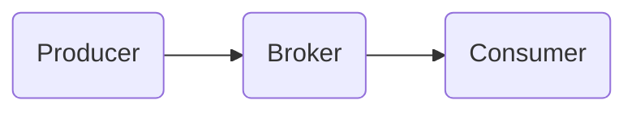

# Kafka 原理与代码实例讲解

作者：禅与计算机程序设计艺术

## 1. 背景介绍

### 1.1 消息队列的重要性
在现代分布式系统中,消息队列扮演着至关重要的角色。它能够实现系统之间的解耦,提高系统的可扩展性,容错性和性能。Kafka作为一个高吞吐量的分布式消息队列系统,在业界得到了广泛的应用。

### 1.2 Kafka的诞生
Kafka最初由LinkedIn公司开发,用于处理海量的日志和用户行为数据。2011年,Kafka被开源并捐赠给了Apache软件基金会。自此之后,Kafka迅速发展,成为了最流行的分布式消息队列系统之一。

### 1.3 Kafka的特点
Kafka具有以下几个主要特点:
- 高吞吐量:单机每秒可以处理数十万条消息。
- 可扩展性:可以轻松地扩展到数百台服务器。  
- 持久化:消息可以持久化到磁盘,避免数据丢失。
- 高可用:支持主题分区,副本机制,保证系统的高可用。

## 2. 核心概念与联系

### 2.1 Producer(生产者)
Producer是消息的生产者,负责将消息发送到Kafka的主题(Topic)中。Producer使用push模式将消息发布到broker。

### 2.2 Consumer(消费者)  
Consumer是消息的消费者,负责从Kafka的主题中拉取消息并进行消费。Consumer使用pull模式从broker拉取消息。

### 2.3 Broker
Broker是Kafka的服务器,负责接收并存储消息。每个broker管理一部分的主题分区。

### 2.4 Topic(主题)
Topic是Kafka的消息的类别或者主题,Producer将消息发送到特定的Topic,Consumer从特定的Topic拉取消息。

### 2.5 Partition(分区)
Partition是Topic的物理分区。一个Topic可以分为多个Partition,每个Partition是一个有序的、不可变的消息队列。

### 2.6 Offset(偏移量)
Offset是消息在Partition中的唯一标识,表示Consumer消费到了Partition的哪个位置。

### 2.7 消息传递流程



Producer将消息发送到Broker的指定Topic和Partition,Consumer从Broker的指定Topic和Partition拉取消息进行消费。Kafka使用Offset来记录Consumer消费的位置。

## 3. 核心算法原理具体操作步骤

### 3.1 Producer发送消息
1. Producer创建ProducerRecord对象,指定Topic,Partition(可选),Key(可选)和Value。 
2. 序列化器(Serializer)将ProducerRecord的Key和Value序列化成字节数组。
3. 将序列化后的消息封装进ProduceRequest对象,发送给Broker。
4. Broker接收到ProduceRequest后,将消息追加到指定的Partition。
5. Broker返回ProduceResponse给Producer,包含消息的Offset。

### 3.2 Consumer消费消息
1. Consumer向Broker发送FetchRequest请求,指定要消费的Topic,Partition和Offset。
2. Broker返回FetchResponse给Consumer,包含消息的二进制数据。 
3. 反序列化器(Deserializer)将消息的二进制数据反序列化成具体的对象。
4. Consumer处理消息,更新自己的Offset。
5. Consumer定期向Broker发送OffsetCommitRequest,提交自己的消费进度。

### 3.3 Broker存储消息
1. Broker接收到Producer发送的消息后,将其追加到指定Partition的本地日志文件中。
2. 根据配置的刷盘策略,定期将内存中的消息数据刷新到磁盘。
3. 当Partition的消息达到一定大小或者超过一定时间后,Broker会对日志进行切分(Log Segment)。
4. Broker会定期清理过期的日志数据,以释放磁盘空间。

## 4. 数学模型和公式详细讲解举例说明

### 4.1 生产者吞吐量估算
假设单个生产者的吞吐量为 $P$ 条消息/秒,单条消息的平均大小为 $M$ 字节,Kafka集群中Broker的数量为 $B$,Topic的Partition数量为 $N$。那么整个集群的最大生产者吞吐量 $T_p$ 可以估算为:

$$T_p = \frac{P \times B \times N}{M}$$

例如,单个生产者吞吐量为10000条/秒,单条消息大小为1KB,集群有3个Broker,Topic有10个Partition,则最大吞吐量为:

$$T_p = \frac{10000 \times 3 \times 10}{1024} \approx 293 MB/s$$

### 4.2 消费者吞吐量估算
假设单个消费者的吞吐量为 $C$ 条消息/秒,单条消息的平均大小为 $M$ 字节,Topic的Partition数量为 $N$,消费者组中消费者实例的数量为 $G$。那么整个消费者组的最大消费吞吐量 $T_c$ 可以估算为:

$$T_c = \frac{C \times N}{M \times G}$$

例如,单个消费者吞吐量为5000条/秒,单条消息大小为1KB,Topic有10个Partition,消费者组有2个消费者实例,则最大吞吐量为:

$$T_c = \frac{5000 \times 10}{1024 \times 2} \approx 24 MB/s$$

### 4.3 消息留存时间估算
假设Broker的磁盘容量为 $D$ GB,单条消息的平均大小为 $M$ 字节,生产者的平均吞吐量为 $P$ 条消息/秒。那么消息的最大留存时间 $R$ 可以估算为:

$$R = \frac{D \times 1024^3}{P \times M \times 86400}$$

例如,Broker的磁盘容量为1TB,单条消息大小为1KB,生产者吞吐量为10000条/秒,则消息最大留存时间为:

$$R = \frac{1024 \times 1024^3}{10000 \times 1024 \times 86400} \approx 1.18 天$$

## 5. 项目实践：代码实例和详细解释说明

### 5.1 生产者代码示例

```java
// 配置生产者参数
Properties props = new Properties();
props.put("bootstrap.servers", "localhost:9092");
props.put("key.serializer", "org.apache.kafka.common.serialization.StringSerializer");
props.put("value.serializer", "org.apache.kafka.common.serialization.StringSerializer");

// 创建生产者实例
KafkaProducer<String, String> producer = new KafkaProducer<>(props);

// 发送消息
for (int i = 0; i < 100; i++) {
    ProducerRecord<String, String> record = new ProducerRecord<>("my-topic", "key-" + i, "value-" + i);
    producer.send(record);
}

// 关闭生产者
producer.close();
```

上述代码首先配置了生产者的参数,包括Kafka Broker的地址,Key和Value的序列化器。然后创建了一个KafkaProducer实例,并循环发送100条消息到名为"my-topic"的Topic中。最后关闭生产者实例。

### 5.2 消费者代码示例

```java
// 配置消费者参数 
Properties props = new Properties();
props.put("bootstrap.servers", "localhost:9092");
props.put("group.id", "my-group");
props.put("key.deserializer", "org.apache.kafka.common.serialization.StringDeserializer");
props.put("value.deserializer", "org.apache.kafka.common.serialization.StringDeserializer");

// 创建消费者实例
KafkaConsumer<String, String> consumer = new KafkaConsumer<>(props);

// 订阅主题
consumer.subscribe(Arrays.asList("my-topic"));

// 拉取并消费消息
while (true) {
    ConsumerRecords<String, String> records = consumer.poll(Duration.ofMillis(100));
    for (ConsumerRecord<String, String> record : records) {
        System.out.printf("offset = %d, key = %s, value = %s\n", record.offset(), record.key(), record.value());
    }
}
```

上述代码首先配置了消费者的参数,包括Kafka Broker的地址,消费者组的ID,Key和Value的反序列化器。然后创建了一个KafkaConsumer实例,并订阅了名为"my-topic"的Topic。最后进入一个无限循环,不断地拉取并消费消息,并打印消息的Offset,Key和Value。

## 6. 实际应用场景

### 6.1 日志收集
Kafka可以用于收集分布式系统中的日志数据。各个服务器上的日志收集器(如Flume,Logstash)将日志数据发送到Kafka中,然后由日志处理应用程序(如Spark,Flink)从Kafka中消费日志数据并进行分析。

### 6.2 消息系统
Kafka可以作为分布式的消息系统,用于服务之间的异步通信。生产者服务将消息发送到Kafka中,消费者服务从Kafka中拉取消息并进行处理。这样可以实现服务之间的解耦,提高系统的灵活性。

### 6.3 流式数据处理
Kafka可以作为流式数据处理平台的数据源。流式数据从数据源(如数据库,日志)发送到Kafka中,然后由流式处理引擎(如Spark Streaming,Flink)从Kafka中消费数据并进行实时计算。

### 6.4 事件溯源
Kafka可以用于实现事件溯源(Event Sourcing)。应用程序将状态的变化封装为事件并发送到Kafka中,然后通过回放事件的方式来重建状态。这样可以避免直接操作数据库,提高系统的性能和可扩展性。

## 7. 工具和资源推荐

### 7.1 Kafka官方文档
Kafka的官方文档是学习和使用Kafka的最权威资料。文档详细介绍了Kafka的架构,原理,API以及最佳实践。

官方文档地址: https://kafka.apache.org/documentation/

### 7.2 Kafka Tool
Kafka Tool是一个Kafka的GUI管理工具。它提供了可视化的方式来管理Kafka集群,查看Topic,Partition,消息等信息。

下载地址: https://www.kafkatool.com/download.html

### 7.3 Kafka Manager
Kafka Manager是Yahoo开源的Kafka管理工具。它提供了Web界面来管理Kafka集群,监控集群的状态,执行管理任务等。

项目地址: https://github.com/yahoo/CMAK

### 7.4 Confluent Platform
Confluent Platform是Confluent公司提供的Kafka商业版本。它在开源版本的基础上提供了更多的企业级特性,如安全,监控,数据连接器等。

官网地址: https://www.confluent.io/product/confluent-platform/

## 8. 总结：未来发展趋势与挑战

### 8.1 云原生化
随着云计算的发展,越来越多的公司选择在云平台上部署Kafka。Kafka需要不断演进以适应云环境,如支持Kubernetes编排,提供更灵活的伸缩能力等。

### 8.2 流批一体化
传统的流式处理和批处理是分开的,导致数据处理逻辑重复,运维复杂。未来Kafka有望与流批一体化处理引擎(如Flink)进一步集成,实现流批统一的数据处理范式。

### 8.3 数据治理与安全
随着数据规模的增长和数据价值的提升,对Kafka数据进行有效的治理和安全防护变得至关重要。Kafka需要提供细粒度的权限控制,数据加密,数据血缘等治理和安全能力。

### 8.4 多语言支持
目前Kafka提供了Java和Scala语言的客户端。为了让更多的开发者使用Kafka,需要提供更多语言的客户端,如Go,Python,C++等。

## 9. 附录：常见问题与解答

### 9.1 Kafka如何保证消息的顺序性？
Kafka可以保证同一个Partition内的消息是有序的。生产者可以通过指定相同的Partition Key将具有相同顺序要求的消息发送到同一个Partition中,消费者按照Partition内消息的存储顺序进行消费即可保证消息的顺序性。

### 9.2 Kafka如何实现消息的重复消费？
Kafka允许Consumer将消费位移(Offset)保存在外部系统(如ZooKeeper,MySQL)中。当Consumer重启后,可以从外部系统中读取之前保存的消费位移,从该位置开始重新消费。这样就可以实现消息的重复消费。

### 9.3 Kafka如何实现消息的事务性？
Kafka从0.11版本开始引入了事务特性。生产者可以将多条消息放入同一