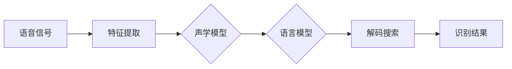

# Speech Recognition原理与代码实例讲解

作者：禅与计算机程序设计艺术

## 1. 背景介绍

语音识别技术是人工智能领域的一个重要分支,旨在让计算机能够理解和识别人类的语音。它在人机交互、智能助手、语音控制等方面有着广泛的应用前景。本文将深入探讨语音识别的原理,并通过Python代码实例来演示如何实现一个基本的语音识别系统。

### 1.1 语音识别的发展历程
#### 1.1.1 早期研究(20世纪50年代)
#### 1.1.2 隐马尔可夫模型(HMM)的引入(20世纪80年代) 
#### 1.1.3 深度学习的崛起(21世纪初)

### 1.2 语音识别的应用场景
#### 1.2.1 智能助手
#### 1.2.2 语音控制
#### 1.2.3 语音转写

### 1.3 语音识别面临的挑战  
#### 1.3.1 语音信号的多样性
#### 1.3.2 环境噪声的干扰
#### 1.3.3 语言的复杂性

## 2. 核心概念与联系

要理解语音识别的原理,需要先了解一些核心概念:

### 2.1 语音信号处理
#### 2.1.1 采样与量化
#### 2.1.2 预加重
#### 2.1.3 分帧与加窗

### 2.2 特征提取
#### 2.2.1 梅尔频率倒谱系数(MFCC) 
#### 2.2.2 线性预测倒谱系数(LPCC)
#### 2.2.3 感知线性预测(PLP)

### 2.3 声学模型
#### 2.3.1 隐马尔可夫模型(HMM)
#### 2.3.2 高斯混合模型(GMM)  
#### 2.3.3 深度神经网络(DNN)

### 2.4 语言模型 
#### 2.4.1 N-gram模型
#### 2.4.2 循环神经网络语言模型(RNNLM)

### 2.5 解码搜索
#### 2.5.1 维特比算法
#### 2.5.2 束搜索算法

下图展示了语音识别系统的整体架构和各个模块之间的关系:



## 3. 核心算法原理具体操作步骤

### 3.1 梅尔频率倒谱系数(MFCC)提取
#### 3.1.1 预加重
#### 3.1.2 分帧与加窗
#### 3.1.3 傅里叶变换
#### 3.1.4 梅尔滤波器组
#### 3.1.5 对数与离散余弦变换

### 3.2 隐马尔可夫模型(HMM)训练
#### 3.2.1 前向-后向算法 
#### 3.2.2 Baum-Welch算法
#### 3.2.3 Viterbi训练

### 3.3 语言模型训练
#### 3.3.1 N-gram模型估计
#### 3.3.2 平滑方法
#### 3.3.3 模型评估

### 3.4 解码搜索
#### 3.4.1 维特比算法
#### 3.4.2 束搜索优化

## 4. 数学模型和公式详细讲解举例说明

### 4.1 隐马尔可夫模型(HMM)
HMM是一种统计模型,用于描述一个隐含的马尔可夫过程。在语音识别中,HMM被用来对语音信号的生成过程进行建模。一个HMM可以表示为一个五元组 $\lambda=(S,V,A,B,\pi)$,其中:

- $S$ 是隐状态集合
- $V$ 是观测集合
- $A$ 是状态转移概率矩阵,其中 $a_{ij}$ 表示从状态 $i$ 转移到状态 $j$ 的概率
- $B$ 是观测概率矩阵,其中 $b_j(k)$ 表示在状态 $j$ 下生成观测 $k$ 的概率  
- $\pi$ 是初始状态概率向量

前向算法可以用来计算给定观测序列 $O=(o_1,o_2,\dots,o_T)$ 和模型 $\lambda$ 下,观测序列的概率 $P(O|\lambda)$。其递推公式为:

$$
\alpha_t(i)=\left[\sum_{j=1}^N \alpha_{t-1}(j)a_{ji}\right]b_i(o_t)
$$

其中 $\alpha_t(i)$ 表示在时刻 $t$ 的状态为 $i$ 且观测到 $(o_1,o_2,\dots,o_t)$ 的概率。

### 4.2 语言模型
N-gram语言模型基于一个马尔可夫假设,即一个词的出现只与前面的 $n-1$ 个词相关。一个N-gram模型的概率可以表示为:

$$
P(w_1,w_2,\dots,w_m)=\prod_{i=1}^m P(w_i|w_{i-n+1},\dots,w_{i-1})
$$

其中 $w_i$ 表示第 $i$ 个词, $n$ 表示N-gram的阶数。

为了避免数据稀疏问题,通常需要对N-gram模型进行平滑处理。一种常用的平滑方法是Kneser-Ney平滑:

$$
P_{KN}(w_i|w_{i-n+1}^{i-1})=\frac{max(c(w_{i-n+1}^i)-d,0)}{\sum_{w_i}c(w_{i-n+1}^i)}+\lambda(w_{i-n+1}^{i-1})P_{KN}(w_i|w_{i-n+2}^{i-1})
$$

其中 $c(w_{i-n+1}^i)$ 表示N-gram $w_{i-n+1}^i$ 在训练语料中出现的次数, $d$ 是一个折扣参数, $\lambda(w_{i-n+1}^{i-1})$ 是一个归一化因子。

## 5. 项目实践：代码实例和详细解释说明

下面我们使用Python和一些常用的语音识别库来实现一个简单的语音识别系统。

### 5.1 环境准备
首先需要安装一些必要的Python库:
```bash
pip install numpy scipy python_speech_features
```

### 5.2 特征提取
使用`python_speech_features`库提取MFCC特征:

```python
from python_speech_features import mfcc
import scipy.io.wavfile as wav

# 读取音频文件
(rate,sig) = wav.read("test.wav")

# 提取MFCC特征
mfcc_feat = mfcc(sig, rate, numcep=13, nfilt=26)
```

### 5.3 声学模型训练
使用HTK工具训练HMM声学模型:

```bash
# 准备训练数据
HCopy -T 1 -C config -S train.scp

# 定义HMM拓扑结构 
# 4个状态,左右跳转
$macro ~o
<STREAMINFO> 1 13
<VECSIZE> 13<NULLD><MFCC_D_A_0>
$macro ~h "proto"
<BEGINHMM>
<NUMSTATES> 4
<STATE> 2
<NUMMIXES> 1
<MIXTURE> 1 1.0
<MEAN> 13
0.0 0.0 0.0 0.0 0.0 0.0 0.0 0.0 0.0 0.0 0.0 0.0 0.0
<VARIANCE> 13
1.0 1.0 1.0 1.0 1.0 1.0 1.0 1.0 1.0 1.0 1.0 1.0 1.0
<GCONST> 1.0
<STATE> 3
<NUMMIXES> 1
<MIXTURE> 1 1.0
<MEAN> 13
0.0 0.0 0.0 0.0 0.0 0.0 0.0 0.0 0.0 0.0 0.0 0.0 0.0
<VARIANCE> 13
1.0 1.0 1.0 1.0 1.0 1.0 1.0 1.0 1.0 1.0 1.0 1.0 1.0
<GCONST> 1.0
<TRANSP> 4
0.0 1.0 0.0 0.0
0.0 0.6 0.4 0.0
0.0 0.0 0.6 0.4
0.0 0.0 0.0 0.0
<ENDHMM>

# 初始化和训练模型
HCompV -C config -f 0.01 -m -S train.scp -M hmm0 proto
HERest -C config -I phones0.mlf -t 250.0 150.0 1000.0 -S train.scp -H hmm0/macros -H hmm0/hmmdefs -M hmm1 monophones0
HERest -C config -I phones0.mlf -t 250.0 150.0 1000.0 -S train.scp -H hmm1/macros -H hmm1/hmmdefs -M hmm2 monophones0
HERest -C config -I phones0.mlf -t 250.0 150.0 1000.0 -S train.scp -H hmm2/macros -H hmm2/hmmdefs -M hmm3 monophones0
```

### 5.4 语言模型训练
使用SRILM工具训练N-gram语言模型:

```bash
# 准备训练语料
cat text1 text2 text3 > train.txt

# 训练3-gram语言模型
ngram-count -order 3 -interpolate -kndiscount -text train.txt -lm lm.arpa
```

### 5.5 解码与识别
使用HTK的`HVite`工具进行解码识别:

```bash
HVite -H hmm/macros -H hmm/hmmdefs -S test.scp -l '*' -i result.mlf -w lm.arpa -p -10.0 -s 5.0 dict monophones1
```

其中`dict`是发音词典,`monophones1`是音素列表。解码结果会保存在`result.mlf`文件中。

## 6. 实际应用场景

语音识别技术在许多领域都有广泛应用,例如:

### 6.1 智能助手
苹果的Siri、谷歌助手、亚马逊的Alexa等智能助理都依赖语音识别技术来理解用户的语音指令并给出相应的回复。

### 6.2 语音输入法
讯飞语记、搜狗语音输入等工具可以将用户的语音转换成文字,提高输入效率。

### 6.3 语音控制
智能家居、车载系统等都支持使用语音指令来控制设备,如调节空调温度、打开导航等。

### 6.4 语音转写
将会议、讲座、采访等音频转换成文本,方便记录和检索。

### 6.5 语音质检
通过分析客服录音,自动检测客户情绪、提取关键词等,评估服务质量。

## 7. 工具和资源推荐

以下是一些常用的语音识别工具和资源:

### 7.1 HTK
隐马尔可夫工具包,用于构建HMM声学模型。
http://htk.eng.cam.ac.uk/

### 7.2 Kaldi 
一个开源的语音识别工具箱,包含了多种现代语音识别技术。
https://github.com/kaldi-asr/kaldi

### 7.3 SRILM
用于训练语言模型的工具包。
http://www.speech.sri.com/projects/srilm/

### 7.4 CMUSphinx
卡内基梅隆大学开发的一系列语音识别工具。
https://cmusphinx.github.io/

### 7.5 DeepSpeech
Mozilla开源的端到端语音识别引擎,基于Baidu的DeepSpeech论文。
https://github.com/mozilla/DeepSpeech

### 7.6 Wav2letter++
Facebook开源的语音识别框架,使用卷积神经网络。
https://github.com/flashlight/wav2letter

### 7.7 AISHELL
中文语音数据集,178小时,400个说话人。
https://www.aishelltech.com/kysjcp

### 7.8 LibriSpeech
英文语音数据集,1000小时,2484个说话人。
http://www.openslr.org/12/

## 8. 总结：未来发展趋势与挑战

语音识别技术在过去几十年中取得了长足的进步,识别准确率不断提高,应用场景日益广泛。未来,语音识别技术有望向以下几个方向发展:

### 8.1 端到端模型
传统的语音识别系统需要分别构建声学模型、发音词典和语言模型,而端到端模型可以直接将语音信号映射到文本序