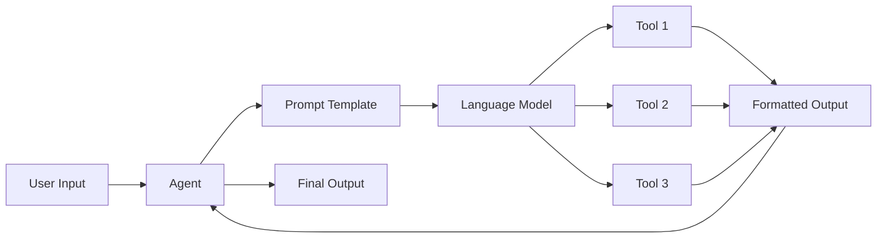

# 【LangChain编程：从入门到实践】LangChain中的代理

作者：禅与计算机程序设计艺术

## 1.背景介绍
### 1.1 LangChain是什么？
LangChain是一个用于开发由语言模型驱动的应用程序的框架。它可以帮助开发者更容易地将语言模型与外部数据源和APIs集成,从而创建更强大的AI应用。

### 1.2 代理(Agent)在LangChain中的作用
在LangChain中,代理(Agent)扮演着至关重要的角色。代理接收用户输入,利用语言模型和工具链来生成响应,从而使应用程序能够执行复杂的任务。

### 1.3 为什么要学习LangChain中的代理？
掌握LangChain中的代理,可以帮助开发者:
- 更好地理解如何构建由语言模型驱动的应用
- 学习如何将语言模型与外部工具和数据源集成
- 设计和实现更智能、更强大的对话式AI系统

## 2.核心概念与联系
### 2.1 代理(Agent)
代理是LangChain应用的核心组件。它负责接收用户输入,调用相关的工具,并生成最终的输出。代理利用语言模型的能力来理解用户意图并选择合适的行动。

### 2.2 工具(Tool)
工具是代理可以调用的函数或API。例如搜索引擎、计算器、数据库查询等。每个工具都有特定的输入和输出格式。代理通过语言模型来决定使用哪些工具。

### 2.3 提示模板(Prompt Template) 
提示模板定义了如何将用户输入和工具输出格式化为语言模型的输入。好的提示模板可以引导语言模型生成更准确、连贯的响应。

### 2.4 语言模型(Language Model)
语言模型是代理的大脑。它接收格式化的提示,并生成相应的输出。LangChain支持多种语言模型,如OpenAI的GPT系列。

### 2.5 代理、工具、提示模板和语言模型之间的关系
下图展示了代理、工具、提示模板和语言模型在LangChain应用中的关系和数据流:



## 3.核心算法原理与具体操作步骤
### 3.1 代理的工作原理
1. 接收用户输入
2. 使用语言模型分析用户意图
3. 选择相关工具
4. 构建提示模板
5. 将提示发送给语言模型
6. 语言模型调用工具并生成输出
7. 代理将输出返回给用户

### 3.2 创建自定义代理的步骤
1. 定义工具:为代理创建一组可用的工具
2. 创建提示模板:定义如何格式化用户输入和工具输出
3. 初始化语言模型:选择并配置合适的语言模型
4. 创建代理:将工具、提示模板和语言模型组合成一个代理对象
5. 运行代理:将用户输入传递给代理,获取生成的输出

## 4.数学模型和公式详细讲解举例说明
在LangChain中,代理的决策过程可以用马尔可夫决策过程(Markov Decision Process, MDP)来建模。MDP由以下元素组成:

- 状态集合 $S$
- 行动集合 $A$
- 转移概率函数 $P(s'|s,a)$
- 奖励函数 $R(s,a)$

在每个时间步 $t$,代理处于状态 $s_t \in S$,选择行动 $a_t \in A$,然后转移到新状态 $s_{t+1}$,并获得奖励 $r_t = R(s_t,a_t)$。

代理的目标是最大化累积奖励:

$$G_t = \sum_{k=0}^{\infty} \gamma^k r_{t+k}$$

其中 $\gamma \in [0,1]$ 是折扣因子,用于平衡即时奖励和长期奖励。

在LangChain中,状态可以表示为对话历史和当前用户输入的组合。行动对应于调用特定工具或生成最终输出。奖励可以基于用户反馈或某些预定义的指标来设计。

## 5.项目实践：代码实例和详细解释说明
下面是一个使用LangChain创建自定义代理的简单示例:

```python
from langchain.agents import initialize_agent, Tool
from langchain.llms import OpenAI
from langchain.chains import LLMMathChain

# 定义工具
search = SerpAPIWrapper()
llm_math_chain = LLMMathChain(llm=OpenAI())
tools = [
    Tool(
        name="Search",
        func=search.run,
        description="useful for searching the internet for information"
    ),
    Tool(
        name="Calculator",
        func=llm_math_chain.run,
        description="useful for doing math calculations"
    )
]

# 创建代理
agent = initialize_agent(tools, OpenAI(), agent="zero-shot-react-description", verbose=True)

# 运行代理
agent.run("What is the population of Canada divided by the population of the United States?")
```

这个例子中:
1. 我们定义了两个工具:搜索引擎和计算器
2. 使用`initialize_agent`函数创建了一个代理,指定工具、语言模型和代理类型
3. 调用`agent.run`方法,将用户问题传递给代理
4. 代理会自动调用搜索引擎查找加拿大和美国的人口数据,然后使用计算器计算比值,最后返回结果

## 6.实际应用场景
LangChain中的代理可以应用于各种场景,例如:

- 智能客服:代理可以利用知识库和外部APIs来回答客户问题
- 数据分析助手:代理可以帮助用户查询数据库、生成可视化图表、解释分析结果
- 代码生成器:代理可以根据用户描述生成代码片段,并使用编程语言工具进行测试和优化
- 智能任务规划器:代理可以帮助用户分解复杂任务,制定计划,并跟踪进度

## 7.工具和资源推荐
- [LangChain官方文档](https://docs.langchain.com/)
- [LangChain Github仓库](https://github.com/hwchase17/langchain) 
- [OpenAI API](https://openai.com/api/)
- [SerpAPI](https://serpapi.com/)
- [LangChain代理示例](https://python.langchain.com/en/latest/modules/agents/getting_started.html)

## 8.总结：未来发展趋势与挑战
LangChain中的代理为构建由语言模型驱动的智能应用开辟了新的可能性。未来,我们可以期待看到更多创新性的应用,如个性化的虚拟助手、智能教育系统等。

然而,开发高质量的代理仍然面临一些挑战:
- 设计有效的提示模板需要对任务和语言模型有深入的理解
- 选择合适的工具和配置最优的参数需要大量的实验和调优
- 确保代理生成的输出安全、可靠、符合伦理规范也是一个重要课题

尽管如此,LangChain正在快速发展,不断引入新的功能和改进。相信通过研究者和开发者的共同努力,这些挑战最终都将得到解决,LangChain和类似的框架将为我们带来更智能、更强大的AI应用。

## 9.附录：常见问题与解答
### 9.1 如何选择合适的语言模型？
选择语言模型需要考虑以下因素:
- 模型性能:选择在目标任务上表现良好的模型
- 可用性:确保模型有稳定的API接口
- 成本:权衡模型性能和使用成本
- 伦理合规性:选择符合伦理标准的模型

### 9.2 如何设计有效的提示模板？
设计提示模板的一些技巧:
- 明确说明任务目标和约束条件
- 提供足够的上下文信息
- 使用清晰、具体的指令
- 给出示例输入和输出以引导模型
- 进行充分的测试和迭代

### 9.3 如何处理代理生成的不恰当输出？
可以采取以下措施:
- 在提示模板中明确禁止生成不当内容
- 使用内容过滤器或模糊处理来屏蔽敏感信息
- 监控代理输出并及时处理问题
- 为用户提供反馈渠道,持续改进系统

希望这篇文章能帮助你更好地理解LangChain中的代理,并启发你创建出更智能、更有趣的AI应用。欢迎进一步探索LangChain的其他功能,并分享你的见解和经验!