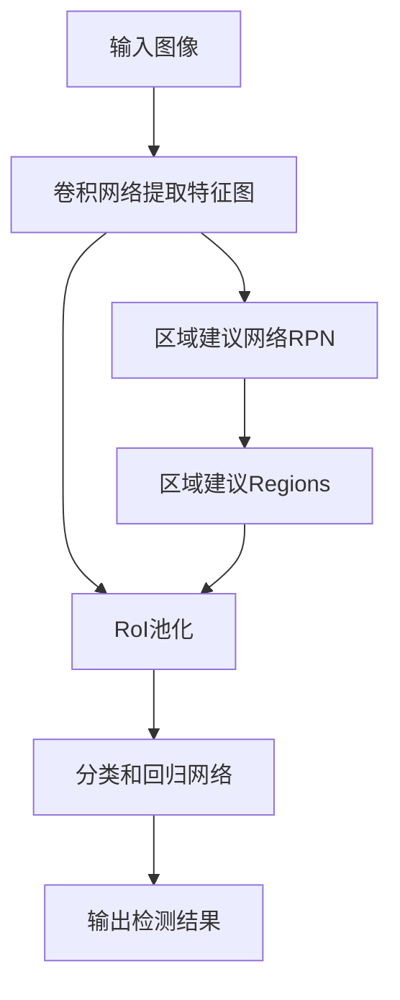
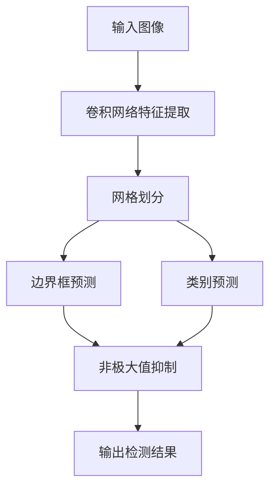

# 一切皆是映射：物体检测与识别：AI的视觉能力

## 1. 背景介绍

### 1.1 视觉感知的重要性

在人类的感知系统中,视觉是最重要的感官之一。我们大约90%的信息来源于视觉。视觉让我们能够识别周围环境中的物体、人物、文字等,并对它们进行理解和分析。在人工智能领域,赋予机器视觉能力一直是研究的重点课题之一。

### 1.2 计算机视觉的发展历程

计算机视觉最早可以追溯到20世纪60年代,当时主要研究图像处理和模式识别技术。随着硬件计算能力的不断提高和深度学习算法的兴起,计算机视觉取得了飞速发展,在物体检测、图像分类、语义分割等任务上取得了突破性进展。

### 1.3 物体检测与识别的应用价值

物体检测与识别技术在诸多领域有着广泛的应用,例如:

- 自动驾驶: 精准检测路况中的车辆、行人、障碍物等
- 安防监控: 识别可疑人员和违规行为  
- 工业自动化: 缺陷检测、装配导引等
- 医疗影像分析: 病灶定位和诊断辅助

## 2. 核心概念与联系

### 2.1 物体检测与识别的区别

物体检测(Object Detection)是指在给定图像中定位出感兴趣物体的位置,并为每个物体绘制一个边界框。而物体识别(Object Recognition)是在检测的基础上,进一步识别出物体的类别。

### 2.2 基于传统方法和基于深度学习的方法

早期的物体检测与识别主要采用基于手工设计特征的传统方法,如HOG+SVM、Haar-like特征+Adaboost等。这些方法需要人工选择特征并构建分类器模型。

近年来,基于深度学习的方法占据了主导地位,主要有两大类:

1. 基于区域的方法(Region-based): 先生成候选区域,再对每个区域进行物体分类,典型有R-CNN系列算法。

2. 基于回归的方法(Regression-based): 直接对图像像素进行编码,同时预测物体类别和边界框坐标,典型有YOLO系列、SSD等。

### 2.3 端到端的物体检测管道

现代物体检测算法通常采用端到端(End-to-End)的管道方式,将特征提取、候选区域生成、分类回归等环节融合到一个统一的深度网络模型中进行训练和预测,提高了检测精度和速度。

## 3. 核心算法原理具体操作步骤

### 3.1 基于区域的物体检测算法

R-CNN是基于区域的物体检测算法的开山之作,后续有Fast R-CNN、Faster R-CNN等改进版本。我们以Faster R-CNN为例介绍其核心原理:

1. **区域建议网络(RPN)** : 使用卷积神经网络从图像中提取特征,然后在特征图上滑动窗口,生成一系列矩形区域建议(Region Proposal)。

2. **区域of Interest(RoI)池化** : 对每个区域建议,从特征图中crop出对应的区域特征,并使用RoI池化层将其resize到固定尺寸。

3. **分类和边界框回归** : 将RoI特征输入两个并行的全连接层,一个用于预测该区域内物体的类别,另一个用于精修预测出的边界框坐标。

4. **训练** : 使用多任务损失函数,同时最小化分类损失和边界框回归损失。

以上步骤反复迭代训练,最终得到端到端的物体检测模型。预测时,先由RPN生成区域建议,然后经过分类和回归网络输出最终结果。



### 3.2 基于回归的物体检测算法

与基于区域的方法不同,基于回归的算法直接对图像像素进行编码,同时预测物体类别和边界框坐标。我们以YOLO算法为例说明:

1. **网格划分** : 将输入图像划分为S×S个网格单元。

2. **边界框预测** : 对于每个网格单元,预测B个边界框以及每个边界框所含物体的置信度。置信度 = 先验概率 × 条件概率(是否包含目标物体)

3. **类别预测** : 对于每个网格单元,同时预测C个类别概率,用于确定边界框内物体的类别。

4. **非极大值抑制(NMS)** : 由于同一个物体可能对应多个边界框,使用NMS算法去除重复的边界框。

5. **训练** : 使用加权损失函数,包括边界框坐标损失、置信度损失和分类损失。

YOLO算法的优点是端到端预测速度快,缺点是对小目标的检测精度较差。后续版本YOLOv2、v3、v4等作了多方面改进。



## 4. 数学模型和公式详细讲解举例说明

### 4.1 交并比(IoU)

在物体检测任务中,我们需要评估预测的边界框与真实边界框的重合程度。交并比(Intersection over Union)是一种常用的评价指标,计算方式如下:

$$
IoU = \frac{Area\ of\ Overlap}{Area\ of\ Union}
$$

其中,Overlap是指预测框与真实框的交集区域,Union是指它们的并集区域。IoU的取值范围是[0,1],值越大表示预测结果与真实值越接近。

在训练过程中,我们将IoU作为阈值,只有当预测框与真实框的IoU大于某个值时,才将其作为正样本参与训练。这种方式称为正样本挖掘(Hard Example Mining),可以显著提高检测精度。

### 4.2 YOLO损失函数

YOLO算法在训练时使用了一种加权损失函数,包含三部分:边界框坐标损失、置信度损失和分类损失。设真实值为$\hat{y}$,预测值为$y$,则损失函数可表示为:

$$
\begin{aligned}
\mathcal{L} &= \lambda_\text{coord}\sum_{i=0}^{S^2}\sum_{j=0}^B\mathbb{1}_{ij}^\text{obj}[(x_i-\hat{x}_i)^2 + (y_i-\hat{y}_i)^2] \\
&+ \lambda_\text{coord}\sum_{i=0}^{S^2}\sum_{j=0}^B\mathbb{1}_{ij}^\text{obj}[(\sqrt{w_i}-\sqrt{\hat{w}_i})^2 + (\sqrt{h_i}-\sqrt{\hat{h}_i})^2] \\
&+ \sum_{i=0}^{S^2}\sum_{j=0}^B\mathbb{1}_{ij}^\text{obj}(C_i-\hat{C}_i)^2 \\
&+ \lambda_\text{noobj}\sum_{i=0}^{S^2}\sum_{j=0}^B\mathbb{1}_{ij}^\text{noobj}(C_i-\hat{C}_i)^2 \\
&+ \sum_{i=0}^{S^2}\mathbb{1}_{i}^\text{obj}\sum_{c\in\text{classes}}(p_i(c)-\hat{p}_i(c))^2
\end{aligned}
$$

其中:
- $\lambda_\text{coord}$和$\lambda_\text{noobj}$是加权参数
- $\mathbb{1}_{ij}^\text{obj}$是一个指示器,如果第i个网格单元的第j个边界框负责预测真实物体,则为1,否则为0
- $x,y,w,h$分别表示边界框的中心坐标、宽度和高度
- $C_i$是第i个边界框包含物体的置信度
- $p_i(c)$是第i个网格单元预测的第c类物体的概率

通过最小化上述损失函数,可以同时优化边界框坐标、置信度和分类概率,得到最终的检测结果。

## 5. 项目实践:代码实例和详细解释说明

为了更好地理解物体检测算法的实现细节,我们将基于PyTorch框架,使用开源的YOLO v5代码,在COCO数据集上进行训练和测试。

### 5.1 环境配置

```bash
# 安装PyTorch
pip install torch torchvision

# 克隆YOLO v5代码库 
git clone https://github.com/ultralytics/yolov5.git
cd yolov5

# 安装依赖库
pip install -r requirements.txt
```

### 5.2 数据准备

COCO数据集是一个常用的物体检测数据集,包含80个物体类别,可以从[官网](https://cocodataset.org/)下载。我们将数据集解压到指定目录,并按照YOLO v5的数据格式进行组织。

```bash
# 下载并解压COCO2017数据集
mkdir datasets
wget http://images.cocodataset.org/zips/train2017.zip
wget http://images.cocodataset.org/zips/val2017.zip
unzip train2017.zip -d datasets/coco/images/train2017
unzip val2017.zip -d datasets/coco/images/val2017

# 下载COCO注释文件
wget http://images.cocodataset.org/annotations/annotations_trainval2017.zip
unzip annotations_trainval2017.zip -d datasets/coco/

# 创建YOLO v5数据集格式
python scripts/get_coco.py --data_path datasets/coco
```

### 5.3 模型训练

YOLO v5提供了多种预训练模型,我们选择较小的YOLOv5s作为基线模型进行训练。

```bash
# 下载YOLOv5s预训练权重
wget https://github.com/ultralytics/yolov5/releases/download/v6.2/yolov5s.pt

# 训练YOLOv5s模型 (使用所有GPU训练)
python train.py --img 640 --batch 32 --epochs 100 --data coco.yaml --weights yolov5s.pt --cache

# 单GPU训练
python train.py --img 640 --batch 16 --epochs 100 --data coco.yaml --weights yolov5s.pt --device 0
```

训练过程中会打印出当前批次的损失值、目标检测指标(精确率、召回率、mAP@0.5等)。训练完成后,最佳模型权重将保存在`runs/train/exp*/weights`目录下。

### 5.4 模型评估

使用训练好的模型在COCO val2017数据集上进行评估:

```bash
python val.py --weights runs/train/exp/weights/best.pt --data coco.yaml --task test
```

评估过程将输出精确率、召回率、mAP@0.5:0.95等指标,用于评价模型的检测性能。

### 5.5 模型预测

最后,我们可以使用训练好的模型对图像或视频进行实时预测:

```python
import cv2
import torch

# 加载模型
model = torch.hub.load('ultralytics/yolov5', 'custom', path='runs/train/exp/weights/best.pt')

# 读取图像
img = cv2.imread('image.jpg')

# 预测
results = model(img)

# 渲染结果
results.render()  

# 保存渲染图像
cv2.imwrite('output.jpg', results.imgs[0])
```

上述代码将读取一张图像,使用YOLO v5模型进行物体检测,并在图像上渲染检测结果的边界框和类别标签。最终结果将保存为output.jpg文件。

## 6. 实际应用场景

物体检测与识别技术在诸多领域有着广泛的应用,下面列举一些典型场景:

### 6.1 自动驾驶

在自动驾驶系统中,精准检测和识别道路上的车辆、行人、障碍物等目标是至关重要的。基于视觉的感知系统可以实时分析复杂的路况,为决策规划模块提供关键信息。

### 6.2 安防监控

安防监控系统需要对视频画面中的人员、车辆等目标进行检测和跟踪,并识别可疑行为,如徘徊、打架等,从而提高安全防范能力。

### 6.3