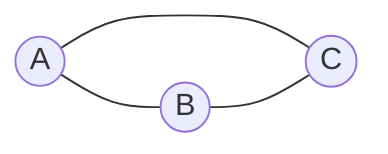

# 图卷积网络(GCN)原理与代码实战案例讲解

作者：禅与计算机程序设计艺术

## 1. 背景介绍
### 1.1 图神经网络的兴起
### 1.2 GCN在图神经网络中的地位
### 1.3 GCN的应用前景

## 2. 核心概念与联系
### 2.1 图的基本概念
#### 2.1.1 无向图与有向图
#### 2.1.2 加权图与非加权图  
#### 2.1.3 图的邻接矩阵表示
### 2.2 卷积神经网络的基本原理
#### 2.2.1 卷积的定义与计算
#### 2.2.2 池化层的作用
#### 2.2.3 全连接层与分类器
### 2.3 将卷积思想引入图领域
#### 2.3.1 图上的卷积定义
#### 2.3.2 谱图理论基础
#### 2.3.3 图傅里叶变换

## 3. 核心算法原理具体操作步骤
### 3.1 GCN的前向传播
#### 3.1.1 输入的预处理
#### 3.1.2 图卷积层计算
#### 3.1.3 激活函数
### 3.2 GCN的训练过程  
#### 3.2.1 损失函数设计
#### 3.2.2 反向传播算法
#### 3.2.3 优化器选择
### 3.3 GCN的推理阶段
#### 3.3.1 节点嵌入向量的提取
#### 3.3.2 下游任务的处理

## 4. 数学模型和公式详细讲解举例说明
### 4.1 谱图卷积的数学推导
#### 4.1.1 图拉普拉斯矩阵
#### 4.1.2 特征分解
#### 4.1.3 谱卷积定义
### 4.2 GCN前向传播公式推导
#### 4.2.1 一阶近似
#### 4.2.2 归一化
#### 4.2.3 引入权重矩阵
### 4.3 计算实例演示
#### 4.3.1 简单图的GCN计算过程
#### 4.3.2 中等规模图的GCN计算
#### 4.3.3 计算复杂度分析

## 5. 项目实践：代码实例和详细解释说明
### 5.1 环境配置
#### 5.1.1 PyTorch安装
#### 5.1.2 PyTorch Geometric安装
#### 5.1.3 常用图库数据准备
### 5.2 GCN模型实现
#### 5.2.1 GCN层的PyTorch实现
#### 5.2.2 GCN模型的定义
#### 5.2.3 训练循环与评估函数
### 5.3 实践案例
#### 5.3.1 Cora数据集节点分类
#### 5.3.2 Citeseer引文网络分类
#### 5.3.3 PPI蛋白质相互作用网络

## 6. 实际应用场景
### 6.1 社交网络分析
#### 6.1.1 用户画像构建
#### 6.1.2 社区发现
#### 6.1.3 链路预测
### 6.2 推荐系统 
#### 6.2.1 协同过滤
#### 6.2.2 兴趣扩散
#### 6.2.3 异质图的融合
### 6.3 交通预测
#### 6.3.1 交通流量预测
#### 6.3.2 速度估计
#### 6.3.3 拥堵检测

## 7. 工具和资源推荐
### 7.1 开源代码库
#### 7.1.1 PyTorch Geometric
#### 7.1.2 DGL
#### 7.1.3 GraphNets
### 7.2 图神经网络相关论文
#### 7.2.1 必读的GCN论文
#### 7.2.2 GCN扩展与改进
#### 7.2.3 GCN在推荐系统中的应用
### 7.3 教程与课程
#### 7.3.1 CS224W斯坦福大学图机器学习
#### 7.3.2 图神经网络实践教程
#### 7.3.3 图深度学习相关博客

## 8. 总结：未来发展趋势与挑战
### 8.1 图神经网络的局限性
#### 8.1.1 过平滑问题
#### 8.1.2 鲁棒性研究
#### 8.1.3 可解释性不足
### 8.2 图神经网络前沿进展
#### 8.2.1 图注意力网络
#### 8.2.2 图对比学习
#### 8.2.3 图生成模型  
### 8.3 产业界关注热点
#### 8.3.1 工业界落地情况
#### 8.3.2 图神经网络的可扩展性
#### 8.3.3 与知识图谱的结合

## 9. 附录：常见问题与解答
### 9.1 GCN能处理动态图吗？
### 9.2 GCN能直接处理原始图像吗？
### 9.3 GCN为什么要用半监督学习范式？

图卷积网络（GCN）作为图神经网络的代表性模型，近年来受到学术界和工业界的广泛关注。GCN将卷积神经网络的思想引入到图结构数据中，通过聚合节点的邻域信息，同时考虑节点自身特征和图的拓扑结构，从而获得更加准确的节点表示。

GCN在图的表示学习和下游任务中展现出了强大的能力，在节点分类、链路预测、社区发现等任务上取得了显著的效果提升。同时，GCN作为一种通用的图表示学习框架，在推荐系统、交通预测、生物信息学等诸多领域得到了成功应用。

本文将从GCN的背景出发，详细介绍GCN的核心概念和基本原理，包括将卷积思想引入图领域的谱图理论基础。在算法讲解部分，我们将GCN的前向传播、训练过程、推理阶段进行拆解，并对其中的关键公式进行推导说明。同时，我们准备了丰富的计算实例，帮助读者直观地理解GCN每一步的计算过程。

为了让读者快速上手GCN的实现，我们提供了详尽的代码实践指南。从环境配置到GCN层的PyTorch实现，再到经典数据集上的实践案例，手把手带领读者体验GCN的建模过程。我们还精心挑选了GCN在社交网络、推荐系统、交通预测等领域的应用场景，展示了GCN在实际问题中的巨大潜力。

本文还为读者梳理了图神经网络领域的工具和资源，包括主流的开源代码库、经典论文、教程课程等，帮助大家构建图神经网络的知识体系，掌握最新的研究进展。

在总结与展望部分，我们客观分析了图神经网络和GCN目前存在的局限性，介绍了图注意力网络、图对比学习等前沿的改进方向，让读者把握图神经网络的未来发展趋势。我们也分享了GCN在产业界的落地情况和面临的挑战，供读者参考。

最后的FAQ环节，我们收集了初学者在学习GCN过程中的常见问题，逐一进行了详细解答，帮助读者扫清学习路上的障碍。

通过本文的学习，相信你将全面掌握GCN的原理和实践，在图神经网络的学习之路上更进一步。让我们一起探索GCN的奇妙世界，用图的智慧去认识这个纷繁复杂的现实世界。

### 4.1 谱图卷积的数学推导

谱图卷积是GCN的理论基础，它将传统CNN中的卷积运算推广到了图结构数据上。为了理解谱图卷积，我们首先需要引入一些基本概念。

#### 4.1.1 图拉普拉斯矩阵

对于一个无向图$G=(V,E)$，其中$V$是节点集合，$E$是边集合。我们可以定义图的邻接矩阵$A\in R^{N\times N}$，其中$N$是节点的数量。如果节点$i$和节点$j$之间有边相连，则$A_{ij}=1$，否则$A_{ij}=0$。

度矩阵$D$是一个对角矩阵，其中$D_{ii}=\sum_{j}A_{ij}$，表示节点$i$的度。

图拉普拉斯矩阵定义为$L=D-A$。它是一个对称矩阵，包含了图的拓扑结构信息。

#### 4.1.2 特征分解

根据谱图理论，图拉普拉斯矩阵$L$可以进行特征分解：

$$
L=U\Lambda U^T
$$

其中，$U$是由$L$的特征向量组成的矩阵，$\Lambda$是一个对角矩阵，其对角元素为$L$的特征值。

#### 4.1.3 谱卷积定义

有了上述铺垫，我们可以定义图信号$x\in R^N$在图$G$上的谱卷积：

$$
x*_Gg=U(U^Tx\odot U^Tg)
$$

其中，$g$是卷积核，$\odot$表示Hadamard积（逐元素相乘）。这个定义表明，图信号$x$与卷积核$g$在谱域上进行element-wise乘积，然后再通过$U$将结果转换回原始域。

### 4.2 GCN前向传播公式推导

然而，直接使用谱卷积定义会带来一些问题，比如计算复杂度高，需要显式地计算拉普拉斯矩阵的特征分解。GCN提出了一阶近似的简化方法。

#### 4.2.1 一阶近似

为了简化计算，GCN假设卷积核$g$在谱域上是一个对角矩阵，并且只考虑$K$阶邻域的信息传递。这样，卷积运算可以近似为：

$$
x*_Gg\approx U_{:,0:K}g_{\theta}U_{:,0:K}^Tx=\sum_{k=0}^{K-1}\theta_kL^kx
$$

其中，$L^k$表示$L$的$k$次幂，$\theta\in R^K$是需要学习的参数。

#### 4.2.2 归一化

为了缓解数值不稳定性和梯度爆炸/消失问题，GCN在拉普拉斯矩阵$L$的基础上进行了归一化：

$$
\tilde{L}=\tilde{D}^{-\frac{1}{2}}\tilde{A}\tilde{D}^{-\frac{1}{2}}
$$

其中，$\tilde{A}=A+I$是加入了自环的邻接矩阵，$I$是单位矩阵，$\tilde{D}$是$\tilde{A}$对应的度矩阵。

#### 4.2.3 引入权重矩阵

最后，我们引入权重矩阵$W$来增强模型的表达能力。结合前面的推导，GCN的前向传播公式可以写为：

$$
H^{(l+1)}=\sigma(\tilde{L}H^{(l)}W^{(l)})
$$

其中，$H^{(l)}$是第$l$层的节点表示矩阵，$W^{(l)}$是第$l$层的权重矩阵，$\sigma$是激活函数（如ReLU）。

### 4.3 计算实例演示

为了更直观地理解GCN的计算过程，我们通过几个具体的例子来演示。

#### 4.3.1 简单图的GCN计算过程

考虑下面这个简单的无向图：

假设节点的初始特征为：

$$
X=\begin{bmatrix}
1 & 0 \\
0 & 1 \\
1 & 1
\end{bmatrix}
$$

邻接矩阵为：

$$
A=\begin{bmatrix}
0 & 1 & 1 \\
1 & 0 & 1 \\
1 & 1 & 0
\end{bmatrix}
$$

加入自环后的邻接矩阵为：

$$
\tilde{A}=\begin{bmatrix}
1 & 1 & 1 \\
1 & 1 & 1 \\
1 & 1 & 1
\end{bmatrix}
$$

对应的度矩阵为：

$$
\tilde{D}=\begin{bmatrix}
3 & 0 & 0 \\
0 & 3 & 0 \\
0 & 0 & 3
\